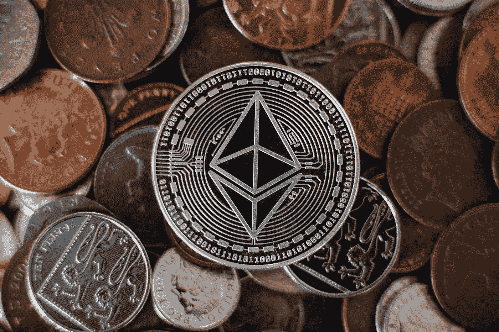

# 新手如何挖掘以太坊

> 原文：<https://medium.com/coinmonks/how-to-mine-ethereum-for-beginners-12daf0b0de87?source=collection_archive---------42----------------------->

## 如何为初学者挖掘以太坊:同样，挖掘通过提供对网络上运行的任何应用程序(dApp)进行更改的能力，将以太坊分散的“应用程序商店”联合起来。

Image Credit: www.investopedia.com

以以太坊文章中概述的在线笔记本或笔记本为例。如果没有足够的计算能力，网络将无法处理诸如添加、编辑或删除条目之类的更改。

以太矿工将一排计算机放在战线上，这样他们可以在其他人面前解决密码问题，这样做时，他们必须解决大量的计算问题，而有人实际上赢得了一个数量。

加密货币中使用的开放区块链的特点是，理论上，每个人都可以设置自己的计算机来解决加密问题，即他们可以自己开始“挖掘”。

不利的一面是，随着时间的推移，这种开采需要主要公共区块链越来越多的能量和容量。

如今，硬件较弱的用户在这场竞赛中几乎没有竞争的机会，但当然，这并不一定会阻止那些更愿意将其视为爱好或出于热情加入项目的人。

# 采矿用硬件的选择

在你开始采矿之前，你需要说明你需要专门的硬件来全职开采乙醚。

有两种主要类型的采矿硬件:

CPU 和所谓的 GPU。有了 GPU 和图形处理器，输入哈希拼图的速度会更快。在写这几行的时候，只有一个合适的 GPU 可以考虑给以太矿工。

选择合适的 GPU 时，需要考虑几个方面。网上也有很多建议，根据哈希速率、功耗和消费价格来看哪一个最适合你。这是一个好主意，建立一个单独的矿机，内置多个 GPU，最多需要一周时间来组装。

有采矿计算器显示在给定的哈希比率下可能赢得的金额，以及考虑到电力成本，一个设置是否可以产生利润。

然而，专门为以太坊设计的快速而强大的 ASIC 芯片还不能用于比特币。那么[让我们开始吧。](https://cryptospix.com/how-to-mine-ethereum-on-low-end-pc/)

> 加入 Coinmonks [电报频道](https://t.me/coincodecap)和 [Youtube 频道](https://www.youtube.com/c/coinmonks/videos)了解加密交易和投资

# 另外，阅读

*   [3 商业评论](/coinmonks/3commas-review-an-excellent-crypto-trading-bot-2020-1313a58bec92) | [Pionex 评论](https://coincodecap.com/pionex-review-exchange-with-crypto-trading-bot) | [Coinrule 评论](/coinmonks/coinrule-review-2021-a-beginner-friendly-crypto-trading-bot-daf0504848ba)
*   [莱杰 vs n rave](/coinmonks/ledger-vs-ngrave-zero-7e40f0c1d694)|[莱杰 nano s vs x](/coinmonks/ledger-nano-s-vs-x-battery-hardware-price-storage-59a6663fe3b0) | [币安评论](/coinmonks/binance-review-ee10d3bf3b6e)
*   [Bybit Exchange 审查](/coinmonks/bybit-exchange-review-dbd570019b71) | [Bityard 审查](https://coincodecap.com/bityard-reivew) | [Jet-Bot 审查](https://coincodecap.com/jet-bot-review)
*   [3 commas vs crypto hopper](/coinmonks/3commas-vs-pionex-vs-cryptohopper-best-crypto-bot-6a98d2baa203)|[赚取加密利息](/coinmonks/earn-crypto-interest-b10b810fdda3)
*   最好的比特币[硬件钱包](/coinmonks/hardware-wallets-dfa1211730c6) | [BitBox02 回顾](/coinmonks/bitbox02-review-your-swiss-bitcoin-hardware-wallet-c36c88fff29)
*   [BlockFi vs 摄氏度](/coinmonks/blockfi-vs-celsius-vs-hodlnaut-8a1cc8c26630) | [Hodlnaut 审核](/coinmonks/hodlnaut-review-best-way-to-hodl-is-to-earn-interest-on-your-bitcoin-6658a8c19edf) | [KuCoin 审核](https://coincodecap.com/kucoin-review)