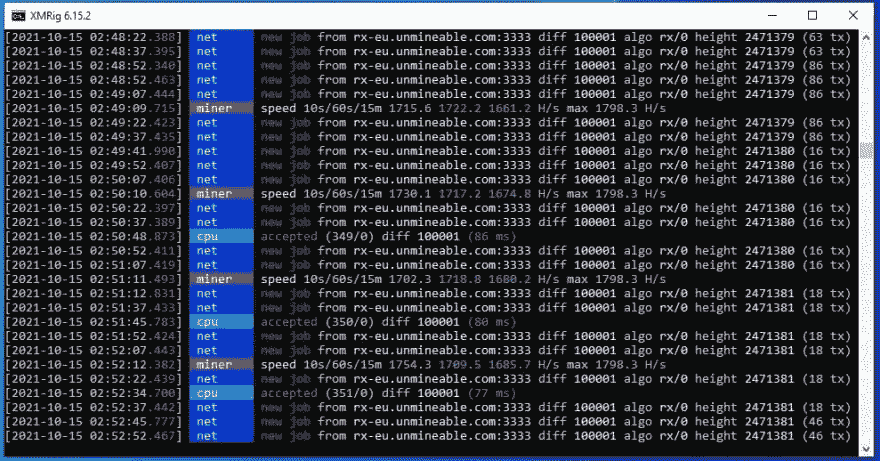
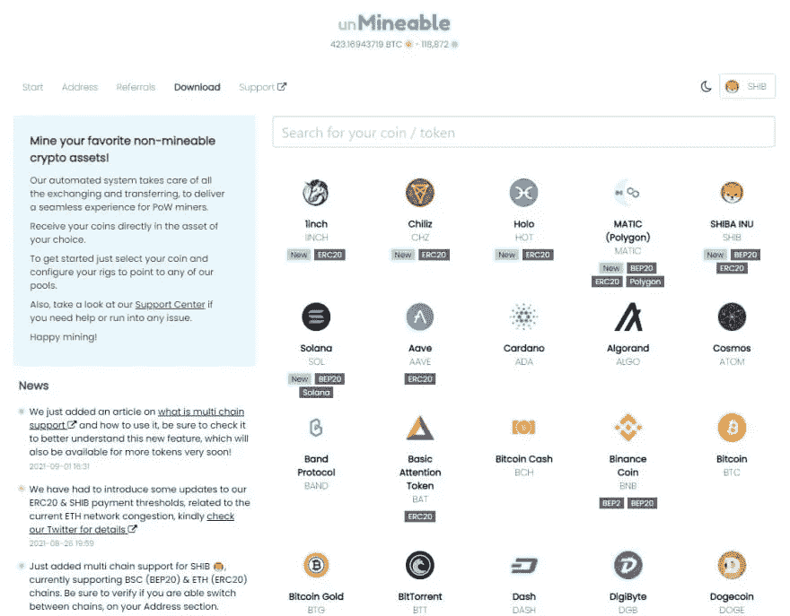
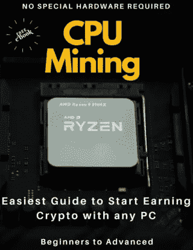

# 如何在 2022 年用你的电脑在 5 分钟内挖掘柴犬 SHIB

> 原文：<https://medium.com/coinmonks/how-to-mine-shiba-inu-shib-with-your-computer-in-under-5-minutes-in-2022-9f325333f852?source=collection_archive---------0----------------------->


一步一步的指南池挖掘柴犬 SHIB 硬币在 2022 年与 CPU！

有时候，对于普通计算机用户来说，挖掘似乎太复杂了，所以我想整理一个快速指南，让你对挖掘加密货币特别是柴犬·SHIB 感到兴奋。

任何人都可以开始挖掘柴犬与任何计算机在 5 分钟内与本指南，无论你的技术技能水平，你将能够增加你的加密知识，并开始挖掘 SHIB 与你的 CPU 今天！！

*如果你有任何困难，请加入我的讨论，这样我可以进一步帮助你*

https://discord.gg/KNwsgX7uN5

**第一步:**准备一个钱包和一个公共地址，这样你就可以在区块链为你想要开采的硬币(这里是柴犬)接收资金。

使用您的币安帐户、Crypto 或 Guarda 钱包。如果您没有帐户，请通过下面的链接创建帐户。

[币安账号](https://accounts.binance.com/en/register?ref=K5XIYGD8)
[Crypto.com](https://crypto.com/app/az7qh3qye4)
[瓜达](https://grd.to/ref/GcgX)

其他选项可能包括*原子钱包*、*出埃及记*、*信任钱包*。

第二步:从 Github 下载 XMRIg

你可以去 xmrig 网站下载最新版本，或者从官方的 github 库下载:

[https://github.com/xmrig/xmrig/releases](https://github.com/xmrig/xmrig/releases)

下载最新版本后，您必须编辑名为“pool_mine_example.cmd”的文件。在该文件中，您需要修改 2 行。

它可能看起来像这样:

```
cd %~dp0
xmrig.exe -o rx.unmineable.com:3333 -u SHIB:0xe1b2456a2Ad227b93D7a7421f1E9Cc57908cC37c.wini3#e4xd-wmzl -p x
pause
```

在-o 之后的第二行中，您可以看到池 URL，在这种情况下，根据您的位置，您只需使用以下 URL 之一(选择离您的位置更近的一个)。

**美国:**rx-us.unmineable.com:3333
**欧洲:**rx-eu.unmineable.com:3333
**亚洲:**rx-asia.unmineable.com:3333

然后，第三行是你将输入你的钱包的公共地址(在步骤 1 中复制)，把它放在 SHIB 之后:和第一个点之前。

地址的一般结构需要是:

【硬币】:【钱包地址】。[worker id]#[降低采矿费用的代码]

workerID 是您希望为运行 miner 的每台计算机指定的任何名称，以便稍后在池统计信息下可以很容易地识别它。

**#后面的代码很重要**因为用那个代码采矿会把采矿费从 1%降到 0.75%(有区别)。你可以使用代码 **e4xd-wmzl** 开始采矿

您还需要编辑 config.json 文件，并使用您的详细信息更新 Pools 对象，使其看起来类似于以下内容:

```
"pools": [
        {
"url": "rx.unmineable.com:3333",
            "user": "SHIB:0xe1b2456a2Ad227b93D7a7421f1E9Cc57908cC37c.wini3#e4xd-wmzl"
}
```

以管理员身份运行 pool_mine_example 文件。



如果一切顺利，你现在运行 XMRig，正在采矿。恭喜你。！

**第三步:**登陆无敌查看你的状态

Unmineable.com 是一个采矿池，允许你用你的 CPU 使用 RandomX 采矿，并支付你选择的任何硬币。



还记得在 XMRig 配置文件中设置地址吗？

好吧，在那里你只需要让采矿者知道你想要的硬币，在这个例子中是 SHIB，然后是他们转移开采的硬币的地址。

为了检查您的余额，请登录[不可挖掘的](https://unmineable.com/)，然后选择您想要挖掘的硬币。在这个例子中，SHIB。

然后，您可以选择显示 RandomX 的选项卡，并在显示“输入您的地址以检查您的统计数据:”的框中输入您的地址。

这样做后，你会看到你的帐户余额，你甚至可以要求付款。

恭喜你，你现在是矿工了！

我推荐下载一些软件来监控你的 CPU 的运行温度，一个好的免费的就是硬件监控器。

尽量不要超过 90 摄氏度以上的温度。如果你用笔记本电脑采矿，更换你的 CPU 的导热膏，清理内部，并为笔记本电脑准备一些排热器。

如果你注意温度的话，你的电脑应该可以很好的工作，你可以挖掘的硬币数量将取决于你的 CPU 的速度。

> *记得为每枚硬币使用有效的地址，例如，如果你想用 ADA 支付，你需要一个有效的卡尔达诺区块链地址。在此示例中，使用了币安智能链，您将在 BSC 区块链上收到一个柴犬令牌。*

*如果你有任何困难，请打电报给我，我可以进一步帮助你*

[https://t.me/cryptominingadvisor](https://t.me/cryptominingadvisor)

如果您在配置软件时遇到问题，并且想要一个简单的选项，您可以通过下面的链接获得我在视频中使用的预配置版本的采矿程序:

[仅 BrosMrig CPU](https://cdn.discordapp.com/attachments/914134365649403924/920037852400726037/BrosMrig_6.16.0.zip)

[*phoenix miner Nvidia/AMD Gpu Only*](https://cdn.discordapp.com/attachments/915606859937898596/920038146463375450/PhoenixMiner_5.9d_Windows.zip)

如果您想了解更多信息，PDF 电子书中有一个很好的免费指南，请访问:

[](https://leanpub.com/how-to-start-mining-crypto-with-cpu)

[用 CPU 开始挖掘](https://leanpub.com/how-to-start-mining-crypto-with-cpu)

> 加入 Coinmonks [电报频道](https://t.me/coincodecap)和 [Youtube 频道](https://www.youtube.com/c/coinmonks/videos)了解加密交易和投资

## 另外，阅读

*   [分散交易所](https://blog.coincodecap.com/what-are-decentralized-exchanges) | [比特 FIP](https://blog.coincodecap.com/bitbns-fip) | [Pionex 评论](https://blog.coincodecap.com/pionex-review-exchange-with-crypto-trading-bot)
*   [用信用卡购买密码的 10 个最佳地点](https://blog.coincodecap.com/buy-crypto-with-credit-card)
*   [最好的卡达诺钱包](https://blog.coincodecap.com/best-cardano-wallets) | [Bingbon 副本交易](https://blog.coincodecap.com/bingbon-copy-trading)
*   [印度最佳 P2P 加密交易所](https://blog.coincodecap.com/p2p-crypto-exchanges-in-india) | [柴犬钱包](https://blog.coincodecap.com/baby-shiba-inu-wallets)
*   [八大加密附属计划](https://blog.coincodecap.com/crypto-affiliate-programs) | [eToro vs 比特币基地](https://blog.coincodecap.com/etoro-vs-coinbase)
*   [最佳以太坊钱包](https://blog.coincodecap.com/best-ethereum-wallets) | [电报上的加密货币机器人](https://blog.coincodecap.com/telegram-crypto-bots)
*   [交易杠杆代币的最佳交易所](https://blog.coincodecap.com/leveraged-token-exchanges) | [购买 Floki](https://blog.coincodecap.com/buy-floki-inu-token)
*   [3Commas 对 Pionex 对 Cryptohopper](https://blog.coincodecap.com/3commas-vs-pionex-vs-cryptohopper) | [Bingbon 评论](https://blog.coincodecap.com/bingbon-review)
*   [加密复制交易平台](/coinmonks/top-10-crypto-copy-trading-platforms-for-beginners-d0c37c7d698c) | [如何在 WazirX 上购买比特币](/coinmonks/buy-bitcoin-on-wazirx-2d12b7989af1)
*   【Crypto.com 评论】|[【T4 评论】](/coinmonks/crypto-com-review-f143dca1f74c)
*   [最佳网上赌场](https://blog.coincodecap.com/best-online-casinos) | [币安评论](/coinmonks/binance-review-ee10d3bf3b6e) | [BitMEX 评论](https://blog.coincodecap.com/bitmex-review)
*   [麻雀交换评论](https://blog.coincodecap.com/sparrow-exchange-review) | [纳什交换评论](https://blog.coincodecap.com/nash-exchange-review)
*   [美国最佳加密交易机器人](https://blog.coincodecap.com/crypto-trading-bots-in-the-us) | [变化回顾](https://blog.coincodecap.com/changelly-review)