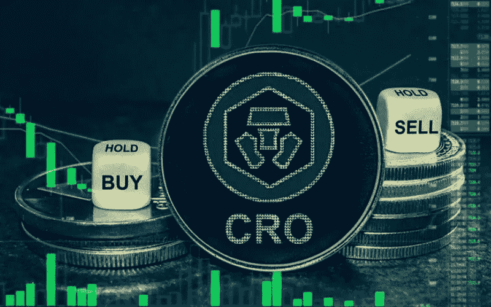
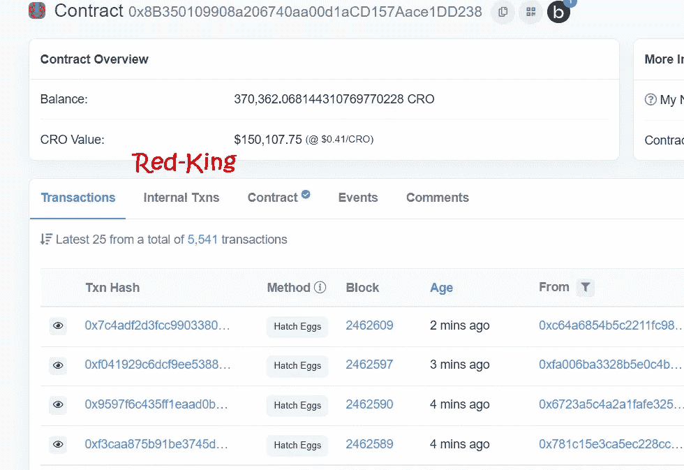
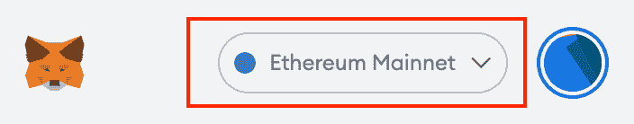
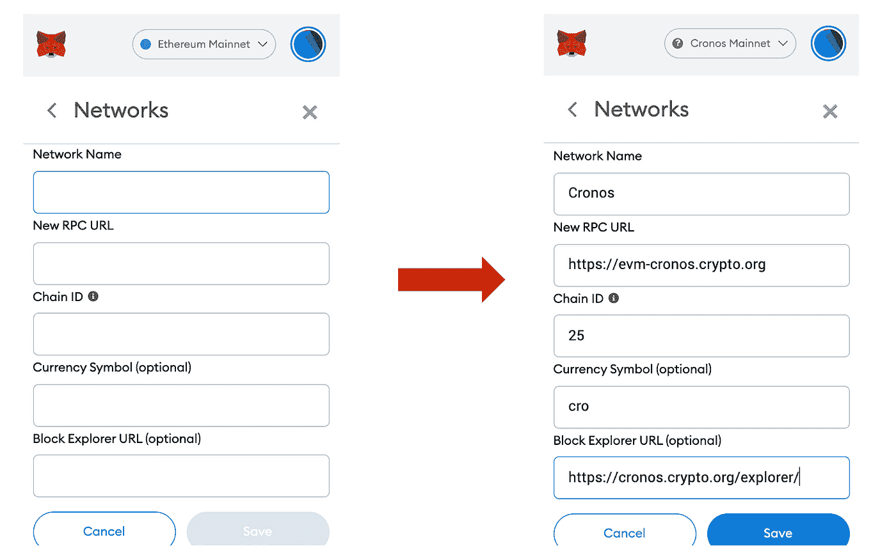
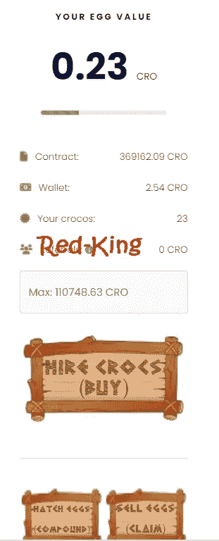
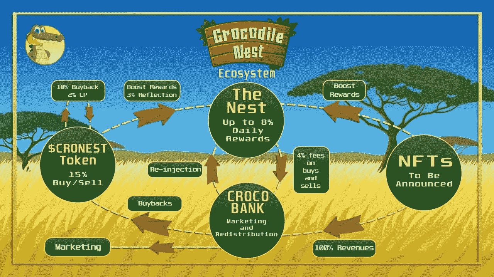

# 农场 Crypto.com 硬币(CRO) -被动浏览器收入，NFT 提升和代币白名单

> 原文：<https://medium.com/coinmonks/how-to-mine-the-official-crypto-com-a49afd12045f?source=collection_archive---------1----------------------->

我总体上相当看好 CRO 硬币，这是我过去几个月一直在交易的东西，在我看来，我认为它有很大的增长潜力，尤其是一旦 BTC 再次开始上涨。crypto.com 的官方硬币是 CRO

今天我向你们展示一个新的 CRO 矿工，它本身相当令人兴奋，因为你们还没有在 CRO 电视网上看到很多东西。

这不是财务建议，纯粹是为了教育和通知你。话虽如此，**我已经投资了这个项目，并每小时产生 CRO 奖励。**此外，这不是一篇赞助文章，我也没有从开发者那里得到任何报酬。

这一个类似于我写过的关于 BNB 链上[和](/@Red-King/my-best-passive-income-crypto-investments-earning-up-to-8-daily-83d09d72854)[多边形(Matic)网络](/@Red-King/my-best-passive-income-crypto-investments-earning-up-to-8-daily-83d09d72854)的其他矿工。这个新的叫做 [***鳄鱼窝***](https://redkingadventures.com/crocnest)*，它是一个 CRO 矿工，每天能为你的投资赚取高达 8%的收益。他们还有即将到来的 NFT 提升和他们自己的令牌，这将在几个小时内推出——该事件的白名单详情如下。*

## *你可以在这里 [**加入鳄鱼窝**。](https://redkingadventures.com/crocnest)*

*这个项目大约两周前启动，我一直在跟踪它，看合同中的行动。我知道很多人喜欢在一家矿商启动时就加入进来，但我首先想看看合同在最初几天是否有所增长，并以此保护自己免受负面影响。显然，这些都是高风险、高回报的项目，所以我喜欢谨慎行事。我也不模仿他们，而是在几天内慢慢地进行小额投资。*

*在过去的三天里，该合约增加了 90，000 CRO，目前的总额为 370，362 CRO(150，107 美元)。所以那时我决定跳进去。 [**此处加入鳄鱼窝**](https://redkingadventures.com/crocnest) 。*

**

# *购买$CRO 硬币*

*首先你必须得到一些 CRO，你可以在各种各样的交易所买到它，我更喜欢使用大门，但是在你舒适和熟悉的任何地方都可以买到。(如果您使用该链接注册 Gate，您将获得 50-100 美元的奖励)。*

*购买 CRO 后，您需要将其发送到您的 Metamask 钱包中。您需要将 CRONUS 网络添加到元掩码中(如果您还没有的话)。*

# *将 CRONUS 网络添加到元掩码*

*步骤 1:在 wallet UI 顶部，单击下拉列表查看网络列表。*

**

*第二步:滚动到列表底部，选择“添加网络”。这是您需要手动添加网络设置的地方。*

*步骤 3:在提供的字段中输入以下详细信息，然后单击“保存”。*

**

*网络名称:Cronos*

*新的 RPC URL:https://evm-cronos.crypto.org*

*链号:25*

*象征:CRO*

*区块浏览器 URL:https://cronos.crypto.org/explorer/*

*步骤 4:您已经成功添加了 Cronos 链！您现在可以在 Metamask 钱包上收发 CRO 了。*

# *连接到鳄鱼窝*

*然后进入 [***鳄鱼窝***](https://redkingadventures.com/crocnest) ，将钱包连接到页面。*

*该平台有一个完整的鳄鱼主题，所以当你输入你想投资多少 CRO 时，你点击*租用鳄鱼*，你会看到你有多少鳄鱼。*

**

*这些鳄鱼会“下蛋”,这意味着它们会给你带来回报。*

*然后你可以选择*卖掉你的蛋*取回你的 CRO 奖励或者*孵化它们*(这是他们对**复利**的术语)。*

**你的彩蛋值*显示你当前的奖励值多少。*

*你可以在底部看到你的日回报率高达 8%。它并不总是保证 8%，通常会在 6%到 8%之间，这个比率取决于你出售鸡蛋或孵化鸡蛋的频率(T21)。*

*你通常会通过遵循他们给你的这些项目的指导方针来获得最好的回报，那就是做 6 天的孵化(或复合)，然后在第 7 天你卖掉你的蛋，将利润提取到你的 Metamask 钱包中。*

# *未来的 NFT 计划*

*他们对这个项目也有一些未来的计划，以帮助它持续更长时间；他们会在未来引入非功能性食物，这些非功能性食物会给你的鳄鱼蛋和 CRO 奖励带来奖励和提升。*

**

# *启动新令牌*

*鳄鱼巢也推出了自己的代币:$CRONEST(你不需要拥有这个代币来投资这个项目，它只是起到一个助推作用。)*

*$CRONEST 将用于维持鸟巢的可持续性。买卖将被征税，所有的东西都将被用于重新注入生态系统，回报持有者。*

*购买代币的投资者将能够自动 ***提升*他们丰厚的每日巢穴奖励高达+25%** ，这使得向巢穴存款并购买代币非常有回报。*

*Pinksale 上将会有一个小型的白名单预售:
🔸截至 4 月 24 日周日，在 Nest 中存款总额至少达到 1K CRO 的所有人都将被自动列入白名单。
🔸您可以参加本次 SweepWidget 竞赛，赢取一个席位:https://sweepwidget.com/view/55576-dejqkpf1
日期:2004 年 1 月 25 日下午 6 点(世界协调时)，紧接着在世界协调时下午 7 点举行代币发布会。*

# *最后要注意的是:*

*我不是财务顾问。这不是一个财务建议，无论你在我的文章中读到什么，都完全是出于教育目的。*

*鳄鱼窝高风险高回报。*

*这份合同有一个反鲸机制，这是所有优秀矿工的标准。*

*这篇文章包含附属链接。*

*我只认可我个人投资的项目。*

*请记住，您不能取出您的初始存款；相当于买了一张存单，你锁定了你的初期投资，但是你每小时都在获得源源不断的回报。*

*如果你遵循六天补种一天收获的制度，这些项目中的大部分可以在六到八周内收回你的初始投资。*

# *其他链接:*

*我最喜欢的 BNB 矿工:**和 [**烤豆**](https://redkingadventures.com/bakedbeans)***

***我最好的 Matic Miner: [**农家**](https://redkingadventures.com/farmhouse)***

> ***加入 Coinmonks [电报频道](https://t.me/coincodecap)和 [Youtube 频道](https://www.youtube.com/c/coinmonks/videos)了解加密交易和投资***

# ***另外，阅读***

*   ***[加密货币储蓄账户](/coinmonks/cryptocurrency-savings-accounts-be3bc0feffbf) | [YoBit 评论](/coinmonks/yobit-review-175464162c62)***
*   ***[Botsfolio vs nap bots vs Mudrex](/coinmonks/botsfolio-vs-napbots-vs-mudrex-c81344970c02)|[gate . io 交流回顾](/coinmonks/gate-io-exchange-review-61bf87b7078f)***
*   ***[CoinFLEX 评论](https://coincodecap.com/coinflex-review) | [AEX 交易所评论](https://coincodecap.com/aex-exchange-review) | [UPbit 评论](https://coincodecap.com/upbit-review)***
*   ***[AscendEx 保证金交易](https://coincodecap.com/ascendex-margin-trading) | [Bitfinex 赌注](https://coincodecap.com/bitfinex-staking) | [bitFlyer 点评](https://coincodecap.com/bitflyer-review)***
*   ***[Bitget 回顾](https://coincodecap.com/bitget-review)|[Gemini vs block fi](https://coincodecap.com/gemini-vs-blockfi)cmd |[OKEx 期货交易](https://coincodecap.com/okex-futures-trading)***