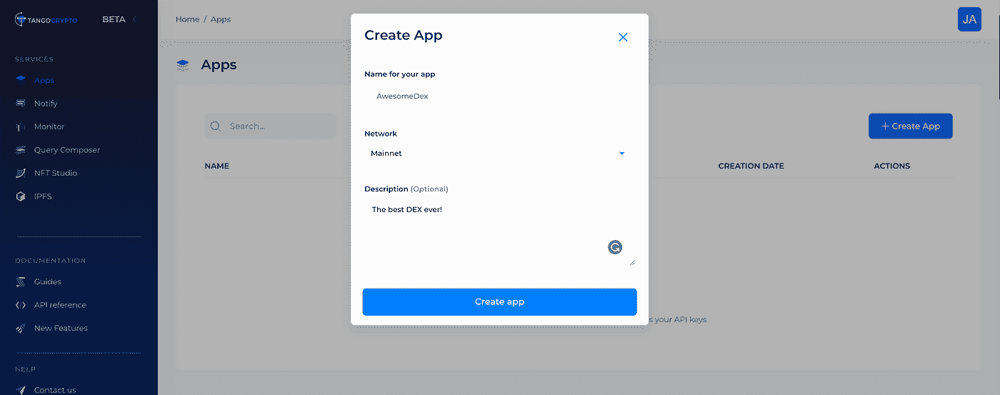
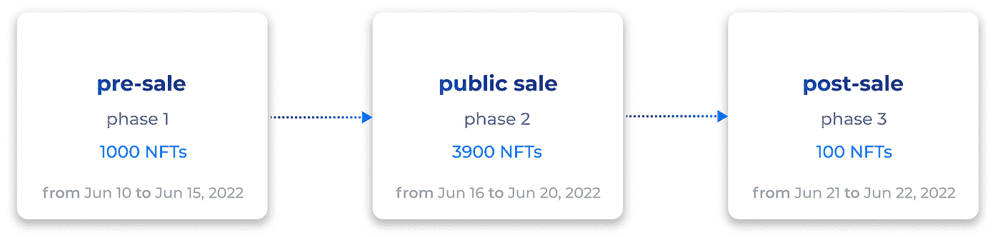
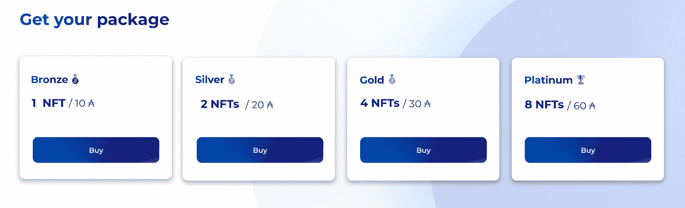
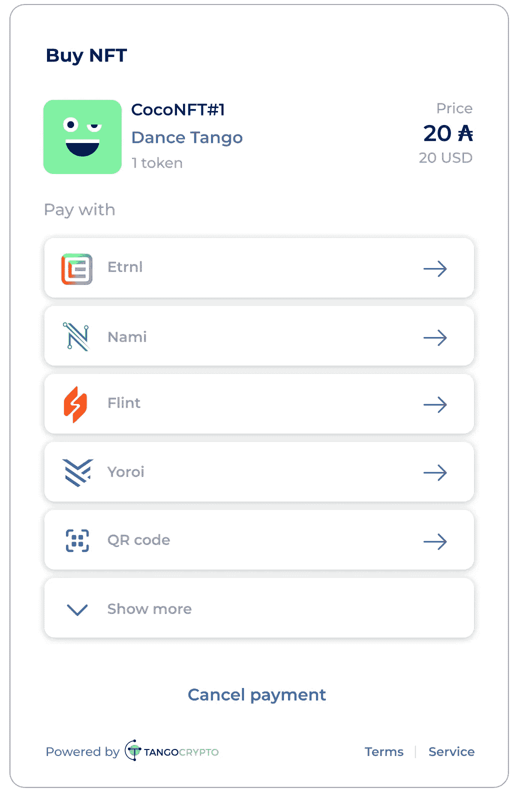

# 如何在卡尔达诺打造 NFT 系列

> 原文：<https://medium.com/coinmonks/how-to-mint-an-nft-collection-on-cardano-7f8f26c71104?source=collection_archive---------5----------------------->

在本教程中，我们将使用 tango crypto API([https://www.tangocrypto.com/](https://www.tangocrypto.com/))打造一个 NFT 系列。

第一步是创建一个帐户，然后创建一个为您提供 API 密钥的应用程序。使用`app-id` 和`x-api-key`你可以调用 API。在这个例子中，我们使用的是 cURL，要获得完整的参考资料，请查看位于[https://www.tangocrypto.com/api-reference/](https://www.tangocrypto.com/api-reference/)的文档。



# 步骤 1:创建一个 NFT 收藏

集合是创建一组具有相似属性的单个 NFT 的一种方式。属于同一集合的所有 NFT 共享属性，如艺术家、创作年份、社交网络、集合名称等。

创建收集请求:

```
curl — location — request POST ‘[https://cardano-testnet.tangocrypto.com/](https://cardano-testnet.tangocrypto.com/)<app-id>/v1/nft/collections' \
 — header ‘x-api-key: <your-api-key>’ \
 — header ‘Content-Type: application/json’ \
 — data-raw ‘{
 “name”: “Tango Collection”,
 “description”: “Tango collection description”,
 “url”: “[https://www.tangocrypto.com](https://www.tangocrypto.com)",
 “payout_address”: “addr_test1qp9mj7vnenx4v99hw7ztfq03n7dmmujpgtlyfjhhel9w67nk72usllcew208n60ym94xcptfrgytuy5apwp565x28jgsg0ztq3”,
 “policy”: {
 “lock”: true,
 “lock_time”: “2022–02–24”
 },
 “metadata”: {
 “asset_name”: “<asset_name>”,
 “name”: “<name>”,
 “media_type”: “<mime_type>”,
 “description”: “<description>”,
 “files”: [
 {
 “name”: “<asset_name>”,
 “media_type”: “<mime_type>”,
 “src”: “<file_link>”
 }
 ],
 “attributes”: {
 “color”: “<color>”,
 “body”: “<body>”,
 “eyes”: “<eyes>”,
 “face”: “<face>”,
 “accessory”: “<accessory>”,
 “collection”: “Tangocrypto Collection”,
 “artist”: “Tangocrypto”,
 “twitter”: “[https://twitter.com/tango_crypto](https://twitter.com/tango_crypto)”,
 “copyright”: “Tangocrypto 2021”
 },
 “version”: “1.0”
 }
}’
```

这个端点返回了`policy_id` **。**您应该在您的网站、社交媒体或任何沟通渠道上发布`policy id`，供买家验证他们购买的代币的真实性。

```
{
    "id": "e1d7fe1d97c64518a5c51011edcc1a31",
    "name": "Tango Collection",
    "url": "[https://www.tangocrypto.com](https://www.tangocrypto.com)",
    "description": "Tango collection description",
    "payout_address": "addr_test1qpp33lzjgyzz6k86yy27kvkjepu8mfjy6g4l8rf2v8yjp4sla7h6txtvlevazp6jylz0w90y8yz0uec3cder28r47sssj9w2kd",
    "token_count": 0,
    "token_for_sale_count": 0,
    "token_sold_count": 0,
    "revenue": 0,
    "income": 0,
    "service_fee": 0,
    "nft_fee": 0,
    "tx_fee": 0,
    "total_fees": 0,
    "policy": {
        "lock": true,
        "lock_time": "2022-02-24T00:00:00.000Z",
        "policy_id": "6a16d7d312dfcbcb4f676fa31893cf6c456508d84472309f3aa7c998",
        "script": {
            "type": "all",
            "scripts": [
                {
                    "type": "sig",
                    "keyHash": "76bcc8cf947649636f027e705a30ec66fa0476971aef51d219323c07"
                },
                {
                    "type": "before",
                    "slot": 54094491
                }
            ]
        }
    },
    "metadata": {
        "label": "721",
        "asset_name": "<asset_name>",
        "name": "<name>",
        "media_type": "<mime_type>",
        "description": "<description>",
        "files": [
            {
                "name": "<asset_name>",
                "media_type": "<mime_type>",
                "src": "<file_link_1>"
            }
        ],
        "attributes": {
            "color": "<color>",
            "body": "<body>",
            "eyes": "<eyes>",
            "face": "<face>",
            "accessory": "<accessory>",
            "collection": "Tangocrypto Collection",
            "artist": "Tangocrypto",
            "twitter": "[https://twitter.com/tango_crypto](https://twitter.com/tango_crypto)",
            "website": "[https://www.tangocrypto.com](https://www.tangocrypto.com)",
            "copyright": "Tangocrypto 2022"
        },
        "version": "1.0"
    },
    "created_at": "2022-02-23T08:21:38.908Z",
    "updated_at": "2022-02-23T08:21:38.908Z"
}
```

# 步骤 2:上传图像并设置元数据属性

一旦收集完成，你就可以开始添加将成为 NFTs 的东西(从技术上讲，要成为 NFT，它需要在区块链铸造)。因此，下一步是上传图像，并为集合中的每个 NFT 定义元数据。使用下面的 API 端点，并将步骤 1 中返回的`collection-id`作为路径的一部分。

**注意**:图像必须转换为 base64

```
curl --location --request POST '[https://cardano-testnet.tangocrypto.com/](https://cardano-testnet.tangocrypto.com/)<app-id>/v1/nft/collections/<collection-id>/tokens' \
--header 'x-api-key: <your-api-key>' \
--header 'Content-Type: application/json' \
--data-raw '{
    "tokens": [{
        "name": "Tango 01",
        "asset_name": "Tango01",
        "description": "If you get all tangled up, just tango on.",
        "media_type": "image/png",
        "image": "iVBORw0KGgoAAAANSU.....hEUgAADQYAAA0HCAYAAACB0xAqAAAACXBIWXMA",
        "metadata_attributes": [{
                "tag": "<color>",
                "value": "Blue"
            },
            {
                "tag": "<body>",
                "value": "Skinny"
            },
            {
                "tag": "<eyes>",
                "value": "Blue"
            },
            {
                "tag": "<face>",
                "value": "rounded"
            },
            {
                "tag": "<accessory>",
                "value": "keyboard"
            }],
        "custom_attributes": {
            "serial_no": "12345545",
            "md5checksum": "bc527343c7ffc103111f3a694b004e2f"
        }
    }]
}'
```

回应:

```
{
  "data": [
    {
      "id": "e9e00b33e0a34edcaf4534a2f96a637d",
      "asset_name": "Tango01",
      "name": "Tango 01",
      "fingerprint": "asset1hzh0uut85ypcueu88422pmgf6twzj2c52f73a5",
      "status": "FOR_SALE",
      "description": "If you get all tangled up, just tango on.",
      "image": "ipfs://QmP8uBgxmTpduCUbasQRCEpiq1g9KEjxuRfR5VcvifWoNo",
      "media_type": "image/png",
      "metadata_attributes": [
        {
          "name": "Attribute color",
          "value": "Blue",
          "tag": "<color>"
        },
        {
          "name": "Attribute body",
          "value": "Skinny",
          "tag": "<body>"
        },
        {
          "name": "Attribute eyes",
          "value": "Green",
          "tag": "<eyes>"
        },
        {
          "name": "Attribute face",
          "value": "Rounded",
          "tag": "<face>"
        },
        {
          "name": "Attribute accessory",
          "value": "Keyboard",
          "tag": "<accessory>"
        }
      ],
      "custom_attributes": {
        "serial_no": "12345545",
        "md5checksum": "bc527343c7ffc103111f3a694b004e2f"
      },
      "policy": {
        "lock": true,
        "lock_time": "2022-01-03T15:35:10.000Z",
        "policy_id": "1373bf16cdea380e6c9c716d0f56f021b9e9ddea90b248dae6310d95",
        "script": {
          "type": "all",
          "scripts": [
            {
              "type": "sig",
              "keyHash": "ac1746df0ba039de81274d472a477fced610f57cebc5c7841074f54c"
            },
            {
              "type": "before",
              "slot": "46854826"
            }
          ]
        }
      },
      "metadata": {
        "721": {
          "1373bf16cdea380e6c9c716d0f56f021b9e9ddea90b248dae6310d95": {
            "Tango01": {
              "name": "Tango 01",
              "description": "If you get all tangled up, just tango on.",
              "image": "ipfs://QmP8uBgxmTpduCUbasQRCEpiq1g9KEjxuRfR5VcvifWoNo",
              "mediaType": "image/png",
              "color": "Blue",
              "body": "Skinny",
              "eyes": "Green",
              "face": "Rounded",
              "accessory": "Keyboard",
              "collection": "Tangocrypto Collection",
              "artist": "Tangocrypto",
              "twitter": "[https://twitter.com/tango_crypto](https://twitter.com/tango_crypto)",
              "website": "[https://www.tangocrypto.com](https://www.tangocrypto.com)",
              "copyright": "Tangocrypto 2022",
              "serial_no": "12345545",
              "md5checksum": "bc527343c7ffc103111f3a694b004e2f"

            }
          },
          "version": "1.0"
        }
      },
      "created_at": "2021-11-30T23:17:36.791Z",
      "updated_at": "2021-11-30T23:17:36.791Z"
    }
  ],
  "status_code": 201
}
```

# 步骤 3:创建销售阶段

销售阶段是一种控制机制，它定义了你将如何销售该系列。你可以添加不同的阶段来控制你将如何出售该系列。例如，您可能总共有 5000 个 NFT，您想分三个阶段出售它们。

您可以创建一个售前阶段，在特定的时间范围内以特价向以前的客户销售前 1000 台 NFT。你可以用一个条件来识别这些客户；这将是一个 NFT，他们的钱包上有一个特定的政策 id。然后，您为 3900 NFTs 和无条件的公共投放创建另一个销售阶段，最后，您留下 100 NFTs 作为最后阶段的储备。



sale phases

现在您已经创建了集合并上传了文件和元数据，是时候定义如何销售 NFTs 了。

在这里，我们将为预售创建一个销售阶段，我们想随机销售 1000 个 NFT。我们有 4 个价格等级，买家可以选择他们想要购买的等级。例如，如果买家想要获得 4 个随机 NFT，他们可以选择黄金等级并支付 30 Ada。

利用价格层级和四个购买按钮的链接生成销售阶段。

```
curl --location --request POST '[https://cardano-mainnet.tangocrypto.com/](https://cardano-mainnet.tangocrypto.com/)<app-id>/v1/nft/collections/<collection-id>/phases' \
--header 'x-api-key: <your-api-key>' \
--header 'Content-Type: application/json' \
--data-raw '{
    "name": "pre-sale",
    "type": "random",
    "total_tokens": 1000,
    "reservation_time": 300,
    "price_tiers": [
        {
            "name": "Bronze",
            "quantity": 1,
            "supply": 1,
            "price": 10000000
        },
        {
            "name": "Silver",
            "quantity": 2,
            "supply": 1,
            "price": 20000000
        },
        {
            "name": "Gold",
            "quantity": 4,
            "supply": 1,
            "price": 30000000
        },
        {
            "name": "Platinum",
            "quantity": 8,
            "supply": 1,
            "price": 60000000
        }
    ]
}'
```

回应:

在回复中，我们可以看到每个价格等级都有一个关联的支付链接。然后，我们复制链接并将其嵌入到按钮中。当买家点击按钮时，一个带有 Tangopay 的新窗口将会打开，一旦支付完成，NFT 将被发送到钱包。

```
{
    "id": "81d190a7ed1847cc97cf515aa2a70bc2",
    "type": "random",
    "name": "pre-sale",
    "active": true,
    "reservation_time": 300,
    "total_tokens": 1000,
    "remaining_tokens": 1000,
    "price_tiers": [
        {
            "id": 0,
            "name": "Bronze",
            "price": 10000000,
            "quantity": 1,
            "supply": 1,
            "payment_link": "[https://buy.tangocrypto.com?q=test_eyJjb2xsZWN0aW9uX2lkIjoiOTFjMjYyZmRkYjljNGYyOWJmZDc0MTI1NmJmMzAxMWIiLCJwaGFzZV9pZCI6IjgxZDE5MGE3ZWQxODQ3Y2M5N2NmNTE1YWEyYTcwYmMyIiwicnVsZXMiOltdLCJwcmljZSI6MTAwMDAwMDAsInByaWNlX2lkIjowLCJxdWFudGl0eSI6MSwic3VwcGx5IjoxLCJ0eXBlIjoiUGhhc2VTYWxlIiwidGNjIjoicVgrcGdJUm00Qm5iVVR2UnFzeGtmK3p4VVBoeFUzaE1rRGVqMTdTSGlwckZMd1BkOGpwaTRleDFCQ2d3YXFyUUpRUEd6SFVVdm9BdEdPbU14dUlYY25LU09rVzkxRVZ1YnhhajdwVDRETVVpaU9NZXdIRXV3eHJUVndQVkFnPT0ifQ==](https://buy.tangocrypto.com?q=test_eyJjb2xsZWN0aW9uX2lkIjoiOTFjMjYyZmRkYjljNGYyOWJmZDc0MTI1NmJmMzAxMWIiLCJwaGFzZV9pZCI6IjgxZDE5MGE3ZWQxODQ3Y2M5N2NmNTE1YWEyYTcwYmMyIiwicnVsZXMiOltdLCJwcmljZSI6MTAwMDAwMDAsInByaWNlX2lkIjowLCJxdWFudGl0eSI6MSwic3VwcGx5IjoxLCJ0eXBlIjoiUGhhc2VTYWxlIiwidGNjIjoicVgrcGdJUm00Qm5iVVR2UnFzeGtmK3p4VVBoeFUzaE1rRGVqMTdTSGlwckZMd1BkOGpwaTRleDFCQ2d3YXFyUUpRUEd6SFVVdm9BdEdPbU14dUlYY25LU09rVzkxRVZ1YnhhajdwVDRETVVpaU9NZXdIRXV3eHJUVndQVkFnPT0ifQ==)"
        },
        {
            "id": 1,
            "name": "Silver",
            "price": 20000000,
            "quantity": 2,
            "supply": 1,
            "payment_link": "[https://buy.tangocrypto.com?q=test_eyJjb2xsZWN0aW9uX2lkIjoiOTFjMjYyZmRkYjljNGYyOWJmZDc0MTI1NmJmMzAxMWIiLCJwaGFzZV9pZCI6IjgxZDE5MGE3ZWQxODQ3Y2M5N2NmNTE1YWEyYTcwYmMyIiwicnVsZXMiOltdLCJwcmljZSI6MjAwMDAwMDAsInByaWNlX2lkIjoxLCJxdWFudGl0eSI6Miwic3VwcGx5IjoxLCJ0eXBlIjoiUGhhc2VTYWxlIiwidGNjIjoicVgrcGdJUm00Qm5iVVR2UnFzeGtmK3p4VVBoeFUzaE1rRGVqMTdTSGlwckZMd1BkOGpwaTRleDFCQ2d3YXFyUUpRUEd6SFVVdm9BdEdPbU14dUlYY25LU09rVzkxRVZ1YnhhajdwVDRETVVpaU9NZXdIRXV3eHJUVndQVkFnPT0ifQ==](https://buy.tangocrypto.com?q=test_eyJjb2xsZWN0aW9uX2lkIjoiOTFjMjYyZmRkYjljNGYyOWJmZDc0MTI1NmJmMzAxMWIiLCJwaGFzZV9pZCI6IjgxZDE5MGE3ZWQxODQ3Y2M5N2NmNTE1YWEyYTcwYmMyIiwicnVsZXMiOltdLCJwcmljZSI6MjAwMDAwMDAsInByaWNlX2lkIjoxLCJxdWFudGl0eSI6Miwic3VwcGx5IjoxLCJ0eXBlIjoiUGhhc2VTYWxlIiwidGNjIjoicVgrcGdJUm00Qm5iVVR2UnFzeGtmK3p4VVBoeFUzaE1rRGVqMTdTSGlwckZMd1BkOGpwaTRleDFCQ2d3YXFyUUpRUEd6SFVVdm9BdEdPbU14dUlYY25LU09rVzkxRVZ1YnhhajdwVDRETVVpaU9NZXdIRXV3eHJUVndQVkFnPT0ifQ==)"
        },
        {
            "id": 2,
            "name": "Gold",
            "price": 30000000,
            "quantity": 4,
            "supply": 1,
            "payment_link": "[https://buy.tangocrypto.com?q=test_eyJjb2xsZWN0aW9uX2lkIjoiOTFjMjYyZmRkYjljNGYyOWJmZDc0MTI1NmJmMzAxMWIiLCJwaGFzZV9pZCI6IjgxZDE5MGE3ZWQxODQ3Y2M5N2NmNTE1YWEyYTcwYmMyIiwicnVsZXMiOltdLCJwcmljZSI6MzAwMDAwMDAsInByaWNlX2lkIjoyLCJxdWFudGl0eSI6NCwic3VwcGx5IjoxLCJ0eXBlIjoiUGhhc2VTYWxlIiwidGNjIjoicVgrcGdJUm00Qm5iVVR2UnFzeGtmK3p4VVBoeFUzaE1rRGVqMTdTSGlwckZMd1BkOGpwaTRleDFCQ2d3YXFyUUpRUEd6SFVVdm9BdEdPbU14dUlYY25LU09rVzkxRVZ1YnhhajdwVDRETVVpaU9NZXdIRXV3eHJUVndQVkFnPT0ifQ==](https://buy.tangocrypto.com?q=test_eyJjb2xsZWN0aW9uX2lkIjoiOTFjMjYyZmRkYjljNGYyOWJmZDc0MTI1NmJmMzAxMWIiLCJwaGFzZV9pZCI6IjgxZDE5MGE3ZWQxODQ3Y2M5N2NmNTE1YWEyYTcwYmMyIiwicnVsZXMiOltdLCJwcmljZSI6MzAwMDAwMDAsInByaWNlX2lkIjoyLCJxdWFudGl0eSI6NCwic3VwcGx5IjoxLCJ0eXBlIjoiUGhhc2VTYWxlIiwidGNjIjoicVgrcGdJUm00Qm5iVVR2UnFzeGtmK3p4VVBoeFUzaE1rRGVqMTdTSGlwckZMd1BkOGpwaTRleDFCQ2d3YXFyUUpRUEd6SFVVdm9BdEdPbU14dUlYY25LU09rVzkxRVZ1YnhhajdwVDRETVVpaU9NZXdIRXV3eHJUVndQVkFnPT0ifQ==)"
        },
        {
            "id": 3,
            "name": "Platinum",
            "price": 60000000,
            "quantity": 8,
            "supply": 1,
            "payment_link": "[https://buy.tangocrypto.com?q=test_eyJjb2xsZWN0aW9uX2lkIjoiOTFjMjYyZmRkYjljNGYyOWJmZDc0MTI1NmJmMzAxMWIiLCJwaGFzZV9pZCI6IjgxZDE5MGE3ZWQxODQ3Y2M5N2NmNTE1YWEyYTcwYmMyIiwicnVsZXMiOltdLCJwcmljZSI6NjAwMDAwMDAsInByaWNlX2lkIjozLCJxdWFudGl0eSI6OCwic3VwcGx5IjoxLCJ0eXBlIjoiUGhhc2VTYWxlIiwidGNjIjoicVgrcGdJUm00Qm5iVVR2UnFzeGtmK3p4VVBoeFUzaE1rRGVqMTdTSGlwckZMd1BkOGpwaTRleDFCQ2d3YXFyUUpRUEd6SFVVdm9BdEdPbU14dUlYY25LU09rVzkxRVZ1YnhhajdwVDRETVVpaU9NZXdIRXV3eHJUVndQVkFnPT0ifQ==](https://by.tangocrypto.com?q=test_eyJjb2xsZWN0aW9uX2lkIjoiOTFjMjYyZmRkYjljNGYyOWJmZDc0MTI1NmJmMzAxMWIiLCJwaGFzZV9pZCI6IjgxZDE5MGE3ZWQxODQ3Y2M5N2NmNTE1YWEyYTcwYmMyIiwicnVsZXMiOltdLCJwcmljZSI6NjAwMDAwMDAsInByaWNlX2lkIjozLCJxdWFudGl0eSI6OCwic3VwcGx5IjoxLCJ0eXBlIjoiUGhhc2VTYWxlIiwidGNjIjoicVgrcGdJUm00Qm5iVVR2UnFzeGtmK3p4VVBoeFUzaE1rRGVqMTdTSGlwckZMd1BkOGpwaTRleDFCQ2d3YXFyUUpRUEd6SFVVdm9BdEdPbU14dUlYY25LU09rVzkxRVZ1YnhhajdwVDRETVVpaU9NZXdIRXV3eHJUVndQVkFnPT0ifQ==)"
        }
    ],
    "created_at": "2022-05-24T03:10:58.988Z",
    "updated_at": "2022-05-24T03:10:58.988Z"
}
```

# 第四步:在你的网站上出售该系列

为每个支付链接创建一个按钮，并在您的网站上销售该系列。



```
<form action="[https://buy.tangocrypto.com?q=test_eyJjb2xsZWN0aW9uX2lkIjoiOTFjMjYyZmRkYjljNGYyOWJmZDc0MTI1NmJmMzAxMWIiLCJwaGFzZV9pZCI6IjgxZDE5MGE3ZWQxODQ3Y2M5N2NmNTE1YWEyYTcwYmMyIiwicnVsZXMiOltdLCJwcmljZSI6NjAwMDAwMDAsInByaWNlX2lkIjozLCJxdWFudGl0eSI6OCwic3VwcGx5IjoxLCJ0eXBlIjoiUGhhc2VTYWxlIiwidGNjIjoicVgrcGdJUm00Qm5iVVR2UnFzeGtmK3p4VVBoeFUzaE1rRGVqMTdTSGlwckZMd1BkOGpwaTRleDFCQ2d3YXFyUUpRUEd6SFVVdm9BdEdPbU14dUlYY25LU09rVzkxRVZ1YnhhajdwVDRETVVpaU9NZXdIRXV3eHJUVndQVkFnPT0ifQ==](https://by.tangocrypto.com?q=test_eyJjb2xsZWN0aW9uX2lkIjoiOTFjMjYyZmRkYjljNGYyOWJmZDc0MTI1NmJmMzAxMWIiLCJwaGFzZV9pZCI6IjgxZDE5MGE3ZWQxODQ3Y2M5N2NmNTE1YWEyYTcwYmMyIiwicnVsZXMiOltdLCJwcmljZSI6NjAwMDAwMDAsInByaWNlX2lkIjozLCJxdWFudGl0eSI6OCwic3VwcGx5IjoxLCJ0eXBlIjoiUGhhc2VTYWxlIiwidGNjIjoicVgrcGdJUm00Qm5iVVR2UnFzeGtmK3p4VVBoeFUzaE1rRGVqMTdTSGlwckZMd1BkOGpwaTRleDFCQ2d3YXFyUUpRUEd6SFVVdm9BdEdPbU14dUlYY25LU09rVzkxRVZ1YnhhajdwVDRETVVpaU9NZXdIRXV3eHJUVndQVkFnPT0ifQ==)">
    <input type="submit" value="Buy" />
</form>
```

当买家点击购买按钮时，一个带有 Tangopay 的新窗口将会打开，买家可以在那里用卡尔达诺最常用的钱包付款。



**Nodejs 代码**

我们通过 Postman 所做的一切都可以用任何编程语言来完成。这里有一个使用 Nodejs 的例子:

**结论**

仅此而已，如果你坚持到了最后，你的钱包里应该有一个 NFTs。请关注我们在 https://twitter.com/tango_crypto[的更新](https://twitter.com/tango_crypto)

> 加入 Coinmonks [电报频道](https://t.me/coincodecap)和 [Youtube 频道](https://www.youtube.com/c/coinmonks/videos)了解加密交易和投资

# 另外，阅读

*   [最佳加密交换平台](https://coincodecap.com/best-crypto-swap-platforms) | [最佳加密交易所](https://coincodecap.com/crypto-exchange)
*   [购买比特币印度](/coinmonks/buy-bitcoin-in-india-feb50ddfef94) | [Pionex 评论](/coinmonks/pionex-review-exchange-with-crypto-trading-bot-1e459d0191ea) | [加密交易机器人](/coinmonks/crypto-trading-bot-c2ffce8acb2a)
*   [n 零审核](/coinmonks/ngrave-zero-review-c465cf8307fc) | [Phemex 审核](/coinmonks/phemex-review-4cfba0b49e28) | [PrimeXBT 审核](/coinmonks/primexbt-review-88e0815be858)
*   最佳[区块链分析](https://bitquery.io/blog/best-blockchain-analysis-tools-and-software)工具| [赚比特币](/coinmonks/earn-bitcoin-6e8bd3c592d9)
*   [Cloudbet 赌场评论](https://coincodecap.com/cloudbet-casino-review) | [点火赌场评论](https://coincodecap.com/ignition-casino-review)
*   [加密套利](/coinmonks/crypto-arbitrage-guide-how-to-make-money-as-a-beginner-62bfe5c868f6)指南| [如何做空比特币](/coinmonks/how-to-short-bitcoin-568a2d0b4ae5)