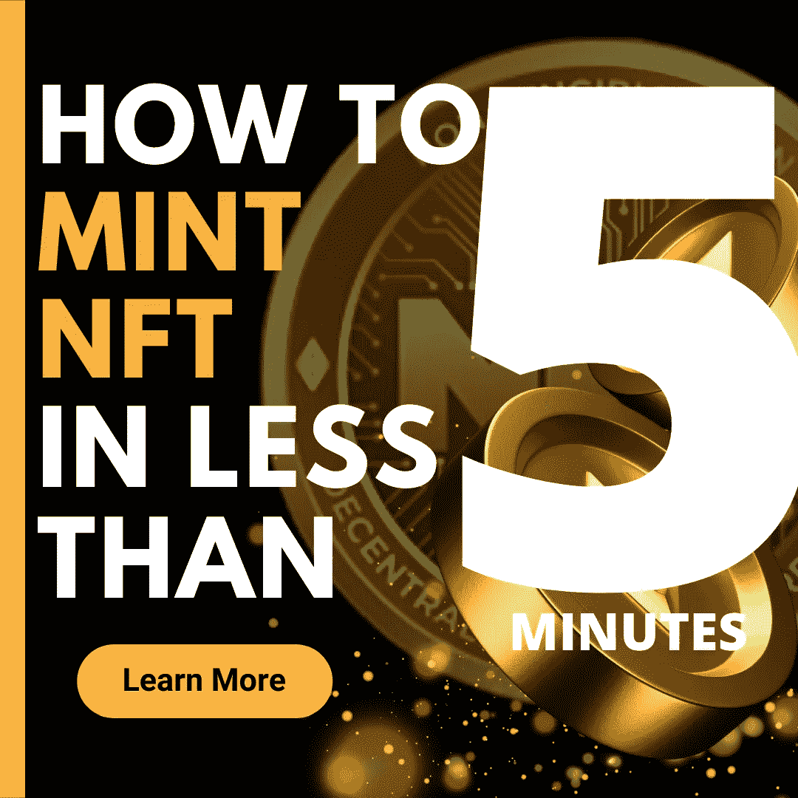
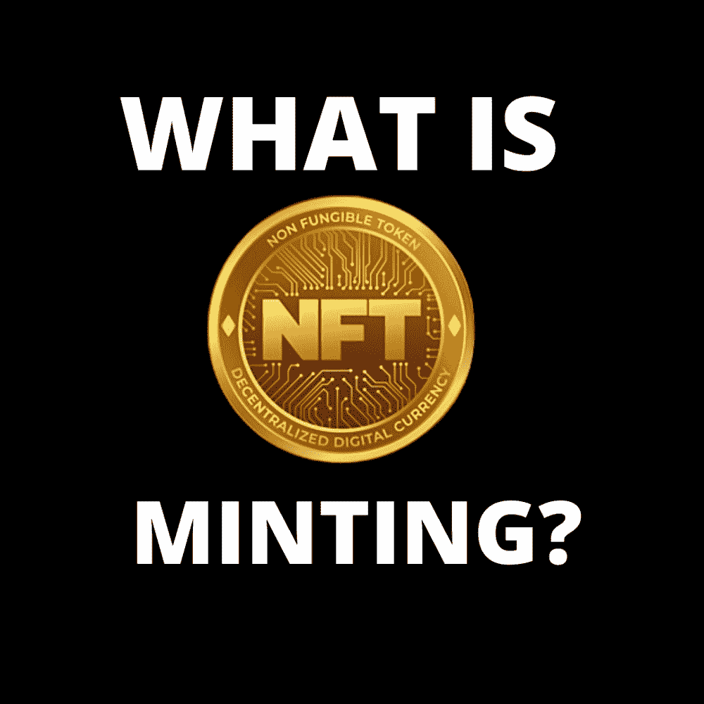
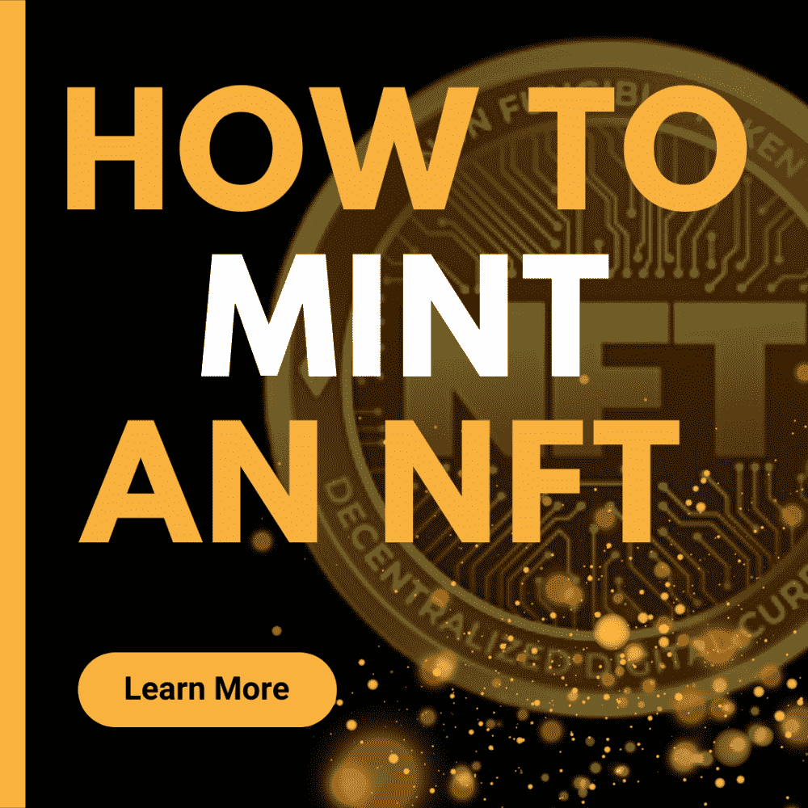

# 如何在 5 分钟内制作一个 NFT

> 原文：<https://medium.com/coinmonks/how-to-mint-an-nft-in-less-than-5minutes-48eb0422fee4?source=collection_archive---------26----------------------->

HOW TO MINT AND NFT INN LESS THAN 5MINUTES

# 介绍

术语 NFT 意味着不可替代的代币。它们是数字资产，不能被任何其他东西替代或交换，例如艺术品。NFTs 的唯一目的是提供数字资产所有权的证明，从而减少对这些资产的模仿。要了解更多关于 NFTs 的信息，请点击这里的链接。

现在，让我们来谈谈 NFT 铸币厂

## NFT 铸币厂

让我们考虑这个场景。如果你有一个有价值的产品，无论是出售还是不出售，你没有把它带到市场上或宣传它，以便人们可以看到它，确定你是所有者，并可能从你这里购买，该产品可能永远不会被任何人购买。事实上，你很容易丢失那个产品，尤其是如果它被那些碰巧在你之前上传它的人看到的话。然而，如果你上传/制造了同样的产品到市场上，首先，你将有数字许可证作为所有权的证明，然后，产品将更容易被看到，有更多的机会被购买。这同样适用于 NFT 铸币厂。

NFT 铸币就是将一份数字文件转换成区块链上的数字资产的过程，这使它成为可以在 NFT 市场在线购买或销售的商品。有很多 NFT 市场，如:开放海，稀有，分散的土地，基金会，轴无限，超级稀有等。

换句话说，NFT 造币厂是数字资产在区块链空间出售之前要经过的一段路。那么，我们怎样才能铸造 NFT 呢？

## 如何铸造 NFT

NFT 可以在不同的交易所进行铸造，但是大多数都遵循相同的铸造程序。因此，我们将考虑一些创建非功能性测试的方法，如下所示:

1.  选择交易所:首先，你要选择能买到以太坊或者币安智能链的交易所。这主要是你铸造一个 nft 时支付的货币。
2.  然后创建一个钱包来存放你的以太坊。有两种不同类型的加密钱包，即:热钱包和冷钱包。点击此[链接](/coinmonks/a-complete-guide-on-getting-the-best-crypto-wallet-5c63b1560c27)了解更多关于加密钱包以及如何选择最佳钱包类型的信息。
3.  决定你想使用的 NFT 市场。如上所述，有许多 NFT 市场，你的市场选择将取决于许多因素，如燃气费，用户友好的界面，客户服务反应等。一些市场场所包括:NFT 陈列室，开放海洋，阿谢市场，超级稀有，稀有等。
4.  将您的钱包连接到您选择的 NFT 平台。这可以通过二维码扫描仪或通过钱包电脑下载来完成。连接钱包后，您就可以创建个人资料了。在个人资料中，你需要分享一些关于你自己的信息。
5.  最后，您需要上传您的资产和您的数字资产的详细信息，包括名称、您希望支付的金额以及您接受的加密货币类型。
6.  然后你付煤气费。汽油费更像是你向市场支付的托管你的产品的服务费。

# 结论

就像地球上的其他活动一样，NFT 是通过一个叫做铸造的过程形成的。这种铸造有不同的阶段或过程，在完成作品之前必须通过这些阶段或过程。它从创建您的加密货币钱包开始，到购买所需的加密货币通常是以太坊，再到选择您首选的市场(考虑很多因素，如汽油费、用户界面、目标客户等)。在此之后，你现在有能力上传你的数字资产，并等待你的潜在买家。

这标志着你的 NFT 铸造的结束。这并不像听起来那么难。所以，为什么不现在就开始，铸造一个 NFT，你会很高兴你这样做了。

# 关于作者

Igwe Ihuoma Patience 是一名自学成才的创意和特定行业内容作家，也是一名加密货币爱好者，拥有 2 年多的经验和不断发展的区块链空间的知识。

我擅长内容创作、文案撰写、字幕管理、视频编辑和手机图形设计，我教其他人如何在加密货币和区块链领域起步，我的目标是让区块链的学习和更新易于任何人理解。

> 加入 Coinmonks [电报频道](https://t.me/coincodecap)和 [Youtube 频道](https://www.youtube.com/c/coinmonks/videos)了解加密交易和投资

# 另外，阅读

*   [火币交易机器人](https://coincodecap.com/huobi-trading-bot) | [如何购买 ADA](https://coincodecap.com/buy-ada-cardano) | [Geco？一次回顾](https://coincodecap.com/geco-one-review)
*   [加密副本交易平台](/coinmonks/top-10-crypto-copy-trading-platforms-for-beginners-d0c37c7d698c) | [五大 BlockFi 替代方案](https://coincodecap.com/blockfi-alternatives)
*   [CoinLoan 审核](https://coincodecap.com/coinloan-review)|[Crypto.com 审核](/coinmonks/crypto-com-review-f143dca1f74c) | [火币保证金交易](/coinmonks/huobi-margin-trading-b3b06cdc1519)
*   [拜比特 vs 币安](https://coincodecap.com/bybit-binance-moonxbt)|[stealthexreview](/coinmonks/stealthex-review-396c67309988)|[Probit Review](https://coincodecap.com/probit-review)
*   [顶级付费加密货币和区块链课程](https://coincodecap.com/blockchain-courses)
*   [CBET 评论](https://coincodecap.com/cbet-casino-review) | [库科恩 vs 比特币基地](https://coincodecap.com/kucoin-vs-coinbase) | [拜比特 vs 比特币基地](https://coincodecap.com/bybit-vs-coinbase)