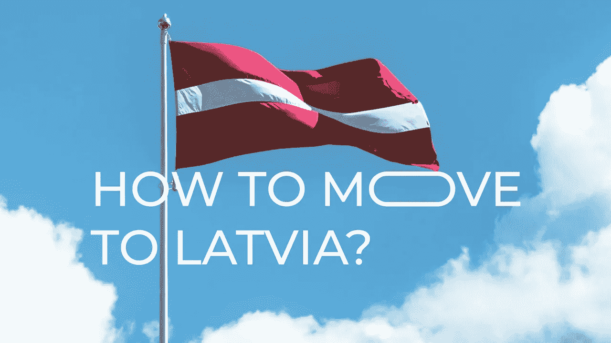

# 如何移居拉脱维亚？

> 原文：<https://medium.com/coinmonks/how-to-move-to-latvia-551f38917284?source=collection_archive---------35----------------------->

毫无疑问，许多人认为生活在甚至移民到另一个国家会很好。但要做到这一点似乎非常困难:你需要收集一大堆文件，确认你的语言知识，找到一个准备接受没有居住证的你的雇主，以及各种困难的预告片。是的，我们同意，这听起来太悲伤了，但我们有一个很好的提议！

## *搬迁*

我们为我们的员工提供与 ***您的家人*** 一起搬迁到拉托维亚、法、美、加的机会，以及在泰国住宿工作的选择！

我们*照顾*一切:

*   我们提供住宿，我们在一个很好的住宅区租公寓，邻居是我们的开发商
*   我们承担文书工作、签证、税收和关税的所有费用
*   我们支付购买机票的费用，并提供私人汽车
*   我们以 1000€的形式给予奖金

## *拉脱维亚*

我们的员工更喜欢拉脱维亚，这并不奇怪。在这里生活比在其他申根国家更便宜。产品的价格水平与俄罗斯相同，但质量要高得多。同时生活质量高。生活质量高，符合欧洲议会制定的法规，里加在生活质量方面处于世界前 100 名的城市之列。

拉脱维亚气候宜人:冬季平均气温零下 6 度左右，夏季阳光明媚。如果你错过了酷暑，那么不到 100 欧元，你就可以买到周末去意大利、法国、西班牙海滩的往返机票，这些地方与欧盟国家有免签证制度。

在拉脱维亚生活期间，您将很快掌握英语，并能够在我们公司的西方英语国家继续您的职业生涯。

## *拉脱维亚有什么好玩的？*

你还能在哪里有机会看到鲑鱼和其他鱼类在欧洲最宽的瀑布——Ventas Rumba 上逆流产卵的非凡现象，从瀑布底部 2 米跳到顶部？

在如此壮观的场面之后，你能在哪里喝啤酒汤，边喝边亲吻面包，人们不会像看疯子一样看着你？

只有在拉脱维亚！

## 你为什么想和我们一起工作？

我想你已经看到了拉脱维亚的厉害！我们呢？除了协助搬迁，我们还对工作条件采取负责任的态度:

*   正式就业。官方工资。弹性工作时间；
*   与经验相关的薪资范围；
*   个人发展计划(人员是我们的重点)；
*   工作人员发展资源(适当的设备和软件)、专业图书馆、参加会议)；
*   自我发展的完美环境(瑜伽、健身房、英语课程、创意课程)

现在你更想去拉脱维亚了吗？

> *加入 Coinmonks* [*电报频道*](https://t.me/coincodecap) *和* [*Youtube 频道*](https://www.youtube.com/c/coinmonks/videos) *了解加密交易和投资*

# 另外，阅读

*   [有哪些交易信号？](https://coincodecap.com/trading-signal) | [Bitstamp vs 比特币基地](https://coincodecap.com/bitstamp-coinbase) | [买索拉纳](https://coincodecap.com/buy-solana)
*   [ProfitFarmers 回顾](https://coincodecap.com/profitfarmers-review) | [如何使用 Cornix Trading Bot](https://coincodecap.com/cornix-trading-bot)
*   [十大最佳加密货币博客](https://coincodecap.com/best-cryptocurrency-blogs) | [YouHodler 评论](https://coincodecap.com/youhodler-review)
*   [my constant Review](https://coincodecap.com/myconstant-review)|[8 款最佳摇摆交易机器人](https://coincodecap.com/best-swing-trading-bots)
*   [MXC 交易所评论](/coinmonks/mxc-exchange-review-3af0ec1cba8c) | [Pionex vs 币安](https://coincodecap.com/pionex-vs-binance) | [Pionex 套利机器人](https://coincodecap.com/pionex-arbitrage-bot)