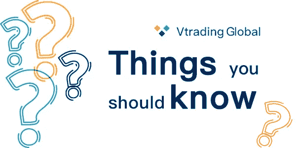
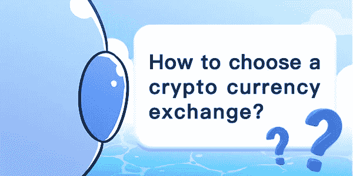
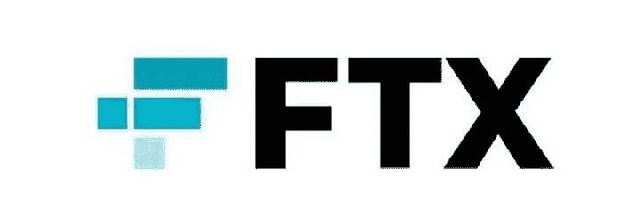
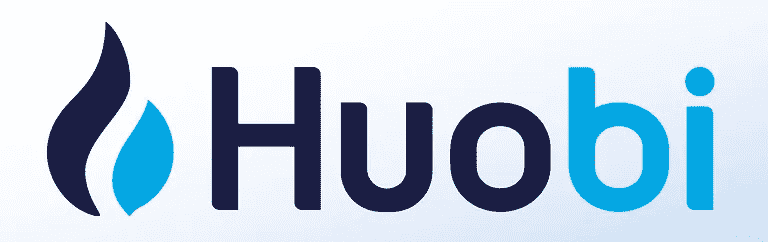

# 如何选择 2022 年的加密交易所

> 原文：<https://medium.com/coinmonks/how-to-pick-a-crypto-exchange-of-2022-a3832cc39cda?source=collection_archive---------58----------------------->

我们日常生活中使用的货币，如美元，被称为法定货币，由政府或中央银行发行。与法定货币不同，加密货币不是由特定国家或地区发行的，可以在全球范围内使用。

它可以在世界各地转账，而无需支付高额费用。不需要在很多银行和不同国家的货币之间来回兑换。它是一种允许资产自由流动的货币。

加密货币交易所的存在是为了提高加密货币的流动性。交易所为加密货币提供了一个集中的市场，增加了流动性，降低了交易成本，并使安全交易更加安全。

## 关于使用加密货币交易所你应该知道的事情

以下是加密货币交易前的一些必备常识。

1.加密货币交易仍然是高风险交易。由于它们非常新，并且加密货币的性质往往是分散的，而不是集中管理的，因此并非所有国家都有法律法规来提供完善的控制和保护。

2.所有重大交易所都经历过黑客攻击，遭受过损失。他们能否保护客户资产，取决于规模和技术实力。

3.目前加密货币领域的安全性还有待考验。有论坛建议不要把大量资金长期留在账户里。如果有利润就定期提取，只留一小部分在外汇账户里。

不了解加密货币建议不要碰。想投资的要注意风险，先学习学习足够的知识，再少量入手。

## 如何选择加密货币交易所？

在你充分意识到风险并有足够知识的前提下。考虑了以下几点:

1.大规模:尽可能选择最大的交易所，在安全、质量和成本方面更好。

2.服务和体验好:大部分平台都可以免费注册，注册后可以自己体验。

# 最佳密码交易所

## 1:币安

币安是由华裔加拿大工程师赵昌鹏创建的。2017 年他进行了一次 ICO(发行加密货币筹集第一笔资本)。这种代币被称为币安硬币(BNB)。投资 ico 的投资者将获得 BNB 作为回报，可用于在币安平台上交易加密货币并支付相关费用。

币安已经成为全球第一大加密货币交易平台。它提供 100 多种加密货币的交易，如比特币、以太坊、莱特币等。

## 2: FTX

FTX 成立于 2019 年，平台上有 70 多个期货交易对和 6 个指数合约。

还有非平仓杠杆代币、波动率合约、美国 2020 总统大选合约、期权、原油合约等。

## 3:比特币基地专业

总部位于旧金山的比特币基地公司是第一家获得 10 亿美元市值投资的美国加密货币公司。

它也是第一家年收入达到 10 亿美元的公司。

2018 年 10 月底，获得纽约州金融服务局批准，成为加密货币合格托管公司。

此外，同年 11 月，对比特币基地主要客户(希望与商业基金进行交易的金融机构)

开设了场外交易柜台。2018 年 10 月宣布追加投资 3 亿美元，估值超过 80 亿美元。

## 4:北海巨妖

北海巨妖是历史最悠久的加密交易所之一，成立于 2011 年，

但在经过两年的开发和测试后，它于 2013 年上市交易。最初，该交易所只提供比特币、莱特币和欧元之间的交易。

2020 年 9 月，北海巨妖还被怀俄明州银行委员会批准成为美国第一家可以设立银行的交易所。

## 5:库科恩

KuCoin 是全球顶级加密货币平台。它成立于 2017 年，支持多种加密货币。

为全球 207 个国家和地区的 500 万用户提供现货、法定货币和期货交易。

## 6: Gate.io

Gate.io 交易所最早成立于 2013 年，名为“Biter”，后更名为 Gate.io。

这个交易所的特点是可交易的硬币数量相当多(根据 Coinmarketcap 数据，有 1212 个硬币)。

此外，该平台具有许多交易功能，提供 10 倍杠杆交易、定期投资计划、IEO 和永久合约。

很多人会用它来交易衍生品。

## 7:火币环球(Huobi)

火币(Huobi)是一家总部位于新加坡的加密货币交易所，最初在中国成立。后来，它在香港、韩国、日本、俄罗斯和美国设立了办事处。

2018 年，其累计交易额超过 1.2 万亿美元，服务于 130 多个国家的用户。

## 8:币安。美国

币安。US 是由币安和 BAM Trading Services 联合开发的交易所。美国用户可以注册并存入资金。

与币安最显著的区别是加密货币和法定货币的数量。

到 2021 年底，币安的加密货币数量。美国大约是 53。但是币安上可交易的硬币数量已经达到了 419 枚。

## 9:双子座

双子星成立于 2014 年 10 月。交易所的主要口号是“没有混乱的加密”

强调这是一个合法和受监管的加密货币交易所，列出的交易对是安全可靠的，目前支持 97 个交易对供用户使用。

## 10: OKX

OKX 成立于 2017 年，为用户提供货币、杠杆、期权/交割/永续合约、DEX 交易、余额宝、Defi 矿业、借贷等多元化产品矩阵，覆盖 200 多个国家和地区。几千万用户。

Vtrading crypto trading platform

Vtrading 是一个加密交易平台，提供智能交易机器人，可以让你的加密交易更容易。您只需点击几下鼠标，就可以将 Vtrading 连接到币安、火币和 OKX 的交易所，让您的加密交易立即开始。