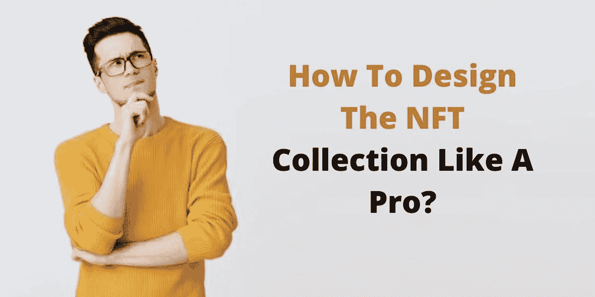
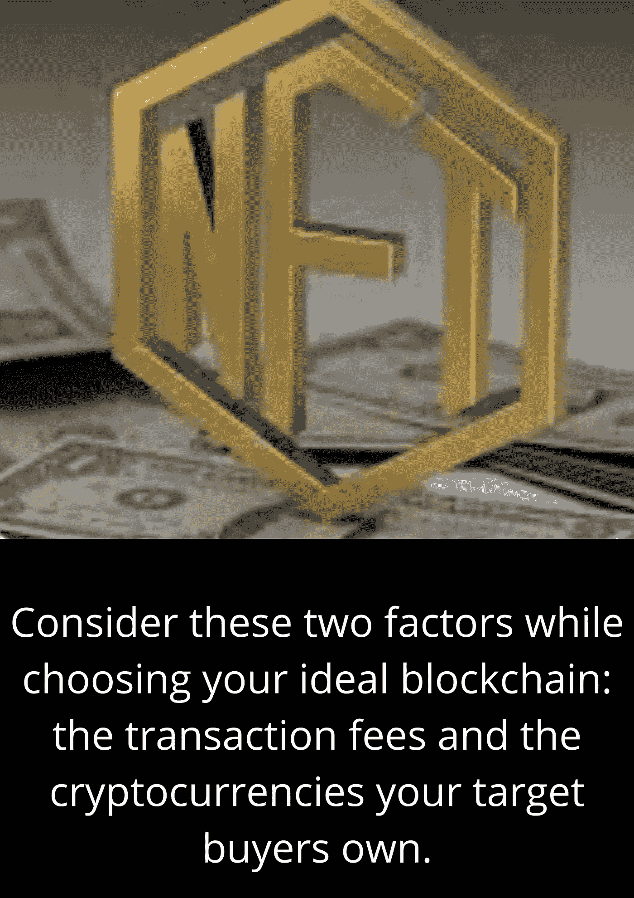

# 如何预先计划你的 NFT 系列？

> 原文：<https://medium.com/coinmonks/how-to-pre-plan-your-nft-collection-ce72cbd6af23?source=collection_archive---------39----------------------->

# 几年前我也有同样的问题！

当时(大约在 2017 年年中)，区块链技术还不存在，更不用说不可替代令牌(NFT)了。

幸运的是，我有学习现代技术的天赋。这就是我偶然发现 NFTs 的原因。不幸的是，没有太多的资源可供阅读和探索。

辛辛苦苦探索 NFT 空间后，我可以说，创建一个 NFT 系列 比以往任何时候都容易得多。

**让我告诉你为什么？！**

## **创建者友好的方法**

我猜你是一个正在读这篇博客的企业家！如果是的话，你有很多选择，我的朋友。每个 NFT 都是不同的，没有两个 NFT 是相同的。除了独一无二的价值之外，它们还有独一无二的品质，这些品质为它们提供了优势。这就是它们被称为“不可替代”令牌的原因。

## **广泛触及**

根据《金融时报》的报道，NFT 已经成为一个 400 亿美元的市场(到 2021 年底)。艺术界的重量级人物已经注意到了这一点。由于市场的蓬勃发展，像佳士得和苏富比这样的百年拍卖行已经卖出了价值数百万美元的艺术品。

## **无缝版税**

当你制造并出售一件 NFT 时，你得到了第一笔钱，仅此而已。也许买家会告诉他们的朋友或同事你的工作，你会得到更多的订单，但仅此而已。

在你学会如何创建 NFT 和出售你的数字 NFT 后，一次性付款不会限制你。二次销售——为你所有的 NFT 作品带来终身版税。

## **回到操作指南**

成为第一批进入这个领域的公司之一有几个好处。如果你想从你的 NFT 赚钱，你需要为自己建立一个名字和声誉，以及你创造的令牌。越早开始，你就能越快体验到好处。

## 🔖**产生一个 NFT 创意**

如果你已经对你的 NFT 有了一个大概的了解，那么你就可以开始下一步了！

然而，如果你仍然不确定该做什么，让我列举一些 NFT 的想法:

💡数字艺术

💡音乐

💡运动时刻

💡域名

💡几乎任何东西。

专注于给你的观众真正的价值。让拥有你的 NFT 的人进入一个高级俱乐部或享受一项高级服务就是一个极好的例子。

例如，如果你想创作一件 NFT 艺术品，但不知道从哪里开始，你可以聘请一名秘密艺术顾问。

## 🔖**验证你的想法**

解构你的 NFT 想法，用每一条信息(你拥有的)来验证它。如果你想把你最喜欢的音乐符号化(例如)，看看音乐 NFT 进展如何(官方数据)。

此外，尝试向你已经存在的社区推销这个想法(如果没有，建立一个)。请记住——社区会毫不犹豫地告诉你事实/真相，因为他们将是购买它的人！

> 如果你有积极的情绪，是时候继续前进了。

## 🔖**制作你的数字文件**

数字文件是不可替代的令牌(NFT)，而不是相反。首先，选择你的数字文件；如果没有，那就手工制作。记住——数字文件可以是任何东西:JPeg 图像、视频艺术、MP3 音乐等等。

如果你想标记一件实物艺术品或任何现实世界的资产，首先要数字化它！

## 🔖**打造你的 NFT**

在此之前，选择你的 NFT 收集的区块链网络。以太坊是 NFT 空间中广泛使用的区块链网络。其他受欢迎的区块链——Tezos、Solana、Polkadot、Litecoin 等。

在选择理想的区块链时，请考虑以下两个因素:交易费用和目标买家拥有的加密货币。

然后，进入至关重要的一步——打造你的 NFT 系列。将数字文件连同其名称和描述附在任何专用的 NFT 铸造平台上。

根据您选择的平台，铸造费用和时间(铸造)可能会有所不同。检查你的喜好！

## 🔖**交易部分——出售你的 NFT**

既然你手上有一个真正的 NFT 收藏，是时候把它变现了。如果不首先选择一个白色标签的 NFT 市场，就不可能赚钱。

钱包整合将是你和市场的第一个接触点。首先，将您的加密钱包与平台连接。其次，在几个步骤内列出你的 NFT 收藏。

但是，在课程中，您将被要求指定课程中的销售模式。你可以设定一个固定的价格，也可以进行特定时间的拍卖。

## **结论**

“NFT 太专业了，兄弟”——我多次听到人们说这个“公理”。但是，这不是真的！只需准备好一些先决条件，就能轻松打造你的首个 NFT 系列。

如果你仍然不确定或犹豫不决，你可以雇佣你的技术合作伙伴——一家不可替代的令牌开发公司。

> *加入 Coinmonks* [*电报频道*](https://t.me/coincodecap) *和* [*Youtube 频道*](https://www.youtube.com/c/coinmonks/videos) *了解加密交易和投资*

# 另外，阅读

*   [Capital.com 评论](https://coincodecap.com/capital-com-review) | [香港的加密借贷平台](https://coincodecap.com/crypto-lending-hong-kong)
*   [如何在 Uniswap 上交换加密？](https://coincodecap.com/swap-crypto-on-uniswap) | [A-Ads 评论](https://coincodecap.com/a-ads-review)
*   [WazirX vs CoinDCX vs bit bns](/coinmonks/wazirx-vs-coindcx-vs-bitbns-149f4f19a2f1)|[block fi vs coin loan vs Nexo](/coinmonks/blockfi-vs-coinloan-vs-nexo-cb624635230d)
*   [本地比特币评论](/coinmonks/localbitcoins-review-6cc001c6ed56) | [加密货币储蓄账户](https://coincodecap.com/cryptocurrency-savings-accounts)
*   [什么是融资融券交易](https://coincodecap.com/margin-trading) | [成本平均法](https://coincodecap.com/dca)
*   [维护卡审核](https://coincodecap.com/uphold-card-review) | [信任钱包 vs 元掩码](https://coincodecap.com/trust-wallet-vs-metamask)
*   [Exness 评测](https://coincodecap.com/exness-review)|[moon xbt Vs bit get Vs Bingbon](https://coincodecap.com/bingbon-vs-bitget-vs-moonxbt)
*   [如何开始用加密贷款赚取被动收入](https://coincodecap.com/passive-income-crypto-lending)