# 如何用 Python 和广义布朗运动预测以太坊价格

> 原文：<https://medium.com/coinmonks/how-to-predict-ethereum-price-using-python-and-general-brownian-motion-f01cfe7e9ea3?source=collection_archive---------7----------------------->


Source: Unsplash

*注意:本文并不旨在提供任何专业的金融/投资建议。这只是为了教育目的。*

我花了很多时间来建立数学和机器学习模型，以创建产生阿尔法的自动交易系统。这是一个对初学者友好的教程，我的目的是邀请数据科学新手使用它作为学习练习。

今天我们将使用模拟随机变量来预测以太坊的价格。从纯数学的角度考虑这种方法，因为极其精确的价格预测需要更复杂的模型输入，如市场情绪、社会经济因素等。

在我们进入数学之前，我想为新来的人描述几个术语:

*   **蒙特卡罗模拟**:这些模型帮助我们预测当随机变量的干预出现时不同结果的概率。它们允许数据科学家构建太复杂而无法分析建模的资产分布。我们将在建模中使用蒙特卡洛模拟(这里的是一个用简单例子解释这一点的视频)。
*   **流程**(在数据科学的语境下！):流程是随着时间的推移而演变以实现目标的事件，通常具有 0 到 t 的时间段。在此期间，事件可能在过程中的不同点发生，可能会对流程的最终值产生影响。
*   **随机过程**:可以用某个随机变量随时间的变化来描述的过程，可以是离散的，也可以是连续的。
*   **随机游走**:在有效市场中，金融价格应该呈现随机游走模式。用最简单的话来说，随机漫步是一个从 0 分开始的随机过程。在每一个离散事件中，有一个概率 *p* 你的分数会增加+1，有一个概率 *(1-p)* 你的分数会减少 1。事件发生 *T* 次。在这种情况下， *T* 的期望值是 *0 + T[p(+1) + (1-p)(-1)]*
*   **马尔可夫过程**:更准确地说，金融市场价格被假设遵循马尔可夫过程，这是一种随机过程，只有变量的现值与预测未来相关。过去无关紧要。

通过模拟，我们将首先创建能够准确反映推动以太坊价格的风险因素的合成变量。这些因素包括加密价格、股票价格、指数、汇率、无风险回报以及商品价格。

上面提到的模拟马尔可夫过程是使用以下组件开发的:

**维纳过程**

维纳过程(也称为布朗运动)是由非负实数 t 索引的随机过程{Wt}t≥0+,具有以下性质:

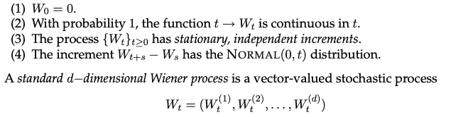

在我们的例子中，它描述了变量δ*z*，其变化在间隔δ*t*上被测量，使得其平均变化为零，并且方差与δ*t*成比例:

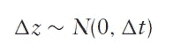

如果 *ε* 是一个标准正态变量 *N(0，1)* ，这可以写成:

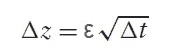

接着是**广义维纳过程**，它描述了从维纳过程建立的变量δ*x*，此外还有每单位时间的恒定趋势 *a* 和波动性 *b* :

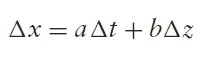

接下来我们有**伊藤过程**，这是一个适应的随机过程，可以表示为布朗运动的积分和时间的积分之和，如下所示:

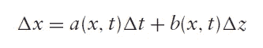

Ito 过程的一个特殊例子是**几何布朗运动(GBM)** ，对于变量 *S* 描述为:

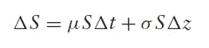

当您认为百分比变化是独立的且同分布时，GBM 在股票价格随时间变化的建模中非常有用。例如，假设 *Xn* 是某股票在时间 *n.* 的价格，那么，假设*Xn*/*Xn*1， *n* ≥ 1，是独立同分布的，这可能是合理的。该过程是几何的，因为趋势和波动项与δ*S*的当前值成比例。这通常适用于以太币价格，其回报率似乎比原始美元回报率更稳定。

这就是我们的模型所需的大部分理论。在进入 python 代码之前，我想向您展示一个示例计算。

2021 年以太坊的回报率 **404.2%。**2020 年为**464.1%**2019 年为**-8.0%**2018 年为 **-82.7%** 。平均回报为 **~194%。**

在本文发表之日，当前的 ETH 价格为**2708.11 美元。**接下来一周比特币价格的变化过程是怎样的？

流程如下:

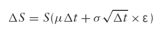

其中 *ε* 是从标准正态分布中随机抽取的。如果间隔是一周，或者δ*t*= 1/52 = 0.01923，则平均值为

*μ*δ*t*= 1.94×0.01923 = 0.0373062

以太坊目前的平均波动率为 **72%，**因此:

σ√δ*t =*0.72×√0.01923 = 0.0937373837

这给了我们:

δ*S*= 2708.11 美元 x(0.0373062+0.09984403837 x*ε)*

对于这个过程，我们最终得到:

δ*S =*101.029+270.389×*ε*

## **用 Python 预测以太币价格**

现在我们有了过程方程，让我们开始编码。我推荐使用 Python3+。在我们的模拟中，该过程由具有正态分布的小步长近似，平均值和方差由下式给出:

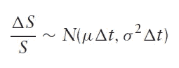

为了预测以太坊的未来价格，我们将从当前价格 St 开始，生成一个独立的标准正态变量ε的序列，对于 *i = 1，2，.。。，n* 。

根据上面的等式，我们得到 St +1 为

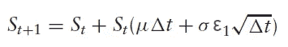

对于 St +n，我们得到 St，它应该具有类似对数的分布。

我们将漂移( *μ* )设置为 0%。在数据科学中，**漂移**是指目标变量随时间变化的统计特性。我们将波动率定为 70%左右，分为 100 步。

因此，局部预期收益为μδt = 0.0/100 = 0.0，波动率为 0.70 × √(1/100) = 0.07

下面是我的 python 脚本设置。初始化之后，我们将定义 2 个函数，第一个函数称为 RAND()，它生成 0 和 1 之间均匀分布的随机数。下一个是 NORMINV，它计算 x 的累积正态分布函数的倒数，以及提供的分布平均值&标准差。

```
import numpy as np
import pandas as pd
from scipy.stats import norm
from numpy.random import randn
from numpy import random as rn
import scipy.stats as si
from matplotlib import pyplot as plt
from IPython.display import Image
%matplotlib inlinedef RAND():
 d = rn.uniform(0, 1, 1)[0]
 return (d)def NORMINV(x,mu,sigma):
 d = si.norm.ppf(x, loc = mu, scale = sigma)
 return (d)S0 = 2708.11M = 100
S = np.ones(M)
print (S)
```

当我们打印 S 时，我们得到:

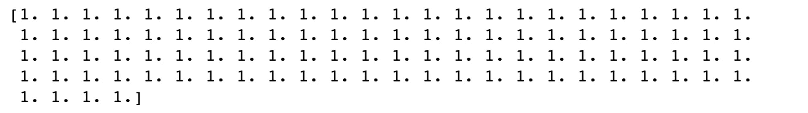

```
step = np.arange(0,101)
print (step)
```

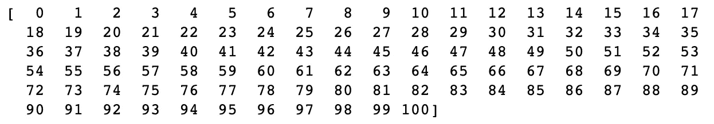

```
df = pd.DataFrame(step, columns=[‘Step i’])
print (df)
```

我们现在初始化我们的熊猫数据帧，看起来像:

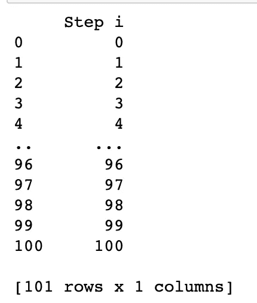

现在，让我们创建第二列，这将是一个统一的 U(0，1)变量的实现，带有相应的 RAND()函数。

```
df[‘Uniform ui RAND(⋅)’]=0.0000
for i in range(1,len(df[‘Step i’])):
 df[‘Uniform ui RAND(⋅)’][i]=RAND()
print(df)
```


我们的下一篇专栏文章将把这个变量转换成均值为 0.0、波动性为 0.07 的正态变量。

```
df[‘Normal ui NORMINV(ui,0.0,0.07)’]=0.0000
for i in range(1,len(df[‘Step i’])):
 df[‘Normal ui NORMINV(ui,0.0,0.07)’][i] = NORMINV(df[‘Uniform ui RAND(⋅)’][i],0.0,0.07)
print (df)
```

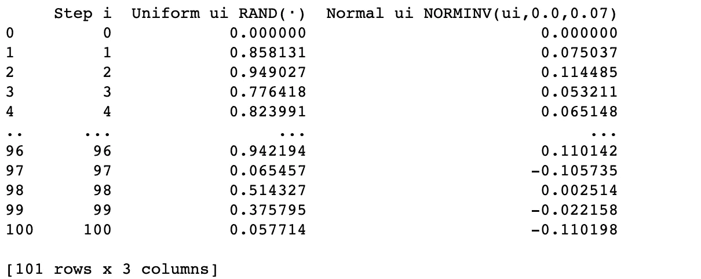

```
df[‘Price St+i’]=0.000
df[‘Price St+i’][0]=S0
print(df)
```

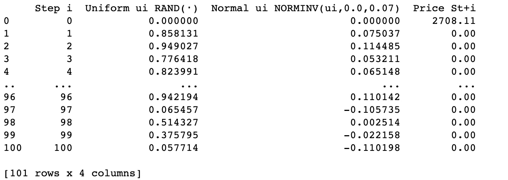

第 0 步的 St+i 价格是我们最初的以太坊价格:2708.11 美元。现在我们将创建一般的布朗运动过程:

```
for i in range(0,100):
 df[‘Price St+i’][i+1] = df[‘Price St+i’][i]+ df[‘Price St+i’][i]*df[‘Normal ui NORMINV(ui,0.0,0.07)’][i+1]
print(df)
```

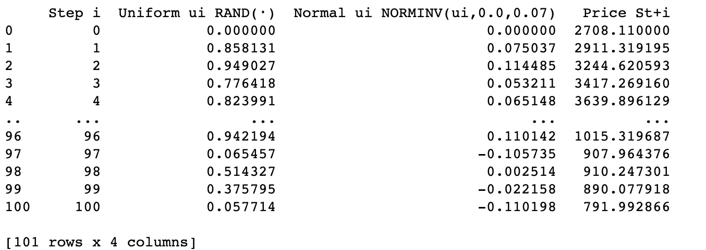

使用上面的数据框架，我们可以简单地通过将随机变量乘以之前的价格得到价格增量，就像这样。

```
df[‘Price Increment’]=0.000
for i in range(1,100):
 df[‘Price Increment’][i] = df[‘Price St+i’][i-1] * df[‘Normal ui NORMINV(ui,0.0,0.07)’][i]
df.drop([‘Price St+i’],axis=1,inplace=True)
print(df)
```

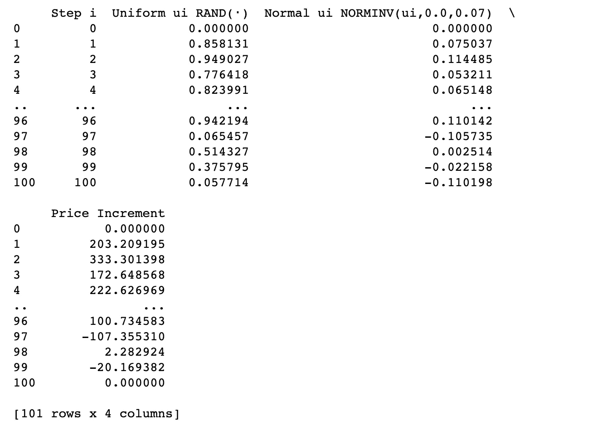

最后，我们将构建价格 St+i 的后验列。

```
df[‘Price St+i’] = 0.000
df[‘Price St+i’][0] = S0
for i in range(0,100):
 df[‘Price St+i’][i+1] = df[‘Price St+i’][i]+ df[‘Price Increment’][i+1]
print(df)
```

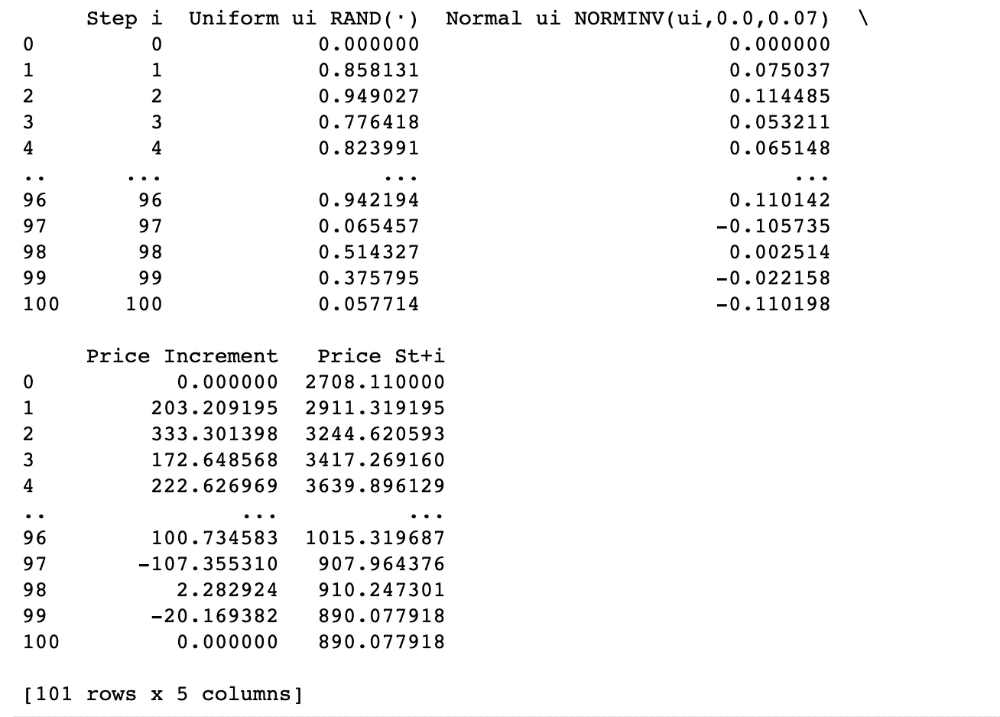

重复该过程，直到在第 100 步达到以太坊的最终价格。

这个实验可以根据需要重复进行。将 *K* 定义为重复或随机试验的次数。

```
import numpy as np
import pandas as pd
from scipy.stats import norm
from numpy.random import randn
from numpy import random as rn
from matplotlib import pyplot as plt
%matplotlib inlineS0 = 2708.11
mu = 0.00
sigma = 0.07
M = 10
N = 100
T = 1
h = T/N
Z = rn.randn(M,N)
S = S0*np.ones((M,N+1))
for i in range(0,N):
 S[:,i+1] = S[:,i] + S[:,i]*( mu*h + sigma*np.sqrt(h)*Z[:,i] )
plt.figure(figsize=(17,10))
a = [ rn.randint(0,M) for j in range(1,20)]
for runer in a:
 plt.plot(np.arange(0,T+h,h),S[runer])
```

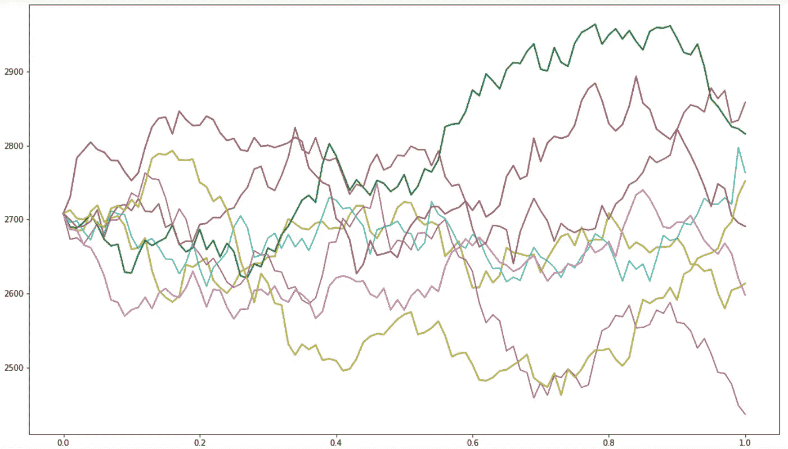

X axis is Steps into the future and the Y axis is the price of Ethereum

在上图中，我们看到了前 10 次试验。每一个都导致一个模拟的最终值 SkT。这产生了模拟价格 ST 的分布。

对于原子模拟，分布总是正态的，然而，我们进行的模拟越多，分布就越趋于对数。

正如你所看到的，这个模型对于模拟以太坊的未来价格非常有用，但是，这种方法有一些问题。

这种方法的缺点:

*   蒙特卡罗模拟很大程度上依赖于所做的假设，包括参数、分布的类型和形状以及定价函数
*   我们假设漂移为零，但事实往往并非如此
*   我们没有考虑影响资产价格的其他数据向量，如新闻、公众情绪、金融活动等。

这篇文章的灵感来自于 Roi Polanitzer 的作品。我希望这是一个很好的学习练习，并提供了一些好的见解。每天，我都大量参与创建机器学习模型和算法方法以生成 alpha 的研究和开发。我也一直在幕后从事 web3 和 De-fi 项目，所以期待这些主题的更多内容！

> 加入 Coinmonks [电报频道](https://t.me/coincodecap)和 [Youtube 频道](https://www.youtube.com/c/coinmonks/videos)了解加密交易和投资

# 另外，阅读

*   [密码本交易平台](/coinmonks/top-10-crypto-copy-trading-platforms-for-beginners-d0c37c7d698c) | [Coinmama 审核](/coinmonks/coinmama-review-ace5641bde6e)
*   [印度的加密交易所](/coinmonks/bitcoin-exchange-in-india-7f1fe79715c9) | [比特币储蓄账户](/coinmonks/bitcoin-savings-account-e65b13f92451)
*   [OKEx vs KuCoin](https://coincodecap.com/okex-kucoin) | [摄氏替代品](https://coincodecap.com/celsius-alternatives) | [如何购买 VeChain](https://coincodecap.com/buy-vechain)
*   [币安期货交易](https://coincodecap.com/binance-futures-trading)|[3 comas vs Mudrex vs eToro](https://coincodecap.com/mudrex-3commas-etoro)
*   [如何购买 Monero](https://coincodecap.com/buy-monero) | [IDEX 评论](https://coincodecap.com/idex-review) | [BitKan 交易机器人](https://coincodecap.com/bitkan-trading-bot)
*   [CoinDCX 评论](/coinmonks/coindcx-review-8444db3621a2) | [加密保证金交易交易所](https://coincodecap.com/crypto-margin-trading-exchanges)
*   [红狗赌场评论](https://coincodecap.com/red-dog-casino-review) | [Swyftx 评论](https://coincodecap.com/swyftx-review) | [造币厂评论](https://coincodecap.com/coingate-review)
*   [Bookmap 评论](https://coincodecap.com/bookmap-review-2021-best-trading-software) | [美国 5 大最佳加密交易所](https://coincodecap.com/crypto-exchange-usa)
*   [如何在 FTX 交易所交易期货](https://coincodecap.com/ftx-futures-trading) | [OKEx vs 币安](https://coincodecap.com/okex-vs-binance)