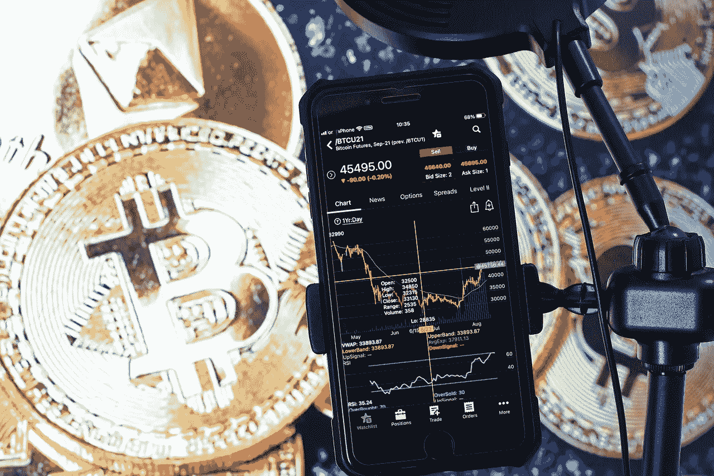

# 如何创造自己的密码交易者成功故事——快速简单的期货交易指南

> 原文：<https://medium.com/coinmonks/how-to-produce-your-own-success-story-as-a-crypto-trader-a-quick-easy-guide-to-futures-trading-ca9a0a75a3d6?source=collection_archive---------15----------------------->

Image by [Sergei Tokmakov Terms.Law](https://pixabay.com/users/sergeitokmakov-3426571/?utm_source=link-attribution&utm_medium=referral&utm_campaign=image&utm_content=6537381) from [Pixabay](https://pixabay.com/?utm_source=link-attribution&utm_medium=referral&utm_campaign=image&utm_content=6537381)

# 简单地说

*   在加密领域，你要么是交易员，要么是霍德勒，或者两者兼而有之。我两样都做。这是因为我喜欢用期货来对冲我的现货资产，以便在市场低迷时期将风险降至最低。
*   **这一策略的目的是保持风险敞口中性** …