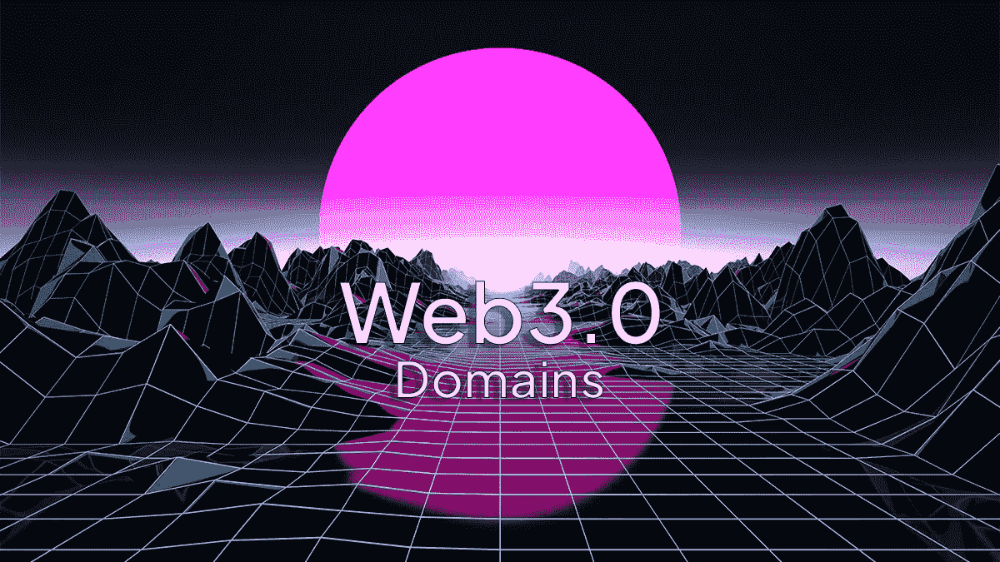

# 如何从 Web3 域名淘金热中获利

> 原文：<https://medium.com/coinmonks/how-to-profit-from-the-web3-domain-gold-rush-f9aafeeee4ed?source=collection_archive---------12----------------------->

Web3 在过去的一年里如火如荼，我们见证了一个处于萌芽阶段的新兴创新领域。类似于 Web2(我们大多数人都知道的互联网版本)在 90 年代和 21 世纪初的崛起。com”的热潮中，Web3 正经历着对域名需求的快速增长。

与”相反。com”域名，为 web3 注册的域名不仅仅是一个网址。这些可以在整个 web3 生态系统中充当你的身份，充当钱包或支付方式，托管分散的应用程序或网站，用于衍生品的许可，保存各种元数据以及可能还有其他尚未探索的用例。

以太网上有几个主要的域名注册商:

[以太坊域名服务(ENS)](https://app.ens.domains/) —最受欢迎的注册服务商，由 Vitalik Buterin 认可。让您注册一个"。eth "扩展域。

[势不可挡的域名](https://unstoppabledomains.com/)——第二大注册商。允许注册几个流行的扩展名，如“.nft“，”。加密“，”。x“，”。钱包“，”。刀”等人。

[Web3 域名服务(WNS)](https://wnsdomains.io/) —新加入的注册商。允许注册“. web3”扩展域名以及独特的 NFT 集合所有权为基础的结尾，如“.bayc "为无聊的猿游艇俱乐部业主。

ENS 域名的注册期限是固定的，这意味着当到期日到来时，您可能需要支付费用来更新注册或放弃所有权。另一方面，不可阻挡的域名和 WNS 是一次性付款注册后，你有终身所有权。

当你打算注册域名时，有几件事要记住，我注意到它们更有价值:

***简称*** ，3-5 个字母的通用词，具有品牌潜力，如柠檬、月亮、墨水等。很多钻石已经被注册了，但是你仍然可以找到一些钻石。我可以从牛津英语词典中获得一些灵感。不要忘记外来语甚至拉丁语！

***名或姓，*** 因为这些域名在整个 web3 中也被用作你的身份，所以它是一个很有价值的名字域名(如“john.eth”等)。如果你足够幸运，注册了一个常见的姓，那么就有可能创造出衍生域名(子域名)，比如授权名(“john.johnson.eth”等)。这有潜在的被动收入。

***子域——能力*** ，类似于授权个人名字，有可能用一个阿尔法域占领整个行业。一个很好的例子就是百威啤酒从 beer.eth alpha 许可一个地址，比如“[百威啤酒. beer.eth](https://twitter.com/budweiserusa) ”。这些通常是可以捕捉各种品牌或孩子地址的单词。

*奖金* // 3 个字母的组合可用于其缩略词定义的多样性。一个普通的首字母缩略词拥有十几个或更多可能的定义，因此具有很高的子域能力，同时还保持有限的供应值。

***限量供应，*** 3 个字母的单词和 3 个数字的名字被认为是最罕见的，因为 3 个字母的英语单词只有 1065 个，3 个数字的代码有 1000 种可能的组合。类似地，3 个字母的组合有 17576 种，4 位数的代码有 10000 种。

***创意组合，*** 将两个最能描述你的业务或用例的关键词串联起来。尝试有意义的两三个单词的混搭。它们能以某种方式组合起来吗——要么是部分组合，要么是全部组合？保持原样。

一旦你找到了一些可以注册的域名，你可以使用 [GoDaddy 评估](https://www.godaddy.com/domain-value-appraisal)工具来评估该域名的价值，这是根据在。com 扩展名。

请记住，虽然尝试注册商标品牌的域名，希望他们支付溢价从你手中拿走，这可能很诱人，但我可以说，这种情况发生的可能性微乎其微。这种行为通常被视为“[域名抢注](https://www.winston.com/en/legal-glossary/cybersquatting)”，并可能导致公司发出 [DMCA 撤销请求](https://www.dmca.com/FAQ/What-is-a-DMCA-Takedown)。

现在出售或购买域名的最前沿市场是 OpenSea。虽然你可以通过在 OpenSea 上上市来获得最多的关注，但相关的天然气费用相当高。考虑在[looks area](https://looksrare.org/)市场上市，因为它们收取的上市费用要低得多，而且仍然拥有稳定的客流量。 [WNS](https://wnsdomains.io/marketplace) 也在他们自己的市场上提供本地列表，不收取任何费用。理想情况下，待售域名应该至少在两个地方列出。

> 加入 Coinmonks [电报频道](https://t.me/coincodecap)和 [Youtube 频道](https://www.youtube.com/c/coinmonks/videos)了解加密交易和投资

# 另外，阅读

*   [阿联酋 5 大最佳加密交易所](https://coincodecap.com/best-crypto-exchanges-in-uae) | [SimpleSwap 评论](https://coincodecap.com/simpleswap-review)
*   购买 Dogecoin 的 7 种最佳方式
*   [最佳期货交易信号](https://coincodecap.com/futures-trading-signals) | [流动性交易所评论](https://coincodecap.com/liquid-exchange-review)
*   [用于 Huobi 的加密交易信号](https://coincodecap.com/huobi-crypto-trading-signals) | [Swapzone 审查](/coinmonks/swapzone-review-crypto-exchange-data-aggregator-e0ad78e55ed7)
*   最佳[密码交易机器人](https://coincodecap.com/best-crypto-trading-bots) | [购买索拉纳](https://coincodecap.com/buy-solana) | [矩阵导出评论](https://coincodecap.com/matrixport-review)