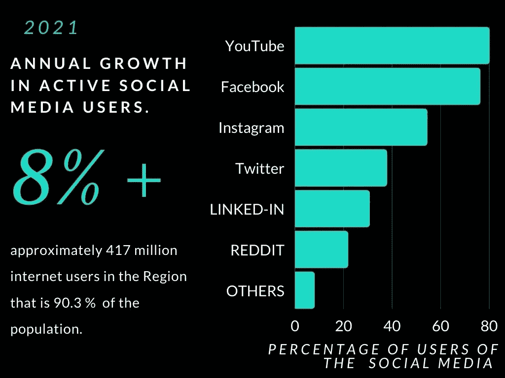
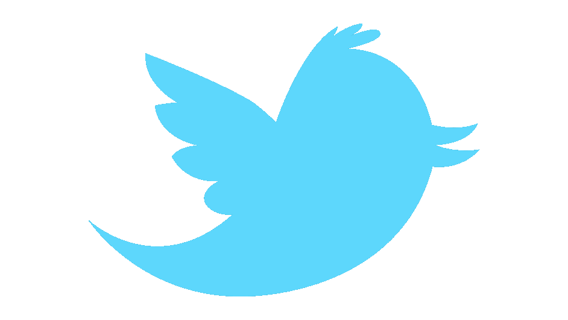
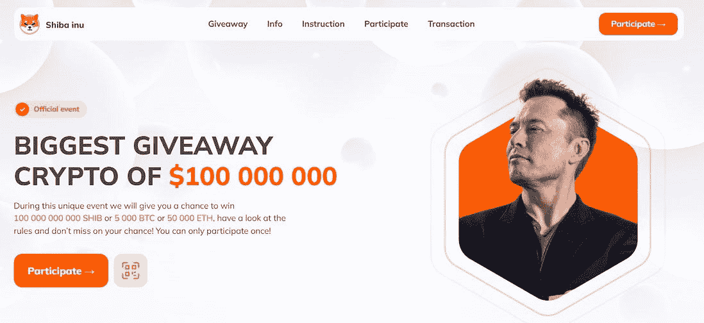
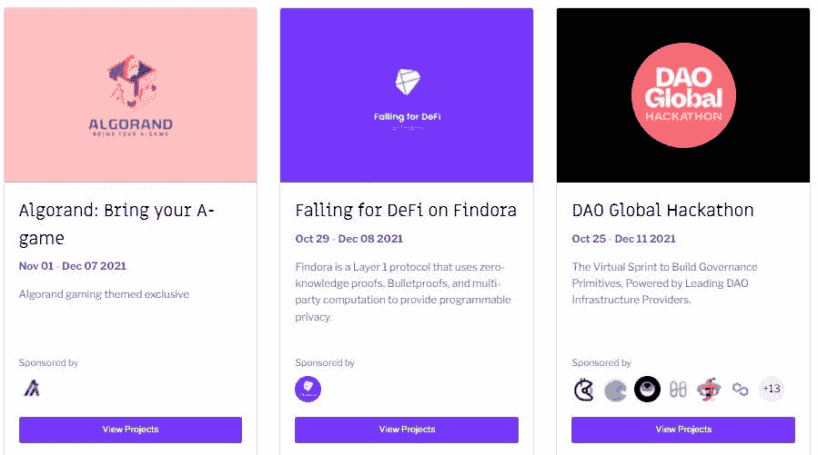
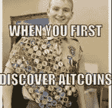

# 2022 年如何推广你的 crypto 项目？

> 原文：<https://medium.com/coinmonks/how-to-promote-your-crypto-project-in-2022-818e66cdae0c?source=collection_archive---------6----------------------->

区块链是真正的革命，与本世纪头十年的互联网繁荣非常相似。Web 3.0 是社区中的新流行语，毫无疑问，这一趋势不会很快放缓。这是进入游戏并制作能够影响数百万人生活的项目的最佳时机，像 Defi、Dao、虚拟游戏、和 NFTs 这样的项目会产生不可忽视的大规模影响。随着大公司进入这个领域，并试图找出他们在 Web 3.0 过渡中生存的策略，许多新来者仍有很大的空间来主导下一场大革命。

这项研究是针对北美地区进行的，但也适用于其他地区，因为区块链是一个全球现象，因此可以对其他地区进行类似的研究

# 了解该地区。

*   尽管活跃互联网用户的比例(90.3%)高于世界其他地区。该地区在%的密码拥有者方面落后于俄罗斯、乌克兰、肯尼亚等国家。
*   只有美国的 8.31%和加拿大的 3.20%。
*   主要投资由机构投资者进行。
*   就加密意识得分而言，加拿大落后于主要经济体，美国也落后于乌克兰和俄罗斯。
*   随着中国等主要经济体禁止加密，俄罗斯提出禁令，印度引入 30%的税收，对加密作为具有巨大波动性的不稳定资产的担忧进一步限制了个人投资者和零售商的增长。

**推广加密货币意识的流行社交媒体。**

*   **YOUTUBE**
*   **脸书**
*   **INSTAGRAM**
*   **推特**
*   **链接于**
*   **电报**
*   **不和谐**
*   **REDDIT**
*   **中等**
*   **GMAIL**

# 1.通过 YouTube 推广。

*   YouTube 影响者是让任何硬币成为焦点的好方法。
*   让新用户容易理解加密的概念，解释不应该太复杂。
*   80%及以上的人都来自北美地区，他们认为这是一个很好的知识分享媒体。
*   这是增长的最大驱动力，将硬币与某个有影响力的人的面值联系起来，会给它带来更多的可信度和信任。

*   一旦观众变得足够成熟，能够处理新的和更复杂的概念，就应该解释有关加密项目的细节。
*   印度已经看到了加密空间的巨大增长，一些交易所报告说，在政府取消禁令后的过去两年里，用户群增长了 5000 倍。
*   喜剧演员、横幅广告、财经 YouTubers，每个人都参与了宣传，导致 25 岁以下的人相信这种说法并开始投资。
*   类似的趋势也出现在越南、巴基斯坦等南亚市场。
*   北美地区近 66%的总人口年龄在 16-64 岁之间，这给 crypto 留下了巨大的增长潜力。
*   为了锁定目标受众，我们需要专注于面向 25 岁以下人群的游戏和喜剧，以及面向工薪阶层(25-64 岁)的融资 YouTubers。

# 2.脸书/梅塔有数字。

*   继 YouTube 之后，脸书是下一个大型社交媒体巨头。
*   它早些时候禁止通过广告推广加密货币，但现在没有这样的限制，最近被取消。

*   脸书可以用来促进加密的事件，并可以作为一个伟大的社区建设平台。
*   76%的互联网用户在脸书，他们是新老用户的混合体。

脸书 messenger 是 messenger 应用程序 68%总用户的市场领导者之一，这使得社区支持变得很容易

# 3.新时代的社交媒体。

*   大多数年轻人在 Instagram 上更活跃
*   出色的演示和视觉效果是关键。
*   Instagram 上的影响者和 YouTube 一样强大，这种媒体将为年轻人提供影响力。
*   54.40 %的用户出现在 Instagram 上。

*   注意力持续时间很短，因此短、快、吸引人的东西很受欢迎。
*   应避免详述项目，并应分享项目的主要 USP。比如 DEFI →将如何扰乱 CEFI。
*   一项加密资产的少量配置可能占某人投资组合的 5-10 %,如何获得 56-100 倍的回报。
*   有各种各样的加密页面，人们可以使用它们作为推广的媒介。

# 4.增加与用户的互动。

*   **Twitter、Reddit、Telegram** 是最受欢迎的一对一社区互动平台。
*   总用户中有 37%的 Twitter 和 21.8%的 Reddit 在这个平台上。
*   Twitter 和 Reddit 有更多的利基加密社区。
*   在这些平台上建立一个这样的社区可以提供一个优势，因为这些服务上出现了更多的密码爱好者。
*   转发有影响力的人的推文，例如:- **马克·库班**持有其 80%的数字资产，这条推文可以推广；我们都已经看到了埃隆·马斯克的推文对加密股价和叙事的影响。
*   大多数新项目都被拒绝，因为用户发现没有来自项目创建者的交互。
*   但是在一对一的互动中，不和是有优势的，
*   **Discord** 可用于组织在线活动和会议，并作为客户服务平台。
*   制作一个大的电子邮件地址数据库是非常必要的，这将有助于向订阅我们时事通讯的用户提供定期更新。
*   电子邮件是专业人士检查的第一件事，也是寻找新用户和社区成员的重要来源。
*   **Medium** 对于与项目相关的博客和项目正在进行的加密空间的一般更新来说是一个很好的媒介。

# 6.举办黑客马拉松和现场赠品。

*   大学和学校学生是最先采用新技术的群体。
*   举办每月一次的竞赛或黑客马拉松会增加参与者的参与度和好奇心。
*   赠品或社区领袖可以通过这些活动形成。
*   Gitcoin、Dev-Folio、Devpost、ETHGlobal 是举办黑客马拉松的全球平台。
*   由于任何新用户都不愿意尝试新的东西，我们可以免费赠送给用户一些硬币。
*   这将允许用户与硬币接触，并向对等方推销硬币和类似的活动。
*   最近，埃隆·马斯克捐赠了以太网、比特币、柴波 INU 来推广柴犬迷因币。

# 7.培养社区和社区领袖

*   建立一个强大的项目参与者社区将会增加其他人的兴趣
*   激励社区领袖和成员将扩大覆盖面。
*   为项目建立强大支持的最简单的方法。

# 8.推广用户生成的内容和模因

*   推广用户生成的促销内容将在吸引用户的同时给用户带来更多价值，并提供更多贡献。
*   应该奖励创意。
*   产生吸引人的迷因
*   时事链接到密码/硬币，以快速推广和吸引眼球。
*   这将有助于创造关于硬币的炒作，是一种不太昂贵但有效的促销方式。

# 9.播客和对创始人的采访

*   创始人越积极地推广加密技术，项目的真实性就越明显。
*   播客和对核心团队或创始人的直接采访使项目合法化
*   对项目的目标和试图解决的问题给出一个清晰的概念。
*   消除小型加密项目中“拖拉地毯”的错误概念。
*   仅在美国每月就有 1 . 94 亿听众，加拿大有 33%的人口消费播客。

# 10.加盟和推荐计划。

*   联盟计划或推荐计划将提供额外的激励来推广硬币/加密项目。
*   这是一个 120 亿美元的产业。
*   比特币基地联盟计划，coinmama，Bybit 是这些计划的几个例子。

请在评论中分享你的想法和建议..

