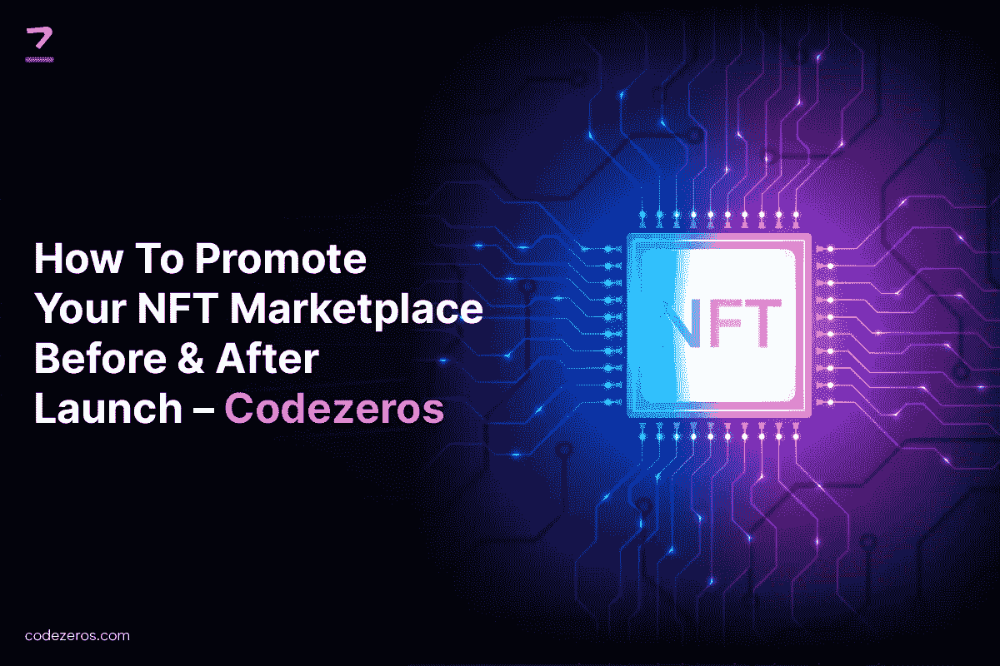

# 如何在发布前和发布后推广您的 NFT 市场— Codezeros

> 原文：<https://medium.com/coinmonks/how-to-promote-your-nft-marketplace-before-after-launch-codezeros-314f35b3fe22?source=collection_archive---------17----------------------->

不可替代的代币或 NFT 是不可互换的数字资产，可以买卖。它们包括独特的纪念品，如音乐、绘画和其他艺术品。

近年来，NFT 市场经历了快速而稳定的增长，而且这一速度似乎不会很快停止。由于其高盈利性，越来越多的企业和开发商投资于 NFTs。他们求助于 NFT 发展服务公司(T2)来充分利用非功能性服务业。

拥有 NFT 有几个因素，包括战略性地营销它们，以便从长远来看从中获利。在推出 NFT 市场之前和之后，营销都是至关重要的一步。因此，我们在这里专门为您收集了所有信息，以全面规划您的 NFT 营销。

How To Promote Your NFT Marketplace Before & After Launch — Codezeros

**关于 NFT 市场，你需要了解什么？**

NFT 市场是一个数字平台，在这里可以买卖数字资产，如艺术品、收藏品、游戏中的头像等。NFT 是在虚拟平台上交易的数字代币。它们是不可交换的数字资产，表现在记录所有交易的区块链上。它们是虚拟世界中的收藏品。

[**NFT 市场开发**](https://www.codezeros.com/services/nft-development-services) 允许数字资产的即时交易。它提供客户支持和多种支付方式，增加了买家的数量。

**为什么营销您的 NFTs 至关重要？**

要想在 NFT 市场取得成功并获得更多利润，你必须让观众能够接触到它。你需要跟上最新的趋势，以吸引潜在的买家，并为品牌赢得知名度。

增强用户体验和提高品牌知名度是 NFT 营销的重要组成部分。一个像 Codezeros 这样的 [**NFT 市场发展公司**](https://www.codezeros.com/services/) 为你提供了实现这些目标的正确方向。

**发布前推广 NFT 市场**

品牌的独特性决定了它在市场上的价值。非功能性交易还需要独特的特征，以使其盈利并在市场上停留更长时间。让我们看看在启动 NFTs 之前需要记住的基本组件。

**设计吸引人的登陆页面**

当您的 NFT 平台仍在建设中时，通过登录页面向观众介绍您的平台。在登录页面上突出你的项目的主要特征，以给出你向你的观众提供什么的想法。

登陆页面是在预告发布和主要电影之前发布的海报。它宣布一些重要的事情即将发生。所以，利用这个机会吸引更多的眼球，增加潜在客户的数量。制作一个醒目的登录页面，介绍您的产品的基本特性。

**启动项目预告**

既然你未来的客户已经知道了你的项目，那就发一个广告让他们看一眼你的 NFT 市场。为你的项目制作一个预告视频，给出细节并详细说明你的 NFT 项目。你可以咨询像 Codezeros 这样的 NFT 令牌开发公司，了解你应该在摘要中包含的要点。

**个性化用户体验**

给顾客一个个性化的体验将会提升你的 NFT 市场的流量。这也将提高生产率和销售额。通过在平台上提供个性化的交互来增强用户体验，将吸引更多的买家并提高声誉。

**促销优惠和折扣**

顾客寻找优惠和折扣的频率比我们意识到的要高。它们增加了让你的 NFT 市场更加可靠的机会。买家会转向你的平台，希望以更低的价格或折扣买到商品。因此，从长远来看，为回头客提供这样的优惠会促进你的业务。

**启动推荐计划**

推荐计划是提高知名度和扩大销售的有效方式。人们相信知名影响者和名人的意见。如果积极的评价来自真正的买家，你的项目就有更多的机会获得更大的成功。

**在发布前推广 NFTs 的好处**

上市前营销有几个好处。其中一些如下。

*   增强在线状态
*   吸引潜在客户的目光
*   提高对竞争对手的认识
*   与客户一起进行测试，并获得建设性的反馈
*   接触未来客户，提高品牌知名度

**发布后推广 NFT 市场**

一旦你启动了 NFT 市场，实际的促销活动就开始了。你应该从在不同平台上推广你的项目的几种方式中受益。

**利用 SEO 策略**

在线商业投资依赖于搜索引擎和搜索结果的可见性。NFT 市场的情况也是如此。搜索引擎优化工具是每一个 NFT 投资者的宝贵资产，以提高他们的在线存在。

投资搜索引擎优化利用知名度和销售。它将在现在和将来获利。与安 [**NFT 开发平台**](https://www.codezeros.com/) 合作也提供营销服务，减少时间，提高营销效率。

**走向社交媒体**

社交媒体是提高你的知名度和扩大你的客户群的最有效的方法之一。您还可以与客户互动，了解他们的偏好，改善您的 NFT 市场，满足他们的需求。

在社交媒体上做广告会让潜在买家注意到你的 NFTs。这也将提高品牌知名度，使你的 NFT 市场从萌芽到成熟。您还可以通知您的客户有关 NFT 市场的优惠和折扣。

**选择电子邮件营销**

与你的客户互动，并告知他们你的平台有新的增加，可以加强你的客户关系。有效地瞄准当前和未来的客户，让他们意识到隐藏的功能。

你还应该限制向客户邮箱发送大量电子邮件，因为这会降低你的价值。偶尔的邮件更受欢迎，因为他们打开和阅读邮件的机会更大。

**发布后推广 NFTs 的好处**

推出后，您可以享受以下营销好处。

*   给你现有的和潜在的买家留下印象会让你的利润和年销售额暴涨。
*   通过你的平台赚钱。
*   一旦你建立了 NFT，市场营销将帮助你洞察客户的兴趣。

**结论**

营销是每个 NFT 项目的重要组成部分。这是让潜在买家了解他们可以添加到他们的收藏中的独特数字资产的存在的本质。咨询一个可靠的 [**NFT 发展公司**](https://www.codezeros.com/services/nft-development-services) 可以帮助你的 NFTs 取得成功，增加销量。Codezeros 帮助你成为顶尖的 NFT。