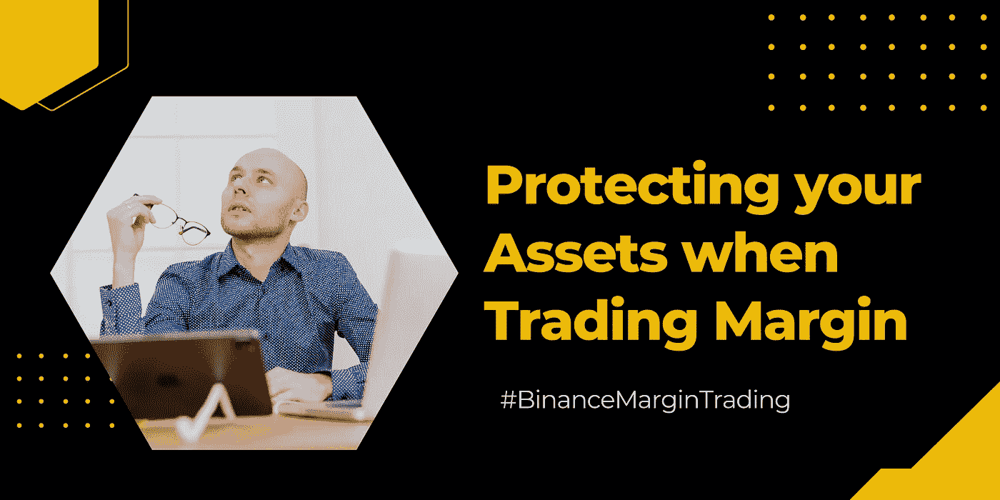
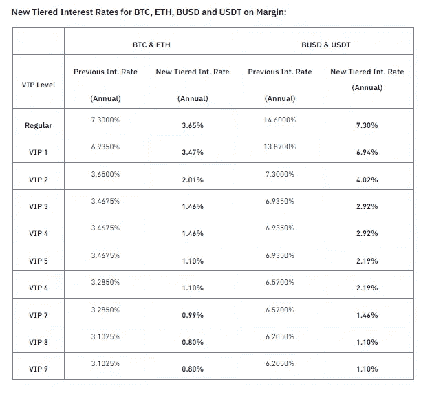

# 如何在交易保证金时保护你的资产

> 原文：<https://medium.com/coinmonks/how-to-protect-your-assets-when-trading-margin-603110224b8f?source=collection_archive---------40----------------------->

说到交易，首要的关键是保护你的资产，这样才能盈利。随着加密交易的极端波动性，你可能会在几秒钟内失去你的资产。

因此，任何成功的交易者都需要充分了解市场，并制定解决方案来降低风险。

**目录**

*[***究竟什么是融资融券交易？***](#d7e4)[***币安保证金利率下调促销***](#5a67) ***∘***[***交易保证金时保护您资产的建议***](#0c14) ***∘***[***为什么是币安保证金***](#9df1)*

## *什么是保证金交易？*

*保证金交易包括利用你的交易账户，以获得比初始投资更多的现金进行交易。*

*简而言之，它简单地意味着通过使用您交易账户中的资金作为杠杆向您的经纪人借钱。*

*保证金交易是一种*“大男孩俱乐部”*游戏，如果你是新手，你会想远离它。或者，对于拥有先进风险管理策略的有经验的交易者来说，这是一个巨大的收入来源。*

*[***在这里打开你的币安账户> >***](https://accounts.binance.com/en/register?ref=431277160)*

## *币安息差利率下调促销*

*如果你是币安*的交易员，你会很高兴地知道，截至 2022 年 3 月*21 日，* *直到进一步通知，*平台已经降低了许多密码的利率。**

**在促销活动中，币安利润团队宣布将下调 BTC、BUSD、瑞士联邦理工学院和 USDT 的利率。在此推广期内，交易商可以享受这些加密资产高达 0.8%的年利率折扣。**

*****下面是详细的折扣率:*****

****

## **交易保证金时保护资产的建议**

1.  *****选择像币安*** 这样值得信赖的平台——在交易保证金时，你想和像币安这样诚实可靠的经纪人交易。**

**币安是一个面向全球受众的知名且完全受监管的交易所。在加密货币交易方面，它目前处于市场领先地位。**

****2*。继续监控你的 LTV***——LTV 的全称是*“贷款价值”*。通常，它被定义为你的贷款与抵押品价值的比率。**

**交易员使用 LTV 来检查贷款风险。因此，如果贷款评估的 LTV 比率很高，那么它就被认为是高风险的。**

**交易保证金时，LTV 将评估您交叉担保品的风险程度。在币安保证金交易中，当 LTV 达到追缴保证金水平时，交易者会收到通知。然后要求交易者增加更多的抵押品来降低清算风险。**

**不这样做将导致你的资产被强制清算。因此，你要密切监控你的 LTV，并及时调整，以避免不惜一切代价平仓。**

*****3。充分理解*** 使用交叉保证金或隔离保证金**

**对交叉保证金和隔离保证金有一个透彻的理解将确保更有成效的交易体验。在交叉保证金模式下，交叉保证金账户中的所有资产由所有头寸共享，当清算发生时，所有头寸都必须被清算。**

**另一方面，隔离保证金交易将涉及每个交易对都有自己的隔离保证金账户，每个账户中的风险都是隔离的。一旦平仓，其他孤立头寸不受影响。**

## **为什么币安利润率对你有好处？**

1.  ***-币安的保证金交易将涉及两种配对的加密货币交易。***

***因此，交易者不必买卖加密资产，而是推测两个交易对的表现。***

***币安是大多数保证金交易者的首选平台，因为用户可以自由交易对，杠杆高达 10 倍。***

*****②*。多资产抵押-*** 币安的交易保证金给用户一个难得的机会，投资多项资产作为抵押，以便借到杠杆。***

**例如，当在 BTC 进行保证金交易时，交易者可以选择使用其他加密资产，如 BTC、BUSD、瑞士联邦理工学院和 USDT 来命名他们的抵押品。**

**这个特性给交易者在开始交易时一种灵活的感觉。**

*****3。冷静期***——过度交易可能导致严重亏损。实质上，币安引入了冷静功能，以帮助交易员避免过度交易。**

**一旦激活冷静期，用户不能在保证金交易账户上借用任何加密资产。**

*****4。保险基金***——交易保证金伴随着无限的风险，币安保证金交易上的保险基金会在你的权益低于 0 时保护你的账户。这是币安为保护贸易商而承担的一项重要责任。**

***关于币安保证金的新促销，我建议交易者利用这个机会，获得高达 0.8%的年利率折扣***

**[***在此了解更多> >***](https://www.binance.com/en/support/announcement/5a523469462a46629e793956d691ac3f?ref=431277160)**

**[***今日币安融资融券入门> >***](https://www.binance.com/en/trade/BTC_USDT?theme=dark&type=spot?ref=431277160)**

*****关联披露:*** *本帖包含关联链接。如果您使用这些链接购买一些东西，我们可能会赚取佣金，对您没有额外的费用。感谢*。**