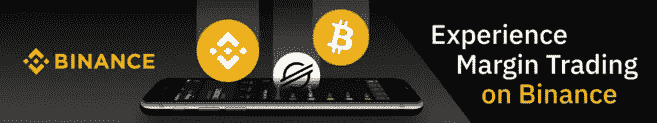
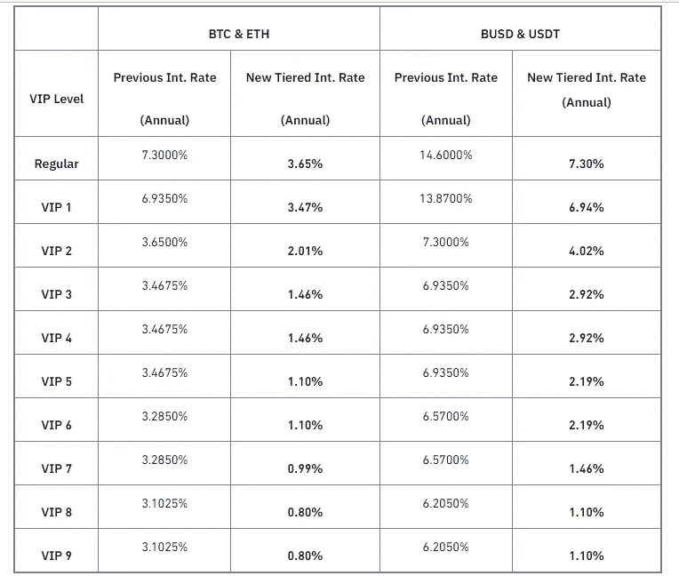

# 如何在交易保证金时保护你的资产

> 原文：<https://medium.com/coinmonks/how-to-protect-your-assets-when-trading-margin-7cd8b224e614?source=collection_archive---------8----------------------->

[https://www.binance.com/en/trade-margin/BTC_USDT](https://www.binance.com/en/trade-margin/BTC_USDT)

> "你攀登的每一座山，都带你到达一个永无止境的辉煌的目的地."
> ― **希拉勒·纳格达**

W ikipedia 将保护定义为保护一件东西免受外力破坏的任何措施。在本文中，保护是指在币安保证金交易中保护你的资产免受损失的任何措施。虽然在币安保证金交易时很可能被冲昏头脑，但保持警惕也是非常重要的。

*什么是融资融券交易？*这只是使用通常由第三方提供的资金进行交易的一种方式。这与传统交易有很大不同，因为它允许更多的资金和支持使用头寸。

## 交易保证金时保护资产的建议

> 虽然在币安保证金交易很有趣，但需要小心，以免在交易结束时失望和悲伤。这里有一些在交易保证金时保护你的资产的提示；

*   **选择像币安这样值得信赖的平台:**币安已经一次又一次地证明，通过其平台每天无缝开展业务的方式是值得信赖的。币安保证金也不例外，因为在那里交易是完全可靠的。有了可靠而快速的客户服务，您的任何投诉或问题一定会得到迅速的答复。
*   **持续监控你的 LTV:** LTV 的基本意思是贷款价值比，是计算贷款价值与其抵押品市场价值的比率。高 LTV 比率意味着高财务风险，反之亦然。币安使用 LTV 比率来确定交叉担保品的风险水平。您将通过电子邮件或短信收到币安的追加保证金通知，要求您在 LTV 比率达到追加保证金水平时增加更多抵押品以降低清算风险。无法对此通知作出适当回应将触发对您抵押资产的强制清算，然后通过电子邮件和手机短信向您发送清算通知。清算费用是贷款金额的 1%。**您可以随时调整 LTV 比率以避免抵押品的清算。**

*以下是 LTV 的计算方法:*

*LTV =贷款金额/担保金额 x 100%*

*(贷款金额=本金+利息)*

*例:1 BTC 在 2022/05/12 等于 7400 美元，因此 0.01938571 BTC 等于 143.45 USDT*

*LTV(%)= 100 USDT/0.01938571 BTC x 100%*

*= 100 USDT/143.45 USDT x 100%*

*= 69.71%*

*   **充分理解交叉保证金或单独保证金的使用:**作为交易者，交叉保证金和单独保证金的知识非常重要，因为它们是交易时可以使用的有效工具。所有保证金余额在未平仓头寸之间共享，以避免在交叉保证金模式下清算。当交叉保证金被激活时，交易者将面临失去全部保证金余额以及任何未平仓头寸的风险。独立保证金是发放给单个头寸的保证金余额。当独立保证金模式被激活时，交易者通过控制分配给每个人的保证金数量来管理他们各自头寸的风险。现在哪个更好？两者都很好，但我更倾向于交叉保证金，因为它能更好地控制清算风险。因此，它在长期策略中更具可持续性，这需要头寸在极端市场情况下生存。

## 币安保证金的好处

1.  **不同的交易对:**交易对是两种加密货币配对在一起，如 BTC 和 USDT、BUSD 和 BTC、ETH 和 BTC 等。在币安平台上交易保证金时，你可以看到大量有趣的交易对，杠杆高达 10 倍。请注意，例如，资产价格的波动将决定市场持有的流动性；波动性越高，市场持有的流动性就越少。这是因为资产的波动性很高，这使得它非常不可靠，因此，市场上很少有人对该资产进行交易。
2.  **多资产抵押:**币安为其用户提供了投资多种资产作为抵押来借贷的机会。这在交叉裕量模式下是可能的。这是为了让交易者在开始交易时有更大的灵活性。
3.  冷静期:这是币安为避免过度交易而采取的预防措施。冷静期允许交易员在一段特定时间内暂停所有保证金交易活动。交易者可以设定 1 天、3 天或 1 周的冷静期。当冷却期启用时，保证金账户不能用于借入任何加密货币。
4.  **保险基金:**有超过 3 亿美元的保险基金，币安的保证金交易者应该可以放心，他们的资产是 SAFU 的。这是为了保护破产交易者免受不利损失，同时确保获胜交易者的利润得到全额支付。
5.  **客户服务:**由于其平台上有来自世界不同地区的大量用户，币安拥有出色的客户服务，支持 17 种不同的语言，并且用户界面简单易用。这意味着交易者在币安保证金交易中遇到任何问题时都不会束手无策。

## 币安融券的降息促销

> 作为币安承诺的一部分，使交易体验更适合，币安有一个针对利率降低的促销活动…

**促销期:**从 2022 年 3 月 21 日上午 11:00(世界协调时)开始，直至另行通知

[币安融券](https://www.binance.com/en/trade-margin/BTC_USDT)在平台上推出了针对 BTC、ETH、BUSD、USDT 的降息促销活动。**促销期间，用户使用上述资产可享受低至 0.8%的年利率折扣。**

[https://www . binance . com/en/support/announcement/5a 523469462 a 46629 e 793956d 691 ac3f](https://www.binance.com/en/support/announcement/5a523469462a46629e793956d691ac3f)

**BTC、瑞士联邦理工学院、BUSD 和 USDT 保证金的新分级利率:**

[https://www.binance.com/en/trade-margin/BTC_USDT](https://www.binance.com/en/trade-margin/BTC_USDT)

***注:*** *利率可能会因用户的 VIP 级别、保证金对等因素而有所不同。请参考* [*保证金数据*](https://www.binance.com/en/margin-fee) *了解最新的可保证金资产列表以及有关具体限额和利率的更多信息。*

总之，由于利息降低，促销是在交易时节省更多的一种方式。不要错过这个绝佳的机会。

立即开始您的币安利润之旅！[https://www.binance.com/en/trade-margin/BTC_USDT](https://www.binance.com/en/trade-margin/BTC_USDT)

今天就创建一个免费的币安账户[https://www.binance.com/en/buy-sell-crypto?ref=ZCF73TU7](https://www.binance.com/en/buy-sell-crypto?ref=ZCF73TU7)

**快乐交易:)**

> 加入 Coinmonks [电报频道](https://t.me/coincodecap)和 [Youtube 频道](https://www.youtube.com/c/coinmonks/videos)了解加密交易和投资

# 另外，阅读

*   [八大加密附属计划](https://coincodecap.com/crypto-affiliate-programs) | [eToro vs 比特币基地](https://coincodecap.com/etoro-vs-coinbase)
*   [最佳以太坊钱包](https://coincodecap.com/best-ethereum-wallets) | [电报上的加密货币机器人](https://coincodecap.com/telegram-crypto-bots)
*   [交易杠杆代币的最佳交易所](https://coincodecap.com/leveraged-token-exchanges) | [购买 Floki](https://coincodecap.com/buy-floki-inu-token)
*   [3 commas vs . Pionex vs . crypto hopper](https://coincodecap.com/3commas-vs-pionex-vs-cryptohopper)|[Bingbon Review](https://coincodecap.com/bingbon-review)
*   [加密复制交易平台](/coinmonks/top-10-crypto-copy-trading-platforms-for-beginners-d0c37c7d698c) | [如何在 WazirX 上购买比特币](/coinmonks/buy-bitcoin-on-wazirx-2d12b7989af1)