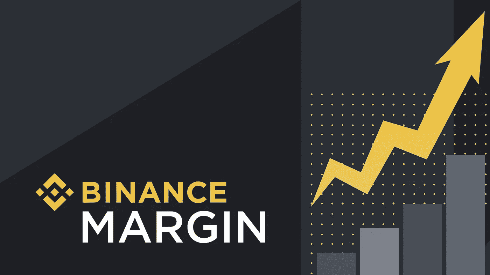
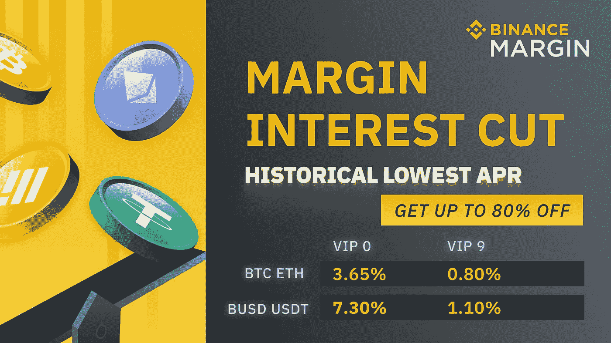
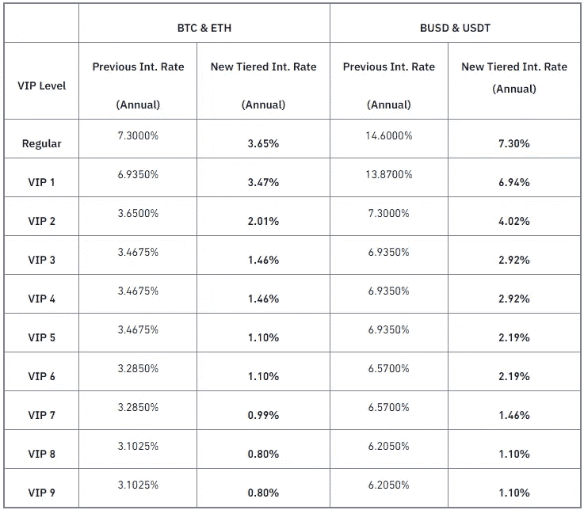
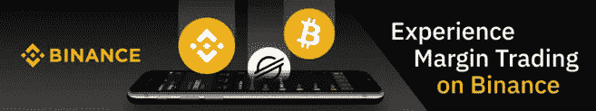

# 如何在交易保证金时保护你的资产

> 原文：<https://medium.com/coinmonks/how-to-protect-your-assets-while-trading-margin-108d4bd57a18?source=collection_archive---------25----------------------->

SOURCE: [Binance Blog](https://www.binance.com/en/blog/margin/binance-margin-differences-between-the-new-isolated-margin-mode-and-cross-margin-mode-421499824684900602)

> 不可否认的事实是，你需要钱来赚钱，尽可能保证你的资本安全是很重要的

每个交易者的目标都是尽可能多的赚钱。然而，尽管有可能通过保证金交易赚取惊人的利润，但也存在一定的风险。这些风险包括损失，以及资金被黑客攻击等。这就是为什么在交易保证金时知道如何保护你的资产是很重要的。

# 币安保证金减息促销

SOURCE: [Binance on Twitter](https://twitter.com/binance/status/1505854889276198915)

币安保证金利率下调促销活动于 2022 年 3 月 21 日开始，并将持续到另行通知，旨在让币安保证金用户在使用平台时享受优惠年利率。由于促销活动，您可以获得高达 80%的币安保证金利率。这使得用户可以节省他们的保证金利率，因为他们支付的利息比平时少。BTC、瑞士联邦理工学院、BUSD 和 USDT 的新利率低至 0.8%，尽管根据用户的 VIP 级别，利率可能会有所不同。

以下是 BTC、瑞士联邦理工学院、BUSD 和 USDT 保证金的新分级利率:

# 如何在交易保证金时保护你的资产

## 1.选择值得信赖的交流平台——币安

你选择的交易平台非常重要。事实上，它可以成就或毁掉你的交易之旅。因此，在像币安这样值得信赖的交易所进行交易是非常有意义的。币安经过多年的考验和信任，是世界上最著名的交易平台之一。超过 2860 万活跃用户信任该平台，不可否认的事实是，很多人信任币安。原因很简单。用户知道他们的资金在币安是安全的。币安不仅有一个保险基金，它还有许多其他安全措施来保护用户帐户免受黑客和其他邪恶行为者的攻击。保险基金的存在是为了弥补当用户的交叉保证金或独立保证金账户权益(资产减去负债)小于 0 时，或者当用户无法偿还加密贷款订单上的债务时可能发生的损失。此外，双重身份认证、KYC 和反网络钓鱼代码等安全措施可确保用户帐户尽可能受到保护。因此，确保资金安全。

## 2.继续监控你的 LTV

贷款价值比(LTV)是指贷款价值与抵押品价值的比率。监控你的 LTV 有助于你了解你的风险。因此，时刻关注你的 LTV 以避免清算是至关重要的。为了做到这一点，你必须为自己配备所有关于你的预期借款资产和抵押资产的重要信息。用于计算贷款价值比的公式是 *LTV =贷款金额/担保金额 x 100* 。贷款金额=本金+利息。如果你的 LTV 变得高于 LTV 保证金通知，你可能需要增加更多的抵押品或偿还贷款。如果它高于清算 LTV，你的抵押品可能会被清算，以偿还你的贷款。

## 3.在充分理解的情况下使用交叉保证金或隔离保证金

为了能够在你用保证金交易时保护你的资产，对交叉保证金和单独保证金如何运作有一个坚实的理解是至关重要的。这有助于你了解你的账户的风险。一方面，顾名思义，对于独立保证金，每个交易对的保证金和风险是独立的。每个交易对都有自己独立的保证金账户，但是您可以为不同的交易对开立多个账户。每个独立保证金账户的保证金水平根据其资产和债务分别计算。当一个账户发生平仓时，其他孤立的头寸不会受到影响。另一方面，有了交叉保证金，保证金和风险在保证金账户中分担。用户只能开立交叉保证金账户，在该账户中他们可以访问所有交易对。保证金水平是根据帐户中的总资产值和债务来计算的。当清算发生时，该账户中的所有头寸将被清算。

*更多信息，请查看这里:*[*https://www . binance . com/en-NG/amp/support/FAQ/b4e 9 E6 ad 70934 BD 082 e8e 09 e 33 e 69513*](https://www.binance.com/en-NG/amp/support/faq/b4e9e6ad70934bd082e8e09e33e69513)

# 为什么币安利润率对你有好处？

## 不同的贸易对

有大量的交易对(超过 600 对)可用于币安保证金交易。这使得交易者可以自由选择要交易的货币对，并创造了良好的用户体验。

## 多资产抵押品

多项资产可用作借款和币安保证金交易的抵押品。例如，在 BTC 的融资融券交易中，交易员可以更灵活地进行开仓交易和操作，因为他们不再局限于只使用 BTC 作为抵押品。他们也可以选择使用 ETH、BUSD 或 USDT。

## 冷却期

冷静期功能是币安保证金帮助您保护资产的方式之一。这个功能只是帮助你避免过度交易，特别是当你被最近的损失或其他因素压倒的时候。你所要做的就是使用这个功能。它通过限制您在选定的时间段(一天、三天或一周)内使用您的保证金账户借入或交易加密数据，暂停您的所有保证金交易活动。这可以防止过度交易或情绪化交易带来的不必要的损失，从而帮助你保护你的资产。

## 保险基金

许多人信任币安，巨大的信任意味着巨大的责任。币安在这一点上并没有疏忽，它有一个保险基金来弥补当用户的账户净值(资产减去负债)小于 0 时，或者当用户无法偿还加密贷款订单上的债务时可能发生的损失。

如果你想在从事保证金交易时保护你的资产，希望扩大你的利润，币安保证金是显而易见的选择。现在更疯狂的是，你可以用非常低的利率做到这一点。是啊！这可以通过之前讨论过的币安保证金减息促销来实现，实际上，您应该通过使用币安保证金来利用这一点:[https://www.binance.com/en/trade-margin/BTC_USDT](https://www.binance.com/en/trade-margin/BTC_USDT)[？ref=YA35VD1V](https://accounts.binance.me/en/register?ref=YA35VD1V)

SOURCE: [Binance Academy](https://academy.binance.com/en/articles/what-is-margin-trading)

更多币安保证金利率下调促销信息:[https://www . binance . com/en/support/announcement/5a 523469462 a 46629 e 793956d 691 ac3f](https://www.binance.com/en/support/announcement/5a523469462a46629e793956d691ac3f)

*如果你还没有一个币安账户，你可以通过下面的链接开一个:*[https://accounts.binance.me/en/register?ref=YA35VD1V](https://accounts.binance.me/en/register?ref=YA35VD1V)

## 风险警告

*加密货币交易受到高市场风险和波动性的影响。保证金交易有很大的风险，有可能带来巨大的利润和损失。过去的收益并不代表未来的回报。如果价格剧烈波动，您所有的保证金余额都可能被平仓。此处的信息不应被视为财务或投资建议。请谨慎交易。*

## 参考

 [## 币安保证金为 BTC、瑞士联邦理工学院、BUSD 和 USDT 推出降息促销活动|币安…

### 促销期:从 2022-03-21 上午 11:00(UTC)开始，直至另行通知已推出降低利率的促销活动…

www.binance.com](https://www.binance.com/en/support/announcement/5a523469462a46629e793956d691ac3f)  [## 什么是贷款价值比(LTV) |币安

### 贷款价值(LTV)比率是评估贷款风险的一个指标。该比率衡量的是一项资产的名义价值。

www.binance.com](https://www.binance.com/en-NG/support/faq/360040490772)  [## 独立保证金和交叉保证金的区别|币安支持

### 币安现在支持交叉保证金和单独保证金交易。您可以在…中轻松选择交叉或隔离模式

www.binance.com](https://www.binance.com/en-NG/amp/support/faq/b4e9e6ad70934bd082e8e09e33e69513)  [## 你应该尝试保证金交易的 3 个理由|币安博客

### 保证金交易融合了现货和期货交易的元素，允许投资者利用杠杆交易加密货币…

www.binance.com](https://www.binance.com/en/blog/futures/3-reasons-why-you-should-try-margin-trading-421499824684902311)  [## 如何使用保证金冷却期|币安支持

### 作为我们鼓励负责任交易的持续努力的一部分，币安启动了保证金交易的冷却期

www.binance.com](https://www.binance.com/en/support/faq/9c660522f69547e8bcda1e7649c7b33b) 

> 加入 Coinmonks [电报频道](https://t.me/coincodecap)和 [Youtube 频道](https://www.youtube.com/c/coinmonks/videos)了解加密交易和投资

# 另外，阅读

*   [Bookmap 点评](https://coincodecap.com/bookmap-review-2021-best-trading-software) | [美国 5 大最佳加密交易所](https://coincodecap.com/crypto-exchange-usa)
*   最佳加密[硬件钱包](/coinmonks/hardware-wallets-dfa1211730c6) | [Bitbns 评论](/coinmonks/bitbns-review-38256a07e161)
*   [新加坡十大最佳加密交易所](https://coincodecap.com/crypto-exchange-in-singapore) | [购买 AXS](https://coincodecap.com/buy-axs-token)
*   [红狗赌场评论](https://coincodecap.com/red-dog-casino-review) | [Swyftx 评论](https://coincodecap.com/swyftx-review) | [CoinGate 评论](https://coincodecap.com/coingate-review)
*   [投资印度的最佳密码](https://coincodecap.com/best-crypto-to-invest-in-india-in-2021)|[WazirX P2P](https://coincodecap.com/wazirx-p2p)|[Hi Dollar Review](https://coincodecap.com/hi-dollar-review)
*   [加拿大最佳加密交易机器人](https://coincodecap.com/5-best-crypto-trading-bots-in-canada) | [库币评论](https://coincodecap.com/kucoin-review)
*   [火币的加密交易信号](https://coincodecap.com/huobi-crypto-trading-signals) | [HitBTC 审核](/coinmonks/hitbtc-review-c5143c5d53c2)