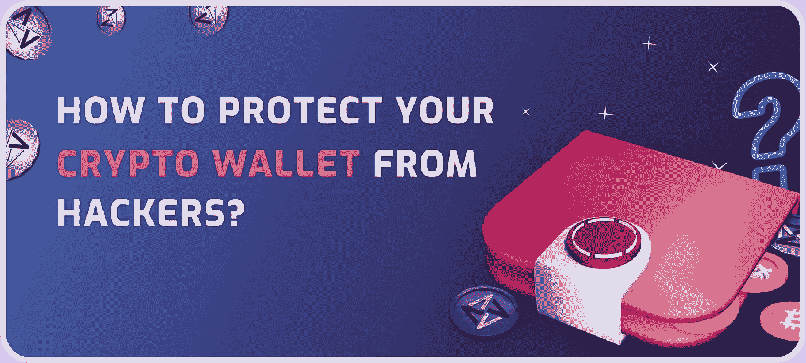

# 如何保护你的加密钱包免受黑客攻击？

> 原文：<https://medium.com/coinmonks/how-to-protect-your-crypto-wallet-from-hackers-ceec36623c2a?source=collection_archive---------8----------------------->

加密投资对黑客攻击的敏感性是许多人对投资加密货币持怀疑态度的主要原因。安全风险很高，特别是因为保护他们的加密货币投资是投资者的责任。这与传统的银行系统不同，在传统的银行系统中，保证你的钱的安全是银行的唯一责任。政府一直对加密投资的安全性保持警惕，这也是他们试图监管加密市场的更多原因。

根据[chain analysis](https://www.chainalysis.com/)的报告，2021 年价值 32 亿美元的加密货币被盗。这是 2020 年被盗加密货币的五(5)倍。密码盗窃的可悲之处在于，一旦被盗，几乎不可能再找回。因此，必须保护您的加密投资。

拥有一种加密货币可以预防你的加密钱包被黑客攻击。有一些安全实践，你将需要遵循，以保持你的加密钱包从黑客的安全。黑客技术已经从过去的样子演变而来，随着安全措施的改进，黑客手段也在改进。但是，您仍然可以通过遵循本文中的步骤来保护您的加密钱包中的加密投资。

网上交易确实会带来一些风险，但许多让你在网上安全的习惯也会让你的加密货币安全。就像你保持你的网上银行安全的方式，你也可以保持你的加密钱包安全。因此，这里有一些额外的事情可以让你的加密货币投资安全。

**保管和非保管钱包**

在我们深入了解如何保护您的加密投资免受黑客攻击的本质之前，让我们先来看看可以存储您的加密投资的两种加密钱包。我们还将看看它们的各种缺点，以及如何在使用它们时避免任何意外。

**保管钱包**

保管钱包，顾名思义，就是由第三方保管的钱包，比如像[币安](https://www.binance.com/)、[比特币基地](https://www.coinbase.com/)、[北海巨妖](https://www.kraken.com/en-us/)、[双子座](https://www.gemini.com/)等等交易所。交换机控制着你的私钥。这意味着，如果你从交易所购买加密货币，你将获得一种加密货币的“借据”，而交易所拥有私钥，并将加密货币放在他们的钱包中。例如，如果你在币安上购买以太坊，你的以太坊将在币安上，直到你决定撤回它。

大多数人更喜欢保管钱包，因为他们不需要担心存储或忘记他们的私人钥匙和永久丢失资金。私钥和加密货币将在加密交易所，但如果交易所被黑客攻击，你将失去你的加密投资，因为黑客将进入交易所的数据库。

**非保管钱包**

非保管或自保管钱包是一种您可以控制私钥和加密货币持有量的钱包。当使用非保管钱包的服务时，您完全有责任记住您的私人钥匙并保持安全措施以保护您的资金。如果您忘记了您的私钥，您将无法访问您的加密货币。

你的责任是确保你不会丢失你的私人钥匙，而你是唯一有这个责任的人。因此，您必须采用像冷钱包这样的备份机制，包括硬件，这是离线存储您的私钥的物理设备。很多硬件钱包看起来像 u 盘。

以下是保护你的加密钱包免受黑客攻击的方法:

1.  **使用冷钱包存放你的加密货币**

为了让您的加密投资远离黑客，第一步是使用冷或硬件存储钱包。如果你想长期保留你的加密投资而不用担心它被黑客攻击，一个冰冷的钱包是你的避风港。你可以随时取出一部分用于网上交易，也可以收回。一个冷加密钱包持有一个私人密钥，您可以使用它来访问您的资金。您可以设置您的私钥，不得丢失它，否则您的加密投资将永远失去。

**2。谨防网络钓鱼**

攻击者可能伪装成合法实体，从您那里获取敏感信息；这叫钓鱼。这是一种人们经常上当的有针对性的攻击。为了防止您的个人信息被盗，请不要从发送给您的任何链接登录您的加密交换。请确保您自己在浏览器中键入 URL，并在之后保存它。此外，不要通过电子邮件、短信或聊天向任何人透露你的个人信息。

**3。避开公共 WiFi**

当您登录在线加密交换或帐户时，公共 WiFi 可用于窃取您的个人信息。完全避免，使用公共 WiFi 时不要访问钱包。您可以使用 VPN 来保护您的数据隐私，隐藏您的 IP 地址和位置。

> 加入 Coinmonks [电报集团](https://t.me/joinchat/Trz8jaxd6xEsBI4p)，了解加密交易和投资

**4。使用多因素认证(MFA)**

您可以使用 MFA，通过基于密码、安全令牌和/或生物特征的独立凭据，在您的帐户上创建一层防御。使用 MFA 时，您知道密码，并且在获得对您的在线加密帐户的访问之前，您有您的令牌、生物特征或推送通知。

您越容易访问您的加密钱包，黑客也就越容易访问您的加密钱包。因此，为了避免被黑客攻击，保持你的加密钱包高度安全，这样你的加密投资可以是安全的。

广告/盈利网站:
[https://www.hashingadspace.com/](https://www.hashingadspace.com/)

阿西米令牌网址:
[https://www . asimi . io](https://www.asimi.io/)

玩游戏，赚取密码:
[https://www.asimiplay.com](https://www.asimiplay.com/)

关注我们下面的社交网站，获取最新的 ASIMI 新闻和公告；

[https://t.me/HashingAdSpace](https://t.me/HashingAdSpace)

[https://www.instagram.com/asimitoken/](https://www.instagram.com/asimitoken/)

[http://www.twitter.com/asimitoken/](http://www.twitter.com/asimitoken/)

【https://www.youtube.com/c/AsimiToken】

[https://www.facebook.com/asimi.io.token](https://www.facebook.com/asimi.io.token)

 [## ASIMI | LinkedIn

### ASIMI | LinkedIn 上有 2373 名粉丝。Asimi 是为在线广告和基于关注的收入而设计的加密令牌…

www.linkedin.com](https://www.linkedin.com/company/asimitoken) 

# crypto hack # crypto security # crypto tips # crypto wallet #黑客# crypto hack #加密货币#cryptos #crypto #walltets