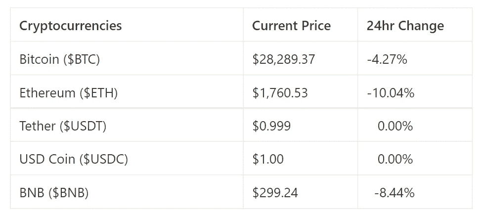
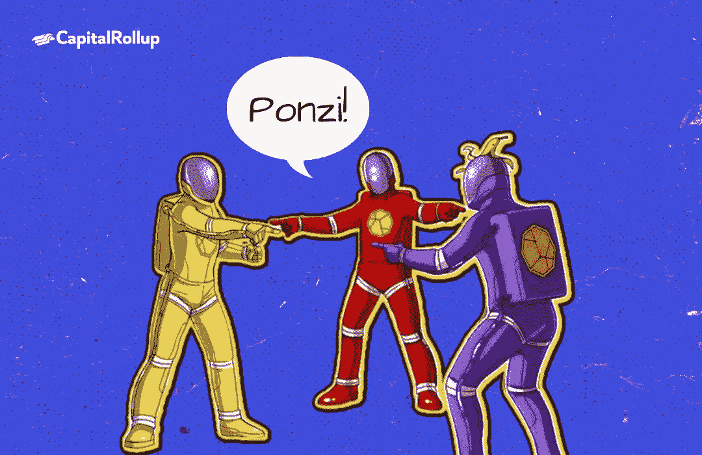

# 如何保护你的钱免受密码诈骗

> 原文：<https://medium.com/coinmonks/how-to-protect-your-money-from-crypto-scams-5b6674011e51?source=collection_archive---------64----------------------->

欢迎来到最新一期的 CapitalRollup Digest！今天的文摘是 5 月 26 日的，大约需要 5 分钟。我们马上开始。

*   今天的市场看起来怎么样？(前 5/10 大流行加密货币)

Price Market Update

# 如何识别庞氏骗局:需要检查的 5 个危险信号

庞氏骗局不时出现，目的都是一样的:把人们和他们的钱分开。成为这些骗局的受害者真的很糟糕。有一些方法可以确定你发现的最新投资计划是否实际上是一个庞氏骗局。让我们看看这些方案是如何工作的，为什么会发生。

> 交易新手？试试[密码交易机器人](/coinmonks/crypto-trading-bot-c2ffce8acb2a)或者[复制交易](/coinmonks/top-10-crypto-copy-trading-platforms-for-beginners-d0c37c7d698c)

# 什么是庞氏骗局？

这是一种投资欺诈，新投资者带来的钱付给老投资者。比如承诺在短时间内让人的钱翻倍的商家。他们唯一的任务就是在业务中投入一定的资金并等待，但他们并不提供真正的服务，也没有资产。因此，当你投资的时候，你没有投资任何真实的东西。

庞氏骗局的组织者重复这一循环，直到他们无法再吸引新的投资者。最终，他们带着投资者的钱跑路了，这个计划也就破产了。

# 加密庞氏骗局是如何运作的？

传统庞氏骗局和加密庞氏骗局的功能类似。人们不投资传统业务，而是投资假的加密模型。

欺诈者利用加密庞氏骗局来利用人们并不真正了解加密货币和区块链的事实。此外，其中一些人声称他们的加密货币是“下一个比特币”，承诺为投资者带来高回报。

加密庞氏骗局也像他们的传统对手一样依赖于新投资者的资金。

# 庞氏骗局在密码界流行吗？

Onecoin 是一个流行于 2014 年至 2016 年的加密庞氏骗局。投资者根据他们出售的材料数量和注册的人数获得奖励。

此外，投资者收到了 Onecoin 加密货币，这在当时似乎很有价值。

“一币通”没有独立的区块链，人们只能通过“一币通”的交易所进行交易。此外，你可以在交易所出售的一枚硬币的数量取决于你的“包装级别”。在不同国家对该公司的运营方式发出警告之前，这似乎并不奇怪。该骗局的创始人 Ruja Ignatova 逃跑了，投资者损失了 50 多亿美元。

有许多庞氏骗局，Onecoin 只是其中之一。因此，学会如何发现它们并避免它们是很重要的。

# 如何识别庞氏骗局

在你的研究中，这里有 5 个危险信号你应该小心:

1.  **风险很小或没有风险的高回报**

投资风险是衡量投资失败或成功的概率。所有类型的投资都有风险。投资任何资产，尤其是加密货币，都不可能没有风险。投资任何资产，尤其是加密货币，都不可能没有风险。

风险更高的投资是那些承诺更高收益的投资。同样需要注意的是，并非所有的投资都是盈利的。在投资任何资产类别时，尤其是加密货币时，保持谨慎非常重要。

**2。保证回报**

加密庞氏骗局承诺你有保证的回报，以说服你投资。然而，在投资领域没有任何保证。例如，如果一颗流星从天上掉下来怎么办？加密货币等资产不会贬值吗？

好吧，也许我们有点夸张了。然而，预测市场的行为是不可能的，尤其是在加密市场。然而，预测市场的行为是不可能的，尤其是在加密市场。一个有影响力的人的推文可以影响一枚硬币的价格。保证利润的秘密项目是你应该避免的危险信号。

**3。一致的高性能**

这可能会让你感到惊讶，但一项总是回报高利润的投资是一个危险信号。加密货币市场波动剧烈，价格也不稳定。

你应该警惕从不波动的秘密利润，即使在市场不景气的时候。他们很有可能用新投资者的钱来支付投资者。

**4。未注册投资**

一般预期投资平台将在州或国家政府监管机构注册。应谨慎看待未注册的加密投资。这绝对是一个危险信号。你还应该找出创始人是谁。

**5。投资压力**

投资前进行自己的研究是至关重要的。研究可以帮助你确定投资是否真实，但是好的研究需要时间。如果迫于压力，你应该避免投资，直到你做了自己的研究。

还有，要提防那些不会让你完全收回资金的项目。请记住，加密庞氏骗局需要成员的钱来运作。如果您遇到以下任何情况，请注意:

*   你不能清算你的硬币和提取你的钱。
*   当你试图清算你的硬币时，投资者会承诺给你更高的回报。

可能很难发现加密货币骗局，但更多地了解加密货币及其工作原理将有助于您避免上当。总是做你自己的研究，并意识到我们讨论的五个危险信号。

# 琐事🤔

加密是不依赖于个人或组织的系统的一部分。这个术语被称为什么？

A.技术的；关于技术的

B.先进的

C.分散的

D.不连接的

在下一期的 CapitalRollup Digest 中找到答案😉

**昨天琐事的答案是 b .)假**

# 每日一词！

💡**密码劫持**

密码劫持被描述为未经请求使用某人的设备或系统，如计算机、服务器、智能手机、平板电脑等。，用于加密挖掘。

**句子中使用的术语:** *—“避免成为* ***密码劫持*** *方案的牺牲品的一些措施包括使用广告拦截器和反密码挖掘扩展。”*

*   **社区更新📢**

我们将很快与 5 个行业领导者组织一个 Twitter 空间会议，在那里我们将讨论加密市场和 web3 上的一切。你可以期待它😎

# 我们今天在读什么📰

原来，秘密投资者也可能陷入庞氏骗局。 [***阅读更多***](https://www.insidehook.com/daily_brief/crime/turns-out-crypto-investors-can-also-fall-ponzi-scheme)

你的秘密投资可能是庞氏骗局的迹象。 [***阅读更多***](https://www.businessreport.com/business/signs-your-crypto-investment-may-be-a-ponzi-scheme)

与朋友一起学习和投资加密💰

当您邀请您的朋友开始使用 CapitalRollup 进行有利可图的投资时，您将获得独特的奖励。

💬对 CapitalRollup Digest 有什么反馈吗？ [**告诉我们！**](mailto:hi@capitalrollup.com)