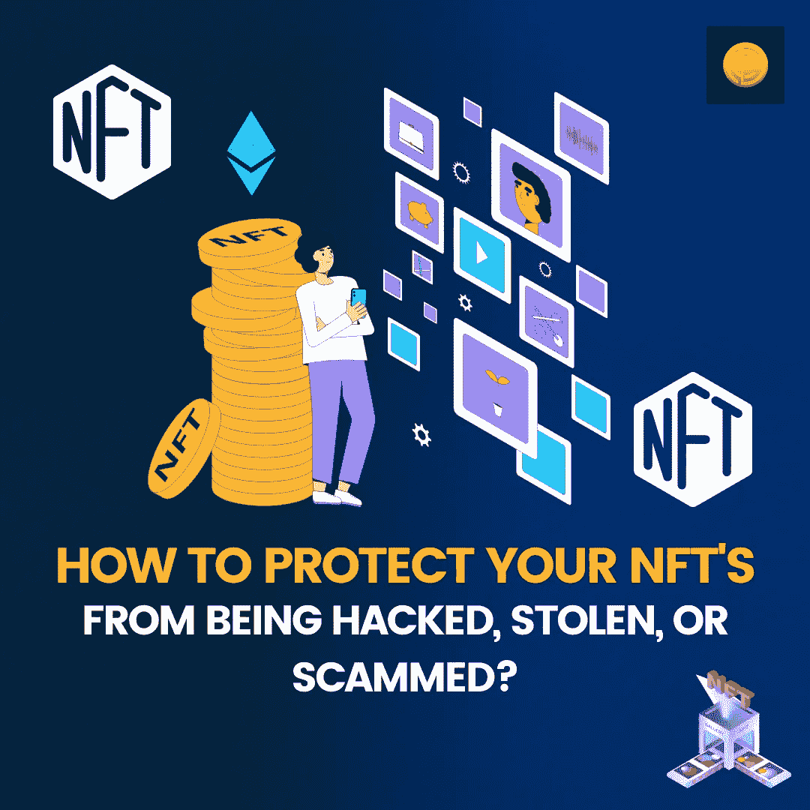

# 如何保护你的 NFT 不被黑，不被盗，不被骗？

> 原文：<https://medium.com/coinmonks/how-to-protect-your-nfts-from-being-hacked-stolen-or-scammed-ef44cbce0036?source=collection_archive---------64----------------------->

Beeple、Fewacious 和 BAYC 或 Bored Ape 游艇俱乐部彻底改变了我们看待和理解 NFTs 的方式。在过去，艺术家和创作者不得不依靠中介来出版或出售他们的作品；然而，随着时间的推移和去中心化技术和 NFTs 的兴起，事情开始转移回艺术家身上。

现在他们完全控制了自己的工作。尽管有这个优势，也有一点风险。由于大部分工作都以 NFT 的形式进行了标记，因此它们很有可能容易受到诈骗和攻击。在最近的一些事件中，NFT 门户遭到破坏。连接单一市场下所有非功能性交易的 NFT 网关遭到破坏，这个骗局让收藏者和创作者损失了数千美元。

因此，如果您喜欢 NFT，那么保护它们免受黑客攻击是非常必要的。在本文中，我们将解释如何保护 NFTs 免受黑客攻击、盗窃和诈骗。如果你期待以所有可能的方式保护你的 NFT，请做好准备；

# 保护你的 [NFTs](https://blog.coindhan.com/2022/05/20/top-nft-games-of-2022/) 免受盗窃&诈骗的方法

陌生人并不总是值得信任的；不要让 DMs 给他们一个偷偷摸摸的高峰

大多数密码爱好者在 Twitter、Reddit 和 Discord 上相当活跃。这些都是与志同道合的人进行互动、了解和交流的最佳平台。尽管如此，你必须保持不和谐，Twitter 和 Reddit 的 DMs 不活跃。同样的原因是未知的联系人可能会提出可疑的提议，通常人们会被引诱利用相同的提议。没有未知的 DM，意味着你从所有的挑战中解脱出来。

# 假冒造币网站对你来说再容易不过了

有许多假 NFT 铸造网站看起来像真的，但他们不是。因此，每当用户试图通过这样的网站制造 NFT，他们的钱包就会在这个过程中受损。从而导致资产完全受损。话虽如此，但始终要尝试通过合法的社交渠道进行核实。最好，你可以访问铸币市场的官方网站，交叉验证一切。如果你对这种网络平台的 Twitter 账户和关注者的验证感到满意，这将帮助你采取正确的行动，保护自己免受诈骗。

# 屏幕共享不可行

在常规世界中，屏幕共享是很好的，但是在加密世界中，事情以一种真正不同的方式形成。骗子可能会要求您共享屏幕，他们可以通过操纵来共享找回钱包的关键词。他们有足够的方法进入这种操控，在那里你只是顺从他们的奇思妙想。在一个罕见的骗局中，一个名叫 [Sohrab](https://twitter.com/sohrobf?ref_src=twsrc%5Etfw%7Ctwcamp%5Etweetembed%7Ctwterm%5E1430478533306982408%7Ctwgr%5E%7Ctwcon%5Es1_&ref_url=https%3A%2F%2Fcdn.embedly.com%2Fwidgets%2Fmedia.html%3Ftype%3Dtext2Fhtmlkey%3Da19fcc184b9711e1b4764040d3dc5c07schema%3Dtwitterurl%3Dhttps3A%2F%2Ftwitter.com%2Fsohrobf%2Fstatus%2F1430478533306982408image%3Dhttps3A%2F%2Fi.embed.ly%2F1%2Fimage3Furl3Dhttps253A252F252Fabs.twimg.com252Ferrors252Flogo46x38.png26key3Da19fcc184b9711e1b4764040d3dc5c07) 的用户在 ETH 被骗了 100 万美元，骗子要求分享屏幕，Sohrab 不得不认为他在和 BAYC 的创始人说话，但实际上，他们是一群骗子。

# 面向 NFTs 的硬件钱包

把你所有的资产放在一个钱包里意味着你在为突袭创造一个最佳地点。话虽如此，使用多个钱包并保持你的密码最终分发是非常可取的。非功能性测试也是如此。但是在任何时候，你都不应该把 12 个短语的恢复短语存储在你的计算机或云上。如果你这样做了，以这样或那样的方式，你肯定已经在你的生活中吸引了挑战。

这些是一些方法，通过它们你可以保证自己的安全，享受投资加密和 NFTs 的好处。

> 加入 Coinmonks [电报频道](https://t.me/coincodecap)和 [Youtube 频道](https://www.youtube.com/c/coinmonks/videos)了解加密交易和投资

# 另外，阅读

*   [如何在加拿大购买加密货币？](https://coincodecap.com/how-to-buy-cryptocurrency-in-canada)
*   [无聊猿游艇俱乐部(BAYC)回顾](https://coincodecap.com/bored-ape-yacht-club-bayc-review) | [拜比特 vs 比特币基地](https://coincodecap.com/bybit-vs-coinbase)
*   [5 款最佳加密交易终端](https://coincodecap.com/crypto-trading-terminals) | [最佳 DeFi 应用](https://coincodecap.com/best-defi-apps)
*   [比特币基地 vs 瓦济克斯](https://coincodecap.com/coinbase-vs-wazirx) | [比特鲁点评](https://coincodecap.com/bitrue-review) | [波洛涅克斯 vs 比特克斯](https://coincodecap.com/poloniex-vs-bittrex)
*   [德国最佳加密交易所](https://coincodecap.com/crypto-exchanges-in-germany) | [Arbitrum:第二层解决方案](https://coincodecap.com/arbitrum)
*   [币安交易机器人](/coinmonks/binance-trading-bots-d0d57bb62c4c) | [OKEx 评论](/coinmonks/okex-review-6b369304110f) | [Atani 评论](https://coincodecap.com/atani-review)
*   [最佳加密交易信号电报](/coinmonks/best-crypto-signals-telegram-5785cdbc4b2b) | [MoonXBT 评论](/coinmonks/moonxbt-review-6e4ab26d037)