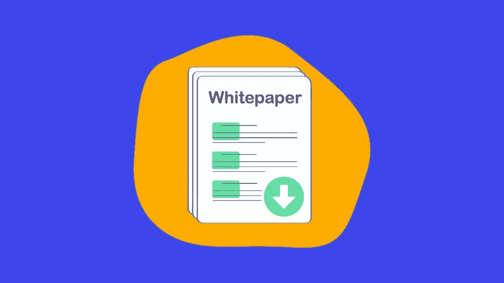

# 如何阅读白皮书

> 原文：<https://medium.com/coinmonks/how-to-read-a-whitepaper-82eda7af971f?source=collection_archive---------36----------------------->

当需要评估一个加密项目的潜力时，尤其是当它是一个 ICO(初始硬币发行)项目时，首先要做的就是分析该项目的白皮书。

密码行业白皮书的目的是详细解释该项目的目标。这包括产品及其技术的描述，使用该产品将解决的问题，关于将被创造的货币的细节，以及关于创始团队和项目时间表的信息。

在密码领域的所有白皮书中，最著名的是题为“比特币:点对点电子现金系统”的比特币白皮书，该白皮书由比特币的神秘发明者中本聪于 2008 年发表，并导致了第一种去中心化数字货币的诞生。

在本指南中，您将学习如何阅读白皮书，以便掌握所有工具来正确分析您对 ICO 或加密货币的下一笔投资。

为什么要阅读白皮书？
阅读某加密货币相关白皮书的三个主要原因:
1。了解项目
2。确定目标问题是否确实可以用提出的区块链解决方案来解决
3。Ro 定义这个虚拟货币项目作为投资是否有意义。白皮书中的信息应该回答这三个关键问题。

对白皮书有什么期待

摘要
白皮书的摘要为您提供了该项目的概述，并鼓励您阅读整份白皮书以了解更多关于该项目的信息及其加密货币。

简介
除了介绍这个特殊的区块链计划进入的市场之外，简介还经常回顾一些基本概念，如区块链和加密货币的盈利能力。

问题定义
问题定义对相关行业面临的挑战进行了更深入的描述，并提出了与解决方案相关的最重要的几点。这些挑战可能是技术性的，也可能与商业世界有关。它们还可能包括已经存在但不足以解决整个问题的解决方案。

产品描述
接下来你会看到项目所涉及产品的描述，它将详细描述平台、产品或服务的功能、工作原理，以及为什么它是解决文档所针对问题的优秀解决方案。

技术细节
接下来是区块链项目的技术细节，这是一个深入的技术解释，描述了该产品是如何开发的，它有哪些技术规格，以及伴随的数字货币将如何发挥作用。

数字货币
这一部分将更深入地探讨新货币的工作方式、将实施何种加密货币储备管理，以及它将如何惠及新平台和/或整个加密社区的用户。

销售详情
如果白皮书的发布部分是因为对加密货币的创建有所预期，那么你会发现这笔资金的细节。这将包括销售的所有里程碑日期、获得奖金的截止日期、授权或不授权参与的投资者的详细信息、累积资金的用途、项目的时间表等。

团队介绍
在白皮书的最后，你通常会看到对创始成员和项目主要开发者的介绍。这一部分很重要，因为一个背景扎实的团队是一个加密项目成功的关键。因此，您将在本节中找到团队每个成员的详细职业经历以及他们将扮演的角色的描述。

结论
最后，白皮书将以结论结束，总结项目的关键要素，并邀请您在即将到来的 ICO 活动中参与筹款活动。

过滤重要信息
如果你正在考虑投资几个新项目，并希望在更深入地分析之前对一个案例有一个大致的印象，那么过滤白皮书，找到你应该问自己的最重要问题的答案。在投资一个加密项目之前。

这些问题包括:
1。项目是否合法？
2。团队有必要的经验来执行它吗？
3。所提供的产品或服务有真正的市场吗？
4。竞争对手是谁？
5。加密货币的功能会是什么？
6。已经存在的虚拟货币会取代这种新的加密技术吗？等等。

做彻底的研究
虽然白皮书涵盖了一个加密项目的大部分方面，但是如果你计划在这样一个项目上进行大规模的投资，你的研究不应该就此停止。

Reddit 或 Twitter 等平台可能会提供对加密社区内部人士意见的见解，独立 ICO 评论也可能提供有用的见解。

最后，在购买加密货币之前，直接通过 Telegram 或 Slack 频道向团队成员提问也应该是任何区块链项目背景评估的一部分。

> 加入 Coinmonks [电报频道](https://t.me/coincodecap)和 [Youtube 频道](https://www.youtube.com/c/coinmonks/videos)了解加密交易和投资

# 另外，阅读

*   如何在 Uniswap 上交换加密？ | [A-Ads 审查](https://coincodecap.com/a-ads-review)
*   [WazirX vs coin dcx vs bit bns](/coinmonks/wazirx-vs-coindcx-vs-bitbns-149f4f19a2f1)|[block fi vs coin loan vs Nexo](/coinmonks/blockfi-vs-coinloan-vs-nexo-cb624635230d)
*   [本地比特币评论](/coinmonks/localbitcoins-review-6cc001c6ed56) | [加密货币储蓄账户](https://coincodecap.com/cryptocurrency-savings-accounts)
*   [什么是融资融券交易](https://coincodecap.com/margin-trading) | [成本平均法](https://coincodecap.com/dca)
*   [支持卡审核](https://coincodecap.com/uphold-card-review) | [信任钱包 vs 元掩码](https://coincodecap.com/trust-wallet-vs-metamask)
*   [Exness 点评](https://coincodecap.com/exness-review)|[moon xbt Vs bit get Vs Bingbon](https://coincodecap.com/bingbon-vs-bitget-vs-moonxbt)