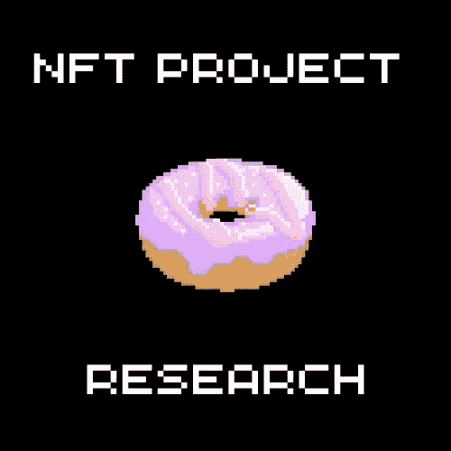

# 如何识别一个好的 NFT 项目？

> 原文：<https://medium.com/coinmonks/how-to-recognize-a-good-project-b1460dc580e1?source=collection_archive---------66----------------------->

**1。强大的路线图。**

大多数 NFT 项目都有一个称为路线图的东西，它解释了当项目达到主要里程碑时要做什么。你通常可以在他们的网站或者 Discord 服务器上找到这个。更强的项目有一个路线图，其中包括对持有人的好处、独家聚会、接触人员或信息、定期赠送、赌注之类的实用工具，或定期空投给关键持有人。路线图中的里程碑通常对应于销售目标(售出的 NFT 的百分比)，但也应包括系列售出后的计划。

**2。一个完全多元化的团队。**

这意味着 NFT 项目的创始人已经公开了他们的身份，可以很容易地归因于该项目和艺术。这提供了问责制，以确保他们将履行他们在路线图中做出的承诺，因为这将他们的声誉置于危险之中。如果他们有名人身份、多项成功的业务和强大的关系网，那就更好了。

**3。好看的艺术品。**

也许这是不言自明的，但重要的是艺术品很酷，是人们想买的东西。然而，这不是一个成王败寇的项目。老实说，加密朋克不是世界上最花哨的艺术品，但它很畅销。

**4。Discord 和 Twitter 上有很多粉丝。**

NFT 社区在 Discord 和 Twitter 上蓬勃发展，根据 Discord 上的服务器成员和 Twitter 追随者的数量，您可以感受到该项目的受欢迎程度。请记住，这些追随者中的一些很可能是机器人，所以评估有多少追随者实际上是活跃的。

**5。一个强大而积极的社区。**

NFT 社区是 NFT 项目的核心。查看社交媒体上关于 NFT 的对话，尤其是在 Discord 上的普通聊天室。社区是否经常进行实质性的参与？还是互动是被迫的，肤浅的？当心冒失鬼，

**6。物品稀缺。**

与项目在 Discord 和 Twitter 上的关注者数量相比，如果 NFT 项目具有稀缺性(意味着项目数量少)，这也是有帮助的。一些铸造 10，000 件的收藏做得很好，但是当没有足够的需求时，较低数量的铸造机会有助于推高价格。供求的基本经济规则也适用于非正规金融机构！

**7。营销计划和预算。**

在 NFTs 的世界里，炒作就是一切。价值是基于受欢迎程度和受欢迎程度而获得的。因此，为了与良好的路线图保持一致，NFT 项目应该从销售中留出资金用于营销。请记住，大多数 NFT 创始人在造币后会保留销售的版税，这意味着一部分销售会回到创始人手中，因此他们有充分的动机保持 NFT 的受欢迎程度和市场价格的上涨。

**8。创始人和 NFT 持有者之间的良好沟通。**

创始人和股东之间持续良好的沟通是让股东满意的关键。创始人应该定期发布更新，并对他们面临的挑战和问题保持透明(这在任何 NFT 的发布中是正常的)。

**9。效用。**

一些 NFT 仅仅是艺术性的，但是其他的提供给持有者专有的利益。NFT 的用途多种多样，从下注(把你的 NFT 放在钱包里赚取“利息”)到向随机或精英持有者定期赠送，到私人(游艇)聚会，到访问网络。一个包含公用事业的 NFT 项目具有长期效益，会吸引更大的投资者(“鲸鱼”)，他们会购买并持有该项目，直到其价值越来越大。

**NFT 材料公司。**

> 加入 Coinmonks [电报频道](https://t.me/coincodecap)和 [Youtube 频道](https://www.youtube.com/c/coinmonks/videos)了解加密交易和投资

# 另外，阅读

*   [3 商业评论](/coinmonks/3commas-review-an-excellent-crypto-trading-bot-2020-1313a58bec92) | [Pionex 评论](https://coincodecap.com/pionex-review-exchange-with-crypto-trading-bot) | [Coinrule 评论](/coinmonks/coinrule-review-2021-a-beginner-friendly-crypto-trading-bot-daf0504848ba)
*   [莱杰 vs Ngrave](/coinmonks/ledger-vs-ngrave-zero-7e40f0c1d694) | [莱杰 nano s vs x](/coinmonks/ledger-nano-s-vs-x-battery-hardware-price-storage-59a6663fe3b0) | [币安评论](/coinmonks/binance-review-ee10d3bf3b6e)
*   [Bybit Exchange 审查](/coinmonks/bybit-exchange-review-dbd570019b71) | [Bityard 审查](https://coincodecap.com/bityard-reivew) | [Jet-Bot 审查](https://coincodecap.com/jet-bot-review)
*   [3 commas vs Cryptohopper](/coinmonks/3commas-vs-pionex-vs-cryptohopper-best-crypto-bot-6a98d2baa203)|[赚取加密利息](/coinmonks/earn-crypto-interest-b10b810fdda3)
*   最好的比特币[硬件钱包](/coinmonks/hardware-wallets-dfa1211730c6) | [BitBox02 回顾](/coinmonks/bitbox02-review-your-swiss-bitcoin-hardware-wallet-c36c88fff29)