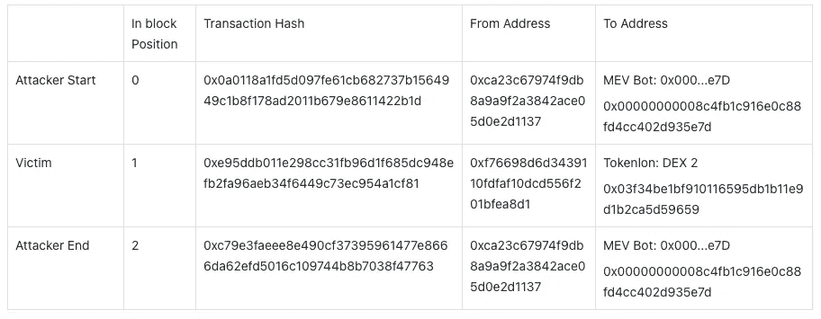
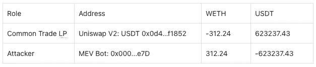
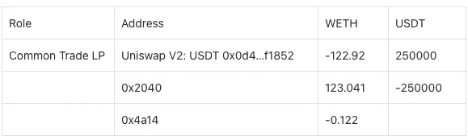
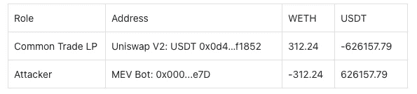
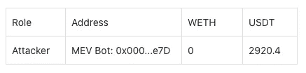
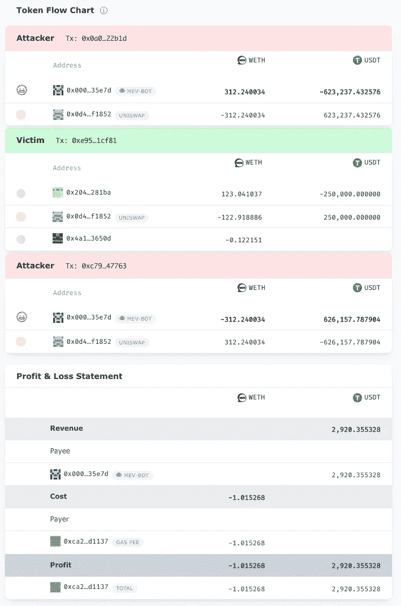

# 如何识别三明治之类的跨交易套利

> 原文：<https://medium.com/coinmonks/how-to-recognize-cross-transaction-arbitrage-like-sandwich-9173cf107cc5?source=collection_archive---------9----------------------->

Photo by [Sara Cervera](https://unsplash.com/@saracervera) on [Unsplash](https://unsplash.com)

我们已经在我们的[上一篇文章](https://eigenphi.substack.com/p/how-eigenphi-identifies-arbitrage?s=w)中解释了我们如何识别像[空间](https://eigenphi-1.gitbook.io/classroom/arbitrage-types/spatial-arbitrage)、[三角形](https://eigenphi-1.gitbook.io/classroom/arbitrage-types/triangular-arbitrage)和[组合](https://eigenphi-1.gitbook.io/classroom/arbitrage-types/combination-arbitrage)这样的原子套利。这一次，我们将带你了解我们关于三明治套利的方法。

为了更好地理解，您可能想先回顾一些核心概念，比如[组合可转让](https://eigenphi-1.gitbook.io/classroom/eigenphis-methodologies/how-eigenphi-identifies-arbitrage-transactions/recognizing-atomic-arbitrage-transactions/implementation#combined-transfer-table)和[交易](https://eigenphi-1.gitbook.io/classroom/eigenphis-methodologies/how-eigenphi-identifies-arbitrage-transactions/recognizing-atomic-arbitrage-transactions/implementation#trade)。

跨交易结构分析是[交易内](https://eigenphi-1.gitbook.io/classroom/eigenphis-methodologies/how-eigenphi-identifies-arbitrage-transactions/recognizing-atomic-arbitrage-transactions)分析方法的延伸。

三明治套利有如下特征。

*   在同一个块中，攻击者的事务包含一个开始事务、一个结束事务以及中间的一个或多个受害者事务。
*   攻击者和受害者的组合需要满足一个基本条件:From 地址不相同。

三明治模式具有(攻击者开始事务、受害者事务和攻击者结束事务)的组合。每个交易的 CombinedTransferTable 包含处理交易的相同地址。结合攻击者的开始交易和结束交易，我们得到了最终净盈余的套利组合可转移量。

再来看[这个](https://www.eigenphi.io/ethereum/tx/0x8ea8aec6887d9ca23b1fa681988866d418284a66f90a1dc3e16432f1ca1db726)。

**区块号交易列表:14762460**

**攻击者启动组合可转移交易**

攻击者以以下价格购买了 WETH:1996 年 USDT。

**受害者交易合并可转让**

受害者以下列价格购买了 WETH:2031.8 USDT。

**攻击者结束交易 CombinedTransferTable**

攻击者以下列价格出售 WETH:2005.4 USDT，高于买入价。

**套利识别信号**

这三笔交易都发生在地址:Uniswap V2: USDT 0x0d4…f1852。

**攻击者的最终净利润**

攻击者的开始/结束交易组合:

在这个三明治套利中，攻击者 MEV Bot: 0x000…e7D 的收入在扣除汽油费等成本之前为 2920.4 USDT。

就是这样。下一次，我们将讨论为什么你应该在 DeFi 上找到交易结构。简而言之:理解 DeFi MEV 交易的基础结构，对于在智能合约构建的迷宫中导航并为 DeFi 新世界建立新边界至关重要。

跟随我们通过这些来挖掘更多隐藏的 DeFi 的智慧:

*   [EigenPhi 官方推特](https://twitter.com/eigenphi)
*   [EigenPhi MEV Alert Twitter](https://twitter.com/eigenphi_alert)
*   [子堆栈](https://eigenphi.substack.com/)
*   [中等](/@eigenphi)
*   [Mirror.xyz](https://mirror.xyz/0xc19565163aFdEe3783FC970E4Bd0275B11848d34)
*   [电报](https://t.me/WisdomOfDeFi)
*   [不和](https://discord.com/invite/JXD8cyzR2a)
*   [Revue](https://www.getrevue.co/profile/EigenPhi)

> 加入 Coinmonks [电报频道](https://t.me/coincodecap)和 [Youtube 频道](https://www.youtube.com/c/coinmonks/videos)了解加密交易和投资

# 另外，阅读

*   [如何在印度购买比特币？](/coinmonks/buy-bitcoin-in-india-feb50ddfef94) | [瓦济克斯审查](/coinmonks/wazirx-review-5c811b074f5b)
*   [隐料斗替代品](/coinmonks/cryptohopper-alternatives-d67287b16d27) | [HitBTC 审查](/coinmonks/hitbtc-review-c5143c5d53c2)
*   [CBET 评论](https://coincodecap.com/cbet-casino-review) | [库科恩 vs 比特币基地](https://coincodecap.com/kucoin-vs-coinbase)
*   [折叠 App 审核](https://coincodecap.com/fold-app-review) | [Kucoin 交易机器人](/coinmonks/kucoin-trading-bot-automate-your-trades-8cf0ca2138e0) | [Probit 审核](https://coincodecap.com/probit-review)
*   [如何匿名购买比特币](https://coincodecap.com/buy-bitcoin-anonymously) | [比特币现金钱包](https://coincodecap.com/bitcoin-cash-wallets)
*   [币安 vs FTX](https://coincodecap.com/binance-vs-ftx) | [最佳(SOL)索拉纳钱包](https://coincodecap.com/solana-wallets)