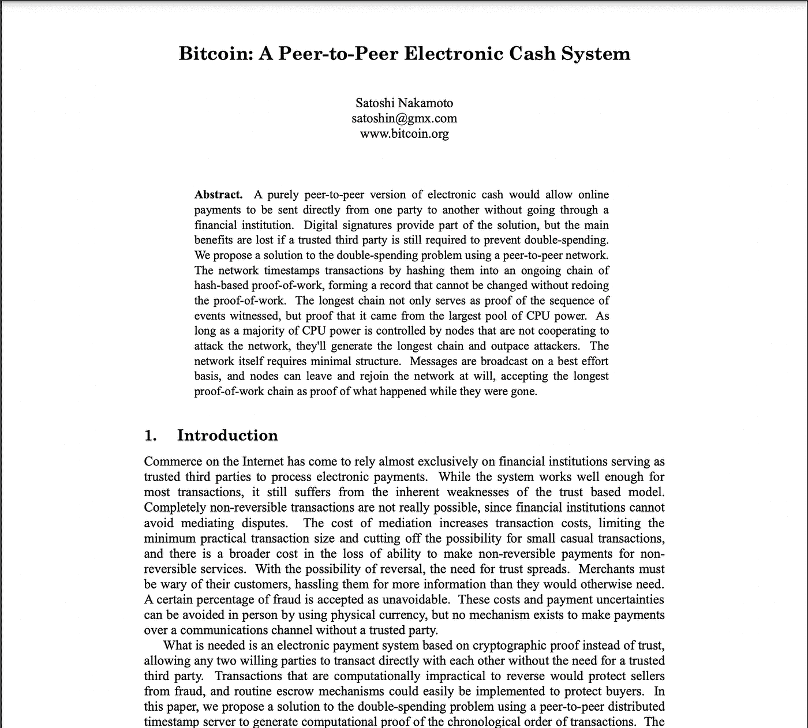

# 如何研究投资加密项目

> 原文：<https://medium.com/coinmonks/how-to-research-crypto-projects-to-invest-in-1aa81d3bfc90?source=collection_archive---------9----------------------->

你已经听说了加密货币，或者在这一点上，你已经做了比听说更多的事情，并且已经购买了一些加密货币，但是你一直在赔钱，或者似乎没有赚到你预期的那么多钱。嗯，我和你一样，在经历了几次加密市场的过山车之后，我现在有了一个加密市场分析的博士学位，哈哈！

这里有几件事，我希望我在开始时就知道。

*NB。这不是财务建议。*

在谈论和/或寻求投资一个加密项目时，你可能需要考虑 8 个因素。

1。 **什么**:他们是什么，他们是做什么的？保持在非常基础的水平。简化一下就好。我真的很喜欢 K.I.S.S 的缩写，意思是保持简单愚蠢！

例如:

*   **比特币** =点对点电子现金系统。
*   **以太坊** =智能合约&去中心化 App 平台。
*   **Dogecoin** = Meme 币。

一个很好的资源是这些加密项目的“*白皮书*”及其网站。

Bitcoin’s whitepaper

这是以太坊的[黄皮书](https://ethereum.github.io/yellowpaper/paper.pdf)和我对它的[走查](/coinmonks/understanding-the-ethereum-yellow-paper-f280800df590)。

这两个资源确切地告诉你他们正在试图做什么，并且基本上概述了他们所有的意图。这就像他们对世界的推销。在他们的网站上，他们也应该有一个关于网页，一个使命宣言，等等…

你还想去 Reddit、Twitter、LunarCrush 等论坛了解更多关于这个项目的信息。基本上，你要做的是获取尽可能多的信息，这样你就可以很容易地向一个 5 岁的孩子解释。你想从 30，000 英尺的高空鸟瞰这个项目。

2。 **历史** **(又名背景)**:团队中有哪些人，即创作者和开发者？他们做了什么，他们存在多久了？你想知道这些问题的答案。

让我们以卡尔达诺(ADA)为例。

*   创始人:查尔斯·霍金森(以太坊联合创始人，IOG 首席执行官)。
*   该项目始于 2015 年，在亚洲进行，由 2015 年至 2017 年分四个阶段进行的 ICO 资助。
*   这种货币上市时市值约为 6 亿美元。
*   霍金森与以太坊的联合创始人维塔利克·布德林闹翻了，因为他想让以太坊盈利，但布德林不想。因此，Hoskinson 决定制作自己的项目，即 Cardano (ADA)。
*   Cardano 是一个“利益证明”智能合约平台，希望让“创新者和远见者带来积极的全球变化”。

Cardano’s background / history

3。 **部门**:下面是一个比特币(BTC)统治地位的聊天来帮助简化这一点。这就告诉我们比特币的市值 vs 整个行业市值是多少。2017 年 3 月，比特币的市值是加密货币市场整体市值的 95%。比特币基本上主宰了一切。无论比特币做了什么，基本上其他东西都跟着做了。4 -5 年后，这一比例仅为 40 %, 3-4 年后，这一比例只会继续下降。这并不意味着比特币的市值将会下降，但随着我们有更多优秀的加密项目获得强大的立足点，它在整个加密货币领域的影响力将开始减弱。

a chat showing bitcoin’s market dominance in 2017 and 2022.

当我们谈到行业时，这些并不是一切，但这些是大行业。

*   **L1(第一层)**:这些是以太坊，雪崩，卡尔达诺，索拉纳，幻影
*   **L2(第二层)**:这些是主要针对第一层的扩展解决方案。L2 是为了 L1 自己做不到的事情。目前最大的 L2 是多边形(MATIC)。
*   公用事业公司:这是一种分散和集中的交易。Uniswap、Sushiswap、币安等。
*   **Defi** :这些是 Defi 协议，如 terra luna、aave、curve
*   **Meta** :任何与元宇宙、即玩即赚游戏等相关的内容

Top sectors of the crypto space.

将这些项目分成几个部分有助于理解每个部分中存在的特性，它们如何在整个加密空间中发挥作用，以及每个部分未来的增长潜力。

4。 **价值**:他们带来了什么价值，他们与其他加密项目有何不同和优势，为什么他们比其他加密项目更值得投资？你想找到这些问题的满意答案。因为如果他们所做的只是贴上一个不同的标志，一个不同的名字，他们做的正是另一个密码正在做的事情，那么他们并不比其他人更好，他们只是在营销方面不同，所以为什么不直接采用 O.G。

O . Gs .的例子有:

*   **比特币**:真实的 O.G
*   ETH :首个智能合约平台
*   **多边形(Matic)** : #1 ETH 缩放解决方案
*   **露娜**:独特的稳定币生态系统
*   **ChainLink** :连接真实世界数据和区块链

此外，除了加密货币之外，还有什么其他东西:你能对它下注吗，他们的流动性池是什么，授权，产量农业？

你想知道这个密码是否在做别人不做、不能做或者会发现很难做的事情。如果有，那么这就给了人们一个投资这个加密项目而不是另一个的理由。

需要考虑的重要因素有:

*   通货膨胀:这是通货膨胀还是通货紧缩的意思？他们会继续制造更多的代币吗？如果是的话，会持续多久，会持续多少年？例如，比特币会引起通货膨胀，因为他们将继续开采新的区块，铸造新的货币，直到 2140 年，之后，将不再有铸造/开采。在这一点上，它变成了通货紧缩。
*   **令牌经济学**:基本上是一种加密货币令牌经济学的加密说法，即“资产经济学”。
*   **流动性**:你只需点击你正在研究的任何一种加密货币，就可以进入 [coinmarketcap](https://coinmarketcap.com/) 查看大量这些指标/统计数据。
*   **市场** **上限**
*   **最大**供给**供给**
*   **总供应量**
*   **循环供给**
*   **交易量(24 小时)**

**流动性>市值**

*   流动性是衡量以当前公平市场价值买卖特定资产的能力。
*   与市值相比，流动性更难操纵
*   对于新项目，创作者和开发者通常会将流动性“锁定”到项目中，以允许新的交易者交易和使用加密/令牌，而不会出现巨大的频繁价格波动。这也表明，开发商正在把他们的钱用在他们的嘴上，这应该给新人们提供一些信心。

5。 **生态系统**:他们在哪里建设，与谁合作，他们在做什么？要问的问题是，你的密码在它自身之外做什么？需要注意的重要事项有:

*   **合作关系:**他们在&外做什么合作关系？
*   **社交媒体:**每个人都有一个社交媒体账户，所以你的加密货币最好也有一个！
*   **增长:**他们是如何发展他们的生态系统和网络的？以太坊的生态系统增长最快，但真正快速增长的是索拉纳。

Solana’s ecosystem of products

6。 **风险**:这个很简单但是**超级重要！**

*   有什么主要的危险信号吗？
*   基本上，如果以上所有重要因素你都没有满足和满足，那么它真的值得投资吗？
*   问问你自己，我能看到数百万其他人使用和投资这个吗？
*   试着让一项投资看起来很糟糕，如果很容易做到，那就继续前进。如果很难让一个加密项目看起来很糟糕，那么你可能会有所发现。
*   客观一点。尽管你很想进入一个加密项目，因为它有 100，000 倍的潜力，但你需要看看数据、数字以及加密到底发生了什么。

7。 **(价格)预测:**做这件事真的没有对错之分。只是不要试图太*【乐观】*。因为如果你试图向星星射击，并登上月球，你会失望的！

以下是一些如何确定未来价格的方法；

*   技术分析。
*   你想比较你的密码与市场上其他顶级密码(如 Fantom —>比特币)的市值，如果它做得更好，那么就证明了“风险越大回报越多”的说法，但如果它做得更差，那么为了更少的回报而承担更多的风险是没有意义的。
*   占全部加密市场份额的百分比:一个很好的例子是，如果 Solana 拥有全部加密市场份额的 3%,如果全部加密市场份额为 20 万亿美元，价格会是多少？
*   其他知名人士对这个项目有什么看法？
*   它属于哪个行业，这个行业在未来会有很大增长吗？例如，像元宇宙这样的行业预计将在未来 5-10 年内大幅增长。
*   做最坏的打算，抱最好的希望！

**最终想法**

*   你打算持有这个密码多久？
*   你喜欢它是因为它所提供的东西，还是仅仅因为它是一个赚钱的好方法？
*   如果项目没有像你希望的那样快速发展，或者随着时间的推移它开始失去价值，你会怎么做？
*   最重要的是，在一天结束时，你应该感谢成为这场加密革命的一部分。这就像是重新参与到互联网的开端，这带来了太多的机会。

> 加入 Coinmonks [电报频道](https://t.me/coincodecap)和 [Youtube 频道](https://www.youtube.com/c/coinmonks/videos)了解加密交易和投资

# 另外，阅读

*   [ProfitFarmers 回顾](https://coincodecap.com/profitfarmers-review) | [如何使用 Cornix Trading Bot](https://coincodecap.com/cornix-trading-bot)
*   [如何匿名购买比特币](https://coincodecap.com/buy-bitcoin-anonymously) | [比特币现金钱包](https://coincodecap.com/bitcoin-cash-wallets)
*   [瓦济里克斯 NFT 评论](https://coincodecap.com/wazirx-nft-review) | [比茨盖普 vs 皮奥克斯](https://coincodecap.com/bitsgap-vs-pionex) | [坦吉姆评论](https://coincodecap.com/tangem-wallet-review)
*   [如何使用 Solidity 在以太坊上创建 DApp？](https://coincodecap.com/create-a-dapp-on-ethereum-using-solidity)
*   [币安 vs FTX](https://coincodecap.com/binance-vs-ftx) | [最佳(SOL)索拉纳钱包](https://coincodecap.com/solana-wallets)
*   [如何在 Uniswap 上交换加密？](https://coincodecap.com/swap-crypto-on-uniswap) | [A-Ads 审查](https://coincodecap.com/a-ads-review)
*   [加密货币储蓄账户](/coinmonks/cryptocurrency-savings-accounts-be3bc0feffbf) | [YoBit 审核](/coinmonks/yobit-review-175464162c62)
*   [Botsfolio vs nap bots vs Mudrex](/coinmonks/botsfolio-vs-napbots-vs-mudrex-c81344970c02)|[gate . io 交流回顾](/coinmonks/gate-io-exchange-review-61bf87b7078f)
*   [CoinFLEX 评论](https://coincodecap.com/coinflex-review) | [AEX 交易所评论](https://coincodecap.com/aex-exchange-review) | [UPbit 评论](https://coincodecap.com/upbit-review)
*   [AscendEx 保证金交易](https://coincodecap.com/ascendex-margin-trading) | [Bitfinex 赌注](https://coincodecap.com/bitfinex-staking) | [bitFlyer 审核](https://coincodecap.com/bitflyer-review)
*   [Bitget 评论](https://coincodecap.com/bitget-review)|[Gemini vs block fi](https://coincodecap.com/gemini-vs-blockfi)cmd |[OKEx 期货交易](https://coincodecap.com/okex-futures-trading)