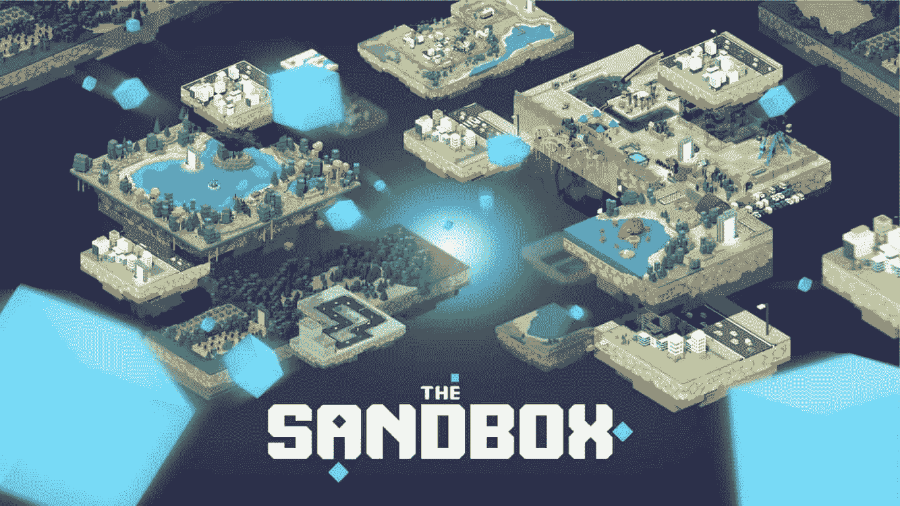
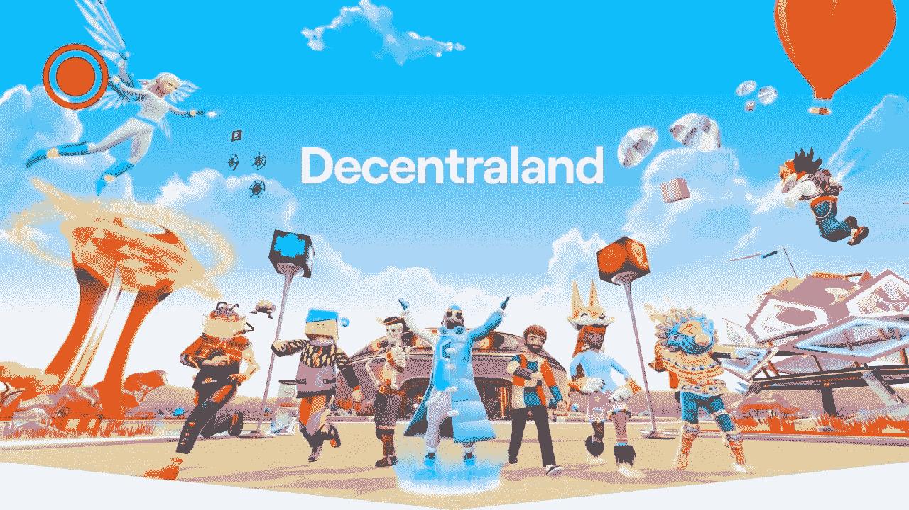
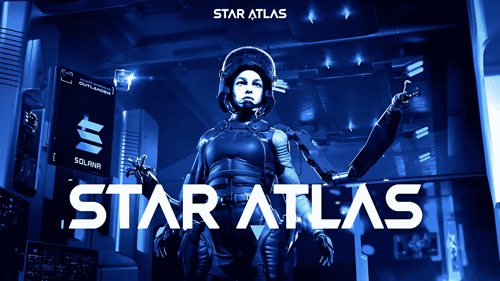

# 如何航行穿过元宇宙

> 原文：<https://medium.com/coinmonks/how-to-sail-through-the-metaverse-30f2348baeec?source=collection_archive---------27----------------------->

## metaverses 的概念涵盖了许多不同的方面——在线游戏、增强现实、社交网络、加密货币。

人们可以使用虚拟空间以现代方式相互交流。在线数字世界允许购物、投资、赚钱等等。

Metaverses 代币通常被用作支付商品和服务的一种方式。这些数字货币单位不仅可以在它们所绑定的游戏中使用(不像传统游戏)，还可以在交易所或其他平台上使用。

想象一个没有日常生活现实的宇宙。在这个另类的世界里，你可以工作、娱乐、放松，并与地球上任何地方的人交流。你将能够参加会议，创造令人难以置信的艺术作品，并获得利润。

有两种类型的元宇宙平台:由中央组织控制的平台(如堡垒之夜和 Roblox)，以及由社区创建和建立的分散平台。

*   数字世界越去中心化，用户就越有权管理项目。

## **虽然有不同种类的元诗句，但基本概念对应几点:**

*   具有代表个人用户的独特的、可定制的化身的公共数字空间；
*   其中数字所有权根据平台的分散程度而变化；
*   在那里你可以和其他用户交流；
*   ️interact 与数字世界的元素，并基于该平台与他人分享经验。

# 最好的元诗句和他们的加密货币

你可能会问，“为什么加密货币会出现在元经文中？”或者“如何在元诗句中使用标记？”

每个位于区块链的元宇宙都有自己的令牌，需要它来参与不可交换的令牌交易、作为去中心化治理的一部分进行投票，以及使用平台的其他功能。游戏越受欢迎，代币就越受欢迎。

## [****【立方体】****](https://somniumspace.com/)

****

**这个项目被称为“元宇宙的元宇宙”。该项目包括一个用于游戏开发、虚拟现实支持的成熟的 Unity SDK 和一个功能性建筑构造器。它既可以在电脑上使用，也可以在移动设备上使用。**

**这是一个建立在以太坊上的虚拟现实世界，其中每个玩家都处于一个开放的世界中。在 Somnium 中，玩家可以购买数字土地(他们完全拥有)，在世界上玩游戏，与其他玩家互动，并创建在平台上使用的数字资产。**

**因为这是一个开放的世界，创造和与环境互动的可能性在很大程度上受限于想象力。**

**通过将区块链与虚拟现实相结合，Somnium 的开放生态系统允许用户相互交互，将他们在平台上的虚拟现实体验货币化，创建和赚取数字资产，铸造 NFT，享受社交互动，并在他们的数字土地上创建和“生活”，从而弥合数字生活和现实生活之间的差距。**

## **[**沙箱**](https://www.sandbox.game/en/)**

********

****沙盒是目前最大的元宇宙区块链平台之一。该项目的长期目标是创建一个完全去中心化的世界，由沙盒社区中的用户完全管理、创建和控制。****

****沙盒是一个虚拟的世界，在这里你可以使用一个叫做“沙”的元宇宙中的硬币来买卖土地和其他资产。你可以创造和转换任何你想要的东西，用这种加密货币将整个过程货币化。****

****沙盒是一个游戏赚钱的元宇宙，让用户自己决定如何使用它。你可以创建自己的游戏，玩其他游戏，拥有虚拟土地，收集，创建或管理财产。****

****像史努比·道格和迪德莫这样的名人也鼓励公众数字化生活，并与名人互动。(想象一下这样一个现实:你可以登录、退出你的数字家庭，向你的邻居 Snoop 挥手，然后开始你的虚拟假期，为你的在线和实体家庭提供资金。有了沙盒，不一定是遥远的现实)。****

## ****[**【分散法力】**](https://decentraland.org/)****

********

****这是一个虚拟现实平台，允许你购买，出售和管理你的虚拟财产称为土地。你可以以任何你想要的方式创建和开发你的世界，并使用你的手机、电脑或虚拟现实(VR)头盔探索这个版本的元宇宙。****

****要开始，你需要一个法力令牌。这是一个本地项目令牌，用于提供对交互式应用程序的访问，支付商品和服务的费用，或者投资房地产。****

****分散的土地是一个社交世界，用户可以在一个开放的平台上相互交流，玩游戏，创建和管理数字财产。****

****虽然沙盒仍在努力变得完全去中心化，但分散的土地已经通过一个去中心化的自治组织来管理，使其 100%去中心化和用户驱动。****

## ****[**【星图(图集)**](https://staratlas.com/)****

********

****《元宇宙星球图册》是独一无二的，游戏发生在一个虚拟现实游戏中，大小相当于整个银河系。因此，每个人都可以为自己找到一个舒适的地方，创造一个独特的角色，购买一艘宇宙飞船，在上面进行一次神奇的旅程。星图给你机会去地球以外的地方旅行。这里没有边界，探索整个宇宙及其可能性。****

****你可以乘坐你的私人飞船，深入研究一个独特的元宇宙，加入一个派别或创建自己的和创造一个新世界。鉴于派系之间的斗争，一个不断变化的势力范围，玩家必须以这样的方式使用他们的雷达装备的船只，以便在敌对和不可预测的环境中生存。****

****如果参与者抓住了游戏的精髓，并制定了获胜的策略，那么在他的过程中，矿工可以完善材料，建筑商可以从中创造新技术。****

****玩家立即用这些材料获得一个新的等级，同时加强船的属性，例如，减少伤害或增加开采有价值材料的可能性。你可以使用阿特拉斯硬币购买任何数字资产，如土地、船只、船员和设备，使自己沉浸在星际阿特拉斯宇宙中。****

****在 Coinmarketcap.com❗查看列表和当前的元宇宙令牌****

# ****最后****

****总之，在区块链的虚拟村庄里，玩家可以买卖和交换许多虚拟的东西——领土、衣服、宠物。所有这些东西都是 NFT 代币的形式，可以在适当的市场上自由交易。例如上****。********

******未来的元宇宙代币开放进入这个行业，允许从 NFT 销售和市场价格增长中获利，还可以提供用你的声音影响项目发展的机会。这是一个新的极其不稳定的领域，风险巨大。参与者永远不要忘记[**【DYOR】(做自己的研究)**](/general_knowledge/dyor-do-your-own-research-7e80b3f1514)**&**[**如何造币**](/general_knowledge/how-to-mint-basic-analysis-guide-cfd1937b10e6) 的规则，即做自己的研究，而不是跟随别人的意见。******

# ******交换。网队
官网—[https://swap.net/](https://swap.net/)
推特—[https://twitter.com/NFTSwapnet](https://twitter.com/NFTSwapnet)
不和—[http://discord.gg/35K7H9RqJd](http://discord.gg/35K7H9RqJd)
电报—[https://t.me/NFTswapnet](https://t.me/NFTswapnet)
中—[https://medium.com/@NFTSwapnet](/@NFTSwapnet)
Docs&白皮书—[http://docs.swap.net](https://t.co/5qc7Mxt2p5)******

> ******加入 Coinmonks [电报频道](https://t.me/coincodecap)和 [Youtube 频道](https://www.youtube.com/c/coinmonks/videos)了解加密交易和投资******

# ******另外，阅读******

*   ******[AscendEx Staking](https://coincodecap.com/ascendex-staking)|[Bot Ocean Review](https://coincodecap.com/bot-ocean-review)|[最佳比特币钱包](https://coincodecap.com/bitcoin-wallets-india)******
*   ******[霍比审核](https://coincodecap.com/huobi-review) | [OKEx 保证金交易](https://coincodecap.com/okex-margin-trading) | [期货交易](https://coincodecap.com/futures-trading)******
*   ******[网格交易机器人](https://coincodecap.com/grid-trading) | [Cryptohopper 审查](/coinmonks/cryptohopper-review-a388ff5bae88) | [Bexplus 审查](https://coincodecap.com/bexplus-review)******
*   ******[7 个最佳零费用加密交易平台](https://coincodecap.com/zero-fee-crypto-exchanges)******
*   ******[氹欞侊贸易评论](https://coincodecap.com/anny-trade-review) | [霍比保证金交易](/coinmonks/huobi-margin-trading-b3b06cdc1519)******
*   ******[分散交易所](https://coincodecap.com/what-are-decentralized-exchanges) | [比特 FIP](https://coincodecap.com/bitbns-fip) | [Pionex 评论](https://coincodecap.com/pionex-review-exchange-with-crypto-trading-bot)******