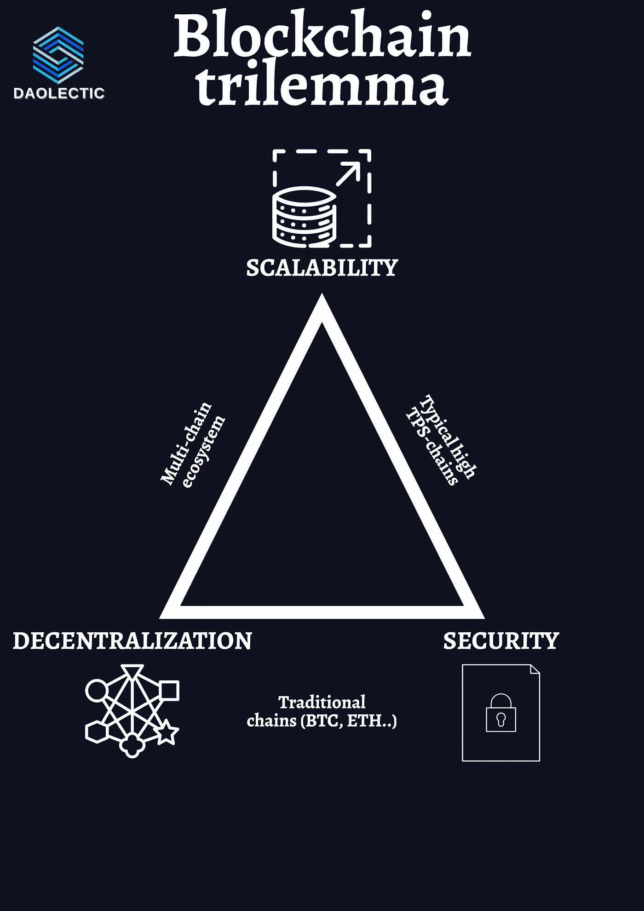
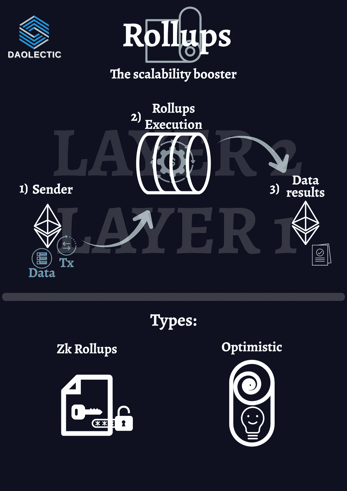
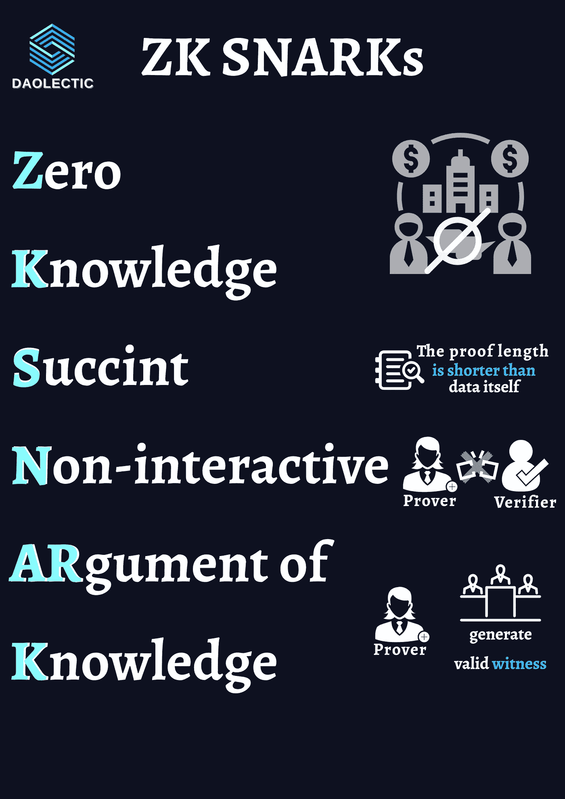
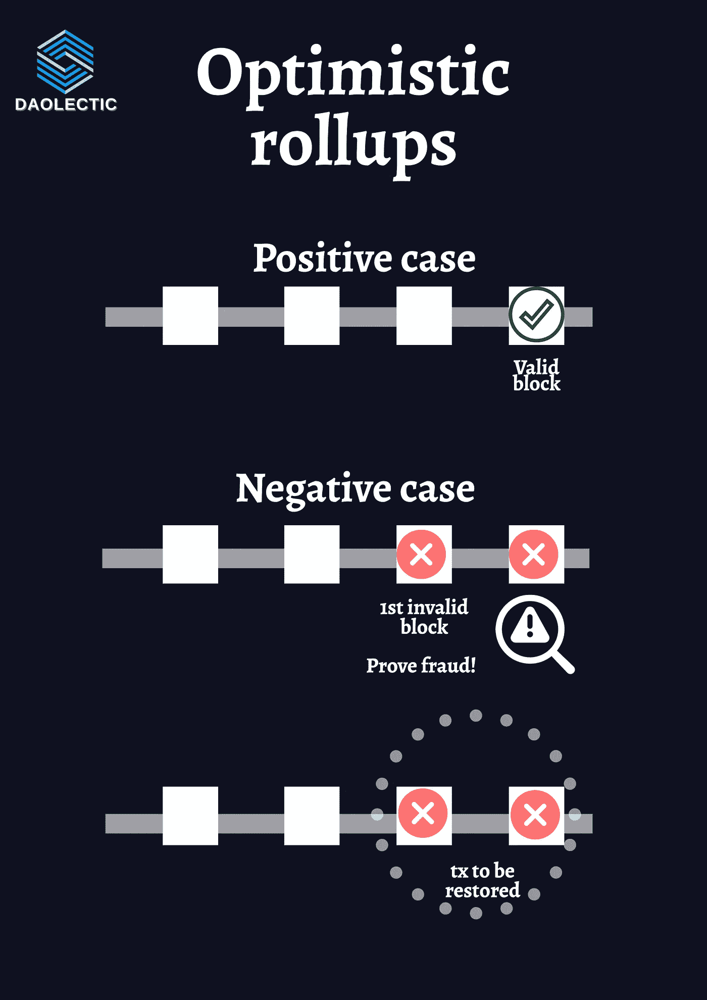
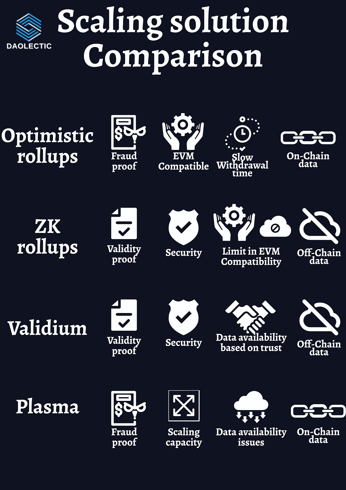
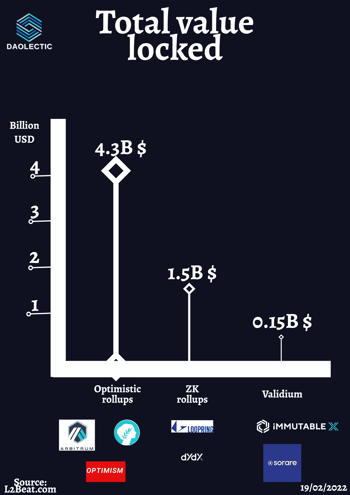

# 以太坊如何规模化？—对所有实际第 2 层环境的全面分析

> 原文：<https://medium.com/coinmonks/how-to-scale-ethereum-a-comprehensive-analysis-of-all-the-actual-layer-2-environment-3e909d4e679f?source=collection_archive---------12----------------------->

# 介绍

在区块链领域，最有争议的话题之一无疑是可伸缩性。

更具体地说，伸缩**以太坊**已被证明是一项具有挑战性但又是必要的操作:随着它越来越受欢迎，对包含在块中的交易的请求也增加了，因此交易成本也增加了。随着以太坊主网处理大约每秒 15 笔交易的*满负荷运转，提高吞吐量显得很有必要。*

*出现了许多第 2 层解决方案来限制 mainnet 上所需的处理量或存储量，以减轻以太坊节点的负担，每个解决方案都有自己的优缺点。*

**

*为了提高以太坊网络在其实际单链配置中的速度，正在使用各种替代扩展策略:它们都旨在将交易处理从主以太坊区块链上卸载下来，以提高可扩展性，但它们以各种不同的方式实现这一点。*

*值得注意的是，这些扩展技术并不是以太坊独有的，也可以用于其他网络。*

*今天帖子的目的是向您介绍区块链生态系统中存在的主要扩展可能性。*

*答事实上，现有技术有多种一致的算法和新颖的实现，例如**分片**方法，它们直接在基础层解决可伸缩性问题。*

*正如之前的报道所预期和解释的那样，**碎片链**构成了近几个月来获得大量兴趣的当前区块链的一小部分，值得注意的是游戏的增长，如和谐一号上的 [DeFi 王国](/@daolecticresearch/jewel-defi-kingdoms-breakdown-analysis-the-next-axie-infinity-killer-6d7aeefe23e1)和协议的 EVM 兼容链[Aurora 的引入。这些生态系统发展的主要驱动力是部署在其中的应用程序的实际价值更快的阻塞时间和更便宜的天然气费用提供的增强的用户体验。](/@daolecticresearch/near-protocol-the-nearest-bridge-to-the-smart-contract-space-59972489a6df)*

*在碎片链家族下，有可能找到**以太坊 2.0。***

*此外，还有构建在顶部的侧链和解决方案，如 **rollups** :这项技术继承了主层的所有安全和共识协议，使其比大多数其他扩展技术具有相当大的优势。在这方面，这些解决方案可分为**【非托管】**侧链。*

> *本质上，汇总收集大量事务，在链外计算它们，然后将它们作为单个链上事务进行广播。*

*现在以太坊主网上活跃的汇总分为两种类型:*

*   ****Zk 汇总(其中 Zk 代表零知识)*** 由 ***有效性证明*** 启用*
*   ****乐观，*** 启用 ***舞弊证明****

**

*在深入这个领域之前，有必要提一下什么是“零知识”证明。*

# *零知识证明*

*从纯粹的定义出发，零知识证明(T21，ZKP)是一个工具的集合，它能够在不暴露潜在假设的情况下验证信息。*

> *“零知识”这一表述源于这样一种思想，即没有提供关于特定事实的(*“零”*)信息:这是通过一组**密码**技术来实现的，这些技术使得“证明者”能够以数学方式向“验证者”表明计算断言是有效的，而无需公开任何数据。*

*也就是说，为了 ZK 证明的形象化，你可以看看这个制作精良的[中帖](https://blog.goodaudience.com/understanding-zero-knowledge-proofs-through-simple-examples-df673f796d99)，里面有几个图文并茂的例子*

*区块链域中引入了 ZKP 来改进其功能。零知识证明分为两种:**交互式**和**非交互式。***

*   *交互式 ZKPs 要求证明者进行一系列的活动或动作，以说服验证者他们拥有某种知识。交互式 zkp 中所需的大多数活动包括数学概率思想。*
*   *非交互式的 ZKPs 不需要证明者和验证者之间的交互，或者验证可以在之后进行。在这种情况下，这些 zkp 需要额外的计算机或软件。*

*所有零知识证明(交互或非交互)必须满足三个先决条件:*

1.  ***完整性**:如果一个陈述为真，验证者可以确认证明者持有所有必要的输入。*
2.  ***有效性**:断言不能被反驳，并且验证者不能被说服证明者有必要的输入，当他们没有的时候。*
3.  ***零知识**:验证者除了判断是真是假之外没有其他信息。其他方的信息和个人数据保持匿名。*

# ***ZK 翻滚***

*零知识汇总将所有事务数据提交给主链，并使用所谓的 Zk-Snark(零知识简洁的非交互知识参数)验证事务。*

*该加密工具已于 2018 年由 [Vitalik Buterin](/@VitalikButerin/zk-snarks-under-the-hood-b33151a013f6) 提供。*

*缩写 **SNARK** 代表**s**ucct、**n**on-interactive**ar**gument of**k**knowledge:*

*   *s***UCC CT***暗示证明比基础数据短。*
*   ****知识论证*** 表示没有适当的“见证人”，或者没有证据证明他们所证明的是真的，证明人就无法构建经验证的证据。*

*一旦这些验证证明完成并发布到主链，其中包含的所有交易都被宣布为最终交易。第 2 层节点构建这些证明所需的处理能力非常高，因为它们使用加密活动。*

**

*ZK 汇总通过一个继电器(也称为操作者或验证者)将交易组合在一起，然后继电器生成零知识证明来证明它们的真实性。之后，提交证明并在主层公布。*

# *乐观向上*

*乐观累计的基本假设是**所有已处理的交易都是有效的**。事实上，这个名字来自节点在链中的乐观状态。*

*每当发现一个事务无效时，节点可以通过提供欺诈证据来质疑发现不正确事务的整批事务:支持乐观汇总的底层系统将在主链上重新运行一批事务([乐观虚拟机，OVM](/plasma-group/introducing-the-ovm-db253287af50) )。*

*总体而言，OVM 允许完成第 2 层的交易，即使它们被第 1 层视为无效而拒绝:此外，如果交易被视为无效，第 2 层链将重置为发现欺诈交易之前的状态。所有后续交易都因欺诈交易而变得无用。*

*由于这种乐观的方法是建立在提交的交易总是真实的前提之上的，直到被证明是不同的，所以它被认为是有点“基于信任的”*

**

*如果向生态系统中的玩家提供适当的激励，这个假设将是现实的。然而，为了防止最坏的情况，也有必要采取额外的预防措施。例如，当将资金从第二层转移到第一层时，乐观主义强加了一个**七天扣留**，以便为验证者提供足够的时间来发现和标记任何欺诈交易。*

*[乐观](https://www.optimism.io)和 [Arbitrum](https://bridge.arbitrum.io) 是最近在以太坊上实现的两个乐观汇总，它们是同类中最重要的。这些解决方案受到了很多关注，并在以太坊社区中受到了很多压力。*

# *井冈霉素*

***Validium** 的操作方式**与 **ZK 汇总**类似，除了**数据**被保存**脱离链**。因为交易数据不在区块链上公布，所以有必要采用额外的信任假设，因为用户必须相信运营商能够在需要时提供数据。***

*Validium 的离线数据存储有许多好处，包括更快的交易速度和增强的客户隐私，因为公众无法访问交易。*

*但是，由于数据是离线保存的，因此用户将无法方便地显示他们在智能合同中的可用金额。*

*因此，他们必须从中继站获取数据以便收集资金，并且他们必须对中继站的可用性做出假设。*

*为了解决这个问题，像 [StarkWare](https://starkware.co) 这样的解决方案提供了一个[数据可用性委员会](/starkware/data-availability-e5564c416424) (DAC)来存储所有的链外数据，并在紧急情况下公开访问，使用户能够减少对这些中继器的依赖:因为他们仍然使用零知识证明，所以没有广播错误状态的危险；相反，用户此刻必须信任的只是信息的及时性。*

*Validium 解决方案是最近的，因为它们建立在 ZKRs 奠定的基础上，如果扩展解决方案的有效性证明套件越来越受欢迎，它们可能会获得动力。*

*Validium 项目包括 [DeversiFi](https://deversifi.com) 、ZKSwap(支付和交换平台)、 [Sorare](https://sorare.com) 、(NFT 足球赛)和[不可变 X](https://www.immutable.com) (NFT 市场)。*

# *血浆*

*在 Plasma 家族中，您可以找到几个基本上**类似于 Ethereum**的**区块链**，它们通过信任最小化的桥接架构连接到 etherceum。每个等离子体链可能采用自己的流程进行交易验证，但区块链以太博物馆仍然是真理的最终权威。*

*等离子用户不需要对运营商抱有信心，并且总是有机会收回现金，即使是在运营商不诚实或阻挠的情况下。虽然等离子体的推出引起了 Ethereum 社区的极大兴趣，但它也带来了一些挑战:新数据可用性网络攻击的混合，用户监控交易以检测恶意活动的要求，以及在大量用户试图同时退出等离子体链的情况下对主链上的数据容量的担忧，这些都减缓了基于等离子体的系统的采用。*

*此外，许多等离子体设计一直受到一系列 UX 和安全问题的困扰，而且它们本身不利于智能合同开发。例如，OMG 和 Polygon 现在已经放弃了等离子体，导致一些人认为它实际上已经死亡。*

# *比较:*

***乐观汇总**受到了**最大的关注**并获得了认可，这要归功于它们能够让开发人员将他们的以太网应用“复制并粘贴”到第 2 层平台上的特性。*

*领先的 Ethereum mainnet 应用程序，如 Uniswap 和 Synthetix，已经开始使用基于概率汇总解决方案的乐观汇总解决方案部署它们的应用程序。同样，ZK 的 rollups 和 Validium 解决方案虽然目前对通用智能合同的支持非常有限，但仍在积极实施中。*

***ZKRs** 相对于乐观汇总的一个主要优势是**没有争议期(退出时间)**。由于使用零知识证明来确定交易真实性，继电器将无法欺骗系统。另一个要考虑的因素是 **ZKR** 用户将始终能够提取他们的资产，因为信息在链上一直被保留着。*

*总的来说，这些计划的发展高度依赖于它们能提供什么。*零知识证明 EVM 兼容性的未来预示着基于有效性证明的 L2 解决方案组合的增长*。*

*随着 Matter Labs 和 StarkWare 率先使用这些具有数据可用性选择的证明，它们可能会超越乐观汇总的流行程度。零知识证明所提供的安全性，以及中继站发布恶意活动的难度，使得应用其能力的 L2 系统的未来看起来更加光明。*

**

*截至今天，整个第 2 层环境锁定的总价值约为 60 亿美元。*

*从下图中可以看出，我们从门户网站 [L2Beat](https://l2beat.com) 获取了最新数据，其中突出显示了乐观向上如何保持市场领先地位，占总市值的 70 %, Arbitrum 以 31 亿美元排名第一。第二层 dYdX 采用了 ZK-Rollup，以 9 . 95 亿美元位居第二。Validium 目前呈现出一个较低的 TVL，随着 IMX 和索拉雷的崛起，它看起来很有希望。*

**

# *结论*

*使用汇总预计将是未来最常见的扩展方法。其中许多今天是第一次部署，这是一个重要的里程碑。考虑到一个全功能的以太坊 2.0 离发布还有多远，它们可能会存在很长一段时间。*

*可组合性是以太坊的一个关键元素，它使网络中的任何人都能够在当前资产之上和周围轻松构建新的用例。
事实上，如果你是以太坊网络的用户，这给了你很大的自由:你可以在一个安全框架下，在同一条链上，通过一些用户友好的活动进行相对复杂的交易。*

*虽然第 2 层解决方案通过降低费用明显改善了用户体验，但它们也提供了独立执行环境的选项。*

*最近，在实现方面有很多犹豫不决，因为应用程序开发人员在选择部署哪个平台之前，一直在等待看哪个第 2 层解决方案会受欢迎。*

*一个或几个层 2 之间的集成将是未来的关键发展。它不仅对整个以太坊生态系统的网络效应有影响，而且对更广泛的智能合约平台环境也有影响。*

# *放弃*

*这不是任何情况下的财务建议，我研究的目标将永远是深入项目并从不同角度研究它，我确实包括基于我最近研究的类似项目的经验的个人意见。*

*我现在和将来都愿意接受讨论。*

***在 Twitter 上关注我们:***

***@道辛***

*在投资任何东西之前，请务必做好自己的研究。*

> *加入 Coinmonks [电报频道](https://t.me/coincodecap)和 [Youtube 频道](https://www.youtube.com/c/coinmonks/videos)了解加密交易和投资*

# *另外，阅读*

*   *[SmithBot 评论](https://coincodecap.com/smithbot-review) | [4 款最佳免费开源交易机器人](https://coincodecap.com/free-open-source-trading-bots)*
*   *[比特币基地僵尸程序](/coinmonks/coinbase-bots-ac6359e897f3) | [AscendEX 审查](/coinmonks/ascendex-review-53e829cf75fa) | [OKEx 交易僵尸程序](/coinmonks/okex-trading-bots-234920f61e60)*
*   *[如何在印度购买比特币？](/coinmonks/buy-bitcoin-in-india-feb50ddfef94) | [瓦济克斯审查](/coinmonks/wazirx-review-5c811b074f5b)*
*   *[隐翅虫替代品](/coinmonks/cryptohopper-alternatives-d67287b16d27) | [HitBTC 审查](/coinmonks/hitbtc-review-c5143c5d53c2)*
*   *[CBET 评论](https://coincodecap.com/cbet-casino-review) | [库科恩 vs 比特币基地](https://coincodecap.com/kucoin-vs-coinbase)*
*   *[折叠 App 审核](https://coincodecap.com/fold-app-review) | [Kucoin 交易机器人](/coinmonks/kucoin-trading-bot-automate-your-trades-8cf0ca2138e0) | [Probit 审核](https://coincodecap.com/probit-review)*