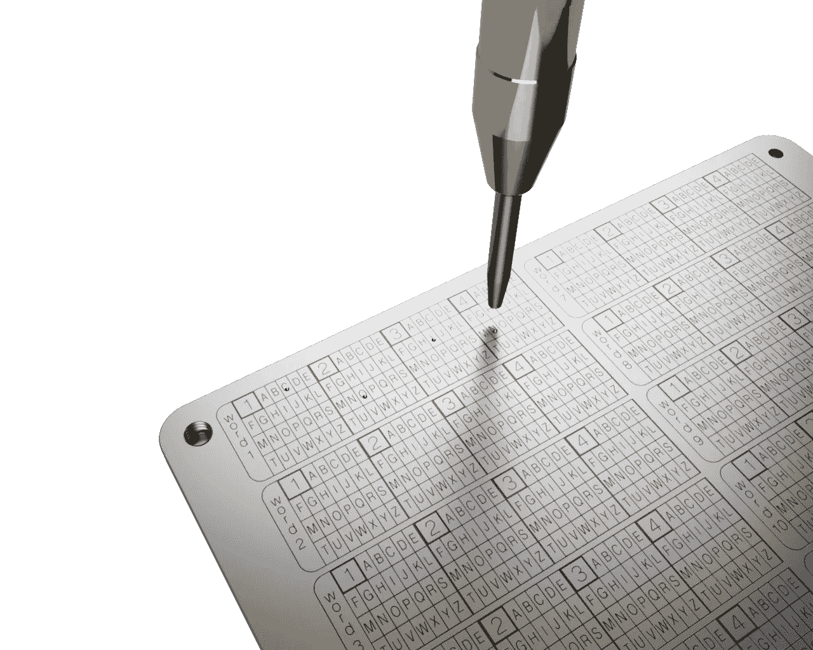
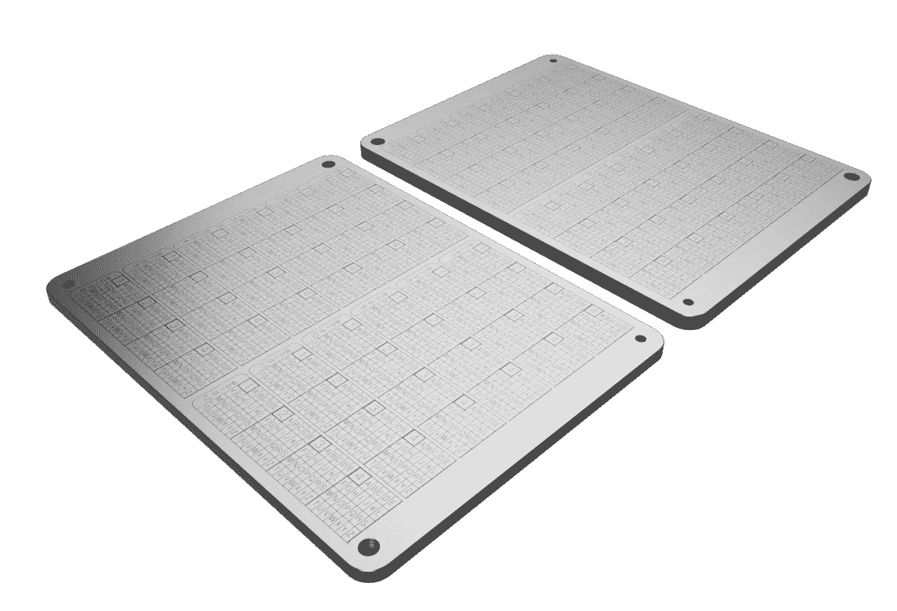

# 如何使用 Coinplate 钢加密备份保护您的比特币恢复短语。

> 原文：<https://medium.com/coinmonks/how-to-secure-your-bitcoin-recovery-phrase-using-coinplate-steel-crypto-backup-255242e421b4?source=collection_archive---------8----------------------->

## 保护您的加密货币投资组合(2022 年更新)

## 什么是种子恢复短语？

比特币和其他加密货币，如以太坊、Dogecoin、Cardano 等。使用一个可以轻松找回钱包的系统。如今，它几乎总是在 BIP39 标准下工作，这比以前使用私钥的解决方案要容易得多。钱包软件生成一个单词列表，并要求用户将它写在一张纸上，并将其放在安全的位置。这个单词列表被称为助记恢复短语、种子短语或备份种子短语，它允许授予对生成它的钱包的完全访问权。

所有这些都适用于硬件钱包，如 Ledger Nano、Trezor、Keystone，以及软件钱包，如 MetaMask 或 MyEtherWallet 和专有加密钱包，因为它们都使用 [BIP39 标准](https://getcoinplate.com/blog/what-is-bip39-mnemonic-phrase-2022-update/?utm_source=medium.com&utm_medium=article&utm_campaign=m1)。

## 为什么你要特别照顾你的恢复期？

凭借你的比特币助记短语或恢复种子短语，任何人都可以完全访问你的整个钱包，包括你的所有资金。这意味着你应该把它存放在一个安全的地方，这样除了你没有人可以访问它。这就是为什么正确地[储存你的种子短语](https://getcoinplate.com/blog/the-best-crypto-seed-phrase-storage-the-ultimate-guide/?utm_source=medium.com&utm_medium=article&utm_campaign=m1)很重要。
拥有你的种子短语的多个副本也是一个好主意。

你写在一张纸上的助记短语，即使存放在一个锁着的保险箱里或埋在一堆其他文件里，仍然是一张纸。不同的情况会把你的备份短语置于危险之中，使它在将来变得不可读。纸很容易被破坏。

想象一下，你楼上的邻居在你存放纸种子短语的房间上面漏水了。纸张潮湿时会变得不可读。同样的情况也适用于你的邻居引起小火灾，消防队用水淹没你的公寓。

同样，在发生火灾的情况下，纸很容易被毁坏。即使你的保险会赔偿你被毁坏的公寓和这台不错的高保真音响。没有人会为你丢失的加密货币付钱，因为你用一张纸丢失了加密货币恢复短语。

有许多类似上述情况，其中一个事故或小灾难可能会使您的资金消失。但是，人们永远失去资金的最常见的情况是最愚蠢的。有无数关于青少年或学生丢失他们价值数百万美元的加密货币钱包和投资组合的故事，因为他们的妈妈把这张奇怪的纸和其他垃圾一起扔掉了。还经常发生这样的情况，几个月后，一个人忘记将他的纸张恢复短语与其他文档放在一起，并在清理时将它们一起扔掉。

## 如何使用带有 Coinplate 的钢制比特币钱包来保护助记恢复短语？

不锈钢比纸坚固得多。像 Coinplate Alpha 或 [Coinplate Grid](https://getcoinplate.com/product/coinplate-grid/?utm_source=medium.com&utm_medium=article&utm_campaign=m1) 这样的不锈钢比特币钱包可以在房屋火灾或倒塌中幸存，被卡车碾过，在 10 年、20 年甚至更长时间后仍然完全可读。 [Coinplate](https://getcoinplate.com/?utm_source=medium.com&utm_medium=article&utm_campaign=m1) 不锈钢钱包防锈防水。不锈钢即使在海水中也能很好地生存，所以你可以放心，它可以使用几十年。

Mark your seed words with automatic marking tool on stainless sheets.

像 Coinplate Alpha、Coinplate Grid 或 Coinplate Punch 这样的不锈钢比特币钱包非常坚固，几乎可以经受住任何事情。

[Coinplate Alpha](https://getcoinplate.com/product/coinplate-alpha/?utm_source=medium.com&utm_medium=article&utm_campaign=m1) 由两块超厚不锈钢板通过不锈钢螺丝连接而成。这款备份解决方案重 2.5 磅或 1 千克。

然而，最好的部分是，你只需要 80 美元和 10 分钟的时间来保护你的比特币或加密货币投资组合。制作备份非常容易，你需要的任何东西都包含在备份集中，不需要单独的工具或特殊知识。您可以使用随附的自动标记工具将您的助记短语永久标记在不锈钢上，轻松地将您的硬件或软件钱包恢复短语备份在 Coinplate cold wallets 上。这是终身心安的极小代价。

> 加入 Coinmonks [电报频道](https://t.me/coincodecap)和 [Youtube 频道](https://www.youtube.com/c/coinmonks/videos)了解加密交易和投资

## 另外，阅读

*   [Crypto.com 费用](/coinmonks/binance-fees-8588ec17965) | [Botcrypto 审查](/coinmonks/botcrypto-review-2021-build-your-own-trading-bot-coincodecap-6b8332d736c7) | [替代方案](https://blog.coincodecap.com/crypto-com-alternatives)
*   [如何在 Bitbns 上购买柴犬(SHIB)币？](https://blog.coincodecap.com/buy-shiba-bitbns) | [印度币安](https://blog.coincodecap.com/binance-in-india)
*   [币安 vs Bitstamp](https://blog.coincodecap.com/binance-vs-bitstamp) | [比特熊猫 vs 比特币基地 vs Coinsbit](https://blog.coincodecap.com/bitpanda-coinbase-coinsbit)
*   [如何购买 Ripple (XRP)](https://blog.coincodecap.com/buy-ripple-india) | [非洲最好的加密交易所](https://blog.coincodecap.com/crypto-exchange-africa)
*   [非洲最佳加密交易所](https://blog.coincodecap.com/crypto-exchange-africa) | [胡交易所评论](https://blog.coincodecap.com/hoo-exchange-review)
*   [eToro vs robin hood](https://blog.coincodecap.com/etoro-robinhood)|[MoonXBT vs by bit vs Bityard](https://blog.coincodecap.com/bybit-bityard-moonxbt)
*   [Stormgain 回顾](https://blog.coincodecap.com/stormgain-review) | [Bexplus 回顾](https://blog.coincodecap.com/bexplus-review) | [币安 vs Bittrex](https://blog.coincodecap.com/binance-vs-bittrex)
*   [Bookmap 评论](https://blog.coincodecap.com/bookmap-review-2021-best-trading-software) | [美国 5 大最佳加密交易所](https://blog.coincodecap.com/crypto-exchange-usa)
*   [如何在 FTX 交易所交易期货](https://blog.coincodecap.com/ftx-futures-trading) | [OKEx vs 币安](https://blog.coincodecap.com/okex-vs-binance)