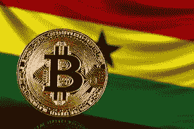
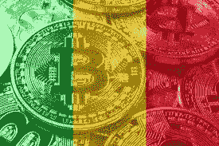

# 如何为 Cedis 销售比特币

> 原文：<https://medium.com/coinmonks/how-to-sell-bitcoin-for-cedis-81420b4c16ab?source=collection_archive---------39----------------------->

与所有加密货币一样，比特币是一种数字货币，其运行不受任何中央机构(如政府或央行)的控制。相反，它依赖于区块链技术和密码学。

区块链是记录和存储所有比特币交易的公共账本，交易的副本可以保存在全球不同的服务器上。如果你有一台功能强大的计算机，你可以为区块链设置一个服务器，这个服务器被称为节点。关于谁拥有哪些硬币的共识是通过这些节点以加密方式达成的，而不是依赖于像银行这样的中央信任源。

所有比特币交易都公开广播到区块链服务器，并在节点间共享。矿工每 10 分钟将比特币交易整理成块，组成一个名为 block 的组，并永久加入区块链。区块链——比特币的权威账本。

就像你会把传统的硬币和纸币放在实体钱包里一样，数字货币也放在数字钱包里。这个钱包可以通过发卡行软件或一系列在线软件和硬件工具访问。

Sell Bitcoin For Cedis

**比特币目前可以细分为七位小数:**

*   Satoshi = 0.00000001BTC
*   芬尼= 0.0000001BTC 以第一个接受比特币的人命名
*   微比特= 0.000001 BTC
*   毫比特= 0.001 BTC
*   厘比特= 0.01 BTC
*   分位数= 0.1 BTC
*   比特币= 1BTC

请注意，比特币的分数还有其他测量方法，如毫卫星或千分之一卫星，然而，毫卫星并不用于主要的比特币网络。

事实上，比特币这种东西并不存在，它只是网络之间基于对系统的信任而达成的关于数字硬币所有权的协议。要证明网络上某个硬币的所有权，你必须拥有与该硬币相关的加密私钥。一个人可以简单地记住他们的私人钥匙，而不需要其他任何东西来取回或花费他们的虚拟现金，这一概念被称为“大脑钱包”。

## **比特币可以转换成 Cedis 吗？**

Sell Bitcoin for Cedis

就像任何资产一样，你可以把比特币换成现金。网上有几个加密交易平台，你可以在那里出售你的比特币来换取现金。您也可以亲自或通过任何交流平台来完成这项工作。比特币没有任何机制可以让它们转换成另一种货币。比特币本身没有价值。但自脱离金本位以来，许多世界上最稳定的国家货币都是如此，比如美元和英镑。所有的货币都有信任做后盾。

## **如何为 Cedis 销售比特币**

如果你在加纳，你想卖掉你的比特币 [Dart Africa](https://dartafrica.io/) 是最好的加密交易平台。在 Dart Africa，客户满意度是他们的首要任务，他们通过以下方式实现这一目标:

*   为比特币和其他加密货币提供最佳汇率。Dart Africa 提供了加密交易市场中最好的交易率，您可以通过使用 [Dart Africa coin calculator](https://dartafrica.io/coincalculator) 检查您的比特币的价值来确认这一点。
*   多亏了他们的自动交易平台，他们可以在几分钟内支付加密交易的费用。在 Dart Africa，一旦您的交易被系统确认，付款将在几分钟内支付到您的帐户。
*   他们的平台被设计成(网页版和[手机应用](https://play.google.com/store/apps/details?id=com.dartafrica&hl=en_US&gl=US))允许客户轻松出售他们的加密货币。不管你有多精通技术，这个平台都是为了让你在点击几下就能卖掉你的加密硬币而设计的。
*   实时客户服务系统使人们能够轻松解决他们在使用该平台时可能遇到的任何问题。他们的客户支持系统全天候可用。

## **如何在** [**达特非洲**](http://dartafrica.io) 上出售你的比特币

Sell Bitcoin for Cedis on Dart Africa

*   使用您的凭据登录您的帐户。如果您没有帐户，请创建一个帐户。
*   单击工具栏图标(左上角的三条垂直直线)。您将在您的帐户面板上看到此信息。
*   点击出售硬币。
*   在硬币栏中选择 BTC 作为您的首选硬币选项。
*   输入你想出售的 BTC 的数量，相应的美元和塞地金额将显示在列中。注意:你可以出售的 BTC 或任何加密货币的最低美元价格是 20 美元。
*   点击立即出售硬币。
*   将提供一个钱包地址和一个 QR 码。您可以通过手动输入地址或扫描二维码发送您在上述步骤中选择的 BTC 金额。付款被确认后，你将立即被记入贷方

> *加入 Coinmonks* [*电报频道*](https://t.me/coincodecap) *和* [*Youtube 频道*](https://www.youtube.com/c/coinmonks/videos) *了解加密交易和投资*

# 另外，阅读

*   [Bookmap 评论](https://coincodecap.com/bookmap-review-2021-best-trading-software) | [美国 5 大最佳加密交易所](https://coincodecap.com/crypto-exchange-usa)
*   最佳加密[硬件钱包](/coinmonks/hardware-wallets-dfa1211730c6) | [Bitbns 评论](/coinmonks/bitbns-review-38256a07e161)
*   [新加坡十大最佳密码交易所](https://coincodecap.com/crypto-exchange-in-singapore) | [收购 AXS](https://coincodecap.com/buy-axs-token)
*   [红狗赌场评论](https://coincodecap.com/red-dog-casino-review) | [Swyftx 评论](https://coincodecap.com/swyftx-review) | [CoinGate 评论](https://coincodecap.com/coingate-review)
*   [投资印度的最佳加密软件](https://coincodecap.com/best-crypto-to-invest-in-india-in-2021)|[WazirX P2P](https://coincodecap.com/wazirx-p2p)|[Hi Dollar Review](https://coincodecap.com/hi-dollar-review)
*   [加拿大最好的加密交易机器人](https://coincodecap.com/5-best-crypto-trading-bots-in-canada) | [库币评论](https://coincodecap.com/kucoin-review)