# 如何在印度卖比特币换印度卢比？

> 原文：<https://medium.com/coinmonks/how-to-sell-bitcoin-for-inr-in-india-fdb6f0c10ce2?source=collection_archive---------40----------------------->

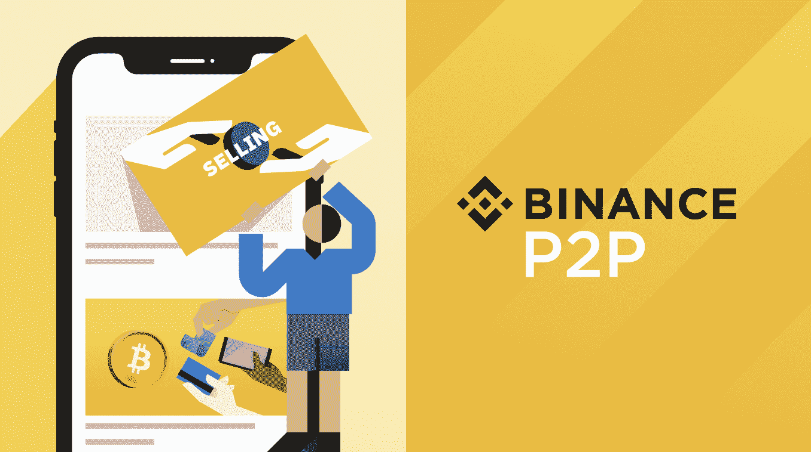

Photo: Binance.com

去中心化的数字货币，比如比特币(BTC——数字黄金)，如今在印度相当流行。到目前为止，比特币成为印度官方法定货币的可能性仍然很小。但是，在印度，通过加密货币交易所轻松购买(使用印度卢比)和出售比特币仍然是可能的。

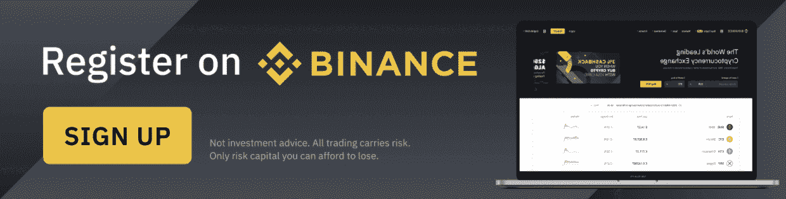

Photo: Binance.com

引领加密货币潮流，成为交易分散数字货币的主要交易所的是币安。最近，印度的加密货币交易所以极大的热情接近 P2P 或 P2P 媒介。

加密世界中的 P2P 市场交换是数字货币资产的直接交换。在 P2P 环境中，个人(买方和卖方)倾向于将法定货币兑换成加密货币，反之亦然。本质上，P2P 交易是加密货币交易所(中央实体)领域之外的加密货币交换。

现在让我们检查一下使 P2P 机制对印度的 Cryptoverse 如此有吸引力的各个方面和原则。但首先，让我们了解一下在[币安 P2P](http://p2p.binance.com/?ref=P10U1GSP) 上添加新支付方式的方法。

**如何在币安 P2P 上添加新的支付方式？**

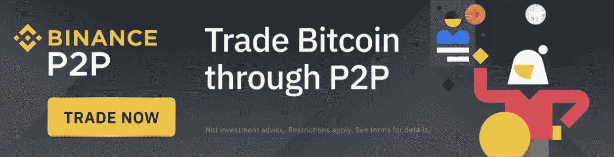

Photo: Binance.com

**币安 App**

支持 60 多种支付方式和 40 种法定货币，在币安 P2P 上添加一种新的支付方式很容易。Binance.com 和币安的应用程序只需要两步就可以添加新的支付方式。

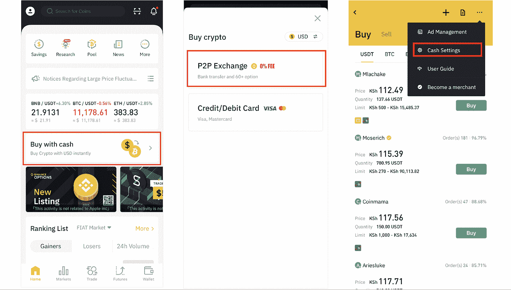

Photo: Binance.com

1.  在币安的应用中，首先点击“用现金购买”标签，然后点击“P2P”。进入 P2P 交易页面后，点击“…”图标，选择“现金设置”选项。

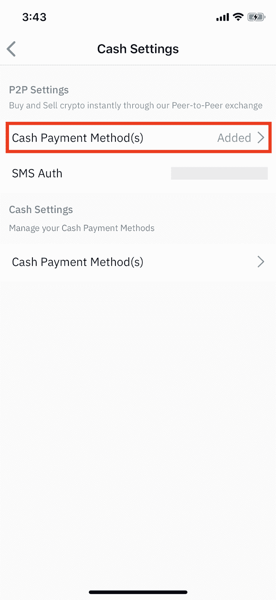

Photo: Binance.com

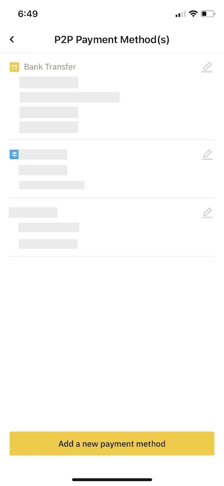

Photo: Binance.com

2.下一步，点击“现金支付方式”然后“添加新的支付方式。”从列出的各种付款方式中，选择您最喜欢的一种。在下一步中继续输入相应的详细支付信息，然后单击“确认”

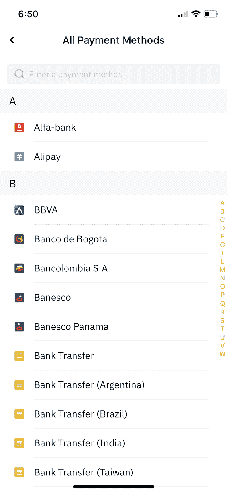

Photo: Binance.com

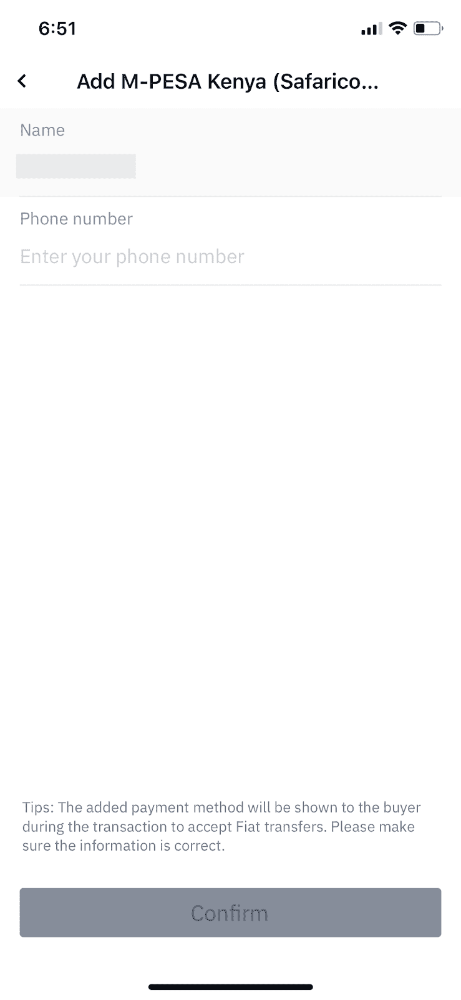

Photo: Binance.com

添加超过 20 种付款方式是可能的。只需激活您的支付方式，开始您的 BinanceP2P 交易之旅。

**Binance.com**

1.  访问 P2P 交易页面。点击“支付设置”(位于右上角)。

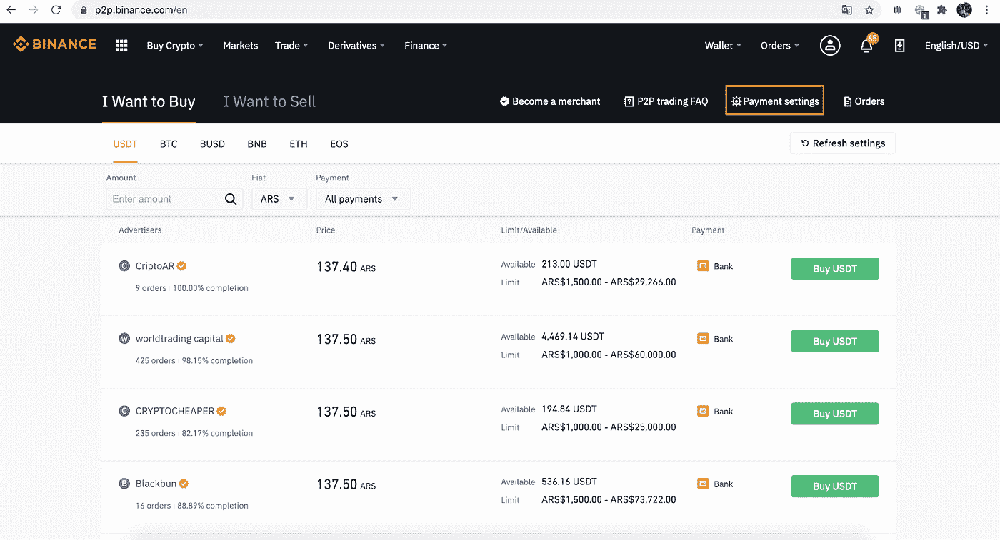

Photo: Binance.com

2.点击“+添加付款方式。”输入您的付款信息，然后点击“确认”

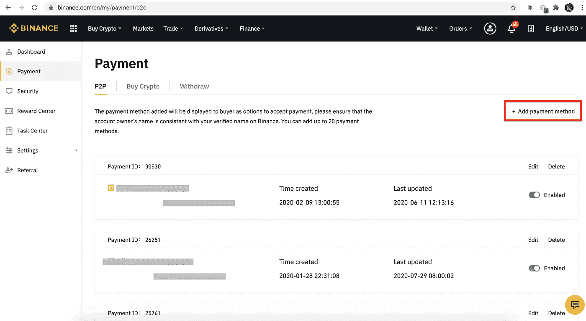

Photo: Binance.com

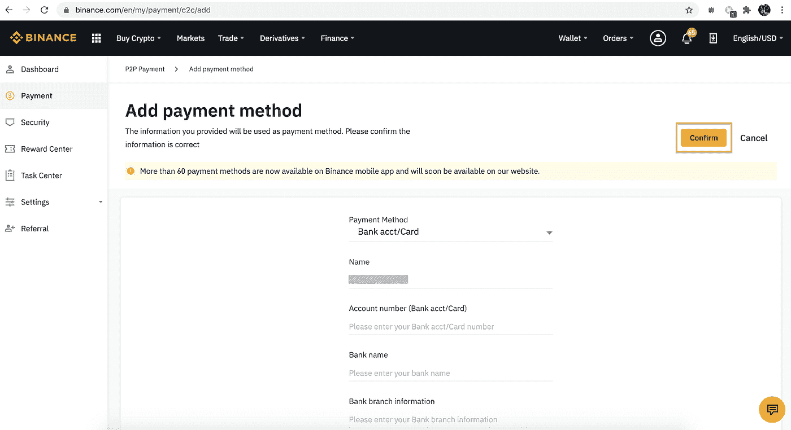

Photo: Binance.com

可以添加 20 多种不同的支付方式。只需启用支付方式，即可开始您的币安 P2P 交易。

**如何在币安 P2P 上销售比特币？**

通过币安 P2P 在印度以印度卢比(印度国家卢比)出售加密货币简单、安全且即时。只需导航到 P2P 交易部分，选择要出售的加密货币和数量，然后执行以下操作:

1.  在[币安](https://accounts.binance.com/en-IN/register?ref=P10U1GSP)(网络或应用)上注册一个账户，并通过验证后，登录你的币安账户。
2.  访问钱包选项卡。将您打算出售的密码转移到您的菲亚特钱包。如果您的菲亚特钱包已经持有加密货币，请访问主页，然后将它们转移到 P2P 交易钱包。
3.  进入“我要出售”标签，然后选择 BTC。通过过滤法定货币的各种可用选项，您将选择 INR。在这样做的时候，不同买家列出的广告会显示给你看。应适当注意贸易限额、数量和各买方提供的付款方式。币安注意到了用户对密码体的担忧。这就是为什么币安在所有 P2P 交易中提供加密货币托管服务，确保用户资金得到保护。
4.  选择 BTC 的目标买家后，点击“出售 BTC”
5.  相对于输入的 BTC 值，指定您将收到的 BTC 金额或印度卢比数量。
6.  选择所需的付款方式，然后点击“出售 BTC”买家将所需资金转入你的付款账户后，请核实资金收据(及金额)。如果收到的金额足够，请点击“确认释放”，批准将 BTC 资金释放到买方账户
7.  订单完成后，将会显示“订单完成”弹出窗口。如果您想验证 BTC 交易，请点击“检查我的帐户”进行 BTC 余额验证。

**如何找到最好的报价？**

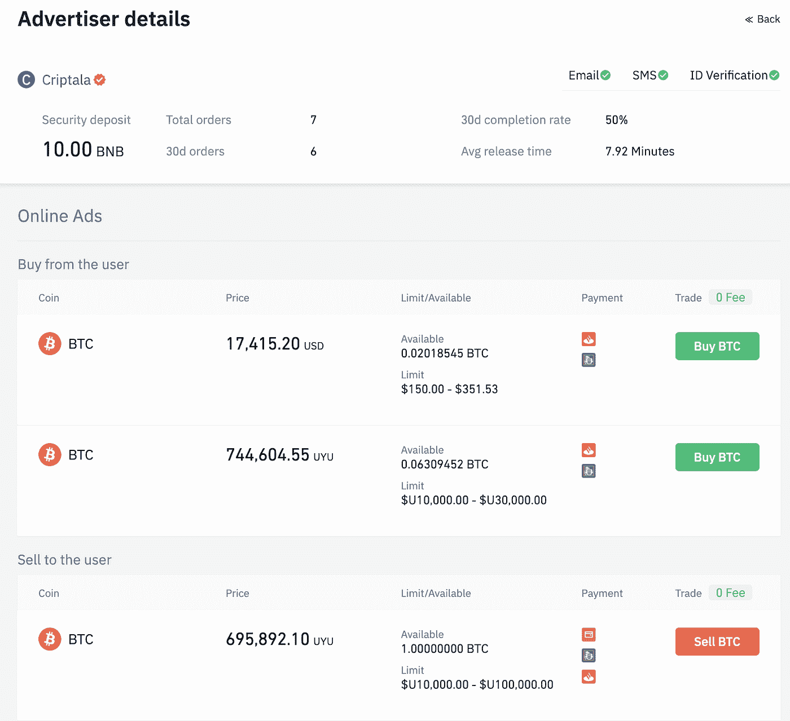

如果你知道在接受报价之前要评估的基本要素，找到最好的币安 P2P 报价是一件容易的事。您应该首先检查用户配置文件中的以下信息:

1.  用户资料和评论。
2.  保证金或托管基金。
3.  总订单或交易数量。
4.  过去 30 天内完成的订单。
5.  在前 30 天内成功启动和完成的事务的百分比。
6.  释放加密所消耗的平均时间。
7.  用户滚动购买和销售的在线广告。
8.  电子邮件、短信和身份验证
9.  检查列出的可用余额信息和对用户施加的限制。你可以在币安 P2P 网站上买卖的比特币的最低和最高金额取决于广告商。

全球币安 P2P [商户](https://www.binance.com/en/support/announcement/360039019631)用户的个人资料会被打上黄色勾号。币安 P2P 上的商户交易员除了在其他平台上证明了自己的交易熟练程度外，还成功通过了深度验证。选择最适合您需求的价格。如果匹配，您可以继续阅读规定的要求，发起交易，并与对方聊天。请记住，在发送加密货币之前，确保您的账户中收到了印度卢比。

**币安 P2P 托管服务**

币安 P2P 的加密货币托管服务旨在保护用户的加密货币资产。在放置广告时，立即从卖方的法定钱包中扣留用于所述广告的加密货币的数量。加密货币领域的托管服务旨在防止卖家接受你的钱但不交付你的加密货币所带来的风险。这种服务还管理卖家不记得按时发布你的密码的事件。在这种情况下，币安的客户服务团队会将资产从卖方的预留资金钱包转移到您的钱包。

***免责声明:*** *本文仅用于教育目的，不应理解为投资建议。*

> 加入 Coinmonks [电报频道](https://t.me/coincodecap)和 [Youtube 频道](https://www.youtube.com/c/coinmonks/videos)了解加密交易和投资

# 另外，阅读

*   [有哪些交易信号？](https://coincodecap.com/trading-signal) | [Bitstamp vs 比特币基地](https://coincodecap.com/bitstamp-coinbase) | [买索拉纳](https://coincodecap.com/buy-solana)
*   [ProfitFarmers 点评](https://coincodecap.com/profitfarmers-review) | [如何使用 Cornix 交易机器人](https://coincodecap.com/cornix-trading-bot)
*   [十大最佳加密货币博客](https://coincodecap.com/best-cryptocurrency-blogs) | [YouHodler 评论](https://coincodecap.com/youhodler-review)
*   [MyConstant Review](https://coincodecap.com/myconstant-review) | [8 款最佳摇摆交易机器人](https://coincodecap.com/best-swing-trading-bots)
*   [MXC 交易所评论](/coinmonks/mxc-exchange-review-3af0ec1cba8c) | [Pionex vs 币安](https://coincodecap.com/pionex-vs-binance) | [Pionex 套利机器人](https://coincodecap.com/pionex-arbitrage-bot)