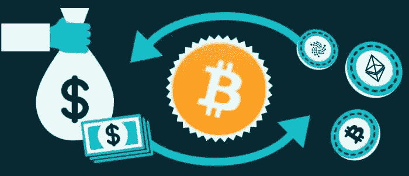

# 如何为奈拉推销比特币

> 原文：<https://medium.com/coinmonks/how-to-sell-bitcoin-for-naira-50d04ec5f90d?source=collection_archive---------40----------------------->

尼日利亚在全球使用比特币的国家中排名第三，因此人们好奇如何出售手中的比特币以换取现金是正常的，因为他们不能直接在银行使用比特币钱包。

要出售你的比特币换取奈拉，你可以使用 P2P 交易平台，或者出售给加密货币交易平台。我们将在本文中进一步解释这两种方法，并给出一种方法优于另一种方法的观点。

## **点对点交换**

peer to peer exchange

对等加密交换指的是各方之间的数字货币(加密货币)的直接交换，不涉及中央机构。在尼日利亚的政府禁令之后，人们最初转向 P2P 交换系统来出售和购买加密货币，然而，更有利可图的媒介(加密交换平台)的发展消除了 P2P 交换系统的不足，并提供了更可靠的平台。

要使用 P2P 交易系统，你必须在一定程度上精通技术。你必须能够区分有利和不利的提议。

你不是直接向 p2p 平台销售，而是向另一个愿意为你的比特币支付特定金额的用户销售，P2P 平台是你和买家之间的联系点。他们是 P2P 平台上的许多合法买家，但他们也是想骗取你比特币的坏人。因此，即使你找到了一个合法的 P2P 平台，如果你在交易时不够谨慎，你仍然会被骗。

你得对 P2P 系统了解到一个合理的程度，才能使用它。例如，你的比特币有不同的价格，你必须知道如何获得一笔好交易，才能获得有利可图的交易体验。

有一些 P2P 交换平台你可以试试喜欢；

*   雷米塔诺
*   币安
*   Paxful
*   加密本地
*   OKEx
*   布洛克维拉
*   位阀
*   Redeeem
*   本地比特币
*   Coincola

## **加密货币交易平台**

Exchange Bitcoin for Naira

加密货币交易所是一家允许其用户将加密货币(比特币、以太币、莱特币等)兑换成当地货币奈拉的公司。

如果你的加密钱包里有比特币并且你需要一些现金。你需要做的就是去一家这样的公司，把你的比特币换成钱。

与 P2P 平台相比，加密货币交易平台相对更容易使用和导航。在这些交易平台中，如果不是全部的话，大部分都不涉及技术细节，这就像从网上商店购买产品一样，但在这种情况下，你是卖家。我们将在本文的后半部分解释**如何在加密交易平台**上出售你的比特币。

与 P2P 系统相比，当你决定在加密交易平台上销售时，你是直接向公司销售，没有第三方。如果你选择了正确的平台，这将降低你被骗的概率。

当谈到加密交易平台时，交易市场上有很多这样的平台，似乎很难选择正确的平台，因为一旦你开始与一个不仅合法而且认真对待其业务的平台进行交易，你的加密销售体验将是成功而简单的。有鉴于此，我们建议你将比特币出售给非洲最好的加密交易平台之一 [Dart Africa](https://dartafrica.io/) 。

## **达特非洲；为奈拉出售比特币的最佳平台**

Sell Bitcoin for Naira

Dart Africa 是一个全自动的加密货币交易平台，允许您以尽可能高的价格将比特币出售给 naira。在进行任何交易之前，要获得你的比特币的奈拉价值，请使用[达特非洲汇率计算器](https://dartafrica.io/coincalculator)。

要出售你的比特币，你必须首先[在 Dart Africa 上创建一个账户](https://dartafrica.io/register)。确保使用有效的电子邮件地址和电话号码。只需这个账户，你就可以出售你的比特币或平台上列出的任何其他加密货币。

有了 Dart Africa，您将享受到确保最快支付时间的自动支付系统、全天候客户服务来满足您关于平台的所有需求，以及更多。 [Dart Africa](http://dartafrica.io) ，关注客户信息和资金的安全，因此他们的网站配备了惊人的安全功能来确保这一点。

## **如何在 Dart Africa 这样的加密交易平台上出售你的比特币**

按照以下步骤出售您的比特币:

*   [使用您的正确信息在 Dart Africa 上注册](https://dartafrica.io/register)。
*   单击工具栏图标(左上角的三条垂直直线)。您将在您的帐户面板上看到此信息。
*   点击出售硬币。
*   在硬币栏中选择 BTC 作为您的首选硬币选项。
*   输入你要出售的 BTC 的数量，相应的美元和奈拉的数量将显示在列中。注意:你可以出售的 BTC 或任何加密货币的最低美元价格是 20 美元。
*   点击立即出售硬币。
*   将提供一个钱包地址和一个 QR 码。您可以通过手动输入地址或扫描二维码发送您在上述步骤中选择的 BTC 金额。付款被确认后，你将立即被记入贷方。

> 加入 Coinmonks [电报频道](https://t.me/coincodecap)和 [Youtube 频道](https://www.youtube.com/c/coinmonks/videos)了解加密交易和投资

# 另外，阅读

*   [Botsfolio vs nap bots vs Mudrex](/coinmonks/botsfolio-vs-napbots-vs-mudrex-c81344970c02)|[gate . io 交流回顾](/coinmonks/gate-io-exchange-review-61bf87b7078f)
*   [CoinFLEX 评论](https://coincodecap.com/coinflex-review) | [AEX 交易所评论](https://coincodecap.com/aex-exchange-review) | [UPbit 评论](https://coincodecap.com/upbit-review)
*   [AscendEx 保证金交易](https://coincodecap.com/ascendex-margin-trading) | [Bitfinex 赌注](https://coincodecap.com/bitfinex-staking) | [bitFlyer 审核](https://coincodecap.com/bitflyer-review)
*   [Bitget 评论](https://coincodecap.com/bitget-review) | [双子星 vs BlockFi](https://coincodecap.com/gemini-vs-blockfi) cmd| [OKEx 期货交易](https://coincodecap.com/okex-futures-trading)
*   [AscendEx Staking](https://coincodecap.com/ascendex-staking)|[Bot Ocean Review](https://coincodecap.com/bot-ocean-review)|[最佳比特币钱包](https://coincodecap.com/bitcoin-wallets-india)