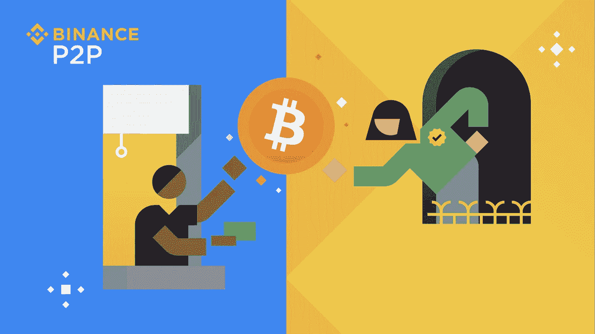
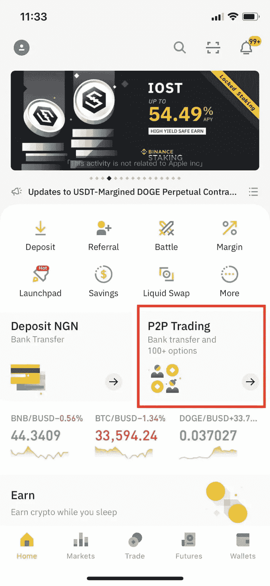
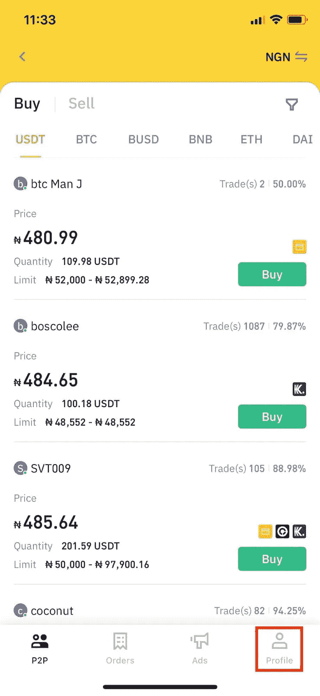
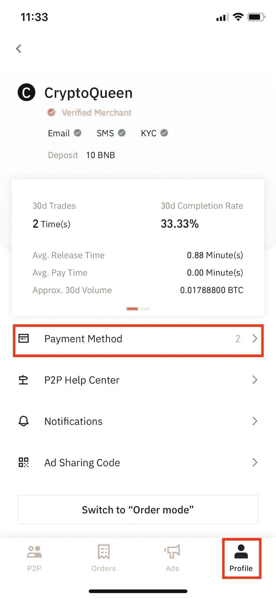
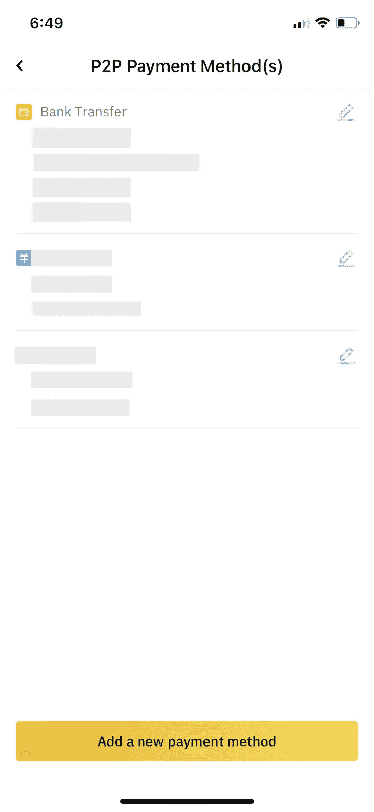

# 如何在尼日利亚卖比特币给奈拉

> 原文：<https://medium.com/coinmonks/how-to-sell-bitcoin-for-naira-in-nigeria-72d0ff27a2be?source=collection_archive---------18----------------------->

[https://p2p.binance.com/ZCF73TU7](https://p2p.binance.com/ZCF73TU7)

出于众所周知的原因，我们大多数人都不得不在某个时候卖掉房产。现在，销售可能发生在实体或网上，甚至两者都有。你同意在网上卖东西让我们有点怀疑，对吗？好吧，当你在尼日利亚把你的比特币卖给奈拉时，你没什么好担心的。几年前联邦政府对加密货币的禁令使许多企业陷入瘫痪，甚至让一些企业非常难过。幸运的是，为了进一步帮助加密货币的顺利买卖，币安推出了 P2P(点对点)技术。随着时间的推移，币安 P2P 已被证明是尼日利亚奈拉在其他加密货币中销售比特币的最佳平台。

## 币安 P2P 的优势

以下是币安 P2P 成为尼日利亚奈拉出售比特币的最佳选择的几个原因

1.  没有交易费:你会想到像这样好的服务会让你付出一些代价。一点也不。在币安 P2P 上交易产生零费用，这是为了让你可以享受你的全部收益而不用担心费用。
2.  托管服务:每笔币安 P2P 交易都涉及托管服务保护，这可以确保交易中的每一方都不会受到任何恶意行为的影响。

> 除此之外，还有其他优势，如:多种支付方式和法定货币，良好的本地和全球市场等等。

## 如何在币安 P2P 上添加新的支付方式

*   为了开始在币安 P2P 上交易，你必须有一个账户，并完成 KYC 验证。[如果您还未注册，请注册一个免费的币安账户](https://www.binance.com/en/buy-sell-crypto?ref=ZCF73TU7)
*   在首页点击 **P2P 交易** > > > **简介**

[https://p2p.binance.com/ZCF73TU7](https://p2p.binance.com/ZCF73TU7)

[https://p2p.binance.com/ZCF73TU7](https://p2p.binance.com/ZCF73TU7)

*   点击**付款方式** > > > **添加新的付款方式**

[https://p2p.binance.com/ZCF73TU7](https://p2p.binance.com/ZCF73TU7)

[https://p2p.binance.com/ZCF73TU7](https://p2p.binance.com/ZCF73TU7)

*   从所有可用的付款选项中选择一种首选付款方式，然后单击输入您的详细付款信息。然后点击**确认**。

# 如何用银行转账在币安 P2P 上卖比特币

> 出售比特币可能是一次美妙的经历，因为很多卖家都在那里，但是，有一些事情需要注意…

如果你是点对点交易的新手，你可能会对选择哪一个报价感到困惑，因为报价太多了。不要烦恼！找到最好的报价就像 P-2-P 一样简单。首先要知道你想卖多少比特币，比如你想卖 2 BTC，你可能要注意那些在你的范围内出售的比特币(如果你无法找到范围，你可以在过滤框中输入数量，它会马上弹出来！).还要查看你感兴趣的每个买家可以交易的比特币的最大和最小金额。

在币安 P2P 上，点击昵称就可以看到买家的活动。买家档案包含以下信息:

*   ***订单总数:*** 这是成交的总笔数
*   ***30d 订单*** :这是买家在最近 30 天内完成的交易数量
*   ***30d 完成率:*** 这是买方在过去 30 天内成功启动并完成的交易的百分比
*   ***平均发布时间*** :这是买方发布密码通常需要的时间
*   ***在线广告:*** 这些是买家在网上提供的买卖要约

经过不同的配置文件，选择最适合你的价格。在进行任何交易之前，确保检查要求，这是为了避免你和买家之间的任何争论。一旦你对要求感到满意，你就可以开始交易了。有一个聊天框，供你和买家在交易过程中进行对话。

当买家最终将奈拉发送到你的银行账户时，请确保在点击释放之前检查你的银行应用程序或交易历史，以验证钱确实已经进入。如果验证结果是肯定的，点击**释放，将比特币释放给卖家。**如果核实结果为否定，立即通知买方。大多数时候，当你还没有收到银行账户中的 naira 时，这可能是由于网络问题，所以当你没有立即看到银行账户中的资金时，需要一点耐心。

你可能会怀疑，如果我被骗了怎么办？嗯，币安 P2P 上的所有买家和卖家都是由币安验证的。除此之外，币安 P2P 托管服务确保你要出售的比特币不会到达买家手中，直到你可以确认你确实收到了你银行账户中的奈拉……将他们视为某种裁判，使事情变得公平和安全。

总之，在币安 P2P 网站上出售你的比特币换取奈拉将是你能采取的最佳选择。为什么你今天不试一试呢？[https://p2p.binance.com/ZCF73TU7](https://p2p.binance.com/ZCF73TU7)

今天就在 https://www.binance.com/en/buy-sell-crypto?ref=ZCF73TU7 创建一个免费的币安账户

> *加入 Coinmonks* [*电报频道*](https://t.me/coincodecap) *和* [*Youtube 频道*](https://www.youtube.com/c/coinmonks/videos) *了解加密交易和投资*

# 另外，阅读

*   [3 商业评论](/coinmonks/3commas-review-an-excellent-crypto-trading-bot-2020-1313a58bec92) | [Pionex 评论](https://coincodecap.com/pionex-review-exchange-with-crypto-trading-bot) | [Coinrule 评论](/coinmonks/coinrule-review-2021-a-beginner-friendly-crypto-trading-bot-daf0504848ba)
*   [莱杰 vs n 格拉夫](/coinmonks/ledger-vs-ngrave-zero-7e40f0c1d694) | [莱杰纳诺 s vs x](/coinmonks/ledger-nano-s-vs-x-battery-hardware-price-storage-59a6663fe3b0) | [币安评论](/coinmonks/binance-review-ee10d3bf3b6e)
*   [Bybit Exchange 审查](/coinmonks/bybit-exchange-review-dbd570019b71) | [Bityard 审查](https://coincodecap.com/bityard-reivew) | [Jet-Bot 审查](https://coincodecap.com/jet-bot-review)
*   [3 commas vs crypto hopper](/coinmonks/3commas-vs-pionex-vs-cryptohopper-best-crypto-bot-6a98d2baa203)|[赚取加密利息](/coinmonks/earn-crypto-interest-b10b810fdda3)
*   最好的比特币[硬件钱包](/coinmonks/hardware-wallets-dfa1211730c6) | [BitBox02 回顾](/coinmonks/bitbox02-review-your-swiss-bitcoin-hardware-wallet-c36c88fff29)