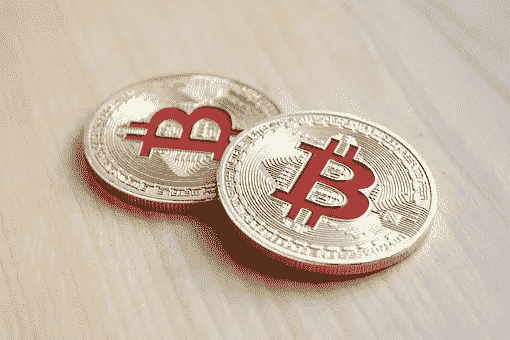

# 加密禁令后如何在尼日利亚出售比特币

> 原文：<https://medium.com/coinmonks/how-to-sell-bitcoin-in-nigeria-after-crypto-ban-1c0dda8035dc?source=collection_archive---------40----------------------->

## 自从去年早些时候尼日利亚禁止与加密相关的活动以来，尼日利亚加密领域的加密活动有所减少。禁令导致对加密货币和区块链技术感兴趣的尼日利亚人的兴趣和活动减少。

然而，尽管有禁令，一些尼日利亚人仍继续通过其他方式投资加密货币和区块链技术。例如，一些尼日利亚人转向在线加密货币交易所，在那里他们可以买卖加密货币而不会被政府抓住。此外，一些尼日利亚人正在使用虚拟专用网络(VPN)访问提供加密货币和区块链相关服务的外国网站。尽管尼日利亚的加密活动有所减少，但它仍然是非洲最活跃的加密领域之一，越来越多的初创公司和投资者对这项新技术感兴趣。

尼日利亚有几家比特币交易所，允许用户买卖比特币。在尼日尼亚可以出售比特币的地方包括 LocalBitcoins.com、Paxful、Dart Africa、Kucoin、Quidax 和币安。
人们出于各种原因出售他们的加密资产。主要原因是因为现金通常比加密货币更容易获得，人们可能更愿意使用它进行交易。此外，其他人将他们的加密货币交易为现金，因为他们担心价格可能会下跌，他们希望在价格下跌之前将其持有的货币取出。

然而，Dart Africa 是领先的加密货币交易平台，在尼日利亚和加纳销售各种类型的加密货币。用户可以出售比特币、以太坊、莱特币、BNB 和其他替代币。Dart Africa 提供用户友好的界面和专业的客户服务。该平台易于使用和导航，使其成为那些希望出售其密码以获取现金的人的理想选择。

**与 Dart Africa 进行交易的简单步骤；**

*   访问 [dartafrica.io](http://dartafrica.io) 或下载移动应用程序创建帐户。这款移动应用可以在 app stores 上下载，任何拥有智能手机的人都可以使用。
*   首次登录时，创建您的 PIN。PIN 可作为您将来授权取款时的签名。
*   将您的银行信息保存在您的帐户上。重要的是在你的账户上保存你的银行信息，以备不时之需。这包括账号和银行名称。
*   在您的帐户面板上选择您想要出售的加密货币，并输入详细信息。Dart Africa 上可交易的加密货币包括:比特币、以太坊、莱特币、多格币、戴、、和。
*   将硬币发送到系统提供的钱包中。事后，等待付款；通常在确认后几分钟内。Dart Africa 不仅是付款最快的交易所之一，还拥有全天候的支持团队来帮助您解决任何问题。

总之，如果你想把你的比特币兑换成奈拉，那么 Dart Africa 是你的最佳选择。

> 加入 Coinmonks [电报频道](https://t.me/coincodecap)和 [Youtube 频道](https://www.youtube.com/c/coinmonks/videos)了解加密交易和投资

# 另外，阅读

*   [BigONE 交易所点评](/coinmonks/bigone-exchange-review-64705d85a1d4) | [电网交易 Bot](https://coincodecap.com/grid-trading)
*   [氹欞侊贸易评论](https://coincodecap.com/anny-trade-review) | [CoinSpot 评论](https://coincodecap.com/coinspot-review)
*   [新加坡十大最佳加密交易所](https://coincodecap.com/crypto-exchange-in-singapore) | [购买 AXS](https://coincodecap.com/buy-axs-token)
*   [投资印度的最佳加密软件](https://coincodecap.com/best-crypto-to-invest-in-india-in-2021) | [WazirX P2P](https://coincodecap.com/wazirx-p2p)
*   [西班牙 5 大最佳文案交易平台](https://coincodecap.com/copy-trading-spain)
*   [Pionex 双重投资](https://coincodecap.com/pionex-dual-investment) | [AdvCash 审查](https://coincodecap.com/advcash-review) | [支持审查](https://coincodecap.com/uphold-review)
*   [面向开发者的 8 个最佳加密货币 API](https://coincodecap.com/best-cryptocurrency-apis)