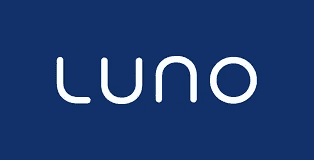

# 如何在尼日利亚的 Luno 上卖比特币

> 原文：<https://medium.com/coinmonks/how-to-sell-bitcoin-on-luno-in-nigeria-99fc657cb26e?source=collection_archive---------32----------------------->

Luno 使存储、购买、使用和学习比特币等数字货币变得安全而简单。Luno 是数字货币集团(DCG)的独立运营子公司。

数字货币集团旨在加速更好的金融体系的发展。他们利用自己的网络、洞察力和资本渠道，创建并支持区块链和数字货币公司。DCG 一直是数字货币行业最活跃的投资者，投资了 30 个不同国家的约 130 家公司，包括 CoinDesk、Genesis 和 Foundry 等市场领导者。

你现在可以用你的当地货币(奈拉)在 Luno 上买卖比特币和其他加密货币。2021 年 5 月，当尼日利亚央行禁止所有加密货币活动时，Luno 停止了在奈拉的交易，Luno 在 2021 年 11 月使用新的支付技术重新开放了与尼日利亚的交易。

## **如何在尼日利亚的 Luno 上卖比特币？**

在 Luno 上出售比特币和其他加密资产非常容易，但首先，如果你没有账户，你需要在 Luno 上注册一个账户。您必须将您的 Luno 帐户验证到 2 级，才能使用凭单在 Luno 上提款。

然后在你的 Luno 钱包里把你的比特币兑换成 Naira，把 Naira 里的资金取出来。

**打开你的 NGN 钱包，选择取款**

*   选择**创建凭证**按钮，输入您想要提取的奈拉金额，然后选择下一步
*   你会看到你的取款金额和取款费用。选择**确认。**
*   如果您正在使用移动应用程序，请输入您的 Luno **PIN** 。您的优惠券详情将发送到您的 Luno 电子邮件和电话号码
*   选择**兑换优惠券**按钮，然后选择您希望资金汇入的银行账户。
*   输入您之前收到的优惠券号码，然后选择**兑换优惠券。**
*   最后，输入通过电子邮件和短信发送的六位数代码。

**谨记:**

*   您必须使用尼日利亚电话号码来兑现您的优惠券。
*   在兑现优惠券之前，请确保您的银行帐户有效，并且银行帐户的交易限额足以支持您的优惠券金额

你也可以在当地的交易平台上出售你的比特币，比如 Dart Africa。Dart Africa 是在尼日利亚和加纳运营的领先本地交易平台，它们以惊人的汇率和快速的支付时间而闻名。当你想在 Dart Africa 上出售你的比特币时，你不需要兑换凭证，你只需将你的比特币发送到平台上提供的钱包地址，等值的奈拉就会被发送到你的账户。在进行任何交易之前，使用其平台上的[硬币计算器](https://dartafrica.io/coincalculator)功能来检查你的比特币的奈拉值。

您可以通过网站或手机应用程序访问他们的服务。Dart 非洲移动应用程序可在谷歌 Play 商店和应用程序商店。

## **如何在 Dart Africa 上出售你的比特币**

–要在 Dart Africa 上进行交易，您必须在他们那里有一个账户。确保在创建帐户时使用正确的凭据，或者如果您已经有帐户，只需登录即可。使用发送到您电子邮件的验证邮件来验证您的帐户。

–首次登录您的帐户时，系统会要求您创建一个 PIN，请确保您选择了一个您能记住的 PIN。将来当您想从 Dart Africa 帐户提取资金到您的银行帐户时，将使用此 PIN。

–将您的银行帐户详细信息添加到 Dart Africa 帐户的帐户列表中。

–点击出售硬币，选择比特币作为您的首选兑换硬币，并输入您想要出售的金额，奈拉值将使用当前汇率显示。

–点击开始交易，他们的系统将自动创建一个带有条形码的钱包地址，将比特币发送到该地址，资金将在 2 次批量确认后发送到 Dart Africa 帐户。请注意，您可以向提供的钱包地址发送任何金额，他们的系统将根据收到的金额为您存款。

—在您的 Dart Africa 帐户被贷记后，您可以将资金提取到您的银行帐户。

> 加入 Coinmonks [电报频道](https://t.me/coincodecap)和 [Youtube 频道](https://www.youtube.com/c/coinmonks/videos)了解加密交易和投资

# 另外，阅读

*   最好的比特币[硬件钱包](/coinmonks/hardware-wallets-dfa1211730c6) | [BitBox02 回顾](/coinmonks/bitbox02-review-your-swiss-bitcoin-hardware-wallet-c36c88fff29)
*   [BlockFi vs Celsius](/coinmonks/blockfi-vs-celsius-vs-hodlnaut-8a1cc8c26630)|[Hodlnaut 点评](/coinmonks/hodlnaut-review-best-way-to-hodl-is-to-earn-interest-on-your-bitcoin-6658a8c19edf) | [KuCoin 点评](https://coincodecap.com/kucoin-review)
*   [Bitsgap 审查](/coinmonks/bitsgap-review-a-crypto-trading-bot-that-makes-easy-money-a5d88a336df2) | [Quadency 审查](/coinmonks/quadency-review-a-crypto-trading-automation-platform-3068eaa374e1) | [Bitbns 审查](/coinmonks/bitbns-review-38256a07e161)
*   [密码本交易平台](/coinmonks/top-10-crypto-copy-trading-platforms-for-beginners-d0c37c7d698c) | [Coinmama 审核](/coinmonks/coinmama-review-ace5641bde6e)
*   [印度的加密交易所](/coinmonks/bitcoin-exchange-in-india-7f1fe79715c9) | [比特币储蓄账户](/coinmonks/bitcoin-savings-account-e65b13f92451)
*   [OKEx vs KuCoin](https://coincodecap.com/okex-kucoin) | [摄氏替代品](https://coincodecap.com/celsius-alternatives) | [如何购买 VeChain](https://coincodecap.com/buy-vechain)