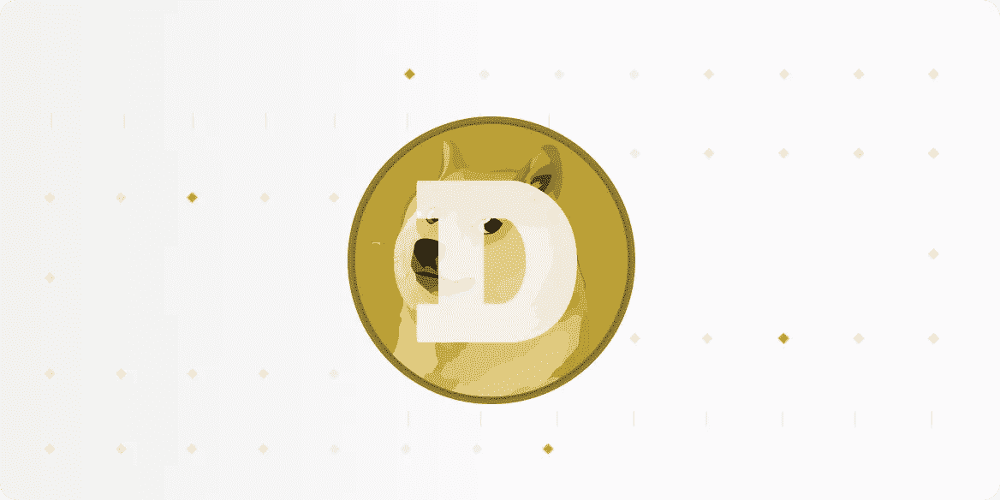

# 如何为加纳 Cedis 销售 Dogecoin

> 原文：<https://medium.com/coinmonks/how-to-sell-dogecoin-for-ghana-cedis-8e523dbc4f09?source=collection_archive---------65----------------------->

Dogecoin 可以说是加密领域最受欢迎的迷因币。Dogecoin 最初是作为一个对密码狂热者的无忧无虑的玩笑而开发的，它的名字来自一个流行的迷因。

Dogecoin 是由两位软件工程师杰克逊·帕尔默和比利·马库斯在 2013 年末创建的。Dogecoin 标志是杰克逊用当时一个流行的迷因来命名的，其中有一个故意拼错的单词“doge ”,用来描述一只柴犬。

Bitwave 的首席执行官帕特·怀特(Pat White)说:“Doge 开始拿比特币开涮了”。在早期，一个支持者社区安排了一些特技来提高 Dogecoin 的公众形象，比如筹集资金将有舵雪橇队从牙买加送到 2014 年奥运会，以及赞助一名 NASCAR 车手。

2021 年初，Dogecoin 通过各种渠道在 Reddit 上获得了巨大的收益，有些达到了神秘的程度，这是受欢迎的 WallStreetBets 留言板——1 月份 GameStop 事件背后的主要煽动者——爱好者承诺将它的价值“推向月球”(这是在 subreddit 上禁止所有关于加密的讨论之前)

Dogecoin 的价格在 2021 年 5 月升至 0.68 美元的历史高点，而今年年初的价格还不到 1 美分。特斯拉首席执行官埃隆·马斯克在声称 Dogecoin 是他最喜欢的加密货币后，对价格的大幅上涨负有部分责任。截至 2021 年年中，Dogecoin 是市值排名前五的加密货币之一。

自那以来，Dogecoin 的价格一直在下跌，在 2022 年 3 月跌至 0.11 美元的最低点，然而，Dogecoin 仍是市值最高的 20 种加密货币之一。

# Dogecoin 是如何工作的？

像大多数加密货币一样，Dogecoin 有其专用的区块链。与其他区块链一样，Dogecoin 的数字账本会随着所有新交易不断更新，网络使用加密工具来确保所有交易的安全。

在 Dogecoin 的区块链上使用了工作共识机制的证明，矿工使用复杂的计算机软件来解决复杂的数学方程，以处理交易并将其存储在区块链上。作为支持区块链的交换，采矿者可以获得额外的 Dogecoin，然后他们可以持有这些 Dogecoin 或者在公开市场上出售。

Dogecoin 可能有利于处理购物付款，但是，它不是一种有效的价值储存手段。这主要是因为采矿可能创造的 Dogecoin 的总可能供应量没有限制——这意味着加密货币在设计上是高度通货膨胀的。

区块链通过每天制造数百万新的 Dogecoin 来支付矿工的工作，这使得 Dogecoin 的投机价格增长很难长期保持下去。

# **如何出售 Dogecoin**

How to Sell DogeCoin

有各种方法来出售你的加纳密码，你可以使用一个交换平台，如币安，比特币基地和其他国家或点对点密码交换平台。在这篇文章中，我们建议你把你的狗币卖给当地的交易平台。这在很大程度上是因为您将享受当地汇率带来的有利汇率。

在加纳有很多本地的交流平台，但是似乎没有一个能比得上 Dart Africa 的服务。一个加密交易平台，以创新的方式处理加密资产的交易。

Dart 非洲的特点:

*   **全自动化**

在 Dart Africa，出售您的 Dogecoin 和其他加密货币来换取现金非常简单。将你的 Dogecoin 兑换成当地货币(加纳塞地)的过程已经被简化，以符合专业人士和新手的要求。一旦您加密交易被确认，资金将立即支付。

*   **惊人的利率**

Dart Africa 是在加纳交易加密货币的最佳平台之一，因为您将享受惊人的利率。众所周知，Dart Africa 提供最友好的客户利率，这是为了确保您的加密交易的回报始终是高的，对您有利。您可以使用他们的[硬币计算器](https://dartafrica.io/coincalculator)功能来查看 Dogecoin 的当前汇率。

*   **担保**

您的数据和与 Dart Africa 的交易将享有 100%的安全性。他们的平台(移动应用和网站)有一个全方位的防火墙，有助于保持您的信息和帐户的安全和完整。在[谷歌 Play 商店](https://play.google.com/store/apps/details?id=com.dartafrica)和 App Store 下载他们的手机应用。

## 简单地卖掉你的狗换钱；

*   在 Dart Africa 上创建并设置一个帐户，如果您已经有帐户，请登录
*   导航到交易界面，选择 Dogecoin 作为您的首选加密货币。
*   通过手动输入钱包上的地址或扫描提供的条形码，将 Dogecoin 发送到系统提供的钱包地址。
*   在你的 Dart Africa 账户被存入后，将资金汇至你当地的加纳账户。

> 加入 Coinmonks [电报频道](https://t.me/coincodecap)和 [Youtube 频道](https://www.youtube.com/c/coinmonks/videos)了解加密交易和投资

# 另外，阅读

*   [Bookmap 点评](https://coincodecap.com/bookmap-review-2021-best-trading-software) | [美国 5 大最佳加密交易所](https://coincodecap.com/crypto-exchange-usa)
*   最佳加密[硬件钱包](/coinmonks/hardware-wallets-dfa1211730c6) | [Bitbns 评论](/coinmonks/bitbns-review-38256a07e161)
*   [新加坡十大最佳加密交易所](https://coincodecap.com/crypto-exchange-in-singapore) | [购买 AXS](https://coincodecap.com/buy-axs-token)
*   [红狗赌场评论](https://coincodecap.com/red-dog-casino-review) | [Swyftx 评论](https://coincodecap.com/swyftx-review) | [CoinGate 评论](https://coincodecap.com/coingate-review)
*   [投资印度的最佳密码](https://coincodecap.com/best-crypto-to-invest-in-india-in-2021)|[WazirX P2P](https://coincodecap.com/wazirx-p2p)|[Hi Dollar Review](https://coincodecap.com/hi-dollar-review)
*   [加拿大最佳加密交易机器人](https://coincodecap.com/5-best-crypto-trading-bots-in-canada) | [库币评论](https://coincodecap.com/kucoin-review)