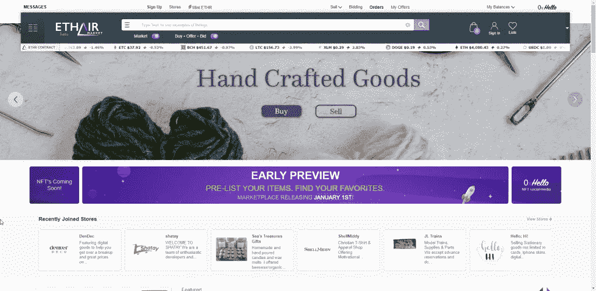
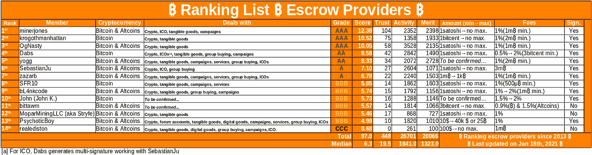

# 比特币怎么卖物品？

> 原文：<https://medium.com/coinmonks/how-to-sell-items-for-bitcoin-d3302a5cf2b6?source=collection_archive---------24----------------------->

借助区块链电子支付的低廉成本，在互联网上用比特币出售你的物品并不困难。这篇文章的目的是给初涉加密市场的新手一些入门技巧和最新资源。

# 用比特币销售是如何运作的？

用比特币出售物品就像你在 Ethair、Craigslist 或易贝等网站上用现金、PayPal 或其他形式出售物品一样。你张贴一个描述你卖的东西的列表，感兴趣的买家就会出价或出价。

# 最安全的比特币销售方式(提示:托管服务)

用比特币交易一件物品时，通常会有一方先承担风险。最安全的做法是使用第三方托管服务。考虑到这一点，这种服务可以从收入中抽取一定百分比，或者收取列出/使用其服务的费用。总的来说，它有助于保护买家和卖家免受骗子的伤害，因为一个中立的第三方处理资金和解决纠纷。此外，大多数买家和卖家在与新人交易时通常会坚持使用托管服务。

# 保管暨代付款服务如何运作？

托管服务通常有一个简单的流程:

1.  买方将所需金额存入第三方托管服务指定的地点。
2.  保管暨代付款服务会通知卖家，资金已经存入。
3.  卖家将物品运送或交付给买家。
4.  买家收到物品后，会检查物品，并向保管暨代付款服务确认一切正常
5.  保管暨代付款服务将资金交给卖家。

如果在此过渡期内出现任何问题，买方或卖方可以提出争议(例如，买方声称物品从未送达，不符合描述或损坏)，托管服务将介入解决此争议。对于销售者，建议他们始终对出售的物品进行完整的记录证明，表明他们已经按照最初的描述提供了物品。

*   在装运或交付之前，对物品状况进行拍照。
*   确保有一个照片或视频证据的项目包装交付。
*   始终使用有跟踪号码的运输服务，如果可能的话，要求在交货时签名。

# 在网上哪里卖比特币

# 1.[et air 市场](https://www.ethair.com/)

在 [Ethair](https://www.ethair.com/) 上，你可以使用托管服务购买或出售物品，它不仅仅限于比特币，还扩展到多种加密货币，同时支持传统现金。有了拍卖和固定价格选项，你有太多的选择。

*   使用托管服务的平台费用最高为 8%(25%以“积分”的形式报销)
*   没有刊登费，也没有上传物品数量的限制。
*   带条纹的 KYC 是强制性的，降低了欺诈率。

# 2. [Bitcointalk 市场](https://bitcointalk.org/)

在 Bitcointalk 市场上，你可能会发现最近的托管[线程](https://bitcointalk.org/index.php?topic=276897.0)，在那里你可能会找到代表你充当托管代理的用户，并收取一定比例的费用作为利润。
使用本服务风险自负！

# 3.Multisig 钱包( [IBCGroup](https://ibcgroup.io/services/ilo-financial/#escrow-services) 和 [Bitrated](https://www.bitrated.com/) )

这些不是托管服务，而是 [multisig 技术](https://en.bitcoin.it/wiki/Multi-signature)服务。使用多签名选项，资金可以通过该选项转移。像 Bitrated 这样的平台允许买家和卖家在作为仲裁者的可信代理的帮助下进行加密货币的商品交换。仲裁者会对他们的服务收取一定的费用，如果双方同意交易，就不需要他们的服务。

> *加入 Coinmonks* [*电报频道*](https://t.me/coincodecap) *和* [*Youtube 频道*](https://www.youtube.com/c/coinmonks/videos) *了解加密交易和投资*

# 另外，阅读

*   [3 商业评论](/coinmonks/3commas-review-an-excellent-crypto-trading-bot-2020-1313a58bec92) | [Pionex 评论](https://coincodecap.com/pionex-review-exchange-with-crypto-trading-bot) | [Coinrule 评论](/coinmonks/coinrule-review-2021-a-beginner-friendly-crypto-trading-bot-daf0504848ba)
*   [Bitsgap 审查](/coinmonks/bitsgap-review-a-crypto-trading-bot-that-makes-easy-money-a5d88a336df2) | [Quadency 审查](/coinmonks/quadency-review-a-crypto-trading-automation-platform-3068eaa374e1) | [Bitbns 审查](/coinmonks/bitbns-review-38256a07e161)
*   [密码本交易平台](/coinmonks/top-10-crypto-copy-trading-platforms-for-beginners-d0c37c7d698c) | [Coinmama 评论](/coinmonks/coinmama-review-ace5641bde6e)
*   [印度加密交易所](/coinmonks/bitcoin-exchange-in-india-7f1fe79715c9) | [比特币储蓄账户](/coinmonks/bitcoin-savings-account-e65b13f92451)
*   [OKEx vs KuCoin](https://coincodecap.com/okex-kucoin) | [摄氏替代度](https://coincodecap.com/celsius-alternatives) | [如何购买 VeChain](https://coincodecap.com/buy-vechain)
*   [币安期货交易](https://coincodecap.com/binance-futures-trading)|[3 commas vs Mudrex vs eToro](https://coincodecap.com/mudrex-3commas-etoro)