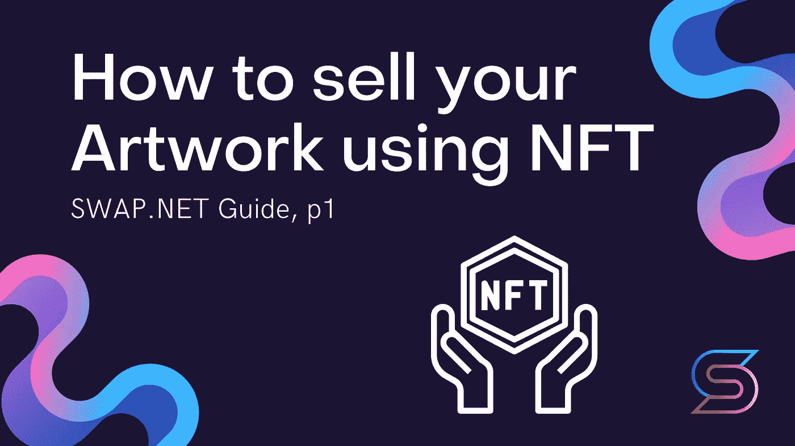
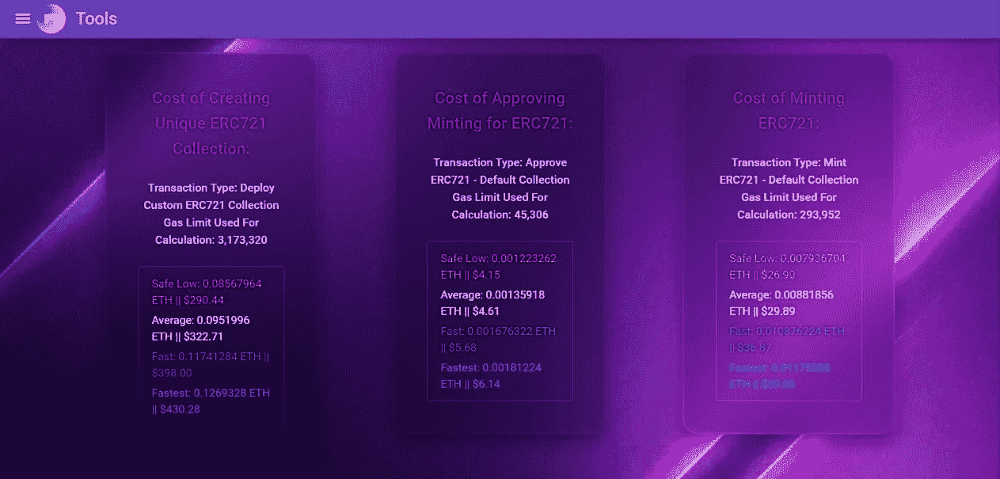

# 如何使用 NFT 出售你的作品

> 原文：<https://medium.com/coinmonks/how-to-sell-your-artwork-using-nft-ac40f6f2be8a?source=collection_archive---------36----------------------->

## 让我们弄清楚什么是 nft，如何使用加密货币钱包，为什么看气体很重要，如何创建 NFT，最后，推广你自己并出售你的艺术品。

NFT 代币极大地简化了买卖数字艺术的过程，让每个人都可以使用它。如果你是一个艺术家/音乐家/剪贴画制作者，等等。，你可以毫无问题地把你的作品卖给任何对它感兴趣的人——NFT 算法会处理整个交易过程。交易只会在你和你的买家之间进行。

NFT——技术允许你向全世界数百万人出售和展示你的作品，而你保留了销售的主要利润。你的作品随后的每一次转售也会给你带来额外的收入。

# NFT 为什么改变行业？

NFT 为任何数字产品增加了许多有用的功能，增加了产品的价值。

*   **真实所有权** —任何人都可以下载 NFT 内容，但只有你会拥有它；
*   **流动性**——在一个地方购买 NFT，你可以在共享生态系统中的另一个地方出售；
*   **多功能** —游戏中的物品以前只在这个游戏中出现。想象一下，如果你现在可以用一个游戏里的剑去砍另一个游戏里的妖精；
*   **可编程性** —任何法律程序、会计和文件都可以写入 NFT 并自动执行。

# 艺术中的 NFT

现在发生在艺术上的事情(多亏了 NFT)可以被称为一场**神秘的文艺复兴**——通常的价值观正在我们眼前发生变化，并反映在艺术中。就像 5 个世纪前一样，一项新技术(当时是书籍印刷，现在是区块链)颠覆了一切。艺术家得到财政支持，这使他们能够依靠他们的艺术生活，并反映当时的现实。

秘密艺术是关于特定的主题、风格、艺术技巧和符号化(记录在 NFT)的作品。秘密艺术是一个独立的艺术方向。

NFT 可编程性允许自动支付版税——你将从你的作品的每一次转售中获得%,不管仲裁者愿意/不愿意支付你。这%将被写入智能合同，并自动附加到您的加密钱包。

## 项目:

*   [**SuperRare**](https://superrare.com/) —首批平台之一；
*   **—顶级密码艺术网站；**
*   **[**基金会**](https://foundation.app/) —年轻预主持精品；**
*   ****—最民主的市集；****
*   ****[**OpenSea**](https://opensea.io/)——NFT 最大的市场，特别是密码艺术；****
*   ****[**Swap.net**](http://swap.net/)——第一个多链 NFT 聚合器。****

## ****著名艺术家:****

*   ****[比尔](https://twitter.com/beeple)****
*   ****[科尔迪](https://twitter.com/coldie)****
*   ****[MBSJQ](https://twitter.com/mbsjq)****
*   ****[Muratpak](https://twitter.com/muratpak)****
*   ****[哈卡陶](https://twitter.com/Hackatao)****
*   ****[费沃修斯](https://twitter.com/fewocious)****

# ****什么是 NFT？****

******NFT** (不可替代令牌)是一种数字加密证书，用它你可以证明你的作品的作者身份和所有权。****

****技术意义上的 NFT 是一个容器，其中放置了一些信息，例如，图形信息(数字艺术等)。).该证书包含关于 NFT 所包含的信息，谁拥有它，NFT 的创建日期，这个人花了多少钱买了这个 NFT，他支付了多少佣金写给区块链和任何其他信息。这些信息使得 NFT 证书(NFT 令牌)与众不同，不像其他令牌，看起来像是字母和数字的集合(关于钱包中令牌数量的加密信息)。****

****例如，如果你想出售一部作品的多份独家拷贝，你的一部作品可以有多份 NFT 的拷贝。****

****我们已经写了技术方面:智能合约和代码 [**这里**](/@NFTSwapnet/constructing-an-erc721-token-contract-b27f9fb02876) 和 [**这里**](/@NFTSwapnet/erc-721-eip-721-and-nft-non-fungible-token-standard-6a083be6f3d4) 。****

****这个证书不能伪造或复制，它像指纹一样独一无二。这就是为什么 NFT 科技使得将数字作品作为真实、有形的艺术品出售成为可能****

## ****区块链基础知识****

****NFT 是你作品的独特象征(证书)。另一方面，令牌是数据库中的记录，其含义是反映交易的事实和/或作为记录的单位。令牌是区块链的必要元素。****

****区块链是一个分布式数据库，将系统参与者的所有交易信息存储为“区块链”。记录(令牌)就存储在这样的注册表中。新块的数据不得与先前块的数据相矛盾，否则它们不会被输入到链中。****

****因为区块链本质上是分散的，这意味着它的所有信息不会存储在一台服务器上，而是同时存储在多台计算机上。这就是为什么区块链能够抵抗黑客攻击和操纵企图，并由于其分布式特性而提供可靠的数据存储，因为要攻击/替换这种注册表中的数据将需要同时访问世界各地的所有 PC。****

****以太坊是一个区块链，可以在上面创造 NFT 代币。这种区块链和比特币区块链的主要区别在于，它不仅能够在分布式注册表中存储数据，还能够执行代码。在以太坊，你可以上传你的程序，它将在网络上的计算机上执行。这个项目叫做智能合同。****

****智能契约可以服务于任何任务，并且是令牌唯一性的保证。另一方面，区块链只是表明这个 NFT 是由某某作者在某某时间创建的(它被记录在数据库中)。最常见的任务之一是服务令牌事务。****

******当有智能合约为令牌服务时，令牌就会出现。**即跟踪令牌所有权，转移和交换令牌，并使用令牌执行任务。****

******您的令牌只是智能合约创建的区块链表中的一个条目。创建令牌就是向该表添加一个新条目。******

****令牌与智能合约密不可分。它不是某个单独存在的单元，它只存在于为它服务的系统中。创建令牌就是向该表添加一个新条目。传输令牌只是执行智能契约中的一个功能，该功能重写所有权表中的数据。****

## ****NFT 是如何运作的****

****NFT 发行的债券被称为“T8 造币厂”。在不同的区块链上创造 NFT 是可能的，最受欢迎的区块链之一是以太坊。也有平台使用自己的区块链和智能合约(币安智能链—币安的区块链/特佐斯—区块链/Flow—NFT 的区块链)。****

****如前所述，智能合约是一个发布和维护令牌的程序。如果我们谈论的是 NFT，智能合约可以执行多种功能，但基本的功能是:**发行 NFT** (mint)和**确认所有权**。****

****此外，随着市场的出现，出现了智能合同，每次转售 NFT 给作者都会自动支付%的版税。****

******维护任何令牌都是根据标准形成的。******

****你可能已经见过这些称呼: **ERC-721 标准令牌，ERC-1155 标准，ERC-998 标准**。****

******这些标准是什么？**虽然被称为 token 标准，但实际上是智能合约的标准。他们为服务于 NFT 的智能合约设定了要求。这些要求描述了智能合约中必须包含哪些功能，以便第三方应用程序(如 OpenSea 之类的交易所)能够以相同的方式处理所有令牌。****

****除此之外，它们只是确保存储哪些令牌属于谁的信息。****

****NFT 只是智能合约表中的一个条目。****

## ****那照片在哪里？****

******NFT =区块链唱片+元数据+媒体******

****现在存在的大多数令牌中的媒体和关于这些媒体的数据不存储在区块链中。****

****在以太坊区块链存储大量数据非常昂贵。例如，即使你只是想在区块链保存你的 NFT 的名字和特征，在 NFT 铸造的时候你也要额外花费 20-30 美元。而且它的每一个特性的改变(比如，如果你改进了它)，也需要输入到区块链，这就意味着要为汽油付费。****

****如何创建一个 [**元掩码钱包**](https://metamask.io/) 我们已经写过了，解释同样的事情毫无意义。最好看看怎么付油钱，怎么给钱包充值。****

# ****如何给你的钱包充值并支付汽油费****

****以太是以太坊网络的区块链货币。****

****要创建你的 NFT，你需要初始资本来支付汽油费(佣金)。这个佣金是从你的加密钱包里扣除的，所以你需要补充。要做到这一点，你需要使用网上的真实货币兑换加密货币或交易所。****

****网上有很多关于如何给你的加密货币充值的说明: [**通过币安交易所**](https://www.binance.com/en/blog/fiat/how-to-buy-bitcoin-with-credit-or-debit-card-on-binance-421499824684901656) **购买。**
使用此兑换购买乙醚后，您需要使用这些指令将加密货币转移到您的 Metamask 钱包— [**将加密货币转移到另一个钱包**](https://www.binance.com/en/support/faq/85a1c394ac1d489fb0bfac0ef2fceafd) **。******

****现在你不仅仅是一个加密钱包的拥有者，而是一个非空加密钱包的拥有者。继续——我们先付汽油费。****

## ****付费天然气****

****新代币的创建伴随着汽油(佣金)的支付。这是将你的令牌写入以太区块链所必需的——没有它你就不能创建你的 NFT。****

****这里有一个非常重要的细微差别:天然气的价格总是不同的。****

****你可以付低价、中价和高价的汽油费。你付的汽油钱越多(你付的价格越高)，你的交易就越快。如果你支付最低的汽油，你的交易可以持续几个月甚至几年。****

****有许多不同的工具可以用来理解现在发行一张 NFT 有多贵。我们来分解其中一个为例:[**gravityenterprises.co**](https://tools.gravityenterprises.co.za/#/Cost)是一个给你显示汽油推荐价格的工具。如果你现在被要求支付一大笔汽油费，等到价格降到推荐价格。****

********

*   ******创建您的收藏(部署收藏)交易******

****收藏是一种文件夹，您可以在其中创建和存储所有的 NFT。例如:一个表情集合，其中每个表情都被创建为一个单独的 NFT。****

*   ******确认您打算向区块链写信的交易(批准)******
*   ******记录您在区块链(造币厂)创建 NFT 的交易******

****如果您在市场集合中创建了一个 NFT(Rarible 有一个同名的集合)，您只需支付第二次和第三次交易。如果你建立自己的收藏，你支付所有 3 笔交易。****

****[**以太扫描**](https://etherscan.io/gastracker) —当前天然气的最低、平均和最高价格。如果最小值超过 200 gwei —关闭并等待，直到最小值不超过 140。****

# ****在下一篇文章中，我们将简要介绍艺术家可以放置作品的市场****

# ****交换。网队
官网—【https://swap.net/】
推特—[https://twitter.com/NFTSwapnet](https://twitter.com/NFTSwapnet)
不和—[https://t.co/uzz0Qt12tf](https://t.co/uzz0Qt12tf)
中—[https://medium.com/@NFTSwapnet](/@NFTSwapnet)
Docs&白皮书—[http://docs.swap.net](https://t.co/5qc7Mxt2p5)****

> ****加入 Coinmonks [电报频道](https://t.me/coincodecap)和 [Youtube 频道](https://www.youtube.com/c/coinmonks/videos)了解加密交易和投资****

# ****另外，阅读****

*   ****[CoinFLEX 评论](https://coincodecap.com/coinflex-review) | [AEX 交易所评论](https://coincodecap.com/aex-exchange-review) | [UPbit 评论](https://coincodecap.com/upbit-review)****
*   ****[AscendEx 保证金交易](https://coincodecap.com/ascendex-margin-trading) | [Bitfinex 赌注](https://coincodecap.com/bitfinex-staking) | [bitFlyer 审核](https://coincodecap.com/bitflyer-review)****
*   ****[Bitget 回顾](https://coincodecap.com/bitget-review)|[Gemini vs block fi](https://coincodecap.com/gemini-vs-blockfi)cmd |[OKEx 期货交易](https://coincodecap.com/okex-futures-trading)****
*   ****[AscendEx Staking](https://coincodecap.com/ascendex-staking)|[Bot Ocean Review](https://coincodecap.com/bot-ocean-review)|[最佳比特币钱包](https://coincodecap.com/bitcoin-wallets-india)****
*   ****[霍比评论](https://coincodecap.com/huobi-review) | [OKEx 保证金交易](https://coincodecap.com/okex-margin-trading) | [期货交易](https://coincodecap.com/futures-trading)****
*   ****[网格交易机器人](https://coincodecap.com/grid-trading) | [Cryptohopper 审查](/coinmonks/cryptohopper-review-a388ff5bae88) | [Bexplus 审查](https://coincodecap.com/bexplus-review)****