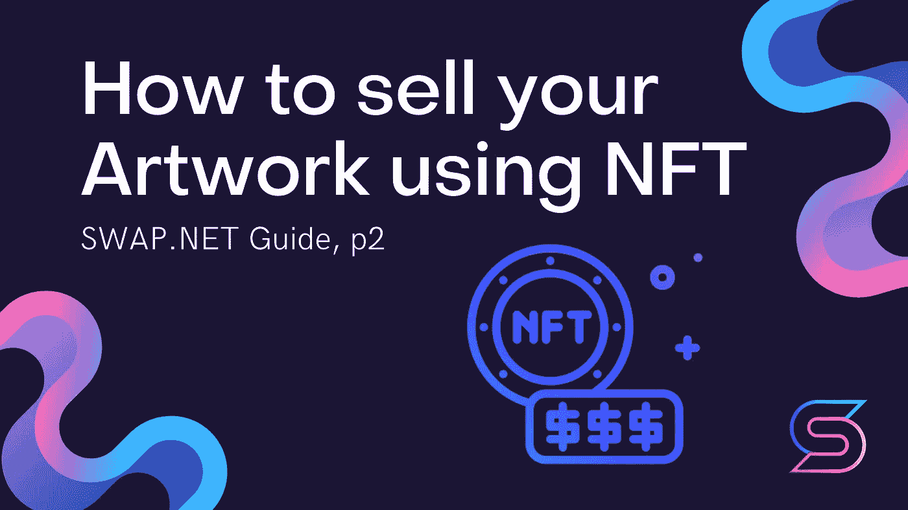

# 如何使用 NFT 出售你的作品，第 2 页

> 原文：<https://medium.com/coinmonks/how-to-sell-your-artwork-using-nft-p2-6e3b0d8028a3?source=collection_archive---------47----------------------->

## 在创造了一个钱包，阅读了关于区块链的文章后，是时候把艺术品变成 NFT 了。值得搞清楚怎么做，在什么平台上做。然后将有必要知道如何促进它毕竟。

在进一步阅读之前，请看上一部分，以便更好地理解: [**如何使用 NFT**](/@NFTSwapnet/how-to-sell-your-artwork-using-nft-ac40f6f2be8a) 出售你的作品，第一部分

创建加密钱包并支付汽油费用后，您可以继续创建 NFT 本身。NFT 是在市场上创造的。因此，首先让我们来分解什么是市场，它们有什么不同，以及如何选择最好的一个。

在很大程度上，市场在参与条款和进入门槛上有所不同。

## zora.co ZORA—

[**仿植物怪兽佐拉**](http://zora.co) 是一种通用的媒体注册协议。我们分析中唯一的非市场。平台对所有人开放。可与许多令牌(ETH、wETH、DAI、、RAC 等)互操作。).除了付油钱，没有其他费用。

天然气的价格相对较高(每个 NFT 都包含拍卖功能)。这个平台上的佣金工作，使作者可以设置版税，买方可以增加他们的二次销售的额外%。

仿植物怪兽佐拉非常适合初学者、音乐家或那些想要定制拍卖机制的人，因为这里没有时间限制，卖家可以选择任何出价人。要价决定了现在的购买价格。这个平台上没有监管，但由于它不是一个市场而是一个协议，人们可以创建自己的监管机制。

## FOUNDATION—[FOUNDATION . app](https://foundation.app/)

[**基金会**](https://foundation.app/?utm_source=techoptimist&utm_medium=techoptimist&utm_campaign=techoptimist&ref=techoptimist) 是一个买卖数字商品的市场。这是一个预调节的精品市场。这是一个封闭的站台——只有被邀请才能上车。仅与 ETH 令牌交互。

这里的佣金结构计算如下:二级市场上永久销售的 10%提成。Foundation 适合那些对加密世界不熟悉，但有才华/知名度足以吸引人群的人。这里的拍卖机制是这样的:作者设定一个底价。一旦底价达到，24 小时拍卖倒计时开始。

在最后 15 分钟内的出价是活跃的，并有额外的 15 分钟延长。这个平台有一个策展系统——社区策展人。创作者和收藏家会邀请新艺术家加入基金会。

## 超级罕见—[superrare.com](https://superrare.com/)

[**Superrare**](https://superrare.com/) 是 NFT 的点对点交易平台，建立在以太坊之上。最早的市场之一。用于数字作品的稀有(1\1)版本。高平均质量的作品和价格。

预调制，封闭平台。仅与 ETH 令牌交互。在这个平台上，作者可以获得二次销售 10%的佣金。Superrare 是为知名作家设计的。不同的拍卖发生在这个平台上:预定的，保留的，异步的。

## OPENSEA — [opensea.io](https://opensea.io/)

[**OpenSea**](https://opensea.io/) 是一个收集加密货币和不可替代代币的数字市场。最大的 NFT 市场，尤其是加密货币。大多数二次销售都是在 OpenSea 上完成的。但实际上，他们有一切可以挖掘他们的工作。只是在 OpenSea 上推广它们稍微不太方便。但是如果你依赖你的用户，OpenSea 是一个很好的选择。最容易互动的平台—非常低的进入门槛。

开放平台——你不需要邀请就能使用它。这个平台不需要佣金。OpenSea 适合正在建立收藏或想要避免汽油费的初学者。这个平台上有易贝式的拍卖。

## nifty gateway—[niftygateway.com](https://niftygateway.com/)

加密艺术的顶级网站。他们喜欢大量出售，一件作品卖多份，外加一些 VIP 版本的 1\1。就收益而言，他们组织了大部分最大的销售。Beeple 在 NiftyGateway 上一个周末就卖出了价值 350 万美元的艺术品(尽管在那之前他已经画了 13 年)。

当然，这是艰难的预调节。 [**NiftyGateway**](https://niftygateway.com/) 是一个你可以真正拥有的数字商品的市场。最难互动的平台就是准入门槛非常高。只有通过邀请才能上这个平台。它只与 ETH 令牌交互。在这个平台上，作者可以自己设定二次销售的提成比例。NiftyGateway 是顶级作者和品牌的平台。有多个版本的“立即购买”类型的拍卖。

## 稀有—[rarible.com](https://rarible.com/)

[**Rarible**](https://rarible.com/) 是一个平价的市场平台，有一些独特的功能，比如可解锁的物品。最实惠的市场。任何人都可以赞化(即令牌化)他们的工作。但总的来说，Rarible 不仅仅是秘密艺术品的市场，它是任何 NFT 的市场。

这是一个开放的平台。作者从未来销售中获得 10%的佣金。Rarible 将适合那些刚刚开始学习数字艺术和 NFT 的人。这里的拍卖只是异步的。

# 创造 NFT

市场 OpenSea 和 Rarible 是最简单、最容易进入和最受欢迎的，因此我们将以它们为榜样来考虑 NFT 的创建。

## OPENSEA

1.  进入 [**OpenSea.io**](https://opensea.io/) 网站，点击个人账户图标。然后点击“我的个人资料”。
2.  您将被重定向到登录页面。这里我们按下按钮中的**标志。由于您之前已经创建了元掩码加密钱包，因此您无需任何其他操作即可进入该站点。**
3.  你进入你的个人账户。这里有一个按钮“**我的收藏**”。点击它。然后点击“**创建**”按钮创建您的收藏。
4.  现在你可以上传你的头像，给你的收藏添加一个独特的名字，如果你愿意，还可以添加描述。一切准备就绪后，按下“**创建**按钮。
5.  现在你可以开始创建你自己的 NFT 了。为此，点击“**添加新项目**”按钮。然后以任何一种格式上传你的作品，并给它一个名字。
6.  现在你可以添加一个链接到你的作品。这个链接是买家在购买作品时得到的——它被称为“**可解锁内容**”。
7.  如有必要，在“**显式&敏感内容**行中放置一个滑块。如果您的内容是 18 岁以上，您需要确保打开该功能。

在供应线上输入可供销售的份数，然后点击“**创建**按钮。

**搞定！现在你有自己的 NFT 艺术了！**

现在让我们来看看如何将一幅 NFT 作品挂牌出售。

转到您刚刚创建的艺术品，然后单击“**出售**”按钮。

现在你必须选择一个选项来出售你的作品。出售你的艺术品有几种方式:
- **设定价格**-设定你想要的价格；
- **最高出价**-拍卖；
- **捆绑**-在一件商品中销售多件非功能性商品。

**设定价格有几个设置:**

*   **隐私** —您可以在这里指定 NFT 的销售对象的钱包。
*   **起拍价** —你为自己的作品设定的最初价格。在这里你也可以选择出售的加密货币。
*   **包括最终价格**——在找到买家之前，你的 NFT 的价值将下降的最终价格。
*   **到期日** —你申报的价格到期后，你的物品将会被移除。这个日期是你自己定的。

在拍卖模式下(**最高出价**)，你必须设定你的最低出价，并选择广告的结束日期。该广告是你的 NFT 在市场提要中的展示。它将包含您设置的所有参数:

*   底价是最低售价，默认为 1 ETH。如果价格达不到这个水平，你的作品就卖不出去。
*   捆绑选项与固定价格相同，但你不是只卖一件作品，而是一批中的几件。

一旦你决定出售你的作品，设置所有指标和价格，点击“**发布你的列表**”按钮。

一个窗口会为你打开进行交易——你必须支付汽油费。在你支付这笔费用之前，请仔细阅读前面关于汽油的部分。之后，用你的加密钱包付油钱。付款会自动完成，你只需要用钱包里相应的按钮在交易上签名。

**搞定！现在你的作品要出售了。**

## 稀有的

要在稀有市场上创建 NFT，您需要:

1.  通过你的 Metamask 钱包进入[**Rarible.com**](https://rarible.com/)。为此，点击“**连接钱包**”按钮。然后点击**创建**按钮。
2.  选择你的 NFT token 类型:
    - **单个**-你的作品只会卖出一件；你将出售你作品的多份拷贝。你自己设定份数。
3.  以您喜欢的格式加载您的作品，并选择销售类型。出售选项与 OpenSea 相同，除了没有最低价格，你的作品将被出售，直到提供最好的价格。
4.  写下你的作品的标题和描述，选择你的作品所属的收藏。如果你的作品被转卖，也可以选择加入你钱包的百分比(默认设置是 10%)。然后点击**创建项目**。
5.  你现在需要支付汽油费。

**付完气，你的作品就要拍卖了！**

# 币安的新市场

币安是一家大型公司，是世界上排名第一的加密货币资产交易所，领先其他交易所很多倍。这里是官网:[**Binance.com**](https://www.binance.com/en)。

这个市场运行在自己的区块链——**币安智能链**上。这个区块链和以太坊区块链几乎一模一样，但是具有更集中的工作原理——区块链的工作只由 21 个验证者(粗略地说，一个人)支持。这影响到:提成(气)的多少。在这种区块链上，交易费率较低。

因为维护区块链的人少，运输的速度增加了安全性。维护区块链的人越多，它就越安全。因此，币安的区块链比其他国家更不安全。

币安的市场是新的，所以它还没有固定的受众。这意味着:

*   区块链缺乏收藏家，也就是说，供大于求。
*   这个平台上的艺术家没有 OpenSea 那么多，这意味着你更容易吸引别人的注意力。你可以在这个平台上第一个成名。

如何上这个平台还不清楚。最初，一切都是通过邀请:币安邀请了 100 位著名作家，他们也邀请了他们的朋友。这个模型在基金会项目中。根据币安东欧主管叶戈尔·科斯塔列夫提供的信息，测试结束后，市场将转向稀有模式，变得更加开放。

要在币安创建您的 NFT 令牌，请使用此链接: [**如何在币安创建您自己的 NFT**](https://www.binance.com/en/support/faq/79dab23c7d724a069cb90dd709ecd243)。

总结所有的信息，币安区块链工作更快，收费更少的佣金。NFT-市场从币安将有同样的优点和 CONS。

# 宣传你自己和你的 NFT

一旦你创建了你的 NFT，是时候开始推广你自己、你的名字和你的作品了。有很多方法可以推广你的 NFT。我们会告诉你最重要的工作。每种方法都会花费一定的时间，但是结果会和花费的时间成正比。如果你想要一种更快捷的方式，那么你应该有一个银行账户或一个装满钱的加密钱包。

## 分发链接到 NFT

给你的作品分配链接是一个老掉牙但很好的方法。随意在社交媒体上分享你作品的链接，这样你的观众就能看到了。毕竟，结果可能是你的崇拜者比你想象的要近得多，他们现在就准备买你的艺术品。

## 市场/专业团体上的大众关注

我们上面看到的所有市场都可以选择订阅(关注)其他作者和收藏者。一定要做到这一点，并且一直做到！每个订阅都会吸引人们对你的个人资料和作品的关注。尤其是追随那些购买与你相似艺术品的收藏家和投机者。你的社区才刚刚开始和发展，所以你订阅的许多人将会回报并订阅你。

此外，由于普遍的炒作，在广阔的互联网上形成了许多主题社区。在这些网站上，你可以订阅同一个艺术家的作品，你们可以互相宣传。由于艺术家之间的这种互动，形成了相互促进的特殊资源。

## 创作社区感兴趣的艺术

有许多在线社区被一个共同的理念团结在一起:视频游戏、电影、书籍、音乐家、演员、公众人物的粉丝社区。例如，在 NFT 市场，描绘埃隆·马斯克及其相关事物的作品非常受欢迎。制作触及社区主题之一的艺术品。

在他们的小组、聊天室、电报频道、youtube 频道上发布你的工作信息。很可能有人会喜欢你的作品并购买它。理想情况下，你的作品可能会被一个名人(例如，同一个埃隆·马斯克)注意到，他会买下它并告诉人们。

## 渠道和出版商

有许多信息资源愿意帮助 NFT 艺术家和作家推广他们的工作。如果作品有价值且足够有趣，它将会在公共刊物上面向大量读者出版(收费或免费)。人们所要做的就是联系管理员，询问有关该出版物的情况。

**电报
-**binancenfts-[digital _ art _ NFT](https://t.me/digital_art_nft)-[聊天邀请，在那里可以获得基础邀请](https://t.me/joinchat/xIiOD0_DeFxmYzIy)

**推特**

根据许多 NFT 作者的建议，你应该特别关注你的 Twitter，因为所有的区块链技术社区都在那里。收藏者社区也大多位于 Twitter 上。

## 直接向收藏者发推文

是的，你可以也应该直接发微博给收藏者。但是为了给他们写信，你首先得找到他们。

## 我如何找到收藏家？

你可以在市场上找到收藏家。每个网站都有一个收藏者的顶端。这是你找到潜在买家的地方。收集者通常会留下他们 twitter 账户的链接，你可以在那里给他们发信息。

收藏者可以在 [**SuperRare Bot Twitter 账号**](https://twitter.com/SuperRareBot) 上找到。在每一次成功的销售之后，这个账户会发布一个帖子，上面有一个链接，链接到收藏家和艺术家，以及关于所售作品和销售价格的其他信息。

收藏者经常互相订阅，所以你可以在你认识的收藏者的订阅中找到新的联系人一旦你有了收藏者联系人，你需要正确而聪明地给他们写信，以免吓跑他们，引起他们的注意。与收藏家交流是一件微妙的事情，你必须考虑到许多细微差别，我们一会儿会告诉你。

## 什么不该写/寄给收藏者

*   不要发送没有上下文的收藏链接到你的作品。大多数收藏家永远不会跟踪一个裸露的链接。
*   添加一堆笑脸并不能帮助你引起收藏者的注意。笑脸不会吸引注意力，它会破坏写它的人的态度。
*   不要乞求或怜悯。像“请看看”或“也许你会对这份工作感兴趣”这样的话是不恰当的。“哦，我是个穷学生，支持我的创意，推广我的第一个作品”这样的请求和恳求也不合适。
*   你也不应该在对话开始时进行哲学思考。模糊的问题也不合适。

## 如何与收藏家交谈

*   当然，要有礼貌，有逻辑，考虑周到。这些品质在任何时候、任何地方都受到重视。
*   不要让收藏家看你的作品。
*   如果你要求什么，就恭敬的去做。你要求的越多，给收集者一些东西来回报他们的时间就越有意义。
*   写得清楚、具体、简洁。
*   把你所有的想法/要求/建议放在一条信息里。
*   为了引起收藏者的兴趣，写下你是如何发现它的，以及你为什么对它感兴趣。所有人都喜欢听关于他们自己的事情。之后，告诉他们一点关于你自己的情况，并提出你想和他们讨论的话题。

## 创作共鸣作品

每一部作品都有情感。当看一件作品时，任何收藏家都会在其中寻找一种情感联系。当他看到这种联系时，他会想买下这件作品。基于引人注目的事件创作的作品以及社区本身开始传播的作品得到了特别好的推广。

## **试着去封闭的站台**

在封闭的平台上，一个人为的严格筛选过程创造了一个作者社区，这本身就吸引了收藏家，并使网站更具排他性。收藏者倾向于在这些网站上购买作者的作品，而作者也试图在这些网站上获得。我们将告诉你如何登陆三个这样的网站。

## **如何上 SuperRare**

要上超级稀有网站，你需要使用 [**这种形式**](https://docs.google.com/forms/d/e/1FAIpQLScTZhB9On31j-uoFzMD3hg0gGNf3hgjVyBz1xwCHsOBSydvPw/viewform) 。填写此表格，发送并等待此市场的邀请。

## 如何上 Niftygateway

就像 SuperRare 一样，要上 NiftyGateWay，你需要 [**填表**](https://niftygateway.com/become-creator) 。Niftygateway 上有一个表单。点击链接，点击立即申请，并填写您的详细信息。

## 如何上粉底

有两种算法可以作为基础:

*   从另一位作者那里获得邀请。

试着在这个网站上找到一个最近刚上线的 NFT 作家，并在社交媒体上给他们写信。每个基金会的简介都通过 Instagram 和 Twitter 进行验证，所以你可以随时访问这些网站，直接给作者发邮件。每个作者在新作品售出后都会得到额外的邀请(数量总是不同)。

**NFT 作者来信模板**

> 下午好，【作者姓名】！我叫[你的名字]，我最近刚开始创建 NFTs(你可以链接到你的社交网络个人资料)。在 Foundation[个人资料链接]上看到了您的个人资料，决定给您写信。如果你能分享到这个网站的邀请，我将非常感激。作为回报，我可以提供(想想你能为另一位作者提供什么:在你的个人资料中做广告或另一个帮助选项)。

*   **在现场进行投票。**

在网站本身，有一个通过投票成为作者的过程。你需要通过你的加密钱包(Metamask 保存在任何地方)在网站上注册。然后进入 NFT 创建过程，系统会提示您完成以下算法:

1.  验证你的 Instagram
2.  验证您的 Twitter
3.  添加个人资料图像:徽标和横幅，以及个人资料说明。
4.  然后，系统会提示你分享一个链接到你的 Twitter 个人资料，并要求你为你投票 5 次。

## 如何通过价格促销

在 Rarible marketplace 上，有一种在主页上显示作品的特定算法:

*   创造新的工作；
*   为工作设定价格；
*   该职务出现在主页上。

使用第二点，您可以绕过算法，将作业的价格提高到提要的顶部。例如，你可以把工作的价格定在 1 ETH，然后每天降低 0.01 ETH，把你的工作提升到最高，吸引新的注意力。

## 找一个策展人来宣传和展览

策展人是艺术界的重要组成部分。他们知道观众现在需要什么，可以帮助你创作作品。例如，我们知道一些很酷的策展人:

*   [**教唆者**](https://www.instagram.com/instigators_int/)；
*   Christina Steinbrecher-Pfandt，Blockchain.art 平台的策展人和联合创始人。

展览也是影响策展人的一个重要部分。展览允许你在你的作品周围创造微粉，展览的策展人会根据你的作品创造一个完整的展览。

有一个非常大的 NFT 残疾人艺术展。就在那里，许多艺术家的作品以 3 万美元的价格售出。对于这种类型的第一次展示，这是一个伟大的结果。

## 创建自己的图库

创建您自己独特的画廊，与朋友、订户和收藏家分享，让您的收藏受欢迎。这方面有现成的资源。其中最受欢迎的是 [**TryShowTime**](https://showtime.io/) 。

# 关于 NFT 系列的最后一部分将是关于 NFT 市场法则和艺术家的规则。

# 交换。网队
官网—[https://swap.net/](https://swap.net/)
推特—[https://twitter.com/NFTSwapnet](https://twitter.com/NFTSwapnet)
不和—[https://t.co/uzz0Qt12tf](https://t.co/uzz0Qt12tf)
中—[https://medium.com/@NFTSwapnet](/@NFTSwapnet)
Docs&白皮书—[http://docs.swap.net](https://t.co/5qc7Mxt2p5)

> 加入 Coinmonks [电报频道](https://t.me/coincodecap)和 [Youtube 频道](https://www.youtube.com/c/coinmonks/videos)了解加密交易和投资

# 另外，阅读

*   [瓦济里克斯 NFT 评论](https://coincodecap.com/wazirx-nft-review)|[Bitsgap vs Pionex](https://coincodecap.com/bitsgap-vs-pionex)|[坦吉姆评论](https://coincodecap.com/tangem-wallet-review)
*   [如何使用 Solidity 在以太坊上创建 DApp？](https://coincodecap.com/create-a-dapp-on-ethereum-using-solidity)
*   [币安 vs FTX](https://coincodecap.com/binance-vs-ftx) | [最佳(索尔)索拉纳钱包](https://coincodecap.com/solana-wallets)
*   如何在 Uniswap 上交换加密？ | [A-Ads 审查](https://coincodecap.com/a-ads-review)
*   [加密货币储蓄账户](/coinmonks/cryptocurrency-savings-accounts-be3bc0feffbf) | [YoBit 审核](/coinmonks/yobit-review-175464162c62)
*   [Botsfolio vs nap bots vs Mudrex](/coinmonks/botsfolio-vs-napbots-vs-mudrex-c81344970c02)|[gate . io 交流回顾](/coinmonks/gate-io-exchange-review-61bf87b7078f)