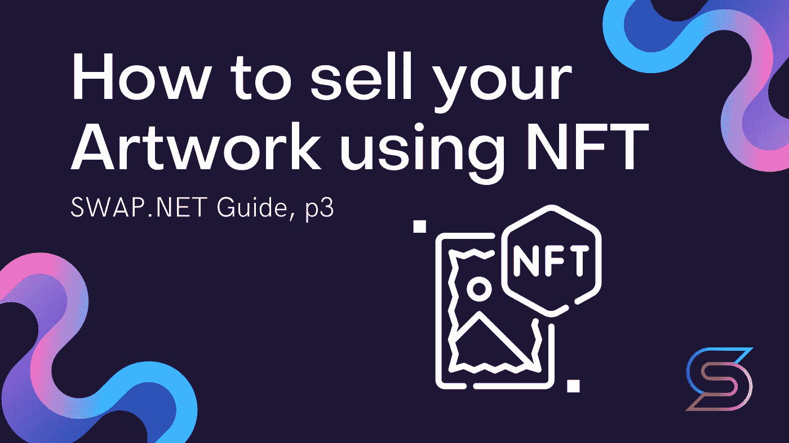

# 如何使用 NFT 出售你的作品，p3

> 原文：<https://medium.com/coinmonks/how-to-sell-your-artwork-using-nft-p3-5438bf87fe0d?source=collection_archive---------8----------------------->

## 所以我们已经知道网站，我们知道如何创建 NFT，我们知道如何传播工作和建立联系。为了保护我们自己，避免陷入不愉快的故事，每个 NFT 艺术家都应该知道他们的权利！

今天，NFT 是知识产权领域的一项重大创新。但是这项技术也带来了许多危险——对创作者和公司都是如此。

像任何其他区块链记录一样，NFTs 不能被盗或篡改。这使得它们成为证明所有权和交易的便利工具。

除了不可伪造性，这项技术还有其他优势。例如，一个作品的创作者可以编写一个 NFT 代码，自动从每个连续的所有者那里收取版税。这些通常是作为回购价格的一部分支付的，并提供了产生源源不断的收入的可能性。NFT 可以链接到一个作品或有限数量的副本之一。

# NFTs 的状态

非金融交易的货币化必须符合法律要求，这些要求因司法管辖区而异。大多数情况下，国家使用欧洲研究委员会第 721 号条例(ERC-721) 中的 NFT 版权[原则。](https://eips.ethereum.org/EIPS/eip-721)

# NFT 与知识产权

重要的是要明白，拥有 NFT 并不自动意味着对基础资产的所有权。令牌本身只是一个信息单元，而不是隐含任何权利或义务的法律文件。这仅仅是获取和保护人类协议的一种方式，而人类协议可能是完全不同的。

在某些情况下，与 NFT 一起，代表它的对象的所有权被转移给购买者。然后，令牌可以用作所有权的数字证明。例如，2019 年 12 月，[耐克获得了 CryptoKicks](https://patft.uspto.gov/netacgi/nph-Parser?Sect1=PTO2&Sect2=HITOFF&p=1&u=%2Fnetahtml%2FPTO%2Fsearch-bool.html&r=1&f=G&l=50&co1=AND&d=PTXT&s1=Nike&s2=Crypto&OS=Nike+AND+Crypto&RS=Nike+AND+Crypto) 的专利，这是一种允许 NFT 与一双物理运动鞋相联系的系统。买家获得代币和鞋子的全部所有权。在这种情况下，NFT 主要是为了证明二级市场上的收藏品训练器的真实性，二级市场上假货泛滥。

但有时出售 NFT 只是一种象征性的姿态，并不伴随着物权的转移。例如，Twitter 创始人杰克·多西[以 290 万美元](https://www.forbes.ru/newsroom/tehnologii/424231-osnovatel-twitter-dzhek-dorsi-prodal-svoy-pervyy-tvit-za-29-mln)的价格出售了与他的第一条推文相关的 NFT，但他没有将任何真实的权利转让给买家——这是合同中规定的。在这种情况下，代币变成了一个很好的纪念品，就像一些企业家用来交易的太空中遥远星球的所有权证书。

通常，除了 NFT，买方还被授予许可权，为某些目的使用卖方的知识产权。

## [此类许可协议通常规定:](https://www.mondaq.com/unitedstates/fin-tech/1085354/essential-considerations-in-nft-licensing-agreements)

*   NFT 的被许可所有者是否可以将作品的使用权转让给第三方，如果可以，其建造者是否会得到补偿；
*   NFT 的许可用途；
*   原作的复制品是否可以出售(例如绘画的复制品)，如果可以，如何分割收益；
*   被许可方是否以及如何创建原始作品的衍生版本或修改版本。

# NFT 和所有权的事实

当一位数字艺术家使用 NFT 技术出售他们的作品时，买家实际上已经拥有了艺术品。这一事实根植于区块链网络。

这意味着购买的作品的真实性很容易验证，并且不可能被篡改:不是原始的高分辨率绘画，而是附加在作品上的数字签名。除了数字签名之外，收藏家和艺术家自己可以选择接受什么。

艺术家额外将他们作品的实物拷贝(或原件)送给收藏家并不少见。例如，毕普发出了 600 个装有小屏幕的箱子，他的作品在这些小屏幕上旋转。

因此，你的作品的权利不会转移给买方，除非你和买方事先明确同意。默认情况下，购买者不能通过 Videohive 将您的作品作为购买的资产或物品使用。

# NFT 和版权

**拥有 NFT 并不等同于拥有版权！**版权独立于有形物品或 NFT 的所有权而存在。作者在作品出售后并未失去其版权(除非在转让/购买 NFT 时另有书面约定和声明)。收藏家只拥有作品本身的权利，所有其他版权归作者所有。

# 收藏家的有限权利

NFT 的所有权不等同于版权的所有权！版权独立于有形物品或 NFT 的所有权而存在。作者在作品出售后并未失去其版权(除非在转让/购买 NFT 时另有书面约定和声明)。

收藏家只拥有作品本身的权利，所有其他版权归作者所有。收藏者拥有出售、交换或转让所购作品的专有权，但无权以营利为目的使用。

例如，收藏者不能出售作品的拷贝、基于该作品制作额外的 NFT、出售对该作品的访问权或以其他方式对其进行商业开发。收藏家只能获得展示作品的有限许可。

# 艺术家的规则

只有收藏家对市场的诚信有信心，整个秘密艺术运动才能发挥作用。如果你是一名艺术家，如果你遵守以下规则，你可以提高你的声誉，并为整个秘密艺术社区增加尊重点:

*   只张贴你个人创作的原创作品；
*   只张贴你有合法权利张贴的作品，即你拥有该作品的版权，而该版权并未转让给其他人；
*   不要发布窃取或复制的内容；
*   如果您的作品包含非原创内容，请确保原创作品处于公共领域，或者您有合适的论据来证明合理使用。

平台不能阻止盗版作品的铸造，但有权销毁此类作品，撤销作者的特权或完全禁止。

确定是否可以接受不完全是原创的内容是困难的。原创性定义的界限现在变得模糊而主观。许多使用可回收但可识别的想法的当代艺术形式一直面临着这种矛盾。尤其是当一件基于其他作品或流行文化人物形象的作品被高价出售，而原作品的创作者或所用形象的所有者却得不到名誉和经济上的补偿时。

# 结论

数字艺术的世界相对较新，所有参与者的公平报酬标准仍在制定中。然而，很明显，crypto-art 将继续回收现有内容的做法，用于象征性、变革性或产生迷因的目的。就目前而言，偷窃和灵感的界限只能由艺术家的良心来决定。

随着密码艺术的发展，可能会有许多欺诈计划、版权侵权者和一般人愿意利用不稳定系统中的漏洞。然而，如果社区中的每个人都有意识地遵守上述非常简单的规则，自我调节将使运动保持诚实，没有外部支持。

# SWAP.NET 队
官方网站—[https://swap.net/](https://swap.net/)
推特—[https://twitter.com/NFTSwapnet](https://twitter.com/NFTSwapnet)
不和—[https://t.co/uzz0Qt12tf](https://t.co/uzz0Qt12tf)
中—[https://medium.com/@NFTSwapnet](/@NFTSwapnet)
Docs&白皮书—[http://docs.swap.net](https://t.co/5qc7Mxt2p5)

> 加入 Coinmonks [电报频道](https://t.me/coincodecap)和 [Youtube 频道](https://www.youtube.com/c/coinmonks/videos)了解加密交易和投资

# 另外，阅读

*   [加拿大最佳加密交易机器人](https://coincodecap.com/5-best-crypto-trading-bots-in-canada) | [库币评论](https://coincodecap.com/kucoin-review)
*   [用于 Huobi 的加密交易信号](https://coincodecap.com/huobi-crypto-trading-signals) | [HitBTC 审查](/coinmonks/hitbtc-review-c5143c5d53c2)
*   [如何在 FTX 交易所交易期货](https://coincodecap.com/ftx-futures-trading) | [OKEx vs 币安](https://coincodecap.com/okex-vs-binance)
*   [OKEx vs KuCoin](https://coincodecap.com/okex-kucoin) | [摄氏替代品](https://coincodecap.com/celsius-alternatives) | [如何购买 VeChain](https://coincodecap.com/buy-vechain)
*   [ProfitFarmers 点评](https://coincodecap.com/profitfarmers-review) | [如何使用 Cornix Trading Bot](https://coincodecap.com/cornix-trading-bot)
*   [如何匿名购买比特币](https://coincodecap.com/buy-bitcoin-anonymously) | [比特币现金钱包](https://coincodecap.com/bitcoin-cash-wallets)