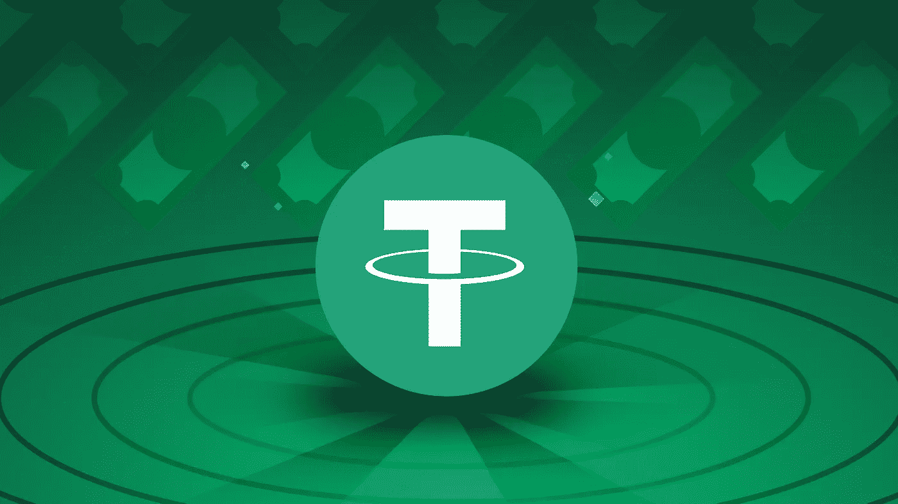
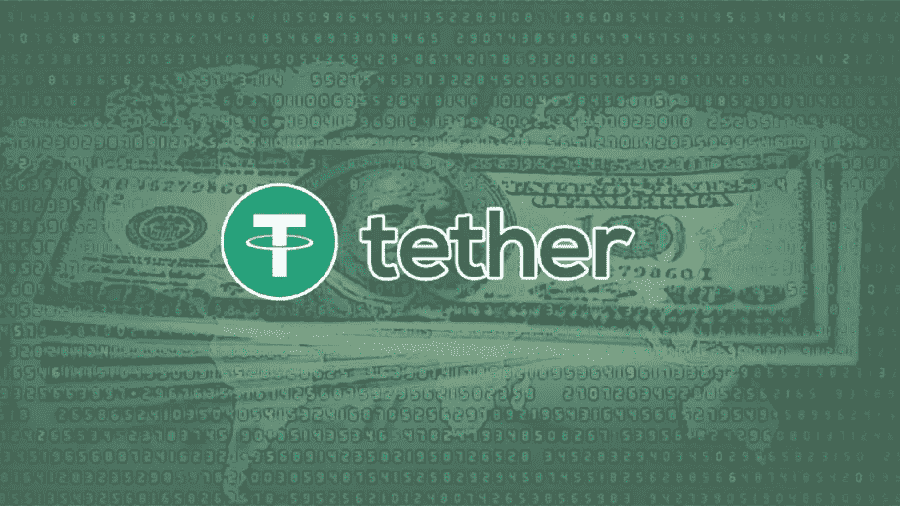

# 如何在尼日利亚出售你的 USDT 并立即获得报酬

> 原文：<https://medium.com/coinmonks/how-to-sell-your-usdt-and-get-paid-instantly-in-nigeria-4463fbe2ed8e?source=collection_archive---------22----------------------->

USDT (Tether)是一种基于区块链的数字货币，其流通中的代币由等值的美元支持，使其成为一种稳定的货币，价格与 1 美元挂钩。稳定货币追踪传统的法定货币，如美元、英镑或日元，这些货币存放在指定的银行账户中。

由加密交易所 BitFinex 创建的 USDT 令牌是系绳网络的本地令牌，并且以 USDT 符号进行交易。截至 2022 年 4 月，USDT 是市值第三大加密货币，价值超过 850 亿美元。

Tether 属于名为 stablecoins 的加密货币类别，它旨在保持加密货币估值稳定，不像比特币和以太坊等其他流行加密货币的价格大幅波动。USDT 被用作交换媒介和价值储存模式，而不是像比特币和其他替代硬币一样被用作投机投资的媒介。

Tether 专门设计用于在法定货币和加密货币之间建立必要的桥梁，并为用户提供稳定性、透明度和低交易成本

## **系绳是做什么用的？**

Tether 对加密投资者有利，因为它提供了一种规避比特币、以太坊、莱特币等其他加密货币极端波动性的方法。此外，拥有 USDT(相对于法定货币)消除了交易成本和延迟，这些成本和延迟会损害加密货币市场内的交易执行。

就像其他加密货币一样，你必须通过加密货币交易平台将你的 USDT 出售给 Naira 或 Cedis，并立即收到付款，因为由于政府的禁令，加密钱包不能与尼日利亚商业银行合作。获得一个可信的平台有时可能是一件麻烦事，这是因为加密交易市场充斥着骗子，通常被称为“Rippers”。

然而，像 [Dart Africa](http://dartafrica.io) 这样的平台可以被信任来出售你的 USDT(系绳)，你肯定会物有所值。

## 销售 USDT 的最佳平台

[Dart Africa](http://dartafrica.io) 是非洲领先的加密货币交易平台。Dart Africa 研究了加密货币兑换市场的不足之处，如信任问题、低汇率、镇静支付系统等，并建立了一个平台，为这些问题提供了有利的解决方案。你可以使用他们的[网页版](http://dartafrica.io)或者在谷歌 Play 商店和 App Store 上下载 [Dart Africa 应用。](https://play.google.com/store/apps/details?id=com.dartafrica&hl=en_US&gl=US)

首先，我们来谈谈大多数密码爱好者感兴趣的是什么，通行的汇率。 [Dart Africa](http://dartafrica.io) 目前在尼日利亚和加纳拥有最好的汇率，在这两个国家，汇率已经被证明是非常有效的，并将继续保持市场领先地位。他们设计了自己的系统，自动更新市场上最好的汇率，以确保客户始终获得最优惠的汇率。要查看当前汇率，你可以使用 [Dart Africa 的汇率计算器](https://dartafrica.io/coincalculator)来知道你的 USDT 值多少钱。当你把你的系绳(USDT)卖给达特非洲时，你不能亏本。

Dart Africa 的另一个突出特点是付款速度快。 [Dart Africa](https://dartafrica.io/) 平台设计用于在确认 USDT 或其他加密货币交易后立即自动向客户付款。Dart Africa 的付款没有延迟时间，因为付款是自动完成的。当您向 Dart Africa 出售您的 USDT 或其他加密硬币时，由于自动支付系统，付款将在几分钟内完成。

要出售你的比特币，你必须首先[在 Dart Africa 上创建一个账户](https://dartafrica.io/register)。你可以通过 [App](https://play.google.com/store/apps/details?id=com.dartafrica&hl=en_US&gl=US) 或者网页版来实现。

## **如何在** [**镖非洲**](http://dartafrca.io) 上推销你的 USDT(系绳)

Dart Africa 的网站是一个令人惊叹的网站，其特点是易于导航和美观。加密货币平台的使用非常简单，只需点击几下鼠标，就可以在没有帮助的情况下设置账户并开始交易。按照以下步骤出售您的 USDT:

*   点击主页上的立即出售
*   点击[在此注册](https://dartafrica.io/register)创建新账户。
*   在提供的栏中填写所有必需的详细信息。详细信息包括首选用户名、有效的电子邮件地址和电话号码、密码和国籍。
*   阅读并同意我们的条款和条件。
*   点击创建一个帐户。
*   一旦您点击创建帐户，您将收到一封来自 Dart Africa 的验证电子邮件。Dart Africa 使用验证电子邮件来确保您的安全并防止欺诈事件的发生。

现在您已拥有 Dart 帐户；(请注意，如果您已经拥有 Dart 帐户，可以跳过上述所有步骤)

*   [使用您的凭证登录](https://dartafrica.io/login)您的帐户。
*   单击工具栏图标(左上角的三条垂直直线)。您将在您的帐户面板上看到此信息。
*   点击出售硬币。
*   在硬币栏中选择 USDT 作为您的首选硬币选项。
*   输入你要出售的 USDT 的数量，相应的美元和奈拉的数量将显示在列中。注意:你可以出售的 USDT 或任何加密货币的最低美元价格是 20 美元。
*   点击立即出售硬币。

> 加入 Coinmonks [电报频道](https://t.me/coincodecap)和 [Youtube 频道](https://www.youtube.com/c/coinmonks/videos)了解加密交易和投资

# 另外，阅读

*   [最佳期货交易信号](https://coincodecap.com/futures-trading-signals) | [流动性交易所评论](https://coincodecap.com/liquid-exchange-review)
*   [南非的加密交易所](https://coincodecap.com/crypto-exchanges-in-south-africa) | [BitMEX 加密信号](https://coincodecap.com/bitmex-crypto-signals)
*   [MoonXBT 副本交易](https://coincodecap.com/moonxbt-copy-trading) | [阿联酋的加密钱包](https://coincodecap.com/crypto-wallets-in-uae)
*   [雷米塔诺评论](https://coincodecap.com/remitano-review)|[1 英寸协议指南](https://coincodecap.com/1inch) | [购买 Floki](https://coincodecap.com/buy-floki-inu-token)
*   [MoonXBT vs Bybit vs 币安](https://coincodecap.com/bybit-binance-moonxbt) | [Arbitrum:第二层解决方案](https://coincodecap.com/arbitrum)
*   [买 PancakeSwap(蛋糕)](https://coincodecap.com/buy-pancakeswap)|[matrix export Review](https://coincodecap.com/matrixport-review)