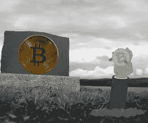

# 如何设置加密继承

> 原文：<https://medium.com/coinmonks/how-to-set-up-a-crypto-inheritance-e7b607cbe37e?source=collection_archive---------37----------------------->

一般来说，加密资产和加密结构不同于银行或交易所中的其他传统金融资产。由于传统金融有一个集中的结构，在一个人去世的情况下，机构更容易联系继承人(反之亦然)，也更容易定义和追踪继承事宜。加密货币可以通过两种方式存储:

1.  *交易所:*多为集中式和托管式，但也有不少分散式交易所。在这两种情况下，他们都不会意识到你的去世。
2.  *钱包:*可以保管，也可以不保管。同样，他们也不会意识到你的逝去。

**你死后你的密码会怎么样？**

也就是说，打个比方，你的密码可能会和你一起死去——因为你不会有共享的访问细节。

当你把资金存入交易所时，资金就在他们的钱包里，由他们最终控制。用户需要密码和登录才能访问资金。如果你有钱包，用户需要知道 12 个字的恢复短语来访问你的密码。

在这两种情况下，除了你所爱的人之外，没有人会知道你的死亡，除非你建立了一个加密继承计划，并就如何访问你的加密资产留下明确的指示，否则它们将永远丢失。

杰拉尔德·科滕的离奇案件

Gerald Cotten 是加拿大最大的加密交易所 Quadriga 的首席执行官和创始人。他在 2018 年的印度之旅中去世，由于他是唯一一个持有离线冷钱包密码的人，大约 1.9 亿美元失踪。Cotten 在去世前几天立了一份遗嘱，但没有提到被称为冷钱包的外部硬盘，他在其中存储了 Quadriga 的大部分资金。

**如何设置加密继承计划？**

为了确保您的家属可以访问您的硬币，您必须创建特权信息的副本。如果你想增加过程的安全性，建议使用可信的第三方解决方案。然而，您的加密继承计划将由这五个简单的步骤组成:

1.  列出您的加密资产并确定您想要保护的内容
2.  为你的投资遗产制定一个策略，分为短期和长期
3.  决定每个资产类别的继承人
4.  考虑为您的加密资产创建一个信任
5.  最终确定关于密钥、恢复短语和其他访问信息的沟通计划

你应该从哪里和谁开始？

现有的解决方案适合这两种类型的投资者:那些不信任数字继承方法来提前传递资金的人，以及那些信任传递后自动协议的人。

[Willsentry](https://www.willsentry.com/) 帮助投资者进行加密货币遗产规划。他们建议在客户的遗嘱中加入法律条款，以确保他们的财产和所有凭证和设备可供受益人继承，而无需分享他们的私钥。

与此同时， [Casa Covenant](https://blog.keys.casa/announcing-casa-covenant-bitcoin-inheritance-service-and-protocol/#:~:text=Inheritance%20is%20one%20of%20the,in%20advance%20of%20your%20death.) 创建了一个协议，将多重签名技术与现有的遗产规划和法律系统相结合。

比特币基地交易所提供了一个类似于银行通常所做的解决方案:他们提供一个选择，如果一个人死亡，他有权继承投资者的账户[。](https://help.coinbase.com/en/coinbase/managing-my-account/other/how-do-i-gain-access-to-a-deceased-family-members-coinbase-account)

作为一个合格的投资者，你应该始终跟踪你的资产和继任计划。我们在罗伯特风险投资公司的职责是关心你的资本，为你和你所爱的人提供一个富有成效的未来。

[*乔罗伯特*](https://joerobert.com/) *现任罗伯特风险投资公司首席执行官，拥有超过 20 年的资产管理经验。自创业以来，乔已经为投资者和合伙人创造了可预见的两位数回报。Joe 已经投资了股权和代币的种子轮，以及比特币、以太坊和其他顶级加密货币的投资组合。*

*如果您是合格投资者，并想了解更多关于我们产品的信息，请联系我们。*

> 加入 Coinmonks [电报频道](https://t.me/coincodecap)和 [Youtube 频道](https://www.youtube.com/c/coinmonks/videos)了解加密交易和投资

# 另外，阅读

*   [折叠 App 回顾](https://coincodecap.com/fold-app-review) | [LocalBitcoins 回顾](/coinmonks/localbitcoins-review-6cc001c6ed56) | [Bybit vs 币安](https://coincodecap.com/bybit-binance-moonxbt)
*   [加密保证金交易交易所](/coinmonks/crypto-margin-trading-exchanges-428b1f7ad108) | [赚取比特币](/coinmonks/earn-bitcoin-6e8bd3c592d9) | [Mudrex 投资](https://coincodecap.com/mudrex-invest-review-the-best-way-to-invest-in-crypto)
*   [WazirX vs coin dcx vs bit bns](/coinmonks/wazirx-vs-coindcx-vs-bitbns-149f4f19a2f1)|[block fi vs coin loan vs Nexo](/coinmonks/blockfi-vs-coinloan-vs-nexo-cb624635230d)
*   [比斯勒评论](https://coincodecap.com/bitsler-review)|[WazirX vs coin switch vs coin dcx](https://coincodecap.com/wazirx-vs-coinswitch-vs-coindcx)
*   [7 大副本交易平台](https://coincodecap.com/copy-trading-platforms) | [BuyCoins 点评](https://coincodecap.com/buycoins-review)
*   XT.COM 评论[币安评论](https://coincodecap.com/profittradingapp-for-binance) |