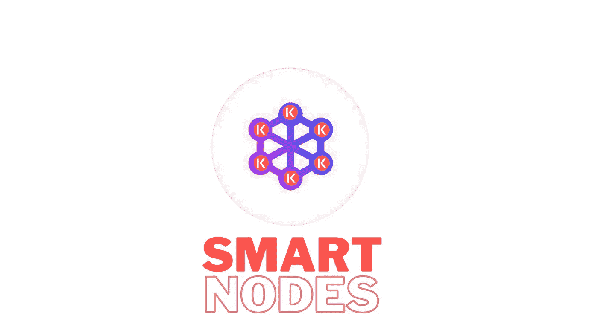
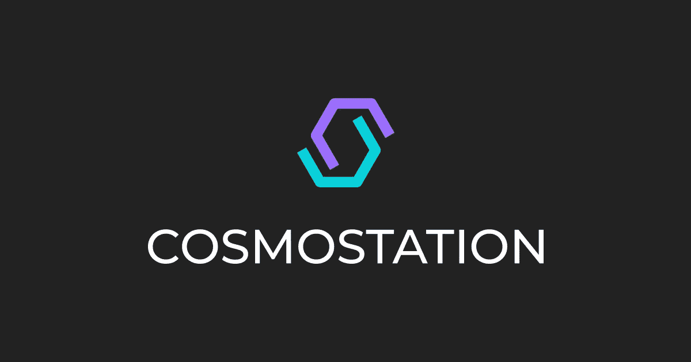
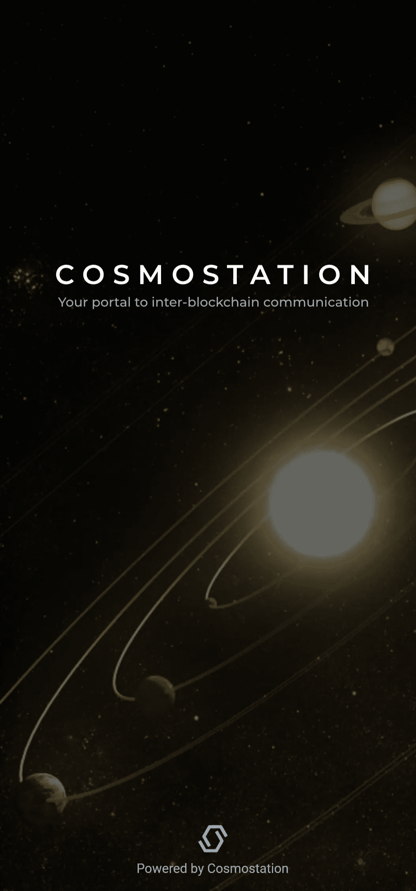
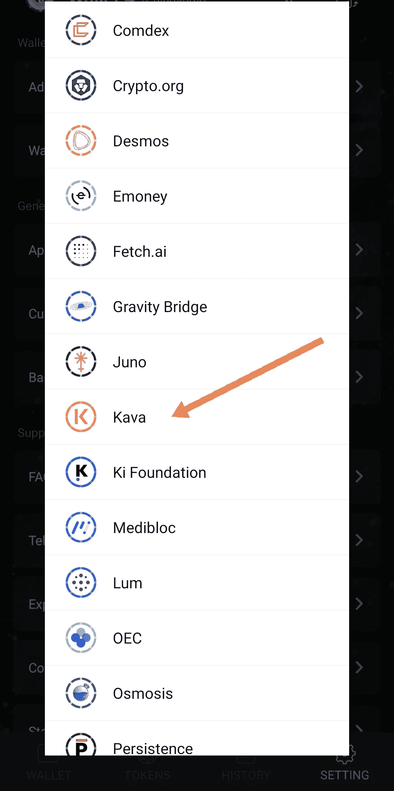
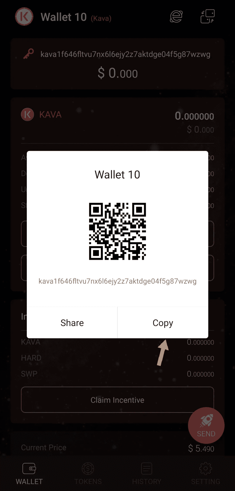
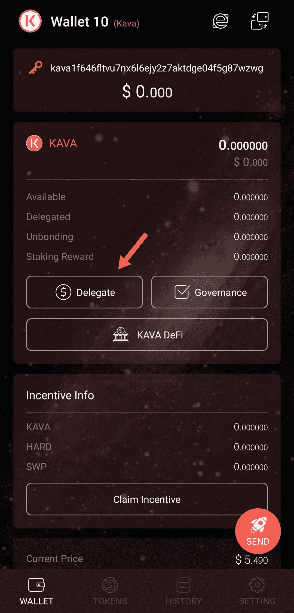
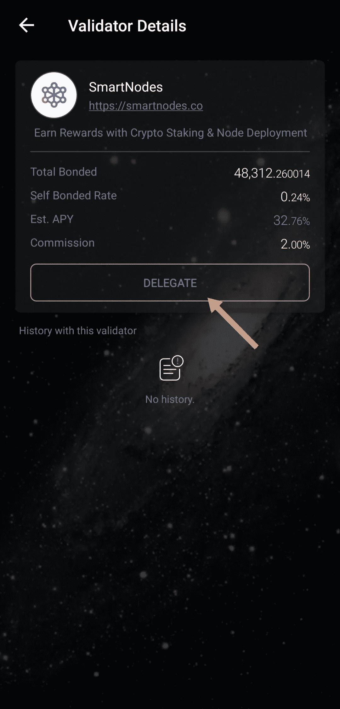
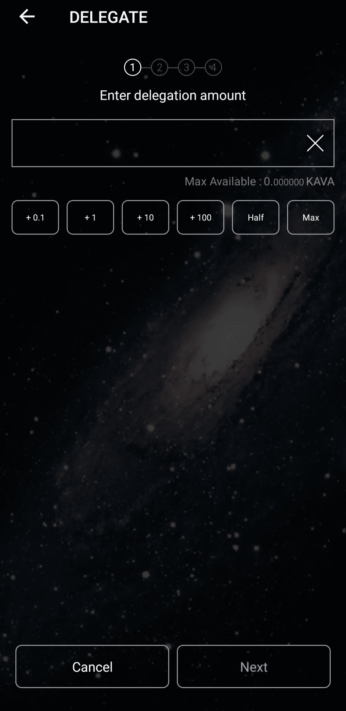
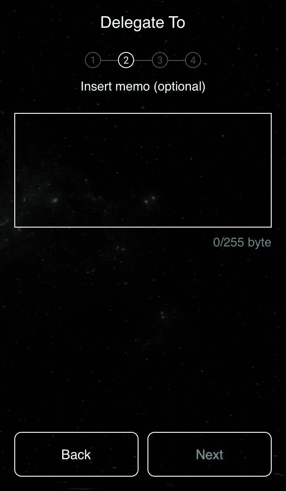

# 如何在 Cosmostation 中入股 Kava？

> 原文：<https://medium.com/coinmonks/how-to-stake-kava-in-cosmostation-50fdc9da0c60?source=collection_archive---------4----------------------->

Smartnodes Validator for [Kava Labs](https://medium.com/u/c6303375bdac?source=post_page-----50fdc9da0c60--------------------------------) Coin

# 什么是卡瓦？

> 基础知识

卡瓦链是一个分散的、无权限的、抵制审查的区块链，由 Cosmos SDK 构建。这意味着它的运作非常类似于其他宇宙生态系统区块链，并被设计为链之间的互操作。[了解更多关于卡瓦的信息。](/kava-labs/kava-protocol-101-ce3beb0fa8b8)
【‍】
‍kava 协议是卡瓦链中内置的组规则和行为，允许高级分散金融(Defi)功能，如无许可借贷。‍卡瓦令牌是卡瓦链条上的一项资产。卡瓦链是由它的令牌卡瓦安全，它是作为运输和有用的价值储存整个链使用。这是作为在卡瓦应用程序上铸造 USDX 的礼物。

# 什么是赌注？

押注加密货币可能是一个过程，涉及购买和留出特定数量的代币，以成为网络的活跃验证节点。通过简单地持有这些硬币，客户成为网络安全基础设施中的关键部分，并相应地得到补偿。

赌注收入可以在支付给持有者的利息范围内获得，而利率则根据包括供求动态在内的几个因素从一个网络到另一个网络有所不同。

> 随着基于 PoS 的网络数量的持续增长，出现了新的替代股份加密的方法，包括推出群组股份，也称为股份池、股份提供商和冷股份。

# 什么是验证器节点？

验证器节点可以是一种特殊的**完全节点**，它参与**“**共识**”**通过加入共识，验证者节点变得负责验证、投票和维护交易记录。

验证器节点支撑着任何区块链或 DLT 网络的安全。

# 什么是委托人？

像您这样将令牌放在验证器节点上的人被称为委托者。您将您的令牌“委托”给一个[验证器](https://www.mintscan.io/kava/validators/kavavaloper1g5egkvqqgp6wv304ph0laftc7jdf3dt39rwugu)。

验证器节点永远不会接管您的令牌。他们被置于区块链的一个智能契约中，该契约将他们的投票权委托给一个节点。这有助于确保区块链的安全，并让你有权获得赌注奖励。

cosmostation wallet

# 如何打造钱包？

Cosmostation 可能是一个轻量级的移动钱包，支持卡瓦存储，转移和赌注。要创建钱包，请将其安装在您的 iOS 或 Android 移动设备上。

*   [从应用商店下载](https://itunes.apple.com/kr/app/cosmostation/id1459830339?mt=8)
*   [从 Google Play 下载](https://play.google.com/store/apps/details?id=wannabit.io.cosmostaion)

启动您的钱包，在主屏幕上点击“ ***创建*** ”以显示替换钱包，或者如果您已经有一个卡瓦钱包，则点击“ ***导入*** ”。

cosmostation

选择卡瓦以连接到 Cosmostation 是一个多链客户端，支持诸如 Akash、osmosis、SecretNetwork、Band Protocol 等区块链。

kava chain in cosmostation

在下一步中，您需要写下将用于恢复钱包的种子短语。准备好后，点击“ ***显示助记符*** ”，在纸上或其他地方写下种子短语。不要截图或以数字方式存储你的助记密码——这通常不是一种安全的方式，你的钱包也可能受到威胁。

**重要！**如果您忘记或丢失了种子短语，您将无法恢复对资金的访问，并且您的代币将永久丢失。在纸上写下种子短语，将其保存在第三方无法接触到的安全位置，并且不要将其传递给除您信任的人之外的任何人。

写下种子短语后，创建并确保一个 PIN 码来登录 Cosmostation 钱包应用程序，该 PIN 码由 4 位数字和一个 A-Z 字符组成。你的钱包现在准备好了。现在你可以把它加满，用卡瓦代币做赌注。

# 如何给卡瓦钱包充值？

有 3 种方法可以为任何 Cosmostation 手机钱包充值:

*   只需复制卡瓦地址，并告诉它的发送者或加密交换，将转移令牌给你。
*   通过 messenger 或电子邮件共享地址。您将发送一个付款请求，人们可以使用发送给您卡瓦代币。
*   创建一个可以在应用程序中扫描的二维码，以便快速向您发送令牌。

kava wallet

一旦你有卡瓦在你的钱包里，你可以开始赌注过程。

# 如何在 cosmostation 钱包中下注卡瓦代币？

1.  点击应用程序主界面上的*。*

**

*delegating kava*

*2.这将打开一个验证器列表。转到“ ***顶部*** 选项卡，找到一个可靠的验证器，例如***【smart nodes】、*** 并选中它。*

**

*Smartnodes Validator*

*4.输入您想要分配的硬币数量。您可以手动输入价值，也可以从可用选项中选择一个，如下图所示。然后点击 ***下一个*** 。*

**

*Delegating Transaction*

*5.您可以添加备忘录(可选)。这个参数识别用户，但是如果你使用它，你将需要指定一个备忘录来提取硬币——没有它，你将无法取回你的卡瓦，但是这可以作为对你的钱包的额外保护。我们将跳过这一步，进入下一部分。*

**

*Transaction Memo*

*6.选择每笔交易的费用金额。它越大，验证器确认传输的速度就越快。(你可以一如既往地选择高)*

*7.再次检查交易细节并进行确认。*

*恭喜你！您的卡瓦代币现已下注，并将显示为“已委托”，这意味着您的代币已委托给验证器( [smartnodes](https://linktr.ee/Smartnodes) )，该验证器将每隔 5-7 秒(根据阻滞时间)向您的奖励余额发送奖励。还请注意，如果您提取硬币，它们将在 21 天后解锁，之后将在 Cosmostation 钱包中再次可用。*

# *为什么选择 SmartNodes 作为验证器？*

1.  *活跃于社区。Smartnodes Validator 通常可以在 Telegram 和 Discord 聊天中找到，回答问题并为社区提供支持。*
2.  *Smartnodes 使用的基础架构是最好的，它有 10 层安全措施来保护您的资产。*
3.  *Smartnodes 验证器提供 100%全额退款斜线和双符号保护*
4.  *我们在宇宙中非常活跃，尽我们所能给予支持。我们是社区驱动的。Smartnodes validator 积极地对提案进行投票，以帮助确保适当的治理。*
5.  *100%支持宇宙生态系统。Smartnodes Validator 已经分发了超过 5000 美元的代币来帮助人们开始使用我们自己的水龙头机器人【https://t.me/smart_y_bot 进入宇宙空间*

*   **** **** **** **** **** **** **** **** **** **** *****

***社交**|[*Reddit*](https://www.reddit.com/r/smart_nodes/)|[|*推特*|](https://twitter.com/nodes_smart)|[|*网站*](https://linktr.ee/Smartnodes)|[|*电报*|](https://t.me/smartnodesvalidators)|[*insta gram*](https://www.instagram.com/smartnodes_validator/)|*

> *交易新手？尝试[加密交易机器人](/coinmonks/crypto-trading-bot-c2ffce8acb2a)或[复制交易](/coinmonks/top-10-crypto-copy-trading-platforms-for-beginners-d0c37c7d698c)*