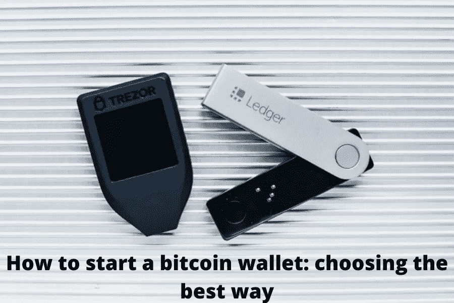

# 如何启动比特币钱包:选择最佳方式

> 原文：<https://medium.com/coinmonks/how-to-start-a-bitcoin-wallet-choosing-the-best-way-8efb77c08025?source=collection_archive---------54----------------------->

在各州将比特币作为本国货币的同时，俄罗斯正赶在 2022 年确定加密货币的地位，并监管这个市场。是时候做好准备了，尤其是投资者的黄金建议仍然适用——将储蓄存放在不同的地方。

我们提议在 2022 年之前记住它们是什么，如何创建比特币钱包，以及最好的方法是什么。

内容

*   什么是比特币钱包？
*   钱包类型
*   选择哪种加密货币钱包？
*   创建比特币钱包的各个阶段
*   如何将资金转入比特币钱包？
*   如何把比特币提现到一个 Webmoney，Yandex？钱还是钱包
*   2022 年最佳比特币钱包

## [什么是比特币钱包？](https://cryptobatman.blogspot.com/2022/03/How-to-start-a-bitcoin-wallet-choosing-the-best-way.html)

数字比特币钱包是一个程序，它是通过区块链使用加密货币并在其中存储储蓄所必需的。在处理它的时候，你可以不依赖于银行系统的政权，随时在全球范围内快速转移资金，并且保持匿名。

尽管名称如此，比特币钱包旨在存储和操作各种加密货币，而不仅仅是传统的比特币(BTC)，后者定期被预测会过时和消亡。

## 每个钱包都有一个公钥和一个私钥。

第一个是钱包地址，这是一组对每个向其发送资金的人可见的字符，无论是补充资金还是转账。

> 加入 Coinmonks [电报频道](https://t.me/coincodecap)和 [Youtube 频道](https://www.youtube.com/c/coinmonks/videos)了解加密交易和投资

# 另外，阅读

 [## 2022 年 6 大最佳硬件钱包|顶级加密硬件钱包[更新]

### 最好的加密货币硬件钱包是绝对必要的。我们将在 NGRAVE、Ledger Nano X 和…

medium.com](/coinmonks/the-best-cryptocurrency-hardware-wallets-of-2020-e28b1c124069)  [## 8 大最佳硬件钱包|顶级加密硬件钱包

### 保管您的数字资产很容易，但找到正确的存储方式却是一项繁琐的任务。在线钱包有一个风险…

medium.com](/coinmonks/hardware-wallets-dfa1211730c6) 

*   [印度的加密交易所](/coinmonks/bitcoin-exchange-in-india-7f1fe79715c9) | [比特币储蓄账户](/coinmonks/bitcoin-savings-account-e65b13f92451)
*   [Cloudbet 赌场评论](https://coincodecap.com/cloudbet-casino-review) | [点火赌场评论](https://coincodecap.com/ignition-casino-review)
*   [币安费用](/coinmonks/binance-fees-8588ec17965) | [Botcrypto 审查](/coinmonks/botcrypto-review-2021-build-your-own-trading-bot-coincodecap-6b8332d736c7) | [Hotbit 审查](/coinmonks/hotbit-review-cd5bec41dafb)
*   [MyConstant Review](https://coincodecap.com/myconstant-review) | [8 款最佳摇摆交易机器人](https://coincodecap.com/best-swing-trading-bots)
*   [我的加密副本交易经历](/coinmonks/my-experience-with-crypto-copy-trading-d6feb2ce3ac5) | [AAX 交易所评论](/coinmonks/aax-exchange-review-2021-67c5ea09330c)