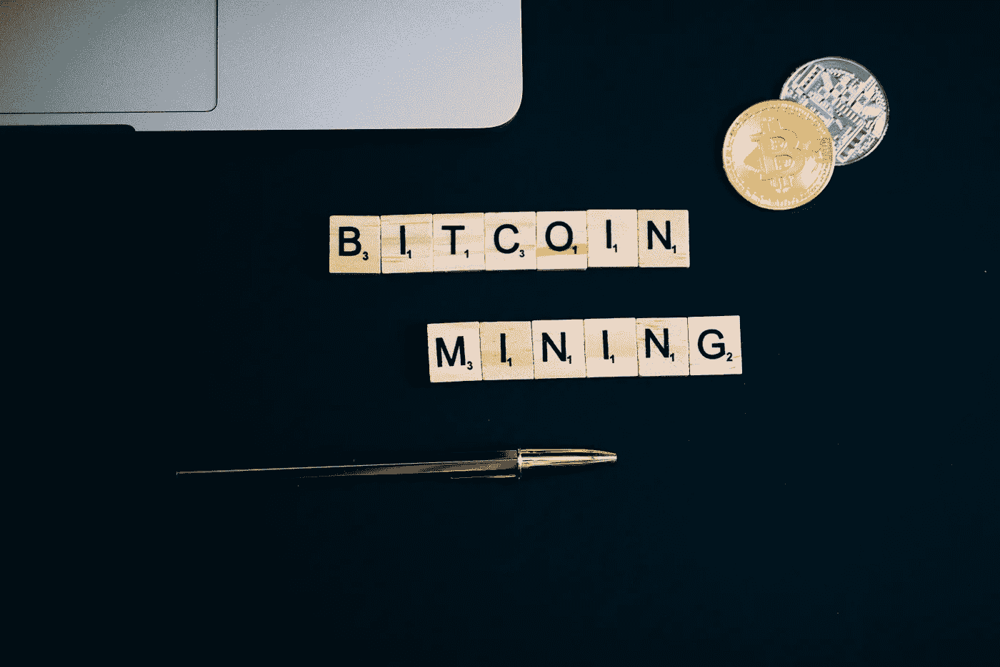
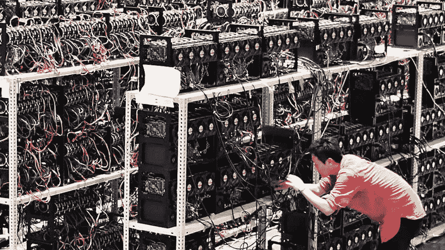
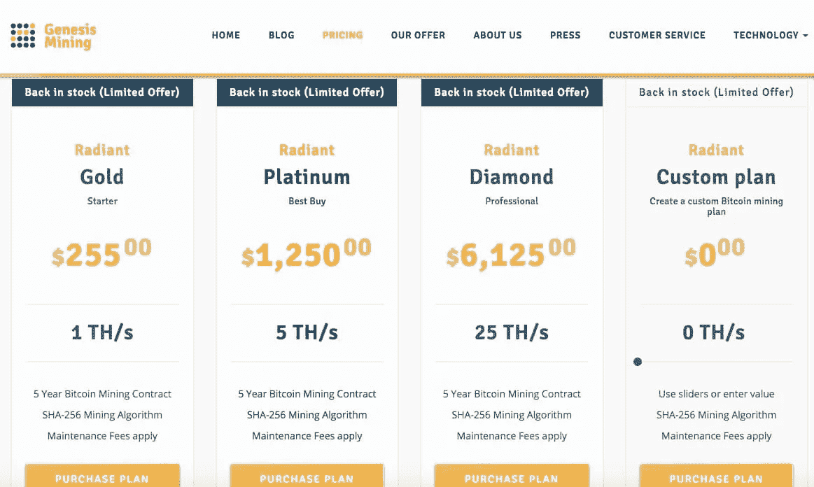
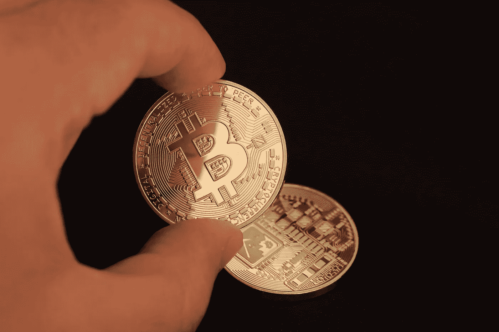
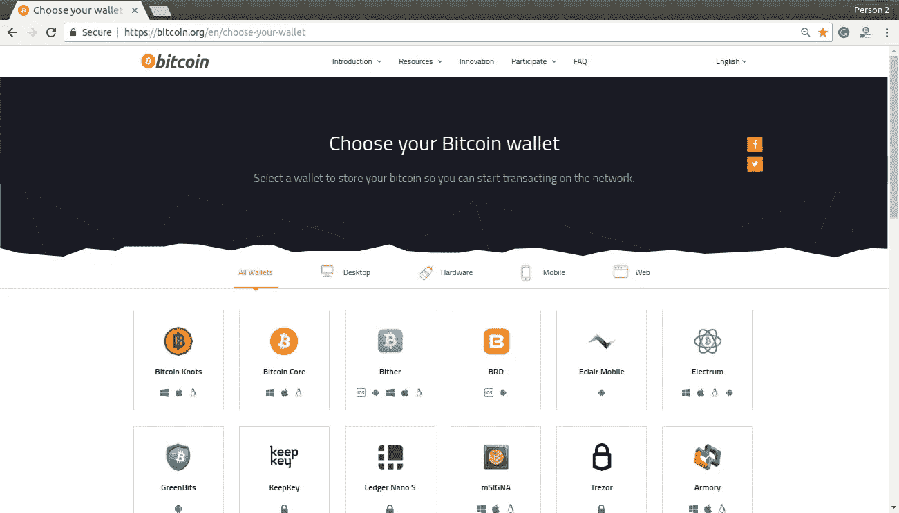

# 如何开始比特币挖矿

> 原文：<https://medium.com/coinmonks/how-to-start-bitcoin-mining-1975cd1229ce?source=collection_archive---------37----------------------->

## 如何挖掘比特币:需要遵循的所有步骤

不知道**如何挖掘比特币**？有两个选择:通过云矿公司，或者购买并使用专门设计的硬件。对我们来说，云采矿是最安全的投资，我们将解释为什么。无论如何，这两种选择都不便宜，这是你一开始就应该清楚的。

正如在任何业务中，事先研究是必不可少的。请记住，在加密货币的世界里**没有什么是有保证的。任何投资都可能会损失，所以在拿出你的信用卡之前，要充分了解自己。**

最后:我们下面给你的是一个信息指南，无论如何你都不应该把我们当成顾问或财务顾问。

# 采矿与投资

bitcoin mining

当比特币在 2009 年出现时，挖掘世界上第一种加密货币的过程只需要一台家用电脑，甚至不需要非常快或现代。目前，如果你想盈利，加密货币世界的切入点要复杂得多，尽管这并不意味着这是不可能的:它不再是曾经的山寨产业。

在我们讨论如何为自己挖掘比特币之前，需要注意的是，虽然加密货币的所有事情都存在不确定性，但挖掘可能是最不稳定的决定。硬件价格波动，挖掘比特币难度的变化，甚至在你努力工作结束时缺乏支付保证，都使其成为比直接购买比特币更具风险的投资。

由于这一点——以及市场的总体波动性——知道如何从比特币挖矿中获利可能是一个挑战。2018 年，矿业市场利润暴跌，进入门槛飙升。除非比特币技术发生重大变化，否则一切照旧的局面很可能会维持不变。如今，一枚比特币的价值约为 5 万美元，但挖掘它可能会付出巨大的代价。

最后，直接购买比特币至少能让你的钱立刻有所值。很明显，在走采矿路线之前，这是值得考虑的。

# 第一步——选择你的矿业公司

云采矿或“云采矿”是租赁采矿硬件，并让别人为您工作的实践。一般来说，你投资比特币会得到回报，即使硬件不是用来开采比特币的。就像一般的投资一样，做好你的研究很重要，因为即使是那些声称自己是最好的公司，也会有很多来自以前投资者的诋毁和抱怨。

几年来，几家矿业公司来了又走，包括我们与之交谈并直接证实的公司，如 Hash Flare，他在采访中告诉 Digital Trends，他们的每一个客户都通过使用他们的服务获利。你目前最好选择像比特币基地这样的公司，这是一家久负盛名的云矿业公司。这是昂贵的开始，但它是最好的选择之一。

对于更广泛的选择， [CryptoCompare](https://www.google.com.mx/url?sa=t&rct=j&q=&esrc=s&source=web&cd=&cad=rja&uact=8&ved=2ahUKEwjQgrTRi4bvAhVLIqwKHVYiANkQFjAAegQIARAE&url=https%3A%2F%2Fwww.cryptocompare.com%2F&usg=AOvVaw3-vGKCEFxxd9t7QUun21t3) 有一个用户评论和评级的矿业公司列表，尽管你应该保持警惕，因为有很多评论者希望利用这种情况。

# 步骤 2-选择采矿包

mining package

一旦你选择了云矿公司并报名，你需要选择一个采矿包。这通常包括选择一定数量的电源，并将其与您能负担的数量相结合。一般来说，支付更多的钱会给你带来更好的业绩或更快的利润，尽管情况并不总是如此。

大多数云开采公司将通过提供基于比特币当前市场价值、开采比特币的难度以及与您租用的电力交叉引用的估计来帮助您做出决定。然而，需要注意的是，这些数字可以而且将会发生变化，因此在选择你的合同之前，观察市场趋势并估计比特币的走向是很重要的。如果比特币的价值崩溃，现在可能有利可图的东西可能就不一定了。

只要像比特币基地这样的公司继续提供他们的计算器，我们会建议使用其他替代品来减少任何趋势进入计算的可能性。

有些云矿公司会以“预售”的方式卖给你一份合同。顾名思义，这意味着您要预先支付一份合同，而这份合同在新硬件上市后的几周或几个月内都不会生效。在大多数情况下，这是不可取的，因为没有办法保证这些合同开始时会盈利，甚至没有具体的迹象表明何时会盈利。

# 步骤 3 —选择一个采矿池

mining pool

选择你的合同后，大多数公司会要求你选择一个*矿池*。这就是你需要选择一个全球矿业团队加入的地方。

是一种通过挖矿增加赚取比特币几率的方法，是个人和云挖矿的标准做法。不同的团体各有利弊，这超出了本文的范围，但是加入一个费用低廉的成熟团体可能是你的最佳选择。

对新矿工来说，最受欢迎和信任的池之一是泥浆池，但你应该总是做你的研究。和公司一样，许多团体都不值得信任。

# 第 4 步—选择一个钱包

Bitcoin Wallet

一旦你完成了最后一步，你的云挖掘就开始了。几天或几周后，如果一切顺利，你应该会看到你的账户开始装满比特币。此时，建议将加密货币从云中取出并存放在安全的钱包中。然而，一些云采矿公司会允许你将你的收入再投资于更多的分散力量。

然而，无论你做什么，你都需要决定从长远来看你将如何处理你的比特币。虽然你可以用比特币购买许多产品和服务，但价格可能会波动，你可能需要做更多的研究，看看你是否得到了一笔好交易。

另一个选择是“HODling”，即保留你的比特币，这对于一些人来说也是一个可行的策略。“霍德勒”是那些持有比特币的人，因为他们相信比特币的价值会随着时间的推移而增加。不幸的是，没有可靠的方法来预测比特币的未来价值。

当然，我们不是金融顾问，我们不会建议你对你的加密货币做任何特别的事情。如果你决定保留你的比特币，你应该考虑一个安全的，甚至可能是基于硬件的钱包来存储它们。

# 想用自己的硬件挖掘比特币怎么办？

在你花钱购买任何硬件或采矿设备之前，你应该使用比特币采矿计算器来看看这个过程的成本。然后，你将能够决定在考虑所有成本的情况下，你是否有可能获利。请记住，价格也可能波动，电费可能会有很大差异。比特币挖矿对普通人来说过于昂贵，你通过经营自己的业务积累足够利润的可能性非常低。

因为建立一个适当的系统非常昂贵，所以我们只建议在你已经证明可以获得丰富且——至关重要——廉价的电力的情况下开采比特币。你还需要强大的网络连接。说到硬件，只有最新一代的 ASIC 矿工提供了任何获得比特币采矿的希望，所以对于直接的比特币采矿，请查看 [AsicMinerValue](https://www.google.com.mx/url?sa=t&rct=j&q=&esrc=s&source=web&cd=&cad=rja&uact=8&ved=2ahUKEwjX9IebjIbvAhVS-6wKHTCCAo4QFjAAegQIARAE&url=https%3A%2F%2Fwww.asicminervalue.com%2F&usg=AOvVaw0Gf-OgHTcvtKCjXrU_Et5Z) 网站，看看你需要什么。

直接比特币挖矿的一个替代方法是使用类似 NiceHash 的服务来开发自己的方法。NiceHash 允许用户插入他们的 ASIC 或 GPU/CPU 机器，并将其出租用于 altcoin 挖掘，所有利润都以比特币的形式发送给你。然而，在开始之前，检查一下盈利能力计算器是值得的，因为你需要考虑你的硬件的相对功率和你当地的电力成本，以潜在地获利。

> 加入 Coinmonks [电报频道](https://t.me/coincodecap)和 [Youtube 频道](https://www.youtube.com/c/coinmonks/videos)了解加密交易和投资

# 另外，阅读

*   [Bookmap 评论](https://coincodecap.com/bookmap-review-2021-best-trading-software) | [美国 5 大最佳加密交易所](https://coincodecap.com/crypto-exchange-usa)
*   最佳加密[硬件钱包](/coinmonks/hardware-wallets-dfa1211730c6) | [Bitbns 评论](/coinmonks/bitbns-review-38256a07e161)
*   [新加坡十大最佳加密交易所](https://coincodecap.com/crypto-exchange-in-singapore) | [购买 AXS](https://coincodecap.com/buy-axs-token)
*   [红狗赌场评论](https://coincodecap.com/red-dog-casino-review) | [Swyftx 评论](https://coincodecap.com/swyftx-review) | [CoinGate 评论](https://coincodecap.com/coingate-review)
*   [投资印度的最佳密码](https://coincodecap.com/best-crypto-to-invest-in-india-in-2021)|[WazirX P2P](https://coincodecap.com/wazirx-p2p)|[Hi Dollar Review](https://coincodecap.com/hi-dollar-review)
*   [加拿大最佳加密交易机器人](https://coincodecap.com/5-best-crypto-trading-bots-in-canada) | [KuCoin 评论](https://coincodecap.com/kucoin-review)