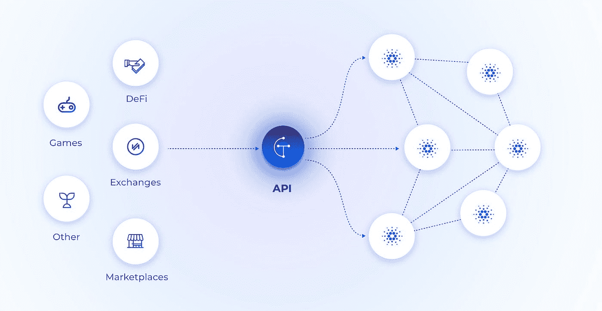
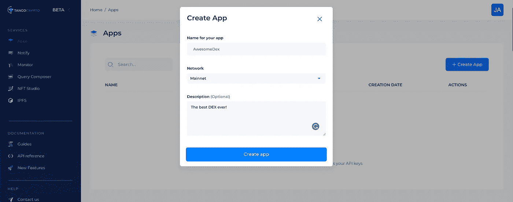
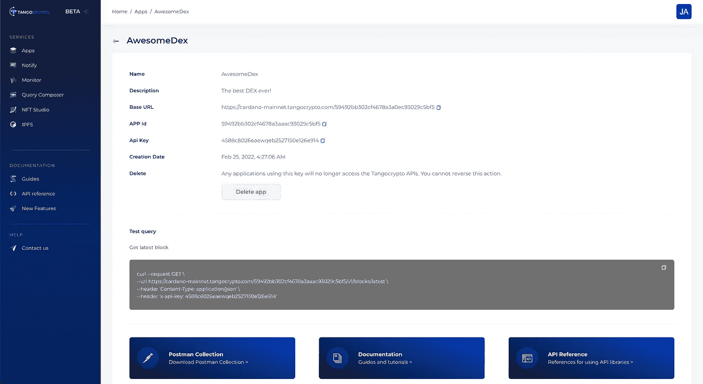

# 如何使用 Tangocrypto API 在 Cardano 上开始开发

> 原文：<https://medium.com/coinmonks/how-to-start-developing-on-cardano-using-tangocrypto-api-37243b802a3d?source=collection_archive---------32----------------------->

# 什么是 Tangocrypto？

我们提供了一套高可用性 API 和开发工具，用于快速可靠地访问 Cardano 网络，集成只需 1 分钟。作为一个从 Cardano 开始的开发者，你将面临以下问题:

*   如果不使用节点或 API 提供程序，就无法访问区块链上的信息。
*   你将不得不开始创建基础设施，而不是专注于你的产品和业务。
*   当用户需求增加时，内部基础架构不会自动扩展。
*   当构建与来自多个提供商的几个 API 服务的集成时，有很高的学习曲线、更广泛的错误面和增加的成本。

我们提供一个统一的平台，让您能够:

*   更快地运送产品并验证商业理念。
*   使用一个平台来获取、提交和听取链上信息、铸造代币、存储文件和处理支付。
*   依靠能够在不停机的情况下处理消费高峰的弹性基础设施，扩大用户群。
*   降低工程和基础设施运营成本。

我们的解决方案提供以下组件:

*   REST API
*   通知(网页挂钩)
*   NFT API

💻你现在可以在 https://dashboard.tangocrypto.com/register[创建一个**免费**账户，并开始编写你的下一个产品。](https://dashboard.tangocrypto.com/register)

# REST API[](https://developers.cardano.org/docs/get-started/tangocrypto#rest-api)

HTTP REST API 的目标是使开发更快更容易。没有必要与区块链同步和维护复杂的设置。不再需要从不同的入口点向区块链发出复杂的多个请求，开发人员可以在更少的请求中获得事务、令牌信息和调试所需的所有数据。



我们提供最易访问和最可靠的 Cardano 基础设施，使公司和开发者从维护复杂基础设施的责任中解脱出来，转而专注于构建他们的业务逻辑并为他们的客户提供价值。

*   **企业级基础设施**:利用我们全球分布式云托管节点网络的处理能力。我们的 API 减少了维护您自己的计算和存储资源的摩擦，降低了开发人员和企业的准入门槛。
*   **专为开发人员打造**:易于阅读的文档和资源，帮助开发人员快速入门。
*   **获得应用洞察**:我们的仪表盘提供关于 API 使用的直接洞察。深入到具体的请求方法，并获得响应时间，最常用的端点，一天中的时间使用，IP 地址，国家和更多。这些见解是基于用户行为优化应用程序的好方法。
*   标准接口:通过客户端兼容的 REST API 在 HTTPS 上支持 Mainnet 和 Testnet。
*   **始终在线**:运行在最新的网络升级上，保证最低 99.9%的正常运行时间。

# 网络和应用 ID[](https://developers.cardano.org/docs/get-started/tangocrypto#network-and-app-id)

您可以为您的查询选择 mainnet 或 testnet。API 要求有效的`app_id`包含在您的请求流量中。这个标识符应该附加到请求 URL 的后面。

网络

卡尔达诺主网:`[https://cardano-mainnet.tangocrypto.com/{app_id}/v1](https://cardano-mainnet.tangocrypto.com/{app_id}/v1)`

卡尔达诺试验网:`[https://cardano-testnet.tangocrypto.com/{app_id}/v1](https://cardano-testnet.tangocrypto.com/{app_id}/v1)`

# API 密钥头[](https://developers.cardano.org/docs/get-started/tangocrypto#api-key-header)

当你在[https://www.tangocrypto.com](https://www.tangocrypto.com/)上注册并创建一个应用时，一个`x-api-key`就被创建了。为了验证 API 调用，必须在每个请求中包含 HTTP 头`x-api-key`。

**完整的 API 参考**

点击这里查看我们的 API 完整参考文档[https://www.tangocrypto.com/api-reference/](https://www.tangocrypto.com/api-reference/)

# Tangocrypto [](https://developers.cardano.org/docs/get-started/tangocrypto#steps-to-get-started-with-tangocrypto)入门步骤

## 1.🔑创建一个 App[](https://developers.cardano.org/docs/get-started/tangocrypto#1--create-an-app)

要使用 Tangocrypto 的产品，您需要一个 API 密钥来验证您的请求。

您可以从仪表板中[创建 API 密钥，只需点击+创建应用程序，命名并点击创建:](https://dashboard.tangocrypto.com/home/dashboard)



一旦你的应用程序被创建，只需复制你的应用程序 id 和`x-api-key`，并开始提出请求。



## 2.🏗️提出请求，开始建造[](https://developers.cardano.org/docs/get-started/tangocrypto#2-%EF%B8%8F-smake-a-request-and-start-building)

使用 app-id 和`x-api-key`您可以发出请求。例如，让我们请求获取最新的块号:

```
curl --location \
--request GET 'https://cardano-testnet.tangocrypto.com/<app-id>/v1/blocks/latest' \
--header 'x-api-key: <your-api-key>'
```

您应该得到这样的结果:

```
{
    "id": "3064146",
    "hash": "f8eadfc91c3219b3d00d4a902174e0978e449f0e8a6f6b0584e06bbbedc0d050",
    "epoch_no": 158,
    "slot_no": 38197024,
    "epoch_slot_no": 310624,
    "block_no": 2940877,
    "previous_block": 2940876,
    "slot_leader": "pool1rcsezjrma577f06yp40lsz76uvwh7gne35afx3zrq2ktx50f8t8",
    "size": 365,
    "time": "2021-09-25T10:37:20.000Z",
    "tx_count": 1,
    "out_sum": 435928446,
    "fees": 171441,
    "op_cert": "333e175db9a2f89de5d9396c10b4dd136c3fffebd7f22d2eb0a3e8ef3884199c",
    "vrf_key": "vrf_vk1ltjt3ucuvah43gpeqpw4n6say9u6s0kju8c8q76xctmvgsqawgrq7kj48j",
    "confirmations": 1
}
```

## API 分页[](https://developers.cardano.org/docs/get-started/tangocrypto#api-pagination)

一些 API 端点对它们的响应进行分页，以使结果集更容易处理。例如，如果您请求一个可能太大而无法有效运行的对象列表，端点将返回第一批结果以及一个用于访问下一组结果的光标。

查询结果被分成大小为 1 MB(或更小)的数据“页”。应用程序可以处理结果的第一页，然后是第二页，等等。您将光标作为请求的 URL 查询参数包含在对端点的后续请求中。

要确定是否有更多的结果，并一次检索一页，应用程序应该执行以下操作:

1.  使用所需的`size`发出请求并检查结果，如果光标不为空，则使用与前一个请求相同的参数构造一个新请求。但是，这一次，从上一个查询中获取游标值，并在新请求中将其用作游标参数。
2.  如果结果中的`cursor`为空，这意味着没有更多要检索的项目。

## 例[](https://developers.cardano.org/docs/get-started/tangocrypto#example)

让我们使用 size=50 进行以下查询

```
https://cardano-mainnet.tangocrypto.com/<app-id>/v1/nft/collections?size=50
```

在响应中，我们看到游标有一个非空值(为了简单起见，只显示了一条记录)

```
{
    "data": [
        {
            "id": "3d010a77c0e24489923c2a9eda731dde",
            "name": "THE Collection",
            "url": "https://www.thecollection.io",
            "description": "thecollection description",
            "payout_address": "addr_test1qp9mj7vnenx4v99hw7ztfq03n7dmmujpgtlyfjhhel9w67nk72usllcew208n60ym94xcptfrgytuy5apwp565x28jgsg0ztq3",
            "token_count": 5000,
            "token_for_sale_count": 1000,
            "token_sold_count": 2000,
            "revenue": 123456,
            "service_fee": 123456,
            "nft_fee": 123456,
            "tx_fee": 123456,
            "income": 123456,
            "total_fees": 123456,
            "policy": {
                "lock": true,
                "lock_time": "2027-01-24T04:18:59.758Z",
                "policy_id": "90570cb29887860e1cf1af88a106f421d6f22333514dd4ab16e8ff12",
                "script": {
                    "type": "all",
                    "scripts": [
                        {
                            "type": "sig",
                            "keyHash": "ac1746df0ba039de81274d472a477fced610f57cebc5c7841074f54c"
                        },
                        {
                            "type": "before",
                            "slot": 46854826
                        }
                    ]
                }
            },
            "metadata": {
                "label": "721",
                "asset_name": "<asset_name>",
                "name": "<name>",
                "image": "<image_link>",
                "media_type": "<mime_type>",
                "description": "<description>",
                "attributes": {
                    "face": "<face>",
                    "twitter": "https://twitter.com/thecollection_io",
                    "copyright": "Tent 2021",
                    "color": "<color>",
                    "artist": "LOLO",
                    "collection": "The Collection",
                    "body": "<body>",
                    "eyes": "<eyes>",
                    "accessory": "<accessory>"
                },
                "version": "1.0"
            },
            "created_at": "2021-11-30T21:04:09.897Z",
            "updated_at": "2021-11-30T21:04:09.897Z"
        }
    ],
    "cursor": "a97f98a8c533ee55fc2c6897c9b50506dc8d65b921092e469f62f9d0e2d0dc92902605dba96d30b2e027557d3d6ea8cb3c1597d93e36f9c70771f19485f176607d834f6bc4fd664e0f68d4c28eff52cc298dee1dc17975c043d05903c31dae41ff84c779f1f8d2bcc00447e25d066a4e"
}
```

为了检索下一批项目，我们使用相同的查询，但是现在插入从上一步获得的光标作为查询参数:

```
https://cardano-mainnet.tangocrypto.com/<app-id>/v1/nft/collections?size=50&cursor=a97f98a8c533ee55fc2c6897c9b50506dc8d65b921092e469f62f9d0e2d0dc92902605dba96d30b2e027557d3d6ea8cb3c1597d93e36f9c70771f19485f176607d834f6bc4fd664e0f68d4c28eff52cc298dee1dc17975c043d05903c31dae41ff84c779f1f8d2bcc00447e25d066a4e
```

可以重复这个过程，直到光标为空，因为没有更多要检索的项目。

> 加入 Coinmonks [电报频道](https://t.me/coincodecap)和 [Youtube 频道](https://www.youtube.com/c/coinmonks/videos)了解加密交易和投资

# 另外，阅读

*   [最佳加密交换平台](https://coincodecap.com/best-crypto-swap-platforms) | [最佳加密交易所](https://coincodecap.com/crypto-exchange)
*   [购买比特币印度](/coinmonks/buy-bitcoin-in-india-feb50ddfef94) | [Pionex 评论](/coinmonks/pionex-review-exchange-with-crypto-trading-bot-1e459d0191ea) | [加密交易机器人](/coinmonks/crypto-trading-bot-c2ffce8acb2a)
*   [n rave 零点回顾](/coinmonks/ngrave-zero-review-c465cf8307fc) | [Phemex 回顾](/coinmonks/phemex-review-4cfba0b49e28) | [PrimeXBT 回顾](/coinmonks/primexbt-review-88e0815be858)
*   最佳[区块链分析](https://bitquery.io/blog/best-blockchain-analysis-tools-and-software)工具| [赚比特币](/coinmonks/earn-bitcoin-6e8bd3c592d9)
*   [Cloudbet 赌场评论](https://coincodecap.com/cloudbet-casino-review) | [点火赌场评论](https://coincodecap.com/ignition-casino-review)
*   [加密套利](/coinmonks/crypto-arbitrage-guide-how-to-make-money-as-a-beginner-62bfe5c868f6)指南| [如何做空比特币](/coinmonks/how-to-short-bitcoin-568a2d0b4ae5)