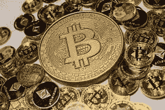
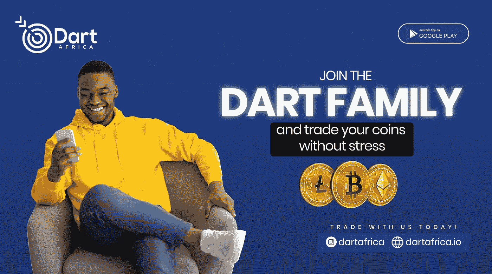

# 如何在尼日利亚开始投资比特币

> 原文：<https://medium.com/coinmonks/how-to-start-investing-in-bitcoin-in-nigeria-170ede080df2?source=collection_archive---------31----------------------->

尼日利亚人恰好是非洲乃至全球比特币最高用户之一。加密货币市场有趣且有利可图，这吸引了许多人的兴趣，随着奈拉价值的不断下降，尼日利亚人特别是年轻人正在寻找通过投资比特币来获得对奈拉的优势。

如果你是在尼日利亚寻找如何投资比特币的人之一，对比特币和加密货币整体有各种各样的疑问是正常的。比如比特币和加密货币的法律地位？如果比特币在尼日利亚已经被禁止，终极问题:如何在尼日利亚投资比特币？。在许多其他问题中。

但首先，我们先从基础说起。什么是加密货币？比特币是什么？以及你能用比特币做什么。

**什么是比特币**

比特币是创造一种不受政府控制的数字货币的首次成功尝试。加密货币是一种数字货币，使用区块链技术作为保存、保护和验证交易记录的手段。加密货币可以在没有政府或银行等任何中央机构的控制或管理下运行。

除了比特币，还有各种其他加密货币，通常被称为替代币。例如以太坊、莱特币、索拉纳、Dogecoin 等。

比特币是一种数字货币，不受任何个人、组织或政府控制，而是由全球比特币用户控制。

**比特币和加密货币在尼日利亚的法律地位**

禁止比特币或其他加密货币在技术上是不可能的，然而，尼日利亚中央银行已经限制所有银行与所有加密货币实体进行交易，这意味着你不能肮脏地使用你的银行来购买或出售加密货币。

这并没有阻止尼日利亚人交易加密货币。各种加密交易平台已经想出了使用合适的支付方式轻松购买和投资比特币的方法。

## **在尼日利亚投资比特币的成本**

在中央银行的限制之前，投资加密的成本曾经非常低，根据您使用的加密交换平台，您可以从低至 N500 开始。然而，由于禁令，由于各种支付方式的相关费用，从小额开始并不划算。以几千起步为宜，比如说一万。

## **如何在尼日利亚投资比特币**

**1。选择比特币(加密)钱包:**加密钱包用于存储你的加密货币，大致分为冷钱包和热钱包。如果你对比特币的短期投资感兴趣，并且你的资本没有那么大，那么最好使用热钱包。热门钱包与互联网相连，因此你可以买卖和交易你的比特币。冷钱包不与互联网连接，更适合大型加密投资者，因为它使用起来更安全。

以下是尼日利亚一些最好的加密和比特币钱包；

*   币安
*   雷米塔诺
*   捆
*   Paxful
*   比特币基地
*   Quidax
*   信任钱包
*   北海巨妖

**2。在尼日利亚选择从哪里购买你的比特币:**购买 crypto 的平台可以分为两种；加密经纪人和加密货币交易平台。加密经纪人通常向用户提供简单的支付方式，如银行转账或借记卡支付。你只需向他们发送相当于比特币的奈拉，他们就会将比特币发送到你的钱包里，市场上有各种知名的加密经纪人。

加密交易平台有各种支付方式，例如，Luno 有一个凭证支付系统，币安在其平台上整合了一个 P2P 交易系统。P2P 交易所允许人们通过匹配买家和卖家，并使用托管系统来确保双方的安全，从其他投资者那里购买加密货币。

**3。购买比特币:**选择一个平台，用他们创建一个账户。大多数加密货币交易平台需要 KYC(了解你的客户)政策才能使用他们的服务。创建帐户后，通过提交您的 ID 信息来验证您的帐户。

当你使用像 [Dart Africa](https://dartafrica.io/) 这样的加密经纪人时，出售你的比特币也很容易。非洲灾难援助反应队是非洲最好的交流平台之一，他们主要在尼日利亚和加纳运作。由于其良好的汇率，Dart Africa 增加了您从比特币投资中获利的机会。您可以使用 Dart Africa coin calculator 功能检查当前汇率。

访问他们的网站或下载谷歌 Play 商店上的移动应用程序，体验在 Dart Africa 上交易加密货币带来的其他惊人优惠。

在 Dart Africa 上卖你的比特币，很简单；

*   创建一个帐户，如果您已经有帐户，请登录。请确保通过验证邮件验证您的帐户。
*   如果您是新用户，请创建您的帐户 PIN。取款时需要您的密码。
*   在“*卖币*”界面选择比特币作为您首选的加密货币，并输入您要出售的比特币数量。
*   在下一页，系统将为您提供一个钱包地址来发送比特币，您可以通过扫描条形码或手动输入地址来完成此操作。
*   发送后，您将在负时间内收到比特币付款。

> 加入 Coinmonks [电报频道](https://t.me/coincodecap)和 [Youtube 频道](https://www.youtube.com/c/coinmonks/videos)了解加密交易和投资

# 另外，阅读

*   [如何在 FTX 交易所交易期货](https://coincodecap.com/ftx-futures-trading) | [OKEx vs 币安](https://coincodecap.com/okex-vs-binance)
*   [CoinLoan 评论](https://coincodecap.com/coinloan-review) | [YouHodler 评论](/coinmonks/youhodler-4-easy-ways-to-make-money-98969b9689f2) | [BlockFi 评论](https://coincodecap.com/blockfi-review)
*   [XT.COM 评论](https://coincodecap.com/profittradingapp-for-binance)币安评论 |
*   [SmithBot 评论](https://coincodecap.com/smithbot-review) | [4 款最佳免费开源交易机器人](https://coincodecap.com/free-open-source-trading-bots)
*   [比特币基地僵尸程序](/coinmonks/coinbase-bots-ac6359e897f3) | [AscendEX 审查](/coinmonks/ascendex-review-53e829cf75fa) | [OKEx 交易僵尸程序](/coinmonks/okex-trading-bots-234920f61e60)
*   [如何在印度购买比特币？](/coinmonks/buy-bitcoin-in-india-feb50ddfef94) | [瓦济克斯评论](/coinmonks/wazirx-review-5c811b074f5b)