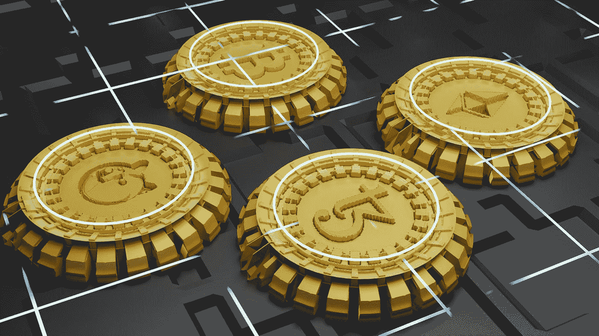
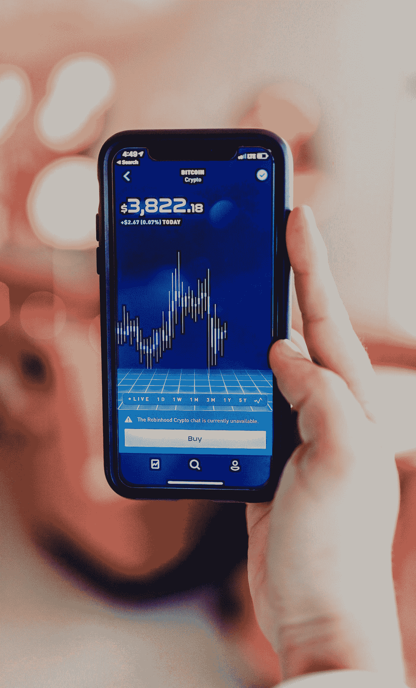

# 如何用一个渴望的金融克隆平台开始你的分散式金融创业？

> 原文：<https://medium.com/coinmonks/how-to-start-your-decentralized-finance-venture-with-a-yearn-finance-clone-platform-19f055b94159?source=collection_archive---------8----------------------->

传统金融体系有一个可行的替代方案。这是因为区块链技术、加密货币和分散金融(DeFi)的大量采用。同样，有一个平台可以确保投资者进行有效的资产管理。这是渴望金融。

交易者在以太坊和方顿区块链操作，锁定了令人难以置信的 38.6 亿美元。你是一个寻求推出一个开源和透明的资金管理平台的企业家吗？ [**打造渴望金融的克隆人现在**](https://www.appdupe.com/yearn-finance-clone) 。

Photo by [Scott Graham](https://unsplash.com/@homajob?utm_source=medium&utm_medium=referral) on [Unsplash](https://unsplash.com?utm_source=medium&utm_medium=referral)

# **一个渴望财务克隆脚本是如何工作的？**

*   重要的是，预建的 DeFi 平台具有类似于渴望金融的功能。它以聚合器模型的形式运行。因此，投资者可以使用 Aave、Compound、Fulcrum 和 dYdX 等平台提供的贷款服务。
*   用户可以通过使用保险库选项获得高回报。他们必须存放加密令牌和定义资产，并选择适当的投资策略。随后，他们可以在渴望金融克隆脚本上轻松积累财富。
*   除此之外，流动性提供者(LP)在管理金库的运作中发挥着至关重要的作用。他们定期下注，赚取丰厚的奖励。
*   一定比例的奖励会锁定在金库里。储户也可以选择乘数，并以交易费作为收入。
*   这个概念被称为什么？是 Boost。总体而言，回报因托管中锁定的 DeFi 令牌总量以及流动性池(LP)中每笔存款的规模而异。

Photo by [Shubham Dhage](https://unsplash.com/@theshubhamdhage?utm_source=medium&utm_medium=referral) on [Unsplash](https://unsplash.com?utm_source=medium&utm_medium=referral)

# **分析监管令牌在渴望金融克隆平台中的重要性**

*   渴望金融克隆平台的用户可以对影响未来增长和发展的提案进行投票。
*   因此，他们收到渴望金融(YFI)令牌在许多阶段。
*   积极参与分散金融(DeFi)平台治理的代币持有者将获得额外奖励。此外，YFI 代币从国库中收回。
*   决定治理令牌分布的 4 个因素是什么？它取决于金库中锁定的代币数量、持续时间、投入金库代币的储户数量以及权重百分比。
*   此外，金库计量将在满足存款人和流动性提供者(LP)的要求方面发挥关键作用。
*   因此，锁定 YFI 令牌更长时间的用户将获得更多奖励和更大份额的投票权。
*   如果投资者在特定期限之前从锁中取出代币会怎么样？他们支付特定的罚金。其余的 YFI 金融代币持有者将直接从他们的硬件和软件钱包中收到这笔钱。

Photo by [Austin Distel](https://unsplash.com/@austindistel?utm_source=medium&utm_medium=referral) on [Unsplash](https://unsplash.com?utm_source=medium&utm_medium=referral)

# **向往金融类平台的主要特征是**

**支持众多钱包—** 像“渴望金融”这样的分散式应用程序(DApp)使投资者能够轻松管理他们的资金。他们可以使用热门钱包，如 Authereum、比特币基地钱包、Fortmatic、Lattice、MetaMask、Opera、Portis、Torus、Gnosis Safe、Liquality、Keystone 以及 WalletConnect 开源协议认可的其他钱包。除此之外，流动性提供商(LP)可以通过使用 Ledger 和 Trezor 这样的冷钱包来保护他们的加密资产。

**个性化仪表板—** 它分享关于净值、收益和金库预期年收益率的实时信息。因此，投资者可以密切关注他们所持股票的表现。关于各种金融服务的总余额和性能的统计数据，如 Vaults、Iron Bank 和 Earn lending aggregator。这确保了最大的透明度。

**滑点容忍度设置—** 有时候，投资者下单时会有巨大的需求。执行价格和报价可能会略有差异。因此，用户可以通过点击滑点允差按钮来防止亏损。他们可以确定一个百分比。

此外，投资者可以根据流动性水平改变策略。一般来说，市价单和限价单的情况不同。例如，交易者可以以卖家愿意提供的价格购买数字代币，如果他们下市场订单的话。在限价单的情况下会发生什么？买卖订单以投资者设定的价格或高于投资者设定的价格处理。

**铁银行—** 投资者可以通过点击铁银行选项实现收益最大化。因此，他们可以使用存放在金库里的钱，选择收益农业或跨资产转移。因此，流动性提供商(LP)可以通过点击机会按钮来选择各种加密货币、稳定币、DeFi 代币和包装代币。此外，还提供了以年百分比表示的贷款和借款百分比(APY)以及以美元表示的市场流动性的综合信息。用户可以根据自己的需求和投资组合目标选择供应或借入选项。

**多语言技术支持—** 投资者和储户在 [**渴望金融克隆平台**](https://www.appdupe.com/yearn-finance-clone) 上获得全天候技术支持。他们可以联系帮助中心，以自己选择的语言获得支持。

# **多链兼容将如何决定向往金融(YFI)的未来？**

自 2020 年推出以来，向往金融已经走过了漫长的道路。总的来说，投资者已经在去中心化金融(DeFi)协议上锁定了惊人的 130 万以太币(ETH)和 89400 比特币(BTC)。

目前，它分别在以太坊和方顿区块链运行。因此，投资者获得了优势，如互操作性、无缝访问分散应用程序(DApps)、高可伸缩性、更多流动性以及没有中介。

此外，Fantom 区块链为流动性提供者(LP)提供了巨大的好处。它包括快速处理事务、更高的吞吐量以及与以太坊虚拟机(EVM)的兼容性。

重要的是，用户可以获得各种金融服务。他们可以选择分散交易所(DEXes)、借贷、收益率优化以及买卖不可替代代币(NFT)等选项。

由于 Chainlink 的 Oracles 和 Band 协议共享全面的价格馈送，真实性得到了保证。而且，应用编程接口(API)与区块链探索者和钱包集成。因此，图表和图形将显示价格、交易量和市值变化的细节。

用户还可以通过押上他们的资本，将他们的加密令牌锁在金库里，并通过复合他们的股份来频繁地要求奖励，从而提高他们的回报。

# **结束**

您希望建立一个高级分散金融(DeFi)协议吗？现在就与广受好评的白标解决方案提供商建立联系，并尽快开发一个类似渴望金融的平台。

> 加入 Coinmonks [电报频道](https://t.me/coincodecap)和 [Youtube 频道](https://www.youtube.com/c/coinmonks/videos)了解加密交易和投资

## 另外，阅读

*   [交易杠杆代币的最佳交易所](https://blog.coincodecap.com/leveraged-token-exchanges) | [购买 Floki](https://blog.coincodecap.com/buy-floki-inu-token)
*   [3 commas vs . Pionex vs . crypto hopper](https://blog.coincodecap.com/3commas-vs-pionex-vs-cryptohopper)|[Bingbon Review](https://blog.coincodecap.com/bingbon-review)
*   [加密复制交易平台](/coinmonks/top-10-crypto-copy-trading-platforms-for-beginners-d0c37c7d698c) | [如何在 WazirX 上购买比特币](/coinmonks/buy-bitcoin-on-wazirx-2d12b7989af1)
*   [CoinLoan 评论](https://blog.coincodecap.com/coinloan-review)|【Crypto.com 评论】T2
*   [最佳网上赌场](https://blog.coincodecap.com/best-online-casinos) | [币安评论](/coinmonks/binance-review-ee10d3bf3b6e) | [BitMEX 评论](https://blog.coincodecap.com/bitmex-review)
*   [麻雀交换评论](https://blog.coincodecap.com/sparrow-exchange-review) | [纳什交换评论](https://blog.coincodecap.com/nash-exchange-review)
*   [美国最佳加密交易机器人](https://blog.coincodecap.com/crypto-trading-bots-in-the-us) | [经常性回顾](https://blog.coincodecap.com/changelly-review)
*   [在印度利用加密套利赚取被动收入](https://blog.coincodecap.com/crypto-arbitrage-in-india)
*   [Godex.io 评审](/coinmonks/godex-io-review-7366086519fb) | [邀请评审](/coinmonks/invity-review-70f3030c0502) | [BitForex 评审](https://blog.coincodecap.com/bitforex-review)
*   [最佳比特币保证金交易](/coinmonks/bitcoin-margin-trading-exchange-bcbfcbf7b8e3) | [萝莉点评](/coinmonks/lolli-review-e6ddc7895ad8) | [比特币保证金交易](https://blog.coincodecap.com/bityard-margin-trading)