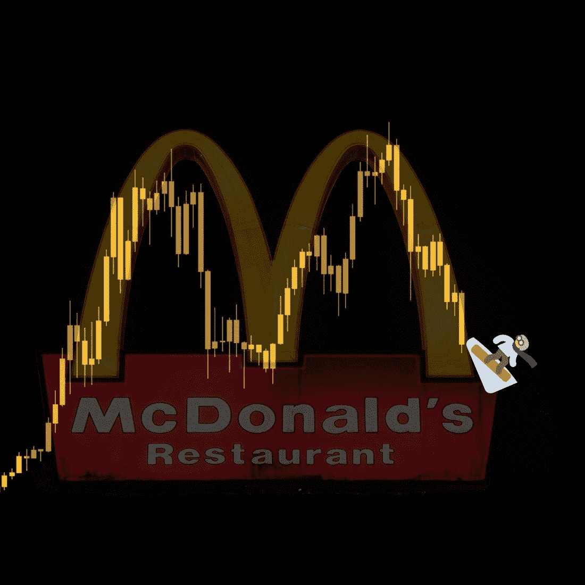
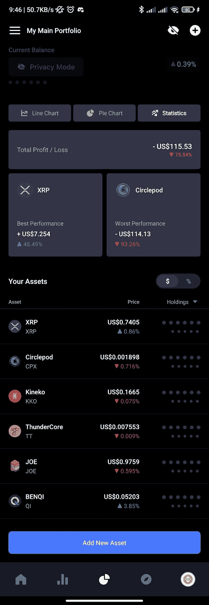
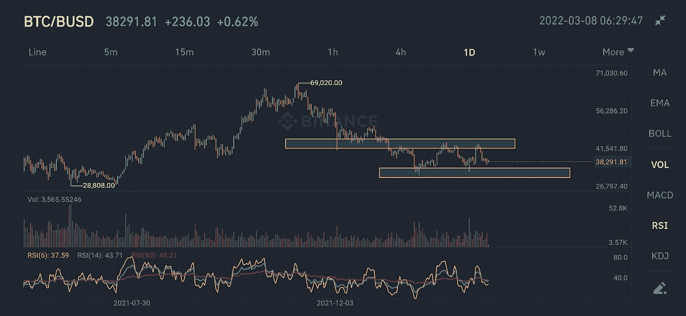
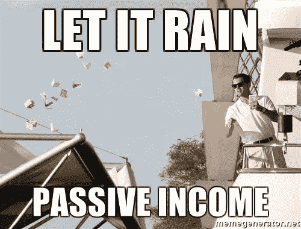
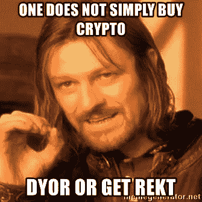
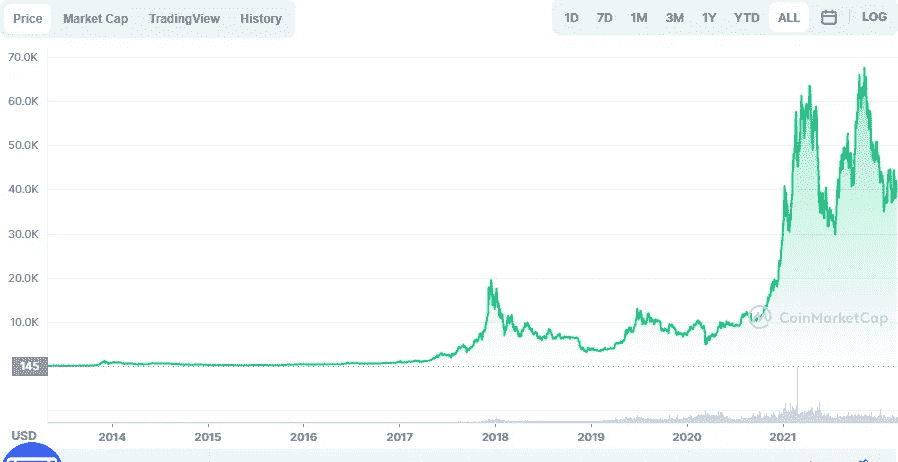

# 如何在熊市中生存

> 原文：<https://medium.com/coinmonks/how-to-survive-a-bear-market-79f4903618d8?source=collection_archive---------22----------------------->

Sliding down lower to discover oil

我在这里只是给你我所研究的信息，所以在我们开始之前请注意两个要点:

*   ***这不是财务或投资建议(NFA)这主要是为了提供信息***
*   ***【DYOR】***

自从市场在 69k 美元见顶以来，我们一直在努力恢复高点，触及 32k 美元，并停留在 40k 美元的中低区域。大多数买了蘸酱的人看到蘸酱进一步下跌，可能会买另一种蘸酱，它继续下跌。 **Rekt** 。这就引出了一个问题:文月亮？

我们首先需要了解市场周期，它们对我们手中的袋子意味着什么，以及我们如何度过这一价格暴跌的浪潮。

# **多头 vs 空头**

我敢肯定，自从你进入加密领域以来，你已经听说了很多关于牛市和熊市的事情。我们可以说，当市场经历持续或大幅增长时，它可以被称为牛市，但当市场处于稳定或持续下降时，即当整体市场呈上升趋势时，我们可以说我们正处于牛市季节，当趋势下降时，就该是时候提高你的人际交往技能，在你附近的麦当劳店露出你最好的笑容了。

我们目前处于熊市吗？

我所知道的是，我的袋子已经从最高点下降了至少 60%。

A Coinmarketcap screenshot of one of my portfolios

这是一个非常可怕的处境。有人说，当美国主要股指从峰值下跌超过 20%时，我们就可以说趋势是熊市。对于小客户来说，这超过了 75%。仅在 BTC，我们目前就下降了 40%左右。这是熊市吗？根据上面的定义，我们已经经历了持续的下跌，价格已经下跌了超过 20%。一些人还说时间还不够长(仅仅四个月)，所以他们还不会称之为熊市。

BTCBUSD daily chart showing some recent lows, highs and zones of interest for the next step

# 我们现在应该做什么？

首先，一定不要慌。熊市是很多人害怕的时候，他们害怕进一步下跌，希望兑现他们的损失。一些代币已经失去了超过 90%的价值，任何低于当前水平的下跌都是有害的。因此，从我的阅读中，我发现了一些可以帮助我们在这些汹涌的浪潮中游泳的东西，当我们从另一边出来时，我们将为下一轮牛市做好更好的准备。

## **避免膝跳反应**

预测熊市何时结束(入市时间>择时入市)极其困难。许多投资者正在撤资，供大于求，影响下跌的可能是多种外部因素。你必须保持头脑冷静。不要匆忙做出任何决定。再多的情绪也救不了你的投资组合。

## **重新平衡你的投资组合**

在你开始购买任何代币之前，你对它的增长有预期，对吗？有时候，我们被上涨趋势的炒作套牢，冒更大的风险，希望上涨趋势结束。好吧，现在是时候评估你的投资组合，并根据它们的风险水平来安排你的投资了。低/中/高。这有助于你知道哪些是值得增加的，哪些是可以减少的。多持有一些美元，这样你就可以投资一些稳健的项目，尽管价格下跌，这些项目依然坚挺。也许 15-40%可以在马厩里。你可以跳出波动性更大的令牌，进入具有适当效用、令牌组学和以往熊市幸存记录的令牌。这个时候我个人不会推荐德根的剧。风险要高得多。这就引出了下一点。

## **平均美元成本**

美元成本平均法(DCA)是一种方法，在这种方法中，无论当前价格如何，你都可以不断地增加你的持有量，而不是一次性地一次付清。这样做的目的是平衡你的投资，当价格回升时，你的平均进场价格会增加，这时你就有利润了。例如，如果你计划购买价值 1200 美元的 STX，你可以将这笔钱分成 12 份，每两周投资 100 美元。这对长期投资来说效果更好。有了这个，你就不必为市场计时了。

## **跑马圈地**

Source: Twitter

在熊市中，你可以只赌你的代币，赚取被动收入。它消除了每天关注价格波动的压力。大多数第 1 层和第 2 层协议提供不同回报率的赌注。你可以考虑在智能合约中锁定代币，并从中获利。

## **研究(和发展自己)**

在熊市期间，流动性通常会枯竭，许多开发人员会失去兴趣，而一些人仍会继续构建和发布更新。他们让自己的社区参与进来，并努力让他们的令牌值得投资。然后，找出这些标记和生态系统对你最有利。加入他们的社区，这样你就可以放心地购买他们的项目，尽管价格很低。此外，投资于你自己，学习一项新技能，你可以用它作为收入的替代来源。你可以学习软件开发，图形设计，你可以领导社区。任何能让你全神贯注的事情。

All time BTC chart from coinmarketcap

熊市过后总会有牛市。这在价格行为中很明显。如果你认为现在还为时过早，我们有必要保持耐心和积极的态度等待它结束。瓦格米。

*礼遇:* [*德根研究中心。*](https://discord.gg/GUBQANGW)

> 加入 Coinmonks [电报频道](https://t.me/coincodecap)和 [Youtube 频道](https://www.youtube.com/c/coinmonks/videos)了解加密交易和投资

# 另外，阅读

*   [Bookmap 点评](https://coincodecap.com/bookmap-review-2021-best-trading-software) | [美国 5 大最佳加密交易所](https://coincodecap.com/crypto-exchange-usa)
*   最佳加密[硬件钱包](/coinmonks/hardware-wallets-dfa1211730c6) | [Bitbns 评论](/coinmonks/bitbns-review-38256a07e161)
*   [新加坡十大最佳加密交易所](https://coincodecap.com/crypto-exchange-in-singapore) | [购买 AXS](https://coincodecap.com/buy-axs-token)
*   [红狗赌场评论](https://coincodecap.com/red-dog-casino-review) | [Swyftx 评论](https://coincodecap.com/swyftx-review) | [CoinGate 评论](https://coincodecap.com/coingate-review)
*   [投资印度的最佳密码](https://coincodecap.com/best-crypto-to-invest-in-india-in-2021)|[WazirX P2P](https://coincodecap.com/wazirx-p2p)|[Hi Dollar Review](https://coincodecap.com/hi-dollar-review)