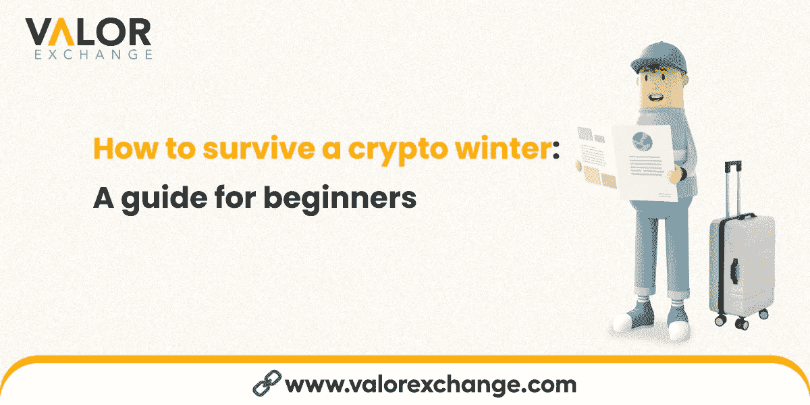

# 如何度过一个秘密的冬天-初学者指南？

> 原文：<https://medium.com/coinmonks/how-to-survive-a-crypto-winter-a-guide-for-beginners-28bbe6474da6?source=collection_archive---------28----------------------->

街上的传言是冬天来了。由于加密系统崩溃，今年损失了很多钱。许多人已经开始质疑我们是否还在购买蘸酱？还是购买秋季？

一个秘密的冬天可能会很可怕，我们正在谈论忘记在你母亲或你富有的叔叔生日的时候打电话给他们。我们不喜欢想象，更不喜欢经历。但是，我们会经历另一个隐秘的冬天吗？

首先，我们需要了解这个术语的含义以及它会如何影响任何人，然后我们将探讨你可以做些什么来保护自己免受它的影响。

这一信息不仅限于加密爱好者，因为全球经济正在经历他们版本的加密冬天。如果你有你爱的人，你想让他们知道现在正在发生的事情，那么你应该和他们分享这些。

如果信息对你很重要，并且你想在你的加密货币之旅中获得更多价值，那么就加入我们的[Telegram](https://t.me/valorexchangecommunity)社区吧。我们不会分享任何对您来说不相关或不重要的信息。

# 什么是隐冬？

你知道有雨季和旱季。密码市场也经历了类似的事情。这叫市场趋势。

有一个牛市趋势，一切都很好。资产价格如预期一样上涨，甚至我们的首席执行官也面带微笑。

与此相反的是熊市趋势。这是资产价格下跌的时候。如果这种情况持续超过一年或更长时间，我们称之为密码冬天。

自今年年初以来，加密货币市场一直在下跌。最近，随着密码市场从超过 2 万亿美元下降到不到 9000 亿美元，创下了历史新低。

那么，在一个隐秘的冬天，人们会做些什么呢？

免责声明:重要的是要注意，我们不是财务顾问，我们不声称给出财务建议。这篇文章旨在为我们的读者提供信息，并希望清晰明了。

**不要投入自己输不起的资本:**有句老话叫“不要做比自己更多的事”。它通常意味着不要过度或不要超越你的极限。如果你计划投入加密货币交易的资金在丢失的情况下会削弱你的能力，那就不要这么做。

加密冬天以前也发生过，它们过去了，但一些加密货币没有完全过去。这就是风险因素的来源。当 ValorExchange 出现时，我们希望让[我们的社区](https://t.me/valorexchangecommunity)获得市场上最好的加密货币，这些货币已经并能够经受住加密冬天或加密崩溃。这是我们选择比特币、以太和 USDT 的部分原因。

**通过成为加密提供商赚钱:**你可以从更大的公司购买加密货币，并以自己的价格出售，以满足当地市场的需求。这是用加密货币赚取更多利润的有利可图的方式。你可以在 ValorExchange 上获得加密货币的最佳汇率。在我们这里创建一个[账户](https://account.valorexchange.com/)，加入我们的等候名单，享受这项专属服务。

**拿你的货币当挡箭牌:**如果你生活在第三世界国家，你就知道货币贬值意味着什么。你不得不花更多的钱去买以前花了更少钱买的东西，这种痛苦。

如果你在国外有兄弟姐妹或孩子，你会知道当你感觉甚至你的货币都与你作对时，支付学费和其他公用事业费用是多么困难。忘记你的“村民”，因为通货膨胀和贬值是你真正的敌人。

然而，你可以通过将你的法定货币兑换成抗通胀的加密货币，如 USDT、瑞士法郎或 BTC，来保护自己免受通胀的影响。例如，USDT 是一种稳定的硬币，无论发生什么情况，它都保持固定的价格。1 USDT 等同于 1 美元。所以，这就像在区块链用你的奈拉换一美元。

# 最后

该行业正面临一个可能的加密冬天，但幸运的是，你可以做一些事情来保护自己免受更严酷的现实。加入我们的社区，你不会后悔的。您可以使用加密货币做更多的事情，我们希望与您分享一个充满可能性的世界。这是完全免费的，所以今天就加入我们的[电报吧。](https://t.me/valorexchangecommunity)