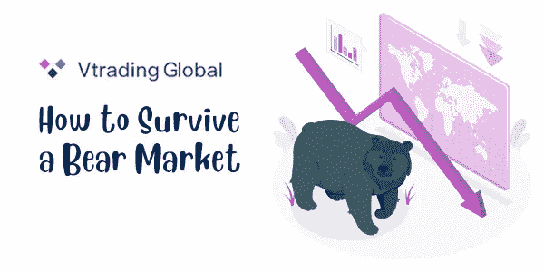
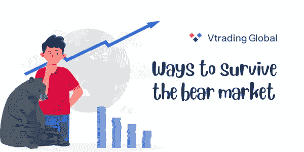
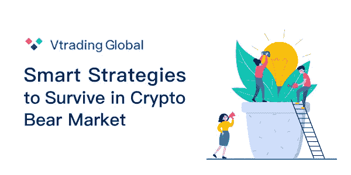

# 如何在熊市中生存？

> 原文：<https://medium.com/coinmonks/how-to-survive-in-a-bear-market-709869c61d31?source=collection_archive---------67----------------------->

> 最近加密市场处于困难时期，不要担心，你并不孤单。但幸运的是，熊市远不是负面的。这里有 10 种方法可以帮助你在熊市中生存下来，甚至从中获利。

# 1.不要惊慌。

市场不是被设计成永远直线上升的。你总是会注意到一些令人恐惧的下跌和低谷。
市场需要不时稳定下来，这是买入更多的机会。

# 2.美元平均成本

DCA(美元平均成本)是一个伟大的技术，通过以不同的价格多次买入来降低专项投资的进场价格，这样当它上涨时，你就可以获利 10 倍以上。

人们经常抱怨这种说法，说你可以再等等，因为现在还不是底部。真实的事实是，没有人能够非常准确地预测市场，所以你可能是对的，也可能是错的。DCA 是一个完美的位置，它让你可以抓住多个价格水平，得到一个好的中间值。

# 3.相信你所支持的

这经常是一句被遗忘的话，但是请花点时间思考一下。如果你不相信你投资的东西，你该如何面对市场调整。就这么简单，做研究，深入了解项目是什么。成功的理解是掌控投资的关键。知识就是力量，它背后有一个原因。

# 4.保持现实

比特币或其他密码甚至股票往往是长期投资。一夜暴富基本上是一个梦想，尽管这种事情时有发生。几率超级低。这就是为什么你需要考虑长远。投资不仅仅是赚零花钱。这是你的未来，这是你放弃你讨厌的日常工作，做一些你喜欢的事情的方式。每天朝九晚五的工作永远不会改变，但你有能力掌控自己的未来。所以好好利用这一点。

# 5.投资组合

为了减少熊市的损失，你需要分散你的投资。
在加密领域，一切都在下降，因此不会真正改变，但它仍然会对项目的风险产生影响。例如，如果在索拉纳发生了不幸的事情，你还有比特币、柴犬、以太坊或其他硬币和代币。如果你只有一个位置，那就真的很可怕了。

但玩不玩冒险游戏取决于你。有些人喜欢 yolo，有些人喜欢稳定。顺便说一下，这也适用于加密之外。得到一点点房地产，黄金股票和口袋妖怪卡或收藏物品。有了这些，你就从根本上降低了摔倒在地的风险。

# 6.不要总是检查你的手机。

我知道看到你有多少和发生了什么很诱人。但是不健康。它有助于改变你的思维方式，削弱你正确决策的能力。休息一下。

# 7.不要听 fomo

对错失良机的恐惧正在扼杀新的投资者，你没有错失良机。机会多的是。即使在 10 年后，你也能从便士中赚到 100 万美元。不要听骗子的话。比特币远未达到历史最高水平。例如，房地产市场的市值是 456 万亿美元，而加密只有两万亿美元。

# 8.质疑你自己

问问你自己为什么不买更便宜的东西。熊市真的令人讨厌还是只是免费赚更多钱的一种方式。人们可以在牛市中毫无问题地买入，但在熊市中却不行。

# 9.管理您的资金

人们总是说他们再也买不到蘸酱了，因为蘸酱太多了。对此你需要有一个战略方法。不要一次性购买所有东西。相反，把你的 100 英镑分成 10 包，每包 10 英镑，用于接下来的 10 次跳水。放聪明点。

# 10.保持健康

最后一点是保持健康。进行一项体育活动。做些事情来保持头脑清醒。这很重要。不要在同一个环境里逾期逗留。

[Vtrading](http://www.vtrading.com/) 是一个为每个交易者提供交易策略的加密交易平台。智能 DCA 交易机器人已在 Vtrading.com 上市，可以帮助您更轻松地进行交易。而且最重要的是，目前是免费提供的。快来加入 Vtrading，让它帮你赚更多。

[从这里开始试炼](https://www.vtrading.com/#/)

> 加入 Coinmonks [Telegram group](https://t.me/joinchat/Trz8jaxd6xEsBI4p) 并了解加密交易和投资