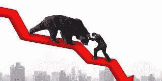
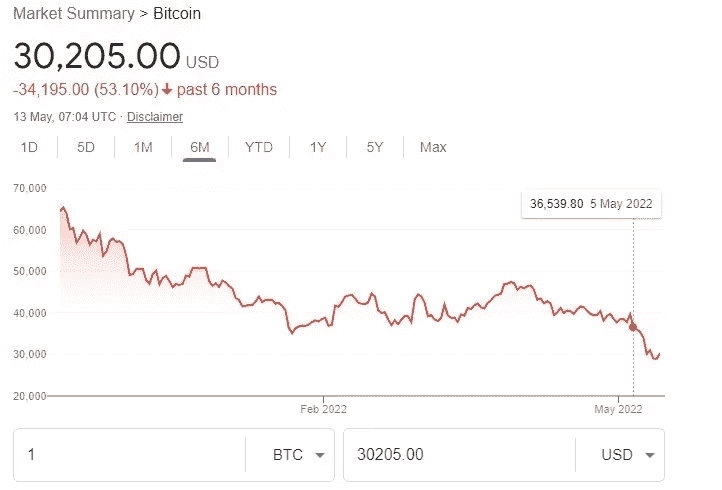

# 如何在熊市中生存下来

> 原文：<https://medium.com/coinmonks/how-to-survive-the-bear-market-as-a-crypto-trader-9894e892d857?source=collection_archive---------43----------------------->

不要做空市场

**有长期战略**

**使用平均美元成本**

多样化你的投资组合

**不做日内交易**

对于投资者来说，熊市通常是一个棘手的时刻，尤其是在以剧烈波动著称的加密市场。

自 2021 年 11 月加密市值达到超过 3 万亿美元的峰值以来，一直呈持续下降趋势，在 Q1 2022 结束时，市值达到 2.1 万亿美元。

暴跌一直持续到 5 月份，使市值达到 1.3 万亿美元，几乎是 3 月份被波动性冲走的市值的一半。自去年 11 月以来，市值最大的加密货币资产比特币暴跌 50%以上，而像卢纳和 UST 这样受欢迎的稳定硬币已经从根本上动摇了。

这给投资者带来了巨大损失，尤其是那些持有替代硬币的投资者。

通常，如此大规模的价值下跌之后会有一段时间的悲观情绪。

然而，如果你正确出牌，即使未来出现熊市，也可以帮助改善你的加密货币投资组合。作为加密货币投资者，在面临熊市时，你可以做以下几件事。

**不做空市场**

我最近偶然发现一位投资分析师的建议，随着熊市的加剧，比特币可能会跌至 5000 美元，从本质上说，他是在鼓励他的观众做空这个市场。但我敢说，这是一个错误的举动，可能会自食其果。做空市场的时间已经过去了。一些领先的专家强调，这样的策略弊大于利，这样的决定将基于情感而不是明智的市场分析。

越来越多的人认为，如果市场还没有触底，它可能很快就会触底，而上升趋势可能很快就会开始。所以多锻炼一点耐心可以减少你的一些麻烦。

**有长期战略**

毫无疑问，熊市有巨大的投资回报潜力，但对粗心的交易者来说也有致命的后果。因此，用一个长期计划来接近市场是有好处的。目前，比特币的价值已较去年 11 月的峰值下跌逾 50%，但这并不是比特币首次出现如此惊人的跌幅。2017 年 12 月，比特币经历了同样的命运，其价值在短短几天内从 2 万美元暴跌至 3000 多美元。但它很快反弹，到 2021 年 11 月，其象征性价格达到 68000 美元。

因此，当前的熊市只是一个很快就会过去的阶段。然而，只有那些具有长期心态的人才能在牛市开始时获得最大收益。

尽管目前的情况下，市场的基本面仍然强劲，零售和机构采用的水平都在继续上升，一些监管机构正在降低他们的反密码修辞。这些保证了未来是光明的。

**使用美元成本平均值**

在熊市中，没有人能准确预测价格走势何时会转向相反的方向。正如我们最近所看到的，熊市会突然变成牛市。因此，通过依赖美元成本策略，无论市场状况如何，交易员都可以逐渐增加他们的投资组合。美元平均成本是一种经过时间考验的策略，在这种策略中，投资者将他的投资组合分成几个固定的金额，然后每隔一段时间进行投资，无论价格是上涨还是下跌。

例如，如果您的投资组合是 200 美元；你把它分成十个地方。然后，您在不同的时间将这 20 美元中的每一美元投资到一项特定的资产上。这将保护您的投资免受不必要的损失，并有助于您在市场情绪出现逆转时逆势而上。

**分散投资组合**

熊市是分散投资组合的好时机，因为这是在探底期间增加投资的好策略。所以，一个经过充分研究的投资计划可以帮助你避开熊市的陷阱。

**不要日间交易**

因此，专家认为，在熊市期间进行日间交易风险太大，建议交易员在市场恢复平静之前不要入市。这可能有争议，但数据表明，大多数日内交易者在市场波动中会被烫伤手指。《商业内幕》最近的一篇文章指出，70%至 97%的日间交易者最终会赔钱。只有经验丰富的交易者和交易所才能获利。

所以，除了你对自己的技能非常肯定之外，你最好休息一会儿。

> 加入 Coinmonks [电报频道](https://t.me/coincodecap)和 [Youtube 频道](https://www.youtube.com/c/coinmonks/videos)了解密码交易和投资

# 此外，请阅读

*   [美国最佳密码交易机器人](https://coincodecap.com/crypto-trading-bots-in-the-us) | [变化回顾](https://coincodecap.com/changelly-review)
*   [在印度利用密码套利获取被动收入](https://coincodecap.com/crypto-arbitrage-in-india)
*   [霍比评论](https://coincodecap.com/huobi-review) | [OKEx 保证金交易](https://coincodecap.com/okex-margin-trading) | [期货交易](https://coincodecap.com/futures-trading)
*   [麻雀交换评论](https://coincodecap.com/sparrow-exchange-review) | [纳什交换评论](https://coincodecap.com/nash-exchange-review)
*   最好的[加密税务软件](/coinmonks/best-crypto-tax-tool-for-my-money-72d4b430816b) | [CoinTracking 评论](/coinmonks/cointracking-review-a-reliable-cryptocurrency-tax-software-5114e3eb5737)
*   [Stackedinvest 评论](https://coincodecap.com/stackedinvest-review) | [北海巨妖评论](/coinmonks/kraken-review-6165fc1056ac) | [bitFlyer 评论](https://coincodecap.com/bitflyer-review)
*   最佳[加密借贷平台](/coinmonks/top-5-crypto-lending-platforms-in-2020-that-you-need-to-know-a1b675cec3fa) | [杠杆代币](/coinmonks/leveraged-token-3f5257808b22)