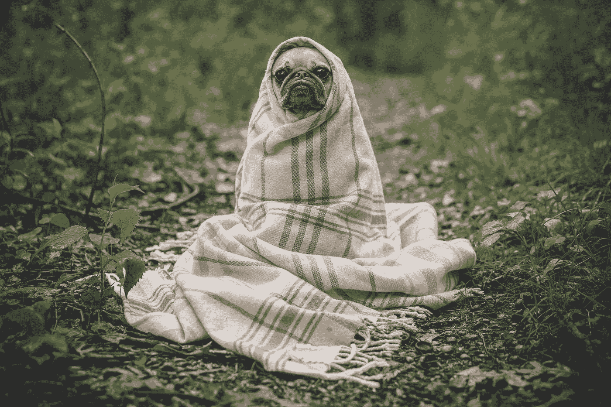
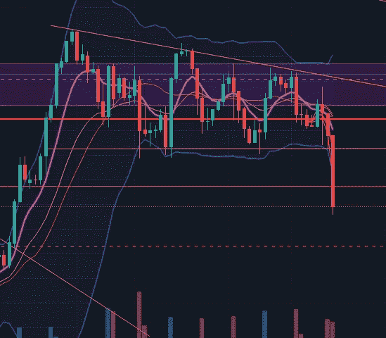

# 如何在没有酒精的情况下度过即将到来的世界末日…..投资者指南。

> 原文：<https://medium.com/coinmonks/how-to-survive-the-coming-apocalypse-without-booze-an-investors-guide-2ccc74af47ce?source=collection_archive---------47----------------------->

Photo by [Matthew Henry](https://unsplash.com/@matthewhenry?utm_source=medium&utm_medium=referral) on [Unsplash](https://unsplash.com?utm_source=medium&utm_medium=referral)

如果你在关注市场和消费者情绪，你很可能在一个掩体中等待市场末日的结束。几周前，我们看起来像是要从自由落体式下跌中幸存下来，并得到一些缓解，但昨天引发了过去 10 天一直持续的盘整模式的向下突破。

就是这个图表，让我在昨天还没被接受之前，就想一瓶一瓶地开。

4 HR S&P Jun 17 Contract

右边那个吓人的红色大烛台……绝对值得我用来做多股票的酒。今天早上到目前为止，我的支撑线(上图中的橙色虚线)突然被打破，虽然我们目前正处于另一次盘整，但我不认为它会长期向上突破。

这让我想知道…我将如何度过我的周末？裹在毯子里，手里拿着酒，手里拿着图表，思考这种恶性循环会持续多久？还是接受我自己的建议，不要过度紧张，在知道市场最终总是回归均值的情况下，找到一个更好的方法来增加我的多巴胺？

显然是后者不管酒有多诱人来麻痹我可怜的长期股权灵魂。幸运的是，我有一个很大的空头，所以我正在抵消投资组合的损失，但不是每个人都有这个投资机会。那么一般投资者该怎么做呢？

快速的解决办法是在反向 ETF 中投入一些资金，比如 SQQQ(做空纳斯达克)或 SDS(做空 S&P ),并在末日来临之际试图抵消一些损失。我怀疑下周 S&P 市场将走向 3400 点，因为这是**美联储周**、大周、*年度经济预测*。

我的希望是，这将是所有人都在等待的一次大清洗，最后一批坚守者抛售，我们将看到一个重大的广度推力和购买压力，以重置市场。

我担心的是，如果我们突破 3400 点支撑位，市场会继续下滑。对我的空头有利，对多头不利。

我更担心这次熊市会比我们预期的持续更长时间。在这种情况下，尽可能多的持有现金，让底部形态出现可能是最好的机会。两年前，投资者得到了一个千载难逢的机会，可以购买下跌的股票。也许我们可以从那个角度来看启示录？一个*第二个*“一生一次”的买入机会？哎呀，我觉得我一生中能经历两次真是太幸运了。

一些好消息…不一定是短期的，但对那些长期投资的人来说…

> 根据《福布斯》杂志，“*在 1945 年以来的 14 次熊市中，超过一半的时间里，标准普尔 500 指数在最初跌破 20%门槛的两个月内跌至低点——Bespoke 指出，远期回报基本上是正的，在 6 个月和 12 个月的时间里，该指数分别平均上涨了* ***7%和近 18%****。*

*有了这种认识，也许只需要一瓶酒？目前的贸易行动肯定值得吗？抓紧你的帽子！不要惊慌，如果你还没有卖出，不要在这个周末喝得太醉；历史证明这一切都会过去的:)大家周五快乐！*

**如果你喜欢这篇文章，并想更多地了解你的金钱、心态、投资和生活，请访问 Xonomist.io，注册我们每月免费的投资微课，或者申请我们即将推出的* ***初级专业投资训练营*** *！我们也希望听到您的反馈，所以请留下您的评论或联系我们。**

*我们第一个**insta invest 微课**今天上线了！这是免费的，也是给新投资者的极好的快速入门指南！我们真的很喜欢你的反馈，所以请注册！下面是链接:[https://share.hsforms.com/1g8XbjNniSUe-8v3TQafcIAcu7te](https://share.hsforms.com/1g8XbjNniSUe-8v3TQafcIAcu7te)*

> *加入 Coinmonks [电报频道](https://t.me/coincodecap)和 [Youtube 频道](https://www.youtube.com/c/coinmonks/videos)了解加密交易和投资*

# *另外，阅读*

*   *[用信用卡购买密码的 10 个最佳地点](https://coincodecap.com/buy-crypto-with-credit-card)*
*   *[加拿大最佳加密交易机器人](https://coincodecap.com/5-best-crypto-trading-bots-in-canada) | [Bybit vs 币安](https://coincodecap.com/bybit-binance-moonxbt)*
*   *[阿联酋 5 大最佳加密交易所](https://coincodecap.com/best-crypto-exchanges-in-uae) | [SimpleSwap 评论](https://coincodecap.com/simpleswap-review)*
*   *购买 Dogecoin 的 7 种最佳方式 | [ZebPay 评论](https://coincodecap.com/zebpay-review)*
*   *[最佳期货交易信号](https://coincodecap.com/futures-trading-signals) | [流动性交易回顾](https://coincodecap.com/liquid-exchange-review)*
*   *【Huobi 的加密交易信号 | [Swapzone 审查](/coinmonks/swapzone-review-crypto-exchange-data-aggregator-e0ad78e55ed7)*